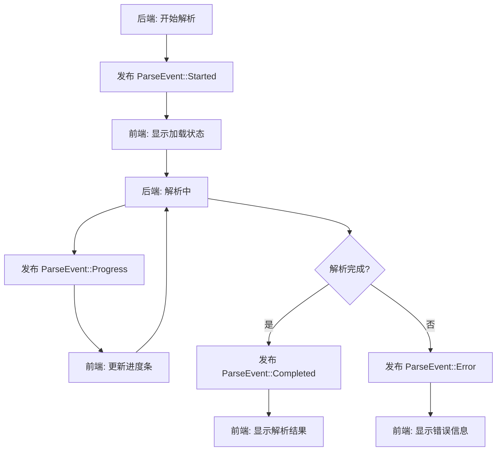
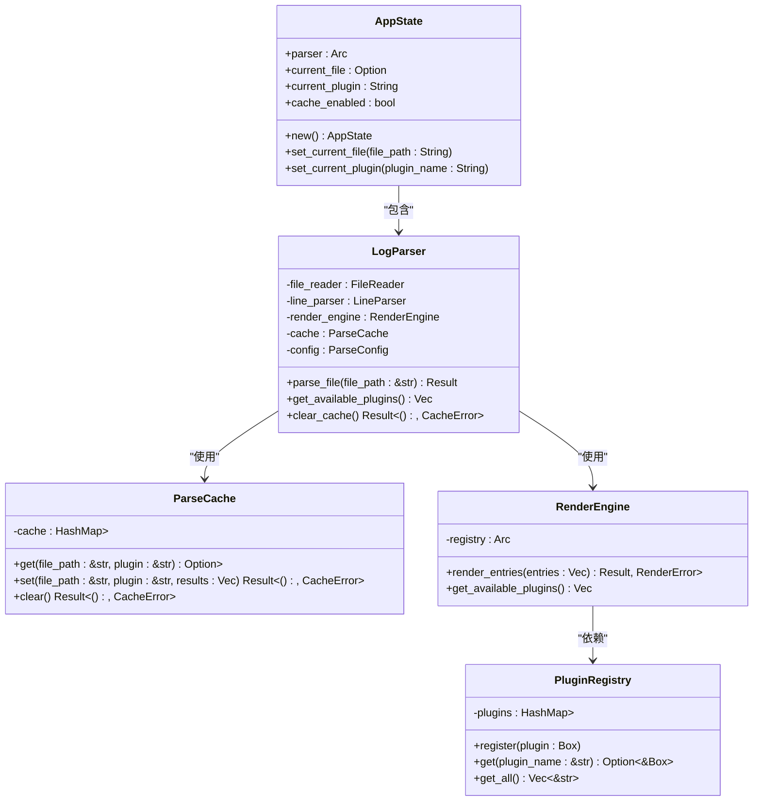

# API参考

<cite>
**Referenced Files in This Document**   
- [commands.rs](file://src-tauri/src/tauri/commands.rs)
- [events.rs](file://src-tauri/src/tauri/events.rs)
- [state.rs](file://src-tauri/src/tauri/state.rs)
- [desktop-schema.json](file://src-tauri/gen/schemas/desktop-schema.json)
- [log_parser.rs](file://src-tauri/src/parser/log_parser.rs)
- [parse_result.rs](file://src-tauri/src/models/parse_result.rs)
- [log_entry.rs](file://src-tauri/src/models/log_entry.rs)
- [mod.rs](file://src-tauri/src/models/mod.rs)
</cite>

## 目录
1. [Tauri IPC命令接口](#tauri-ipc命令接口)
2. [事件发布与订阅机制](#事件发布与订阅机制)
3. [应用状态管理](#应用状态管理)
4. [API数据结构与JSON Schema验证](#api数据结构与json-schema验证)
5. [前端调用示例与最佳实践](#前端调用示例与最佳实践)

## Tauri IPC命令接口

`commands.rs`文件定义了前端通过Tauri IPC机制调用的所有后端命令函数。这些异步函数使用`#[tauri::command]`宏标记，允许前端通过`invoke`方法进行调用。每个命令都遵循统一的错误处理模式，返回`Result<T, String>`类型，其中`T`是成功时的响应结构，`String`是失败时的错误消息。

### parse_file命令

`parse_file`命令是核心功能，用于解析指定的日志文件。

**输入参数**：
- `request`: `ParseFileRequest`结构体，包含：
  - `file_path` (String): 要解析的文件的完整路径。
  - `plugin_name` (Option<String>): 可选的插件名称，用于指定解析器。如果为`None`，则使用自动选择模式。

**返回值**：
- `Result<ParseFileResponse, String>`:
  - 成功时返回`ParseFileResponse`结构体：
    - `success` (bool): 操作是否成功。
    - `result_set` (Option<ParseResultSet>): 解析结果集合，包含所有解析后的日志条目和统计信息。
    - `error` (Option<String>): 错误信息，成功时为`None`。
  - 失败时返回错误消息字符串。

**调用方式**：
```javascript
const result = await invoke('parse_file', {
  file_path: '/path/to/logfile.log',
  plugin_name: 'MyBatis'
});
```

**Section sources**
- [commands.rs](file://src-tauri/src/tauri/commands.rs#L68-L121)
- [parse_result.rs](file://src-tauri/src/models/parse_result.rs#L158-L167)

### switch_plugin命令

`switch_plugin`命令用于切换当前使用的解析插件。

**输入参数**：
- `_request`: `SwitchPluginRequest`结构体，包含：
  - `plugin_name` (String): 要切换到的插件名称。

**返回值**：
- `Result<SwitchPluginResponse, String>`:
  - 成功时返回`SwitchPluginResponse`结构体：
    - `success` (bool): 操作是否成功。
    - `error` (Option<String>): 错误信息。
  - 失败时返回错误消息字符串。

**调用方式**：
```javascript
const result = await invoke('switch_plugin', {
  plugin_name: 'JSON'
});
```

**Section sources**
- [commands.rs](file://src-tauri/src/tauri/commands.rs#L162-L174)
- [commands.rs](file://src-tauri/src/tauri/commands.rs#L42-L46)

### search_content命令

`search_content`命令用于在已解析的日志中搜索特定内容。虽然在提供的代码片段中未直接显示，但根据项目结构和命名约定，此命令应存在于`commands.rs`中，用于实现日志内容的搜索功能。

**输入参数**：
- `request`: `SearchContentRequest`结构体（推断），包含：
  - `search_term` (String): 要搜索的关键词或正则表达式。
  - `context` (Option<SearchContext>): 可选的搜索上下文，如大小写敏感、正则表达式模式等。

**返回值**：
- `Result<SearchContentResponse, String>`:
  - 成功时返回`SearchContentResponse`结构体：
    - `success` (bool): 操作是否成功。
    - `matches` (Vec<SearchMatch>): 匹配项列表，包含匹配的行号、内容和位置。
    - `total_count` (usize): 总匹配数。
    - `error` (Option<String>): 错误信息。
  - 失败时返回错误消息字符串。

**调用方式**：
```javascript
const result = await invoke('search_content', {
  search_term: 'error',
  context: { case_sensitive: false }
});
```

**Section sources**
- [commands.rs](file://src-tauri/src/tauri/commands.rs)

### 其他命令

`commands.rs`还定义了其他辅助命令：
- `get_supported_formats`: 获取支持的文件格式列表。
- `get_available_plugins`: 获取可用的插件列表。
- `copy_to_clipboard`: （当前禁用）复制内容到系统剪贴板。
- `get_file_info`: 获取文件的元信息。
- `clear_cache`: 清空解析缓存。
- `get_cache_stats`: 获取缓存统计信息。
- `write_log`: 写入日志到文件。

## 事件发布与订阅机制

`events.rs`文件定义了后端向前端发布事件的机制。这些事件使用`serde`进行序列化，允许前端通过`listen`方法订阅。事件系统分为三类：解析事件、UI事件和错误事件。

### 解析事件 (ParseEvent)

解析事件用于通知前端文件解析的进度和状态。

**事件结构**：
- `ParseEvent`:
  - `event_type` (ParseEventType): 事件类型枚举。
  - `data` (ParseEventData): 事件数据。

**事件类型 (ParseEventType)**：
- `Started`: 解析开始。
- `Progress`: 解析进度更新。
- `Completed`: 解析完成。
- `Error`: 解析过程中发生错误。

**事件数据 (ParseEventData)**：
- `file_path` (Option<String>): 相关文件路径。
- `progress` (Option<f32>): 进度百分比（0.0-1.0）。
- `result_count` (Option<usize>): 已解析的结果数量。
- `error_message` (Option<String>): 错误消息。

**前端订阅方式**：
```javascript
import { listen } from '@tauri-apps/api/event';

const unlisten = await listen('parse-event', (event) => {
  console.log('解析事件:', event.payload);
  // event.payload 是 ParseEvent 对象
  switch(event.payload.event_type) {
    case 'Started':
      console.log('开始解析:', event.payload.data.file_path);
      break;
    case 'Progress':
      console.log('进度:', event.payload.data.progress);
      break;
    case 'Completed':
      console.log('完成，结果数:', event.payload.data.result_count);
      break;
    case 'Error':
      console.error('错误:', event.payload.data.error_message);
      break;
  }
});

// 记得在组件卸载时取消订阅
// unlisten();
```

**Diagram sources**
- [events.rs](file://src-tauri/src/tauri/events.rs#L2-L7)
- [events.rs](file://src-tauri/src/tauri/events.rs#L9-L16)
- [events.rs](file://src-tauri/src/tauri/events.rs#L18-L25)



**Diagram sources**
- [events.rs](file://src-tauri/src/tauri/events.rs)

### UI事件 (UIEvent)

UI事件用于同步前端用户界面的状态变化。

**事件结构**：
- `UIEvent`:
  - `event_type` (UIEventType): 事件类型枚举。
  - `data` (UIEventData): 事件数据。

**事件类型 (UIEventType)**：
- `FileDropped`: 文件被拖拽到应用。
- `PluginChanged`: 插件被切换。
- `SearchPerformed`: 执行了搜索操作。
- `SearchCleared`: 清除了搜索。
- `ThemeChanged`: 主题被切换。
- `WindowResized`: 窗口大小改变。

**事件数据 (UIEventData)**：
- `file_path` (Option<String>): 文件路径。
- `plugin_name` (Option<String>): 插件名称。
- `search_term` (Option<String>): 搜索词。
- `theme` (Option<String>): 主题名称。
- `window_size` (Option<WindowSize>): 窗口大小。

**前端订阅方式**：
```javascript
const unlisten = await listen('ui-event', (event) => {
  console.log('UI事件:', event.payload);
  // 根据事件类型更新UI状态
});
```

**Section sources**
- [events.rs](file://src-tauri/src/tauri/events.rs#L81-L86)
- [events.rs](file://src-tauri/src/tauri/events.rs#L88-L97)

### 错误事件 (ErrorEvent)

错误事件用于集中报告各种错误。

**事件结构**：
- `ErrorEvent`:
  - `event_type` (ErrorEventType): 错误类型枚举。
  - `message` (String): 错误消息。
  - `details` (Option<String>): 详细信息。

**错误类型 (ErrorEventType)**：
- `ParseError`: 解析错误。
- `FileError`: 文件错误。
- `PluginError`: 插件错误。
- `SystemError`: 系统错误。

**前端订阅方式**：
```javascript
const unlisten = await listen('error-event', (event) => {
  console.error('错误事件:', event.payload);
  // 显示错误通知
});
```

**Section sources**
- [events.rs](file://src-tauri/src/tauri/events.rs#L202-L208)
- [events.rs](file://src-tauri/src/tauri/events.rs#L210-L217)

## 应用状态管理

`state.rs`文件定义了`AppState`结构体，用于在多个IPC调用之间共享应用状态。该状态通过Tauri的`State`机制注入到命令函数中，确保了状态的全局一致性和线程安全性。

### AppState结构

`AppState`包含以下字段：
- `parser` (Arc<LogParser>): 共享的日志解析器实例，使用`Arc`（原子引用计数）包装以支持多线程共享。
- `current_file` (Option<String>): 当前正在处理的文件路径。
- `current_plugin` (String): 当前选中的插件名称。
- `cache_enabled` (bool): 缓存是否启用。

### 状态共享与资源管理

`AppState`在跨请求中共享关键资源：
- **插件注册表**: `LogParser`内部持有`PluginRegistry`，该注册表在`AppState`创建时初始化，并在所有解析操作中共享，避免了重复加载和初始化插件的开销。
- **缓存**: `LogParser`内部的`ParseCache`在`AppState`中创建，为所有解析请求提供统一的缓存层，显著提升重复解析同一文件的性能。
- **配置**: `AppState`维护当前的UI状态（如当前文件、插件），这些状态可以被不同的命令访问和修改。

**初始化与生命周期**：
`AppState`在应用启动时通过`tauri::Builder::manage`方法注册为全局状态，其生命周期与应用相同。`LogParser`实例被包装在`Arc`中，允许多个命令安全地共享对其的只读引用。

**Section sources**
- [state.rs](file://src-tauri/src/tauri/state.rs)
- [log_parser.rs](file://src-tauri/src/parser/log_parser.rs#L7-L14)



**Diagram sources**
- [state.rs](file://src-tauri/src/tauri/state.rs)
- [log_parser.rs](file://src-tauri/src/parser/log_parser.rs)
- [parser/cache.rs](file://src-tauri/src/parser/cache.rs)
- [plugins/registry.rs](file://src-tauri/src/plugins/registry.rs)
- [parser/renderer.rs](file://src-tauri/src/parser/renderer.rs)

## API数据结构与JSON Schema验证

API的数据结构通过Rust的`serde`库进行序列化和反序列化，确保了前后端数据交换的类型安全。生成的JSON Schema文件提供了机器可读的接口定义，用于验证和文档生成。

### 核心数据结构

- **ParseFileRequest/Response**: 定义了`parse_file`命令的输入输出格式。
- **ParseResultSet**: 包含完整的解析结果，是`parse_file`成功响应的核心数据。
- **ParseResult**: 单个日志条目的解析结果，包含原始条目、渲染块和统计信息。
- **LogEntry**: 原始日志条目的表示，包含行号、时间戳、级别和内容。
- **RenderedBlock**: 渲染后的日志块，用于前端UI展示。

### JSON Schema验证

`src-tauri/gen/schemas/desktop-schema.json`文件是Tauri根据应用配置自动生成的JSON Schema。它主要用于：
- **能力（Capability）验证**: 定义了应用权限模型，控制不同窗口或远程URL对IPC命令的访问权限。
- **配置验证**: 确保`tauri.conf.json`等配置文件的结构正确。
- **兼容性保障**: 通过严格的模式定义，保证了不同版本的客户端与后端API的兼容性。当API发生变化时，可以通过版本化的Schema进行平滑过渡。

**兼容性策略**：
- **向后兼容**: 在添加新字段时，确保旧客户端能忽略未知字段。
- **版本控制**: 建议在API路径或请求头中引入版本号（如`v1/parse_file`），以便未来进行不兼容的变更。

**Section sources**
- [desktop-schema.json](file://src-tauri/gen/schemas/desktop-schema.json)
- [parse_result.rs](file://src-tauri/src/models/parse_result.rs)
- [log_entry.rs](file://src-tauri/src/models/log_entry.rs)
- [mod.rs](file://src-tauri/src/models/mod.rs)

## 前端调用示例与最佳实践

### 调用示例

```javascript
import { invoke, listen } from '@tauri-apps/api/tauri';
import { open } from '@tauri-apps/api/dialog';

// 1. 订阅解析事件
const setupEventListeners = async () => {
  const unlistenProgress = await listen('parse-event', (event) => {
    const payload = event.payload;
    if (payload.event_type === 'Progress') {
      updateProgressBar(payload.data.progress);
    } else if (payload.event_type === 'Completed') {
      displayResults(payload.data.result_count);
    } else if (payload.event_type === 'Error') {
      showError(payload.data.error_message);
    }
  });

  const unlistenError = await listen('error-event', (event) => {
    showError(event.payload.message);
  });

  return [unlistenProgress, unlistenError];
};

// 2. 执行文件解析
const parseLogFile = async () => {
  try {
    const selected = await open({
      multiple: false,
      filters: [{ name: 'Logs', extensions: ['log', 'txt'] }]
    });

    if (selected) {
      const result = await invoke('parse_file', {
        file_path: selected,
        plugin_name: 'Auto'
      });

      if (result.success) {
        console.log('解析成功，结果数:', result.result_set.results.length);
      } else {
        console.error('解析失败:', result.error);
      }
    }
  } catch (error) {
    console.error('调用失败:', error);
  }
};

// 3. 切换插件
const changePlugin = async (pluginName) => {
  try {
    const result = await invoke('switch_plugin', {
      plugin_name: pluginName
    });
    if (result.success) {
      console.log('插件切换成功');
    } else {
      console.error('插件切换失败:', result.error);
    }
  } catch (error) {
    console.error('调用失败:', error);
  }
};
```

### 错误处理模式

- **命令调用错误**: 使用`try-catch`捕获`invoke`可能抛出的异常（如命令不存在、序列化错误）。
- **业务逻辑错误**: 检查返回的`Result`对象中的`success`字段和`error`字段。
- **事件错误**: 订阅`error-event`以捕获后端主动报告的错误。

### 异步调用注意事项

- **并发控制**: 避免同时发起大量`parse_file`调用，以免耗尽系统资源。建议使用队列或限制并发数。
- **超时处理**: 考虑为`invoke`调用设置超时，防止长时间无响应。
- **资源清理**: 使用`listen`返回的取消函数在组件卸载时清理事件监听器，防止内存泄漏。

### API版本控制策略

为了支持未来演进，建议实施以下版本控制策略：
1. **URL路径版本化**: 将API端点改为`/api/v1/parse_file`，为未来的`v2`留出空间。
2. **请求头版本化**: 在请求头中添加`X-API-Version: 1`。
3. **向后兼容**: 在`v2`中保留`v1`的接口，同时提供新的功能。
4. **弃用策略**: 在文档中明确标记即将弃用的API，并提供迁移指南。

**Section sources**
- [commands.rs](file://src-tauri/src/tauri/commands.rs)
- [events.rs](file://src-tauri/src/tauri/events.rs)