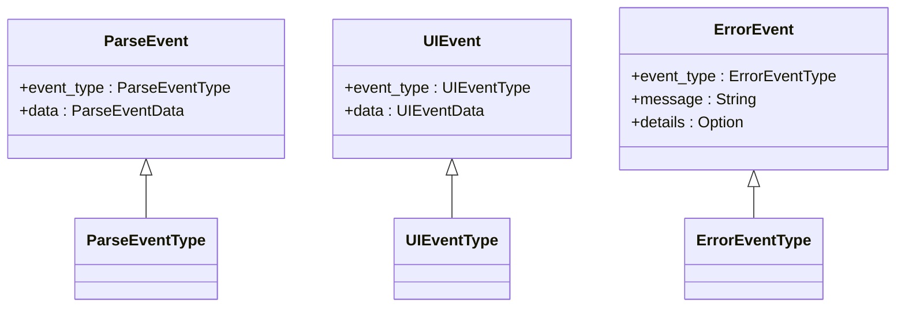
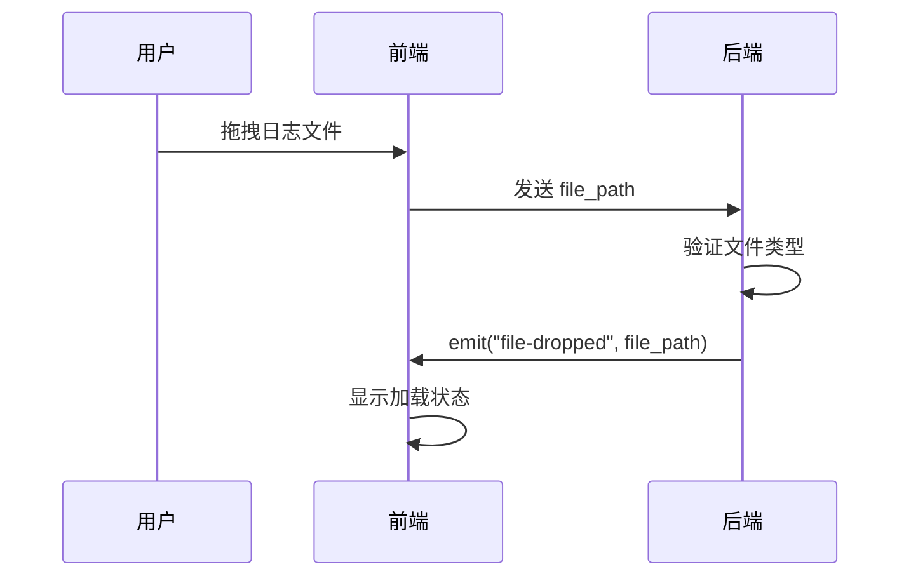

# 事件系统

<cite>
**本文档中引用的文件**  
- [events.rs](file://src-tauri/src/tauri/events.rs)
- [handlers.rs](file://src-tauri/src/tauri/handlers.rs)
- [main.js](file://src/main.js)
</cite>

## 目录
1. [简介](#简介)
2. [核心事件类型](#核心事件类型)
3. [ParseEvent 解析事件](#parseevent-解析事件)
4. [UIEvent 用户界面事件](#uievent-用户界面事件)
5. [ErrorEvent 错误事件](#errorevent-错误事件)
6. [前端事件订阅机制](#前端事件订阅机制)
7. [事件驱动架构的优势](#事件驱动架构的优势)

## 简介
LogWhisper 采用事件驱动架构实现前后端解耦通信。该系统通过定义清晰的事件类型，使前端能够实时响应后端状态变化，提升用户体验。事件系统主要由三类核心事件构成：ParseEvent（解析事件）、UIEvent（用户界面事件）和ErrorEvent（错误事件），分别对应日志解析过程、用户操作行为和系统异常处理。

**Section sources**
- [events.rs](file://src-tauri/src/tauri/events.rs#L1-L256)

## 核心事件类型
LogWhisper 的事件系统包含三大核心事件类型，每种事件都包含类型标识和数据负载，确保信息传递的结构化与可扩展性。



**Diagram sources**
- [events.rs](file://src-tauri/src/tauri/events.rs#L1-L256)

## ParseEvent 解析事件
ParseEvent 用于通知前端日志文件解析过程中的关键状态变化，包括开始、进度、完成和错误四种状态。

### ParseEventType 状态类型
ParseEventType 枚举定义了日志解析过程的四个阶段：

- **Started**：解析任务已启动，携带文件路径信息
- **Progress**：解析进行中，携带当前进度百分比
- **Completed**：解析成功完成，携带结果条目数量
- **Error**：解析过程中发生错误，携带错误描述信息

### ParseEventData 数据结构
ParseEventData 包含与解析状态相关的可选数据字段：

- `file_path`：正在处理的文件路径（仅 Started 状态有效）
- `progress`：当前解析进度（0.0 ~ 1.0，Progress 和 Completed 状态有效）
- `result_count`：成功解析的日志条目数量（Completed 状态有效）
- `error_message`：错误描述信息（Error 状态有效）

### 前端监听解析进度
前端通过监听 `parse-progress` 和 `parse-complete` 事件实现解析进度的实时反馈。当收到 `parse-progress` 事件时更新进度条；当收到 `parse-complete` 事件时刷新日志展示区域并更新状态栏信息。

**Section sources**
- [events.rs](file://src-tauri/src/tauri/events.rs#L1-L75)
- [handlers.rs](file://src-tauri/src/tauri/handlers.rs#L125-L155)

## UIEvent 用户界面事件
UIEvent 用于反映用户在界面上的操作行为，实现用户动作与系统响应的映射。

### UIEventType 枚举类型
UIEventType 包含以下六种用户操作类型：

- **FileDropped**：用户拖拽文件到应用窗口
- **PluginChanged**：用户切换日志解析插件
- **SearchPerformed**：用户执行搜索操作
- **SearchCleared**：用户清除搜索内容
- **ThemeChanged**：用户切换应用主题
- **WindowResized**：用户调整窗口大小

### UIEventData 数据结构
UIEventData 携带与用户操作相关的上下文信息：

- `file_path`：拖拽的文件路径（FileDropped 事件）
- `plugin_name`：选中的插件名称（PluginChanged 事件）
- `search_term`：搜索关键词（SearchPerformed 事件）
- `theme`：目标主题名称（ThemeChanged 事件）
- `window_size`：新窗口尺寸（WindowResized 事件）



**Diagram sources**
- [events.rs](file://src-tauri/src/tauri/events.rs#L84-L190)
- [handlers.rs](file://src-tauri/src/tauri/handlers.rs#L1-L26)

## ErrorEvent 错误事件
ErrorEvent 用于系统在运行过程中发生异常时向前端报告错误信息，实现统一的错误处理机制。

### ErrorEventType 分类
ErrorEventType 将错误分为四类：

- **ParseError**：日志解析失败
- **FileError**：文件读取或访问异常
- **PluginError**：插件执行错误
- **SystemError**：系统级异常（如内存不足、权限问题）

### 错误传播机制
当后端检测到异常时，通过 ErrorHandler 创建对应的 ErrorEvent 并通过 Tauri 的事件系统发送到前端。前端监听特定错误事件（如 `parse-error`、`file-error`）并显示相应的错误提示对话框，同时记录错误日志供调试使用。

**Section sources**
- [events.rs](file://src-tauri/src/tauri/events.rs#L205-L256)
- [handlers.rs](file://src-tauri/src/tauri/handlers.rs#L93-L112)

## 前端事件订阅机制
前端通过 Tauri 提供的 `listen` 方法订阅后端事件，实现异步通信。

### listen 方法使用方式
```javascript
// 示例：监听解析进度事件
window.__TAURI__.event.listen('parse-progress', (event) => {
    const progress = event.payload;
    updateProgressBar(progress);
});
```

### 事件解构模式
事件回调函数接收包含 `payload` 属性的对象，`payload` 即为后端发送的数据内容。不同事件类型对应不同的数据结构：

- `parse-progress`：f32 类型的进度值
- `parse-complete`：usize 类型的结果数量
- `file-dropped`：包含文件路径的字符串
- `plugin-changed`：插件名称字符串

### 异常捕获策略
在事件监听中应包含异常捕获逻辑，防止因单个事件处理失败导致整个应用崩溃：

```javascript
window.__TAURI__.event.listen('parse-error', (event) => {
    try {
        const errorMessage = event.payload;
        showErrorDialog(errorMessage);
    } catch (error) {
        console.error('处理错误事件失败:', error);
    }
});
```

**Section sources**
- [main.js](file://src/main.js#L73-L113)
- [handlers.rs](file://src-tauri/src/tauri/handlers.rs#L25-L155)

## 事件驱动架构的优势
事件驱动架构在 LogWhisper 中显著提升了用户体验：

- **实时反馈**：通过 ParseEvent 实现解析进度的实时更新，避免用户等待时的不确定性
- **响应式界面**：UIEvent 使界面能即时响应用户操作，如主题切换立即生效
- **错误透明化**：ErrorEvent 确保所有异常都能被用户感知，提高系统可靠性
- **松耦合设计**：前后端通过事件通信，降低模块间依赖，便于维护和扩展

该架构使得 LogWhisper 能够高效处理大文件解析任务，同时保持界面流畅响应，为用户提供专业级日志分析体验。

**Section sources**
- [events.rs](file://src-tauri/src/tauri/events.rs#L1-L256)
- [main.js](file://src/main.js#L73-L113)