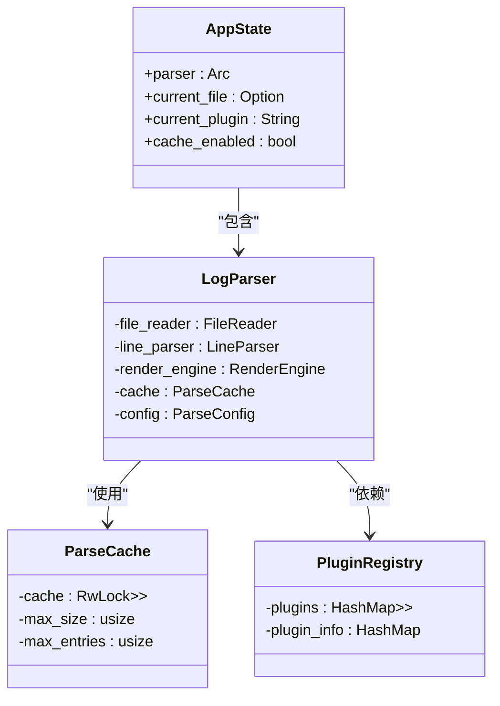

# 命令接口

<cite>
**本文档中引用的文件**  
- [commands.rs](file://src-tauri/src/tauri/commands.rs)
- [log_parser.rs](file://src-tauri/src/parser/log_parser.rs)
- [state.rs](file://src-tauri/src/tauri/state.rs)
- [parse_result.rs](file://src-tauri/src/models/parse_result.rs)
- [cache.rs](file://src-tauri/src/parser/cache.rs)
- [registry.rs](file://src-tauri/src/plugins/registry.rs)
- [trait_def.rs](file://src-tauri/src/plugins/trait_def.rs)
- [lib.rs](file://src-tauri/src/lib.rs)
</cite>

## 目录
1. [简介](#简介)
2. [核心命令详解](#核心命令详解)
3. [状态管理与资源共享](#状态管理与资源共享)
4. [前端调用示例](#前端调用示例)
5. [错误处理与日志记录](#错误处理与日志记录)
6. [剪贴板功能设计考量](#剪贴板功能设计考量)

## 简介
`log-whisper` 是一个基于 Tauri 框架的日志分析工具，通过定义在 `commands.rs` 中的 IPC 命令实现前端与后端之间的通信。这些命令封装了日志解析、插件管理、缓存控制等核心功能，支持异步执行和结构化响应。本文档详细说明所有可用命令的功能、参数结构、返回值格式以及其内部工作机制。

**Section sources**
- [commands.rs](file://src-tauri/src/tauri/commands.rs#L1-L292)

## 核心命令详解

### parse_file 命令
`parse_file` 是主解析命令，用于异步解析指定日志文件并返回结构化结果。

- **请求结构**: `ParseFileRequest`
  - `file_path`: 文件路径（字符串）
  - `plugin_name`: 可选插件名称（字符串）
- **响应结构**: `ParseFileResponse`
  - `success`: 是否成功（布尔值）
  - `result_set`: 解析结果集（可选 `ParseResultSet`）
  - `error`: 错误信息（可选字符串）

该命令使用 `Arc<LogParser>` 共享状态进行文件读取、行解析、多行合并和渲染处理，并根据配置决定是否启用缓存。解析完成后，结果通过 `ParseResultSet` 返回，包含总体统计信息如总行数、成功/错误行数及耗时。

**Section sources**
- [commands.rs](file://src-tauri/src/tauri/commands.rs#L78-L138)
- [log_parser.rs](file://src-tauri/src/parser/log_parser.rs#L50-L148)

### get_supported_formats 命令
获取当前支持的文件格式列表。

- **响应结构**: `SupportedFormatsResponse`
  - `formats`: 支持的格式数组（字符串列表）

目前支持 `.log` 和 `.txt` 格式，未来可通过插件系统扩展。

**Section sources**
- [commands.rs](file://src-tauri/src/tauri/commands.rs#L140-L152)

### get_available_plugins 命令
获取所有可用插件的详细信息。

- **响应结构**: `AvailablePluginsResponse`
  - `plugins`: 插件信息数组（`PluginInfo` 列表）
- **插件信息结构**: `PluginInfo`
  - `name`: 插件名称
  - `description`: 描述
  - `enabled`: 是否启用

此命令调用 `LogParser` 的 `get_available_plugins` 方法，结合 `get_plugin_description` 函数生成本地化描述。

**Section sources**
- [commands.rs](file://src-tauri/src/tauri/commands.rs#L154-L184)
- [log_parser.rs](file://src-tauri/src/parser/log_parser.rs#L200-L208)
- [trait_def.rs](file://src-tauri/src/plugins/trait_def.rs#L119-L136)

### switch_plugin 命令
切换当前使用的解析插件。

- **请求结构**: `SwitchPluginRequest`
  - `plugin_name`: 目标插件名称
- **响应结构**: `SwitchPluginResponse`
  - `success`: 是否成功
  - `error`: 错误信息（可选）

当前实现为简化版本，未实际更改 `LogParser` 状态（因其不可变）。真实场景中需结合 `Mutex` 或状态更新机制实现动态切换。

**Section sources**
- [commands.rs](file://src-tauri/src/tauri/commands.rs#L186-L198)

### copy_to_clipboard 命令
将指定内容复制到系统剪贴板。

- **请求结构**: `CopyToClipboardRequest`
  - `content`: 要复制的内容
- **响应结构**: `CopyToClipboardResponse`
  - `success`: 是否成功
  - `error`: 错误信息

**当前功能已被禁用**，始终返回“剪贴板功能暂时禁用”错误。详见“剪贴板功能设计考量”章节。

**Section sources**
- [commands.rs](file://src-tauri/src/tauri/commands.rs#L200-L214)

### get_file_info 命令
获取指定文件的元信息（大小、修改时间等）。

- **输入参数**: `file_path`（字符串）
- **返回值**: 文件信息字符串（格式化后的 `FileInfo`）

调用 `LogParser` 的 `get_file_info` 方法异步获取文件属性。

**Section sources**
- [commands.rs](file://src-tauri/src/tauri/commands.rs#L216-L230)
- [log_parser.rs](file://src-tauri/src/parser/log_parser.rs#L210-L218)

### clear_cache 命令
清空解析结果缓存。

- **无输入参数**
- **返回值**: `Result<(), String>`，表示操作是否成功

调用 `LogParser` 的 `clear_cache` 方法清除内存中的缓存条目。

**Section sources**
- [commands.rs](file://src-tauri/src/tauri/commands.rs#L232-L242)
- [log_parser.rs](file://src-tauri/src/parser/log_parser.rs#L230-L238)
- [cache.rs](file://src-tauri/src/parser/cache.rs#L148-L158)

### get_cache_stats 命令
获取当前缓存的统计信息。

- **无输入参数**
- **返回值**: 缓存统计信息字符串（格式化后的 `CacheStats`）

包括缓存文件数、结果总数、最大容量等。

**Section sources**
- [commands.rs](file://src-tauri/src/tauri/commands.rs#L244-L256)
- [log_parser.rs](file://src-tauri/src/parser/log_parser.rs#L240-L246)
- [cache.rs](file://src-tauri/src/parser/cache.rs#L178-L193)

### write_log 命令
将日志内容写入本地日志文件。

- **请求结构**: `WriteLogRequest`
  - `content`: 要写入的内容
  - `append`: 是否追加模式
- **响应结构**: `WriteLogResponse`
  - `success`: 是否成功
  - `error`: 错误信息（可选）

自动创建 `logs` 目录，并按日期生成日志文件（如 `logwhisper_2025-04-05.log`）。使用 `OpenOptions` 控制写入行为。

**Section sources**
- [commands.rs](file://src-tauri/src/tauri/commands.rs#L267-L318)

## 状态管理与资源共享
所有命令通过 `State<'_, Arc<LogParser>>` 访问共享的 `LogParser` 实例，确保跨命令状态一致性。



**Diagram sources**
- [state.rs](file://src-tauri/src/tauri/state.rs#L7-L52)
- [log_parser.rs](file://src-tauri/src/parser/log_parser.rs#L7-L14)
- [cache.rs](file://src-tauri/src/parser/cache.rs#L7-L20)
- [registry.rs](file://src-tauri/src/plugins/registry.rs#L11-L20)

## 前端调用示例
以下为前端 JavaScript 调用 `parse_file` 命令的示例：

```javascript
import { invoke } from '@tauri-apps/api/tauri';

async function parseLogFile(filePath, pluginName) {
  try {
    const request = {
      file_path: filePath,
      plugin_name: pluginName
    };

    const response = await invoke('parse_file', { request });
    
    if (response.success) {
      console.log('解析成功', response.result_set);
      // 处理解析结果
    } else {
      console.error('解析失败', response.error);
    }
  } catch (error) {
    console.error('调用失败', error);
  }
}
```

其他命令调用方式类似，均通过 `invoke('command_name', { ...params })` 形式发起异步调用并处理 Promise 结果。

**Section sources**
- [lib.rs](file://src-tauri/src/lib.rs#L25-L45)

## 错误