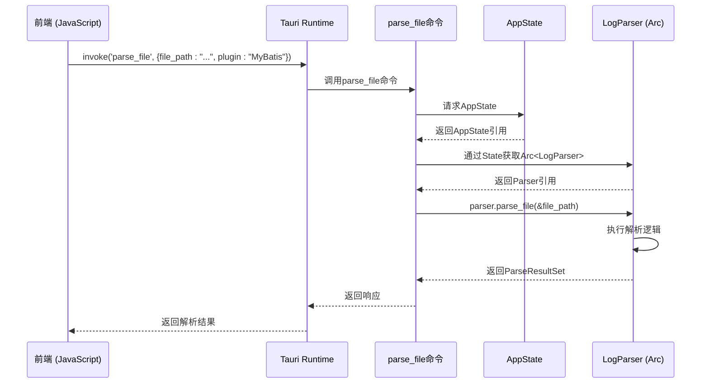

# 应用状态

<cite>
**Referenced Files in This Document**  
- [state.rs](file://src-tauri/src/tauri/state.rs)
- [log_parser.rs](file://src-tauri/src/parser/log_parser.rs)
- [commands.rs](file://src-tauri/src/tauri/commands.rs)
- [lib.rs](file://src-tauri/src/lib.rs)
</cite>

## 目录
1. [应用状态](#应用状态)
2. [AppState结构体详解](#appstate结构体详解)
3. [状态初始化与默认实现](#状态初始化与默认实现)
4. [状态管理方法](#状态管理方法)
5. [Tauri状态共享机制](#tauri状态共享机制)
6. [前端状态更新建议](#前端状态更新建议)

## AppState结构体详解

`AppState` 是 log-whisper 应用的核心状态管理结构体，定义于 `src-tauri/src/tauri/state.rs` 文件中。该结构体通过封装关键运行时数据，为整个应用提供统一的状态管理机制。

`AppState` 包含四个核心字段：

- **parser**：`Arc<LogParser>` 类型，指向日志解析器实例的智能指针。`Arc`（原子引用计数）确保该实例可在多个命令间安全共享，避免重复创建解析器，保证解析状态的一致性。
- **current_file**：`Option<String>` 类型，存储当前正在处理的日志文件路径。`Option` 枚举表示文件可能处于“已选择”或“未选择”状态。
- **current_plugin**：`String` 类型，记录当前激活的插件名称，用于指导日志解析和渲染行为。
- **cache_enabled**：`bool` 类型，控制是否启用解析结果缓存功能，直接影响应用性能和响应速度。

这些字段共同构成了应用的运行时上下文，使得不同功能模块能够基于一致的状态进行操作。

**Section sources**
- [state.rs](file://src-tauri/src/tauri/state.rs#L3-L13)

## 状态初始化与默认实现

`AppState` 的生命周期始于 `new` 方法的调用。该方法在 `src-tauri/src/tauri/state.rs` 中实现，负责创建并初始化一个全新的应用状态实例。

初始化过程的关键步骤包括：
1.  **创建 `LogParser` 实例**：调用 `LogParser::new()` 构造一个新的解析器对象。
2.  **包装为 `Arc`**：使用 `Arc::new()` 将 `LogParser` 实例包裹，使其具备跨线程共享的能力。
3.  **设置默认值**：将 `current_file` 初始化为 `None`，`current_plugin` 初始化为 `"Auto"`，`cache_enabled` 初始化为 `true`。

此外，`AppState` 实现了 `Default` trait，其 `default()` 方法直接委托给 `new()` 方法。这使得在 Tauri 应用构建器中通过 `.manage(AppState::default())` 或 `.manage(AppState::new())` 来注册应用状态变得非常简洁和标准。

**Section sources**
- [state.rs](file://src-tauri/src/tauri/state.rs#L15-L38)
- [lib.rs](file://src-tauri/src/lib.rs#L19)

## 状态管理方法

`AppState` 提供了一系列公共方法来安全地修改其内部状态，这些方法遵循 Rust 的所有权和借用规则，确保了数据的线程安全。

- **`set_current_file`**：接收一个 `String` 参数，更新 `current_file` 字段。此方法用于在用户选择新日志文件后，记录当前操作的目标文件。
- **`clear_current_file`**：将 `current_file` 字段重置为 `None`，表示当前没有文件被选中。
- **`set_current_plugin`**：接收一个 `String` 参数，更新 `current_plugin` 字段。此方法允许用户在不同解析插件（如 MyBatis、JSON、Raw 等）之间进行切换。
- **`set_cache_enabled`**：接收一个 `bool` 参数，动态启用或禁用缓存功能。

这些方法均通过 `&mut self` 接收可变借用，允许在不转移所有权的情况下修改结构体内部的数据。

**Section sources**
- [state.rs](file://src-tauri/src/tauri/state.rs#L40-L52)

## Tauri状态共享机制

log-whisper 利用 Tauri 框架的 `State` 机制在后端命令间安全地共享 `AppState` 和 `LogParser` 资源。

在 `src-tauri/src/lib.rs` 文件中，`AppState::new()` 的返回值通过 `.manage()` 方法被注册到 Tauri 应用的全局状态管理器中。这使得 `AppState` 实例在应用的整个生命周期内都是可用的。

在具体的命令处理函数中，例如 `parse_file`，可以通过在参数列表中声明 `parser: State<'_, Arc<LogParser>>` 来获取对共享资源的引用。Tauri 运行时会自动解析此依赖并注入正确的实例。

值得注意的是，虽然 `AppState` 是共享的，但 `LogParser` 在 `parse_file` 命令中是通过 `State<'_, Arc<LogParser>>` 直接注入的，这表明 `LogParser` 本身也被设计为一个可共享的核心服务。`Arc` 智能指针在此处起到了关键作用，它允许多个 `State` 句柄同时持有对同一个 `LogParser` 实例的引用，从而实现了高效的资源复用和状态一致性。

**Diagram sources**
- [lib.rs](file://src-tauri/src/lib.rs#L19)
- [commands.rs](file://src-tauri/src/tauri/commands.rs#L70)
- [state.rs](file://src-tauri/src/tauri/state.rs#L15)

## 前端状态更新建议

为了实现前后端状态的同步，前端应遵循以下模式：

1.  **状态变更触发**：当用户在前端界面进行操作（如选择文件、切换插件）时，前端应调用相应的 Tauri 命令（如一个假设的 `set_current_file` 命令）来通知后端。
2.  **后端状态更新**：后端命令执行 `AppState` 的对应方法（如 `set_current_file`）来更新内部状态。
3.  **事件通知**：后端在状态更新完成后，可以通过 Tauri 的事件系统（`emit`）向所有前端窗口广播一个状态变更事件（如 `app-state-updated`）。
4.  **前端响应**：前端监听此事件，并在收到通知后，重新获取最新的应用状态（例如，通过调用 `get_available_plugins` 或 `get_file_info` 等查询命令），然后更新 UI 以反映最新状态。

这种“命令-更新-事件-响应”的模式确保了状态变更的单向数据流，避免了竞态条件，并使 UI 能够及时响应后端状态的变化。