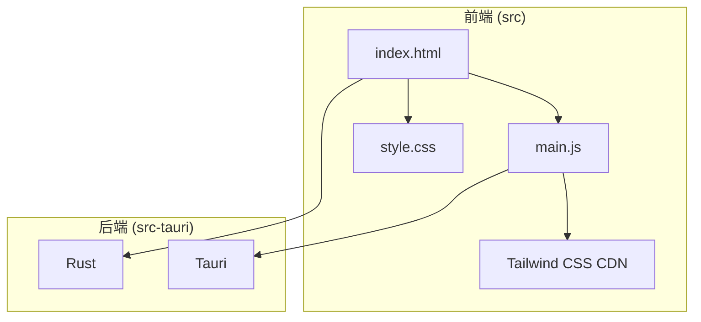
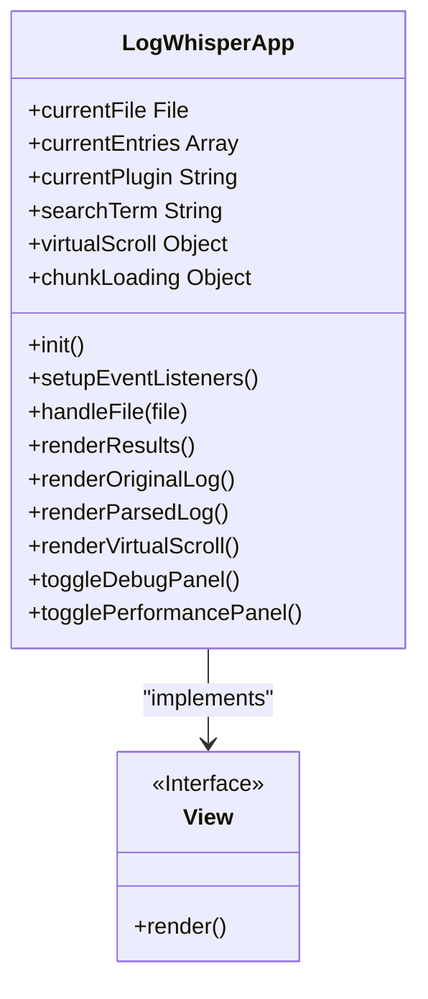
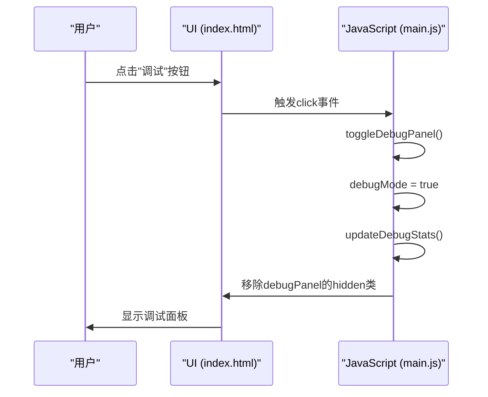
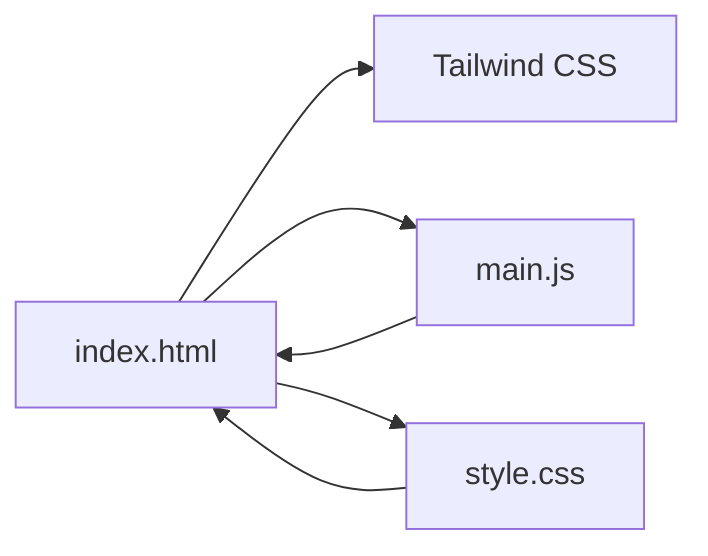

# UI结构设计

<cite>
**本文档中引用的文件**  
- [index.html](file://src/index.html)
- [main.js](file://src/main.js)
- [style.css](file://src/style.css)
</cite>

## 目录
1. [简介](#简介)
2. [项目结构](#项目结构)
3. [核心组件](#核心组件)
4. [架构概述](#架构概述)
5. [详细组件分析](#详细组件分析)
6. [依赖分析](#依赖分析)
7. [性能考虑](#性能考虑)
8. [故障排除指南](#故障排除指南)
9. [结论](#结论)
10. [附录](#附录)（如有必要）

## 简介
LogWhisper 是一款专为日志文件解析与可视化设计的前端应用，采用现代化的双栏布局架构，结合 Tailwind CSS 实现响应式设计。其核心界面由顶部工具栏、主内容区（左侧原始日志、右侧解析结果）、底部状态栏构成，支持拖拽上传、插件选择、搜索过滤等交互功能。通过虚拟滚动与分块加载技术，确保大文件处理时的性能与流畅性。同时，内置调试面板与性能优化面板，为开发与调优提供有力支持。

## 项目结构
LogWhisper 的项目结构清晰，前端资源集中于 `src` 目录下，包含 HTML、JavaScript 和 CSS 文件。`index.html` 作为应用入口，定义了完整的 DOM 结构；`main.js` 负责所有交互逻辑与状态管理；`style.css` 则扩展了 Tailwind CSS 的样式系统，实现主题化与组件化设计。

**Diagram sources**
- [index.html](file://src/index.html#L1-L247)
- [main.js](file://src/main.js#L1-L2093)
- [style.css](file://src/style.css#L1-L518)

**Section sources**
- [index.html](file://src/index.html#L1-L247)
- [main.js](file://src/main.js#L1-L2093)
- [style.css](file://src/style.css#L1-L518)

## 核心组件
LogWhisper 的核心组件围绕日志的展示与解析展开。`#originalLog` 容器负责展示原始日志文本，`#parsedLog` 容器则展示结构化后的解析结果。这些容器通过 `main.js` 中的 `LogWhisperApp` 类进行动态渲染，其内容会根据用户选择的插件和搜索条件实时更新。整个应用的交互逻辑，如文件上传、插件切换、主题变更等，均由 `main.js` 中的事件监听器驱动。

**Section sources**
- [index.html](file://src/index.html#L50-L64)
- [main.js](file://src/main.js#L1-L2093)

## 架构概述
LogWhisper 采用经典的 MVC（Model-View-Controller）模式进行架构设计。`main.js` 中的 `LogWhisperApp` 类作为控制器，管理应用状态（如 `currentEntries`、`currentPlugin`）并处理用户交互。`index.html` 定义了视图（View），即用户可见的界面结构。当控制器接收到用户操作（如打开文件）时，会更新模型（Model），并调用 `renderResults()` 等方法重新渲染视图。

**Diagram sources**
- [main.js](file://src/main.js#L1-L2093)

## 详细组件分析

### 双栏布局与响应式设计
LogWhisper 的主界面采用双栏布局，通过 `flex` 布局实现。在 `index.html` 中，主内容区 `
` 包含两个子容器，分别使用 `w-1/2` 将宽度均分为两半。Tailwind CSS 的 `flex` 和 `h-screen` 等实用类确保了布局的自适应性。`style.css` 中的媒体查询 `@media (max-width: 768px)` 在小屏幕设备上将 `flex` 方向改为 `column`，使左右两栏变为上下堆叠，保证了跨设备的兼容性。

**Section sources**
- [index.html](file://src/index.html#L49-L70)
- [style.css](file://src/style.css#L479-L485)

### 交互功能实现
#### 拖拽上传
拖拽功能通过监听 `#app` 容器的 `dragover`、`dragleave` 和 `drop` 事件实现。当文件被拖入时，`app` 容器会添加 `drag-over` 类，通过 `style.css` 中的 `.drag-over` 样式改变背景和边框，提供视觉反馈。松开文件后，触发 `handleFile()` 方法处理文件。

#### 插件选择与搜索过滤
插件选择通过 `#pluginSelect` 下拉框实现，其 `change` 事件绑定在 `setupEventListeners()` 方法中，调用 `switchPlugin()` 方法切换解析逻辑。搜索功能则通过监听 `#searchInput` 的 `input` 事件，动态更新 `searchTerm` 并调用 `filterLogs()` 方法，该方法会遍历 `#originalLog` 和 `#parsedLog` 中的元素，根据 `searchTerm` 显示或隐藏内容，并使用 `search-highlight` 类高亮匹配的文本。

**Section sources**
- [index.html](file://src/index.html#L17-L34)
- [main.js](file://src/main.js#L94-L298)

### DOM容器与JavaScript逻辑关联
`#originalLog` 和 `#parsedLog` 是两个关键的 DOM 容器。`main.js` 中的 `renderOriginalLog()` 和 `renderParsedLog()` 方法负责将 `currentEntries` 数组中的数据渲染到这两个容器中。`renderOriginalLog()` 创建带有行号和日志内容的 `
` 元素，而 `renderParsedLog()` 则根据 `rendered_blocks` 创建结构化的渲染块（`rendered-block`）。当启用虚拟滚动时，`renderVirtualScroll()` 会创建一个虚拟的滚动容器，并通过 `updateVirtualScroll()` 方法动态更新可见区域的内容。

**Section sources**
- [index.html](file://src/index.html#L50-L64)
- [main.js](file://src/main.js#L842-L896)

### 调试与性能优化面板
#### 模态窗口设计原理
调试面板 (`#debugPanel`) 和性能优化面板 (`#performancePanel`) 均为固定定位 (`fixed`) 的模态窗口，初始状态为 `hidden`。`toggleDebugPanel()` 和 `togglePerformancePanel()` 方法通过切换 `hidden` 类来控制它们的显示与隐藏。这种设计将开发辅助功能与主界面分离，避免干扰用户的核心操作，同时保证了这些功能的随时可访问性。

#### 开发辅助作用
调试面板提供了一个实时的控制台日志 (`#debugLogs`) 和性能统计 (`#debugStats`)，开发者可以在此查看应用的内部运行状态，如解析次数、平均解析时间、内存使用情况等。性能优化面板则允许开发者动态调整虚拟滚动和分块加载的配置，如启用/禁用、调整块大小，并实时观察内存使用情况，对于优化大文件处理性能至关重要。

**Diagram sources**
- [index.html](file://src/index.html#L153-L201)
- [main.js](file://src/main.js#L1205-L1266)

## 依赖分析
LogWhisper 的前端依赖关系清晰。`index.html` 依赖于外部的 Tailwind CSS CDN 和本地的 `main.js` 与 `style.css`。`main.js` 作为核心逻辑文件，依赖于 `index.html` 中的 DOM 元素，并通过 `setupEventListeners()` 方法与它们建立连接。`style.css` 则依赖于 `index.html` 中的类名，并通过 CSS 变量 (`--bg-primary`, `--text-primary` 等) 实现主题化，与 `main.js` 中的 `applyTheme()` 方法协同工作。

**Diagram sources**
- [index.html](file://src/index.html#L1-L247)
- [main.js](file://src/main.js#L1-L2093)
- [style.css](file://src/style.css#L1-L518)

## 性能考虑
LogWhisper 针对大文件处理进行了深度优化。其核心是**虚拟滚动**（Virtual Scroll）和**分块加载**（Chunk Loading）机制。虚拟滚动通过计算当前滚动位置，仅渲染视口内的日志项，极大地减少了 DOM 节点数量。分块加载则将大文件的解析过程拆分为多个小块，异步处理，避免了主线程阻塞。`main.js` 中的 `parseLargeFile()` 和 `processRemainingChunks()` 方法利用