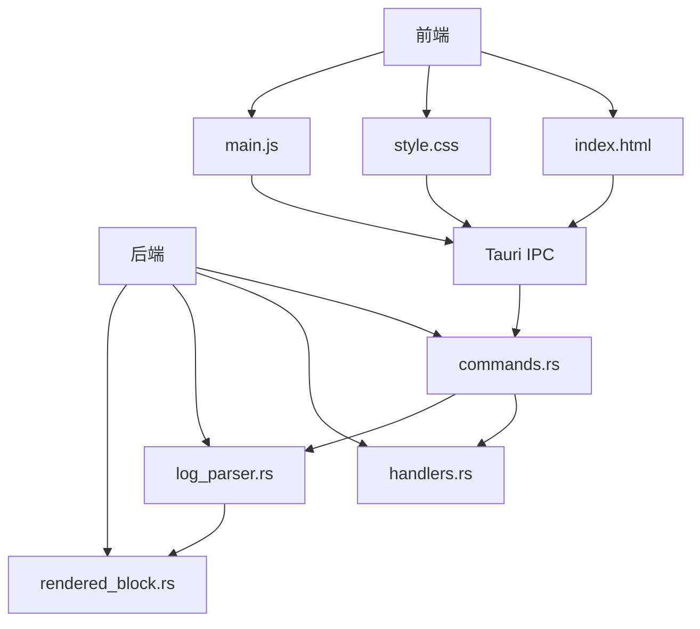
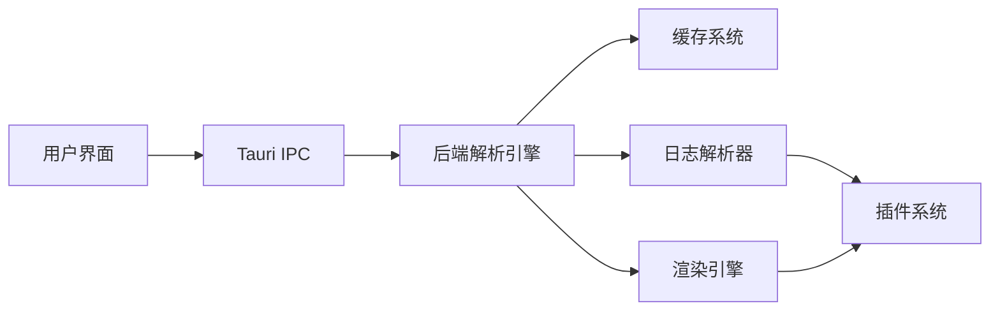
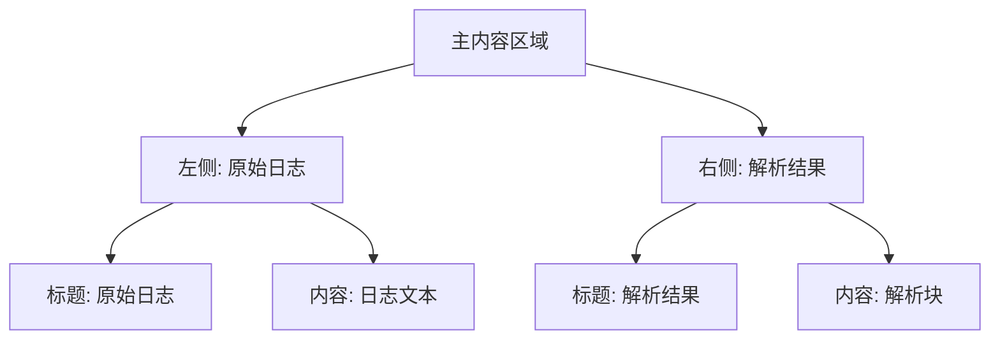
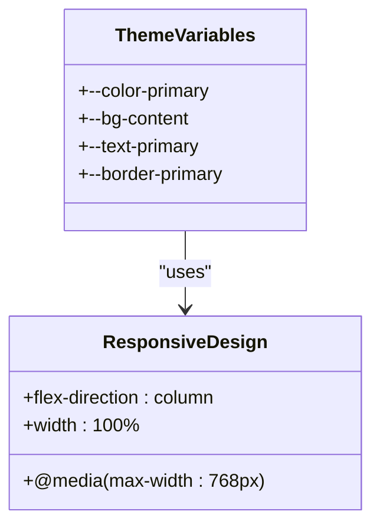
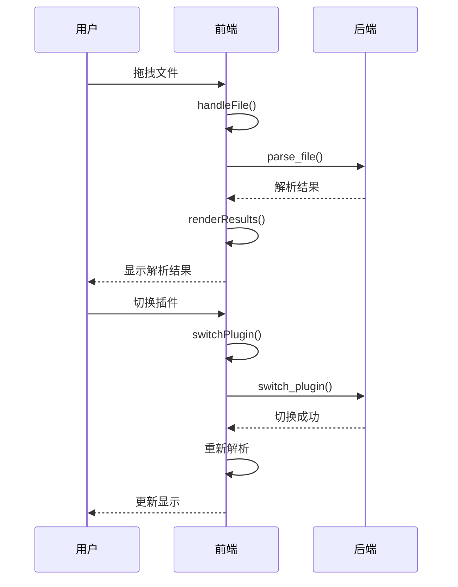
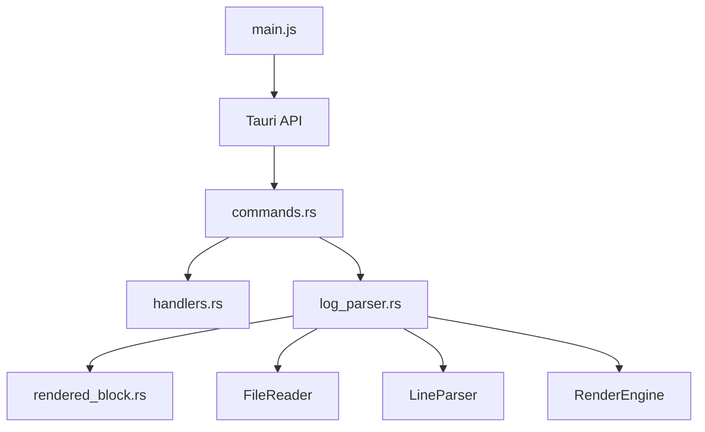

# 前端实现

<cite>
**本文档中引用的文件**  
- [index.html](file://src/index.html)
- [style.css](file://src/style.css)
- [main.js](file://src/main.js)
- [commands.rs](file://src-tauri/src/tauri/commands.rs)
- [handlers.rs](file://src-tauri/src/tauri/handlers.rs)
- [rendered_block.rs](file://src-tauri/src/models/rendered_block.rs)
- [log_parser.rs](file://src-tauri/src/parser/log_parser.rs)
</cite>

## 目录
1. [项目结构](#项目结构)
2. [核心组件](#核心组件)
3. [架构概述](#架构概述)
4. [详细组件分析](#详细组件分析)
5. [依赖分析](#依赖分析)
6. [性能考虑](#性能考虑)
7. [故障排除指南](#故障排除指南)
8. [结论](#结论)

## 项目结构

LogWhisper 项目采用前后端分离的架构设计，前端位于 `src` 目录，后端 Rust 代码位于 `src-tauri` 目录。前端由 HTML、CSS 和 JavaScript 三部分组成，通过 Tauri 框架与后端进行通信。项目结构清晰，模块化程度高，便于维护和扩展。

**图源**  
- [index.html](file://src/index.html)
- [main.js](file://src/main.js)
- [commands.rs](file://src-tauri/src/tauri/commands.rs)
- [handlers.rs](file://src-tauri/src/tauri/handlers.rs)

**节源**  
- [index.html](file://src/index.html)
- [main.js](file://src/main.js)

## 核心组件

LogWhisper 的核心组件包括前端界面、Tauri 通信层和后端解析引擎。前端界面负责用户交互和数据显示，Tauri 通信层负责前后端数据交换，后端解析引擎负责日志文件的解析和处理。这些组件通过清晰的接口进行通信，实现了高内聚低耦合的设计。

**节源**  
- [index.html](file://src/index.html)
- [main.js](file://src/main.js)
- [commands.rs](file://src-tauri/src/tauri/commands.rs)

## 架构概述

LogWhisper 采用现代化的前后端分离架构，前端使用 HTML、CSS 和 JavaScript 实现用户界面，后端使用 Rust 实现高性能的日志解析功能。前后端通过 Tauri 提供的 IPC 机制进行通信，实现了安全高效的数据交换。整个系统设计遵循模块化原则，各组件职责明确，便于维护和扩展。

**图源**  
- [main.js](file://src/main.js)
- [commands.rs](file://src-tauri/src/tauri/commands.rs)
- [log_parser.rs](file://src-tauri/src/parser/log_parser.rs)

## 详细组件分析

### 前端界面分析

LogWhisper 的前端界面采用双栏布局设计，左侧显示原始日志，右侧显示解析结果。这种设计使用户能够直观地对比原始日志和解析后的结果，提高了日志分析的效率。界面使用 Tailwind CSS 实现现代化 UI 样式，并支持响应式布局，能够在不同设备上良好显示。

#### 双栏展示区域设计原理

双栏展示区域的设计基于 Flexbox 布局，通过 `flex-1` 和 `w-1/2` 类实现等宽分栏。左侧栏使用 `border-r` 类添加右侧边框，右侧栏使用 `bg-white` 类设置背景色。两个栏目的高度都设置为 `h-full`，确保它们填满整个内容区域。

**图源**  
- [index.html](file://src/index.html)

**节源**  
- [index.html](file://src/index.html)

### 样式系统分析

LogWhisper 的样式系统采用 CSS 变量实现主题切换功能，支持亮色和暗色两种主题。样式文件 `style.css` 定义了丰富的 CSS 变量，包括颜色、背景色、文本色、边框色等，通过 `:root` 和 `[data-theme="dark"]` 选择器分别定义亮色和暗色主题的样式。

#### 现代化UI样式与响应式布局实现

样式系统使用 CSS 变量和媒体查询实现现代化 UI 样式和响应式布局。通过定义 `--color-primary`、`--bg-content` 等 CSS 变量，实现了样式的统一管理和主题切换。媒体查询 `@media (max-width: 768px)` 用于实现响应式布局，在小屏幕上自动调整界面布局。

**图源**  
- [style.css](file://src/style.css)

**节源**  
- [style.css](file://src/style.css)

### 交互逻辑分析

LogWhisper 的交互逻辑由 `main.js` 文件中的 `LogWhisperApp` 类实现。该类负责处理用户操作，如文件拖拽、插件切换、搜索过滤等，并通过 Tauri 命令与后端通信。事件监听器在 `setupEventListeners` 方法中设置，确保用户操作能够及时响应。

#### 事件监听与用户操作处理

`LogWhisperApp` 类通过 `setupEventListeners` 方法设置各种事件监听器，包括文件选择、插件切换、搜索输入等。这些监听器将用户操作转换为相应的处理函数调用，实现了用户界面与业务逻辑的分离。

**图源**  
- [main.js](file://src/main.js)
- [commands.rs](file://src-tauri/src/tauri/commands.rs)

**节源**  
- [main.js](file://src/main.js)

## 依赖分析

LogWhisper 的依赖关系清晰，前端依赖 Tauri 框架与后端通信，后端依赖各种解析和渲染组件。通过 Tauri 的依赖注入机制，各个组件能够方便地获取所需的服务实例，实现了松耦合的设计。

**图源**  
- [main.js](file://src/main.js)
- [commands.rs](file://src-tauri/src/tauri/commands.rs)
- [log_parser.rs](file://src-tauri/src/parser/log_parser.rs)

**节源**  
- [main.js](file://src/main.js)
- [commands.rs](file://src-tauri/src/tauri/commands.rs)

## 性能考虑

LogWhisper 在性能方面做了充分考虑，包括虚拟滚动、分块加载、缓存机制等。虚拟滚动用于处理大量日志条目，避免一次性渲染所有条目导致的性能问题。分块加载用于处理大文件，避免一次性读取整个文件导致的内存占用过高。缓存机制用于避免重复解析相同的文件，提高解析效率。

**节源**  
- [main.js](file://src/main.js)
- [log_parser.rs](file://src-tauri/src/parser/log_parser.rs)

## 故障排除指南

LogWhisper 提供了详细的日志记录和错误处理机制，便于故障排除。前端通过 `console.log` 和 `toast` 提示记录和显示错误信息，后端通过 `log` 宏记录详细的调试信息。当出现解析错误时，系统会显示具体的错误信息，帮助用户定位问题。

**节源**  
- [main.js](file://src/main.js)
- [commands.rs](file://src-tauri/src/tauri/commands.rs)

## 结论

LogWhisper 是一个功能强大、设计良好的日志分析工具，其前端实现采用了现代化的 Web 技术，后端使用高性能的 Rust 语言，通过 Tauri 框架实现了高效的前后端通信。系统设计遵循模块化原则，各组件职责明确，便于维护和扩展。通过虚拟滚动、分块加载、缓存机制等性能优化措施，确保了系统在处理大文件时的流畅性。