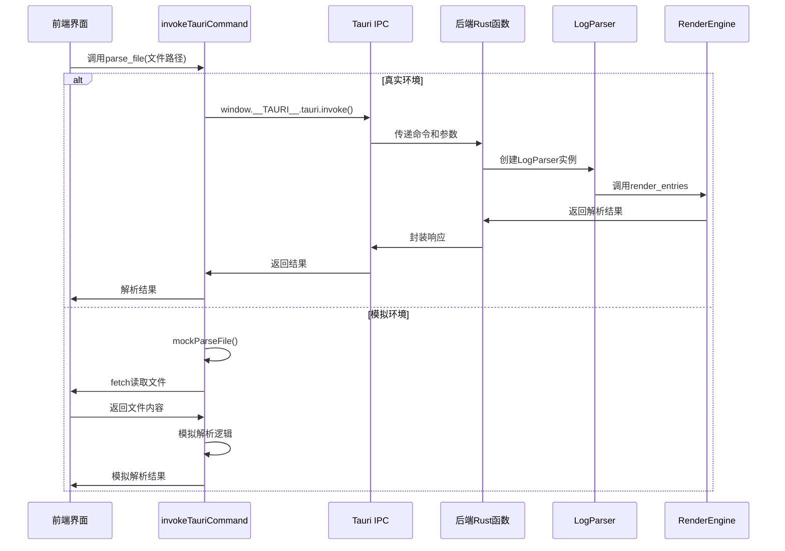

<cite>
**Referenced Files in This Document**   
- [main.js](file://src/main.js)
- [commands.rs](file://src-tauri/src/tauri/commands.rs)
- [log_parser.rs](file://src-tauri/src/parser/log_parser.rs)
- [renderer.rs](file://src-tauri/src/parser/renderer.rs)
</cite>

# Tauri IPC通信集成

## 目录
1. [invokeTauriCommand方法解析](#invoketauricommand方法解析)
2. [前端命令与后端Rust函数映射](#前端命令与后端rust函数映射)
3. [模拟模式实现机制](#模拟模式实现机制)
4. [错误处理与降级方案](#错误处理与降级方案)
5. [通信流程时序图](#通信流程时序图)

## invokeTauriCommand方法解析

`invokeTauriCommand` 方法是前端与Tauri后端进行IPC通信的核心入口。该方法通过检查 `window.__TAURI__` 对象的存在性来判断当前运行环境，从而决定是进行真实的IPC调用还是进入模拟模式。

在真实环境中，该方法直接调用 `window.__TAURI__.tauri.invoke(command, args)` 发起异步IPC请求，其中 `command` 参数指定要执行的后端命令，`args` 参数传递命令所需的参数。这种设计实现了前端与后端的松耦合，前端只需关注命令名称和参数结构，而无需了解后端的具体实现细节。

**Section sources**
- [main.js](file://src/main.js#L319-L326)

## 前端命令与后端Rust函数映射

前端命令与后端Rust函数之间通过清晰的映射关系进行通信。以 `parse_file` 和 `get_available_plugins` 命令为例，这些命令在 `commands.rs` 文件中通过 `#[tauri::command]` 宏进行声明，使其能够被前端调用。

`parse_file` 命令接收 `ParseFileRequest` 结构体作为参数，包含文件路径和可选的插件名称。后端接收到请求后，会创建 `LogParser` 实例并调用其 `parse_file` 方法进行实际的文件解析工作。解析结果通过 `ParseFileResponse` 结构体返回给前端，包含成功状态、解析结果集和可能的错误信息。

`get_available_plugins` 命令则通过 `LogParser` 的 `get_available_plugins` 方法获取当前可用的插件列表，并将其转换为前端可识别的格式。这种设计模式确保了前后端数据结构的一致性，同时通过Rust的强类型系统保证了数据完整性。

**Section sources**
- [commands.rs](file://src-tauri/src/tauri/commands.rs#L68-L160)
- [log_parser.rs](file://src-tauri/src/parser/log_parser.rs#L195-L198)

## 模拟模式实现机制

模拟模式（mockTauriCommand）是开发和测试环境中的重要特性，它允许在没有Tauri运行时的情况下测试前端功能。当检测到 `window.__TAURI__` 不存在时，系统会自动切换到模拟模式，调用 `mockTauriCommand` 方法。

`mockTauriCommand` 方法通过 `switch` 语句分发不同命令的模拟实现。对于 `parse_file` 命令，`mockParseFile` 方法会使用浏览器的 `fetch` API 读取本地文件内容，然后通过前端的解析逻辑模拟后端的解析过程。这种方法不仅能够验证前端UI的正确性，还能在开发初期快速迭代功能，而无需启动完整的Tauri应用。

对于 `get_available_plugins` 命令，`mockGetPlugins` 方法直接返回预定义的插件列表，包含插件名称、描述和启用状态等信息。这种静态数据模拟方式简化了测试过程，使开发者能够专注于前端逻辑的开发。

**Section sources**
- [main.js](file://src/main.js#L328-L401)

## 错误处理与降级方案

系统实现了完善的错误处理机制，确保在IPC通信失败时能够优雅降级。在后端实现中，每个命令函数都返回 `Result<T, String>` 类型，将可能的错误封装为字符串消息。例如，`parse_file` 命令在解析失败时会捕获异常，记录详细的错误日志，并返回包含错误信息的响应对象。

前端的 `invokeTauriCommand` 方法通过 `try-catch` 机制捕获IPC通信异常。在模拟模式下，`mockParseFile` 方法同样实现了完整的错误处理流程，能够捕获文件读取和解析过程中的各种异常，并返回与真实环境一致的错误响应格式。这种一致性设计使得前端错误处理逻辑可以统一处理真实和模拟环境下的错误，提高了代码的可维护性。

降级方案主要体现在模拟模式的无缝切换上。当系统检测到非Tauri环境时，自动启用模拟模式，使得应用能够在普通浏览器中正常运行，这对于演示、调试和持续集成测试具有重要意义。

**Section sources**
- [main.js](file://src/main.js#L340-L401)
- [commands.rs](file://src-tauri/src/tauri/commands.rs#L85-L121)

## 通信流程时序图

**Diagram sources**
- [main.js](file://src/main.js#L319-L326)
- [commands.rs](file://src-tauri/src/tauri/commands.rs#L68-L121)
- [log_parser.rs](file://src-tauri/src/parser/log_parser.rs#L46-L118)