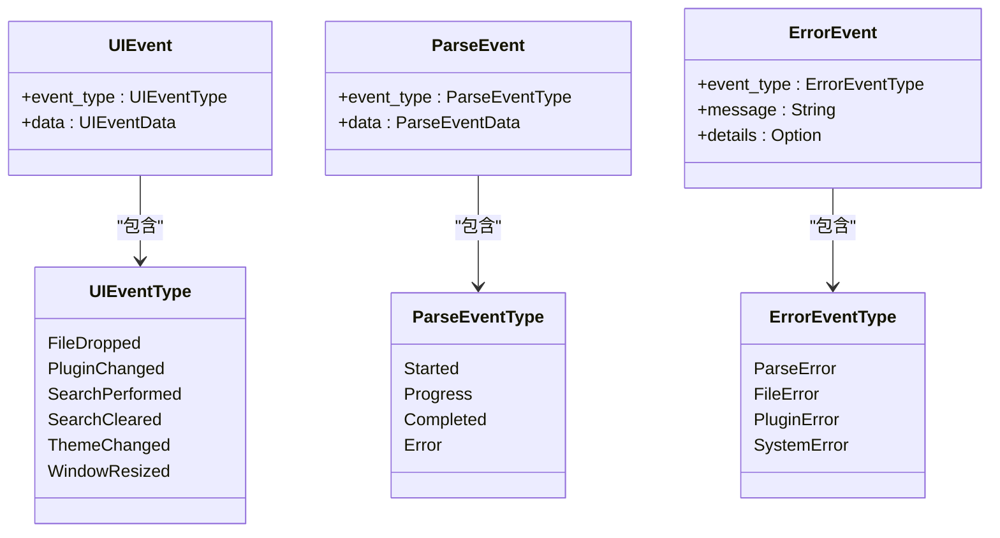
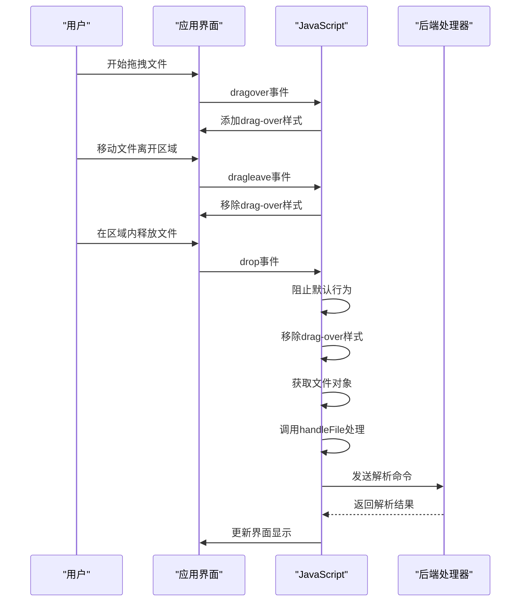
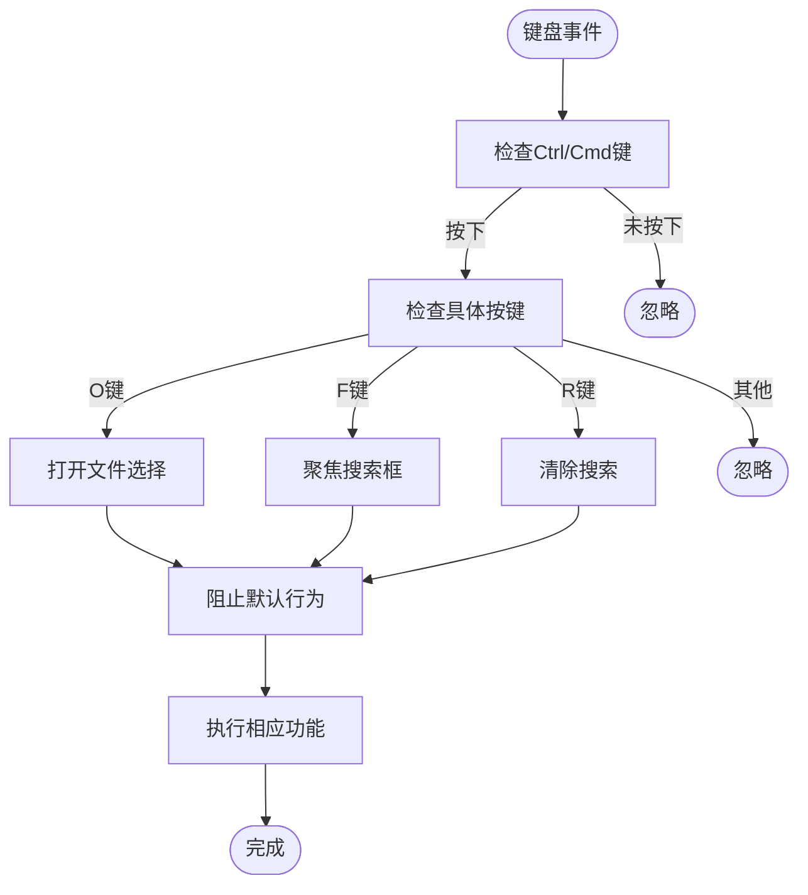

<cite>
**Referenced Files in This Document**   
- [main.js](file://src/main.js)
- [handlers.rs](file://src-tauri/src/tauri/handlers.rs)
- [events.rs](file://src-tauri/src/tauri/events.rs)
- [main.rs](file://src-tauri/src/main.rs)
</cite>

# 事件监听与处理机制

## Table of Contents
1. [事件监听器注册分析](#事件监听器注册分析)
2. [前端事件与后端Tauri事件系统集成](#前端事件与后端tauri事件系统集成)
3. [拖拽上传功能实现细节](#拖拽上传功能实现细节)
4. [键盘快捷键实现原理](#键盘快捷键实现原理)
5. [事件处理流程总结](#事件处理流程总结)

## 事件监听器注册分析

`setupEventListeners`方法在LogWhisper应用中负责注册所有用户交互事件的监听器，这些事件涵盖了文件操作、插件管理、搜索功能、主题切换和性能调试等多个方面。

### 文件选择事件
文件选择功能通过两个关联的DOM元素实现：`openFileBtn`按钮和隐藏的`fileInput`文件输入框。当用户点击"打开文件"按钮时，会触发点击事件，程序通过JavaScript主动触发隐藏文件输入框的点击事件，从而打开系统文件选择对话框。文件选择完成后，`fileInput`的`change`事件被触发，调用`handleFile`方法处理选中的文件。

### 插件切换事件
插件切换功能通过`pluginSelect`下拉菜单实现。当用户选择不同的解析插件时，`change`事件被触发，调用`switchPlugin`方法切换当前使用的解析插件。这种设计允许用户根据日志文件的格式选择最合适的解析策略。

### 搜索输入事件
搜索功能通过`searchInput`输入框实现。`input`事件监听器在用户输入时实时响应，将输入内容保存到`searchTerm`属性中，并调用`filterLogs`方法对日志内容进行过滤。同时，系统记录搜索操作日志，便于后续分析用户行为。

### 主题切换事件
主题切换通过`themeToggleBtn`按钮实现。点击该按钮会触发`toggleTheme`方法，切换应用的亮色/暗色主题模式，提升用户在不同光照环境下的使用体验。

### 调试与性能面板控制
应用提供了调试面板和性能面板，分别通过`debugToggleBtn`和`performanceToggleBtn`按钮控制显示/隐藏。面板内的各种操作按钮（如清除日志、导出日志、运行性能测试等）也都有相应的事件监听器，实现了完整的调试和性能分析功能。

### 性能优化控制
性能相关的控制选项包括虚拟滚动和分块加载的启用/禁用，以及分块大小的调整。这些设置通过复选框和输入框的`change`事件进行监听，允许用户根据硬件性能和文件大小动态调整应用的性能参数。

**Section sources**
- [main.js](file://src/main.js#L94-L205)

## 前端事件与后端Tauri事件系统集成

LogWhisper应用采用前后端分离的架构，前端JavaScript代码与后端Rust代码通过Tauri框架提供的事件系统进行通信。这种集成机制确保了用户界面操作能够有效触发后端处理逻辑。

### 事件处理器架构
后端在`handlers.rs`文件中定义了多个事件处理器，每个处理器负责处理特定类型的用户操作：

- `FileDropHandler`：处理文件拖拽事件，验证文件类型并发送文件路径到前端
- `PluginChangeHandler`：处理插件切换事件，验证插件名称的有效性
- `SearchHandler`：处理搜索和清除搜索事件
- `ErrorHandler`：处理各种错误情况
- `ProgressHandler`：处理解析进度和完成状态

### 事件类型定义
在`events.rs`文件中，应用定义了三种主要的事件类型，构成了前后端通信的基础：

**Diagram sources**
- [events.rs](file://src-tauri/src/tauri/events.rs#L2-L217)

### 事件通信流程
当用户在前端进行操作时，事件处理流程如下：

1. 前端DOM事件被触发（如点击、输入等）
2. 前端JavaScript调用相应的处理方法
3. 处理方法通过Tauri API向后端发送命令
4. 后端执行相应逻辑并可能触发事件
5. 后端通过`emit`方法将事件发送回前端
6. 前端监听特定事件并更新UI

这种双向通信机制确保了用户操作能够得到及时响应，同时后端处理结果能够实时反映在用户界面上。

**Section sources**
- [handlers.rs](file://src-tauri/src/tauri/handlers.rs#L1-L156)
- [events.rs](file://src-tauri/src/tauri/events.rs#L1-L257)

## 拖拽上传功能实现细节

拖拽上传功能为用户提供了一种直观、便捷的文件导入方式，其核心实现基于HTML5的拖拽API。

### 拖拽事件处理
拖拽功能在`setupDragAndDrop`方法中设置，监听三个关键事件：

- `dragover`：当文件被拖拽到应用区域上方时触发
- `dragleave`：当文件被拖拽离开应用区域时触发
- `drop`：当文件在应用区域内释放时触发

**Diagram sources**
- [main.js](file://src/main.js#L207-L231)
- [handlers.rs](file://src-tauri/src/tauri/handlers.rs#L4-L28)

### 视觉反馈机制
为了提升用户体验，应用实现了视觉反馈机制。当文件被拖拽到应用区域上方时，通过添加`drag-over`CSS类为界面添加高亮边框，直观地提示用户可以在此处释放文件。这种即时反馈让用户清楚地知道操作是否有效，减少了误操作的可能性。

### 文件处理流程
文件释放后，系统首先阻止浏览器的默认行为（如打开文件），然后从`dataTransfer.files`中获取文件对象。如果存在文件，则调用`handleFile`方法进行处理。这种方法支持直接从文件管理器拖拽文件到应用窗口，提供了比传统文件选择对话框更流畅的操作体验。

## 键盘快捷键实现原理

键盘快捷键功能通过监听全局`keydown`事件实现，为常用操作提供了高效的键盘访问方式。

### 快捷键注册
系统监听`document`上的`keydown`事件，在事件处理函数中检查是否按下了Ctrl（或Mac上的Cmd）键配合特定字母键：

- **Ctrl+O**：打开文件选择对话框
- **Ctrl+F**：聚焦到搜索输入框
- **Ctrl+R**：清除当前搜索

### 事件处理机制
快捷键的实现遵循以下原则：

1. 首先检查`ctrlKey`或`metaKey`（Mac Cmd键）是否被按下
2. 如果组合键条件满足，则根据`key`属性判断具体操作
3. 调用`preventDefault()`阻止浏览器的默认行为
4. 执行相应的应用功能

这种设计避免了与浏览器默认快捷键的冲突，同时确保了快捷键操作的可靠性。

### 用户体验优化
键盘快捷键的引入显著提升了应用的可用性：

- **效率提升**：用户无需使用鼠标即可完成常用操作
- **操作流畅**：减少了手在键盘和鼠标之间切换的时间
- **专业体验**：符合专业软件的使用习惯，降低了用户学习成本

此外，当虚拟滚动功能启用时，系统还支持方向键导航，进一步增强了键盘操作的完整性。

**Diagram sources**
- [main.js](file://src/main.js#L185-L203)

**Section sources**
- [main.js](file://src/main.js#L185-L203)

## 事件处理流程总结

LogWhisper应用的事件处理机制体现了现代桌面应用的典型架构特点，通过前后端分离和事件驱动的方式实现了丰富的用户交互功能。

### 架构特点
应用的事件处理系统具有以下特点：

- **模块化设计**：不同类型的事件由专门的处理器处理
- **双向通信**：前端和后端通过事件系统进行双向数据交换
- **用户体验优先**：提供了多种交互方式（鼠标、键盘、拖拽）满足不同用户偏好
- **错误处理完善**：建立了完整的错误报告和处理机制

### 数据流分析
从用户操作到最终结果展示，数据流经历了以下阶段：

1. 用户通过界面元素（按钮、输入框等）或快捷键触发操作
2. 前端JavaScript捕获DOM事件并调用相应的处理方法
3. 处理方法通过Tauri API调用后端Rust函数
4. 后端执行业务逻辑，可能涉及文件读取、数据解析等操作
5. 后端将结果或状态变化通过事件系统发送回前端
6. 前端接收事件并更新UI，完成整个交互循环

这种清晰的数据流设计确保了应用的可维护性和可扩展性，为未来添加新功能提供了坚实的基础。

**Section sources**
- [main.js](file://src/main.js#L94-L231)
- [handlers.rs](file://src-tauri/src/tauri/handlers.rs#L1-L156)
- [events.rs](file://src-tauri/src/tauri/events.rs#L1-L257)
- [main.rs](file://src-tauri/src/main.rs#L1-L65)