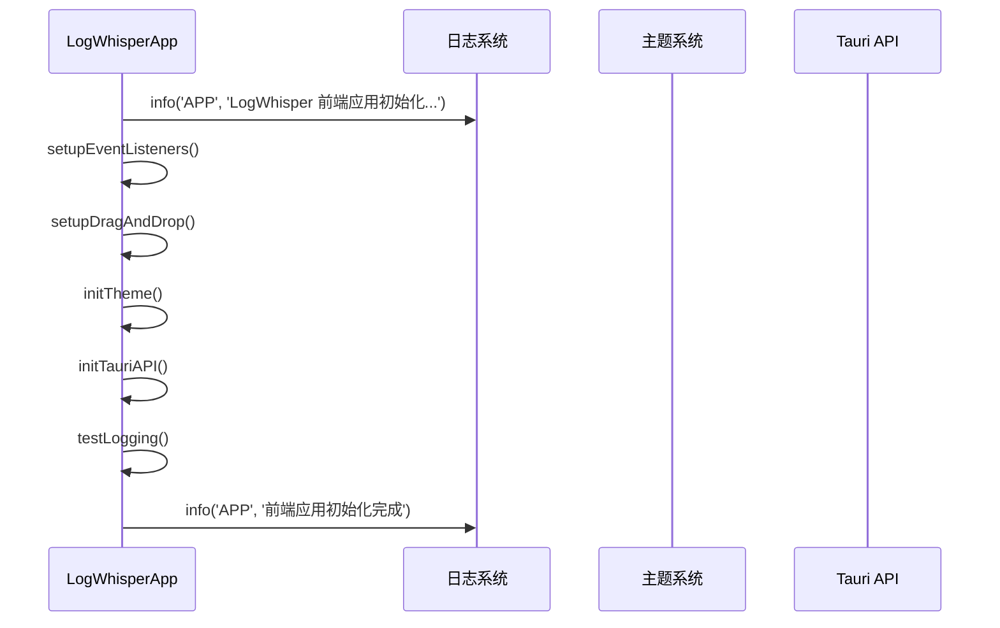
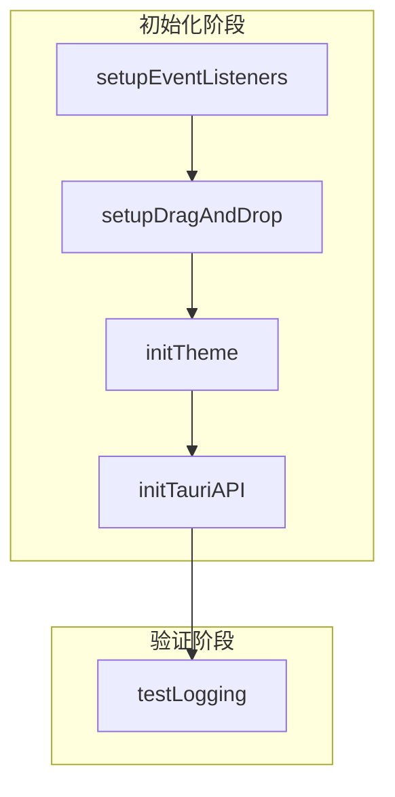
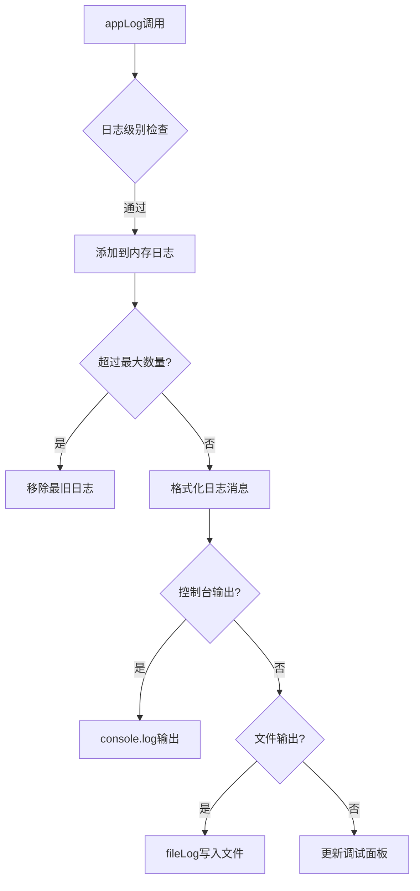
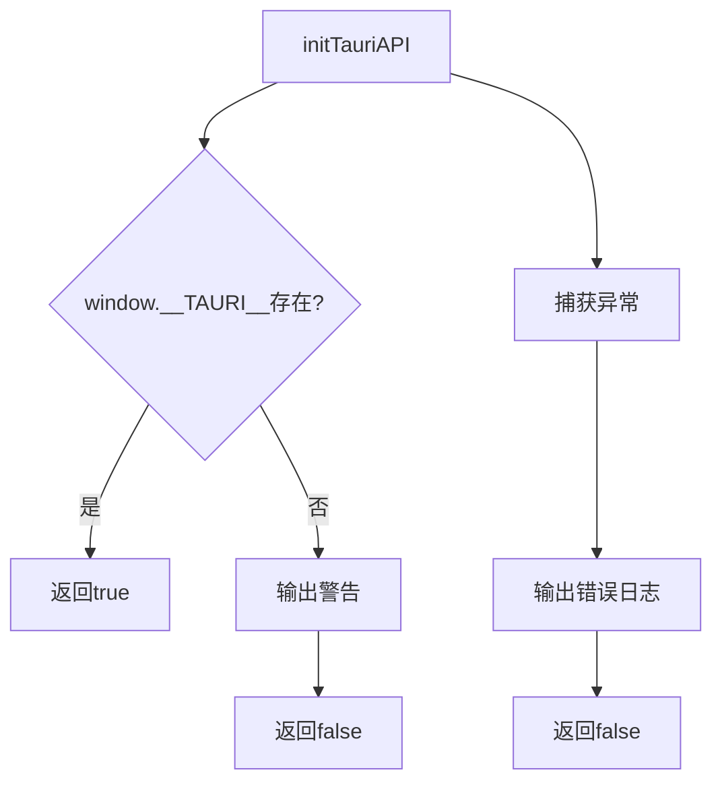

<cite>
**Referenced Files in This Document**   
- [main.js](file://src/main.js)
</cite>

# 前端初始化流程

## Table of Contents
1. [构造函数初始化](#构造函数初始化)
2. [init方法执行流程](#init方法执行流程)
3. [状态对象初始化](#状态对象初始化)
4. [初始化函数依赖关系](#初始化函数依赖关系)
5. [开发辅助功能配置](#开发辅助功能配置)
6. [错误处理与恢复策略](#错误处理与恢复策略)

## 构造函数初始化

LogWhisperApp类的构造函数在应用实例化时执行，负责初始化所有核心状态对象和配置参数。构造函数首先设置文件相关状态，包括`currentFile`（当前文件对象）和`currentEntries`（当前日志条目数组），然后初始化插件选择器`currentPlugin`为'auto'模式。

**Section sources**
- [main.js](file://src/main.js#L1-L55)

## init方法执行流程

`init`方法是应用初始化的核心入口，按照严格的顺序执行多个初始化函数。方法首先记录应用启动日志，然后依次调用`setupEventListeners`、`setupDragAndDrop`、`initTheme`和`initTauriAPI`等初始化函数。在所有核心功能初始化完成后，执行`testLogging`进行日志系统测试，确保日志功能正常工作。

**Diagram sources **
- [main.js](file://src/main.js#L56-L76)

**Section sources**
- [main.js](file://src/main.js#L56-L76)

## 状态对象初始化

### 核心状态对象
构造函数初始化了多个关键状态对象，用于管理应用的不同方面：

- **虚拟滚动配置** (`virtualScroll`): 启用虚拟滚动功能，设置项目高度为60px，可见区域显示20个项目，缓冲区大小为5
- **分块加载配置** (`chunkLoading`): 启用分块加载，设置块大小为100条日志，支持自适应块大小调整
- **日志系统配置** (`logger`): 设置日志级别为DEBUG，启用文件输出，限制单个文件大小为10MB，最多保存5个日志文件

### 调试与性能监控
- **调试模式** (`debugMode`): 默认关闭，可通过调试面板开启
- **调试统计** (`debugStats`): 跟踪解析次数、总解析时间、缓存命中/未命中次数
- **性能监控**: 通过`performance.memory` API监控内存使用情况

**Section sources**
- [main.js](file://src/main.js#L1-L55)

## 初始化函数依赖关系

### 执行顺序与依赖
`init`方法中的初始化函数按照特定顺序执行，形成明确的依赖关系链：

1. **事件监听器设置** (`setupEventListeners`)：最先执行，为后续功能提供事件处理基础
2. **拖拽功能设置** (`setupDragAndDrop`)：依赖DOM元素已存在，但不依赖其他初始化函数
3. **主题初始化** (`initTheme`)：从本地存储读取主题设置，或根据系统偏好设置默认主题
4. **Tauri API初始化** (`initTauriAPI`)：最后执行，因为其他功能可能需要Tauri API的支持

**Diagram sources **
- [main.js](file://src/main.js#L78-L229)

**Section sources**
- [main.js](file://src/main.js#L78-L229)

## 开发辅助功能配置

### 日志系统
应用实现了完整的日志系统，支持多种日志级别（DEBUG、INFO、WARN、ERROR）。日志系统通过`appLog`方法实现，首先检查日志级别是否满足输出条件，然后将日志条目添加到内存日志数组中，并限制最大数量为100条。

**Diagram sources **
- [main.js](file://src/main.js#L1548-L1599)

### 性能监控
- **解析性能统计**: 跟踪每次解析的耗时和解析次数
- **内存使用监控**: 通过`performance.memory` API获取JavaScript堆内存使用情况
- **缓存命中率**: 计算并显示缓存命中率，帮助优化性能

### 调试工具
- **调试面板**: 显示详细的调试日志和性能统计
- **性能测试**: 提供性能测试功能，测量解析性能
- **内存清理**: 提供手动内存清理功能，优化应用性能

**Section sources**
- [main.js](file://src/main.js#L1548-L1724)

## 错误处理与恢复策略

### Tauri API初始化错误处理
`initTauriAPI`方法包含完善的错误处理机制。方法使用try-catch块捕获可能的异常，并检查`window.__TAURI__`对象是否存在。如果Tauri API不可用，应用会自动切换到模拟模式，确保核心功能仍然可用。

**Diagram sources **
- [main.js](file://src/main.js#L78-L92)

### 文件处理错误处理
在文件处理过程中，应用实现了多层错误处理：
- **文件格式验证**: 检查文件扩展名是否为.log或.txt
- **文件大小限制**: 限制文件大小不超过50MB
- **文件读取异常**: 使用Promise的reject处理文件读取失败
- **解析异常捕获**: 在try-catch块中执行解析操作，捕获并处理解析错误

### 恢复策略
- **降级模式**: 当Tauri API不可用时，自动切换到模拟模式
- **备用日志输出**: 当文件日志写入失败时，输出到控制台作为备用
- **状态重置**: 在错误发生后，确保应用状态不会进入不一致状态

**Section sources**
- [main.js](file://src/main.js#L78-L92)