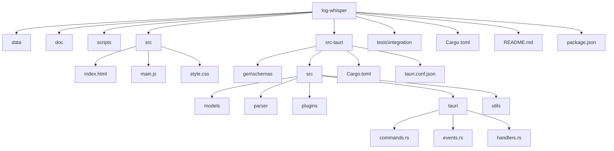
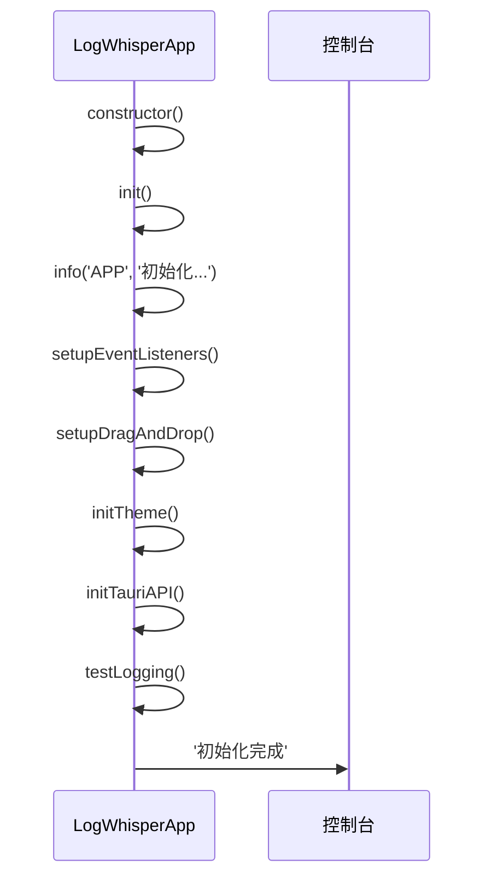
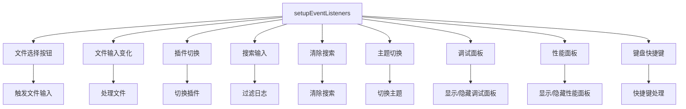
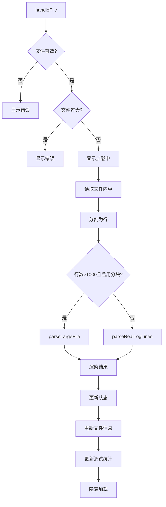
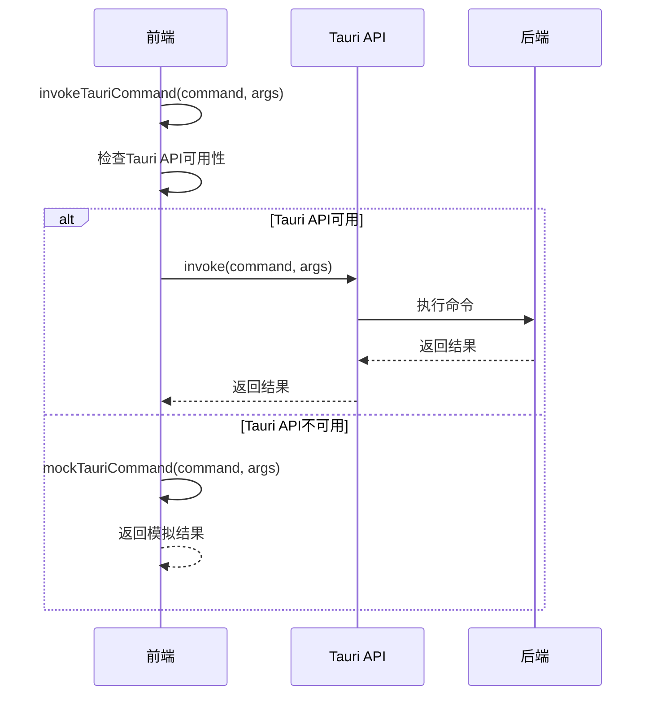
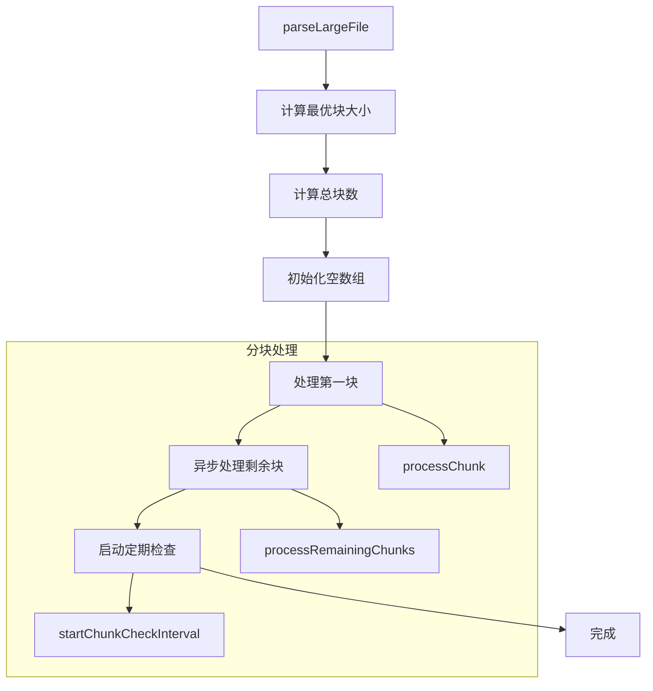
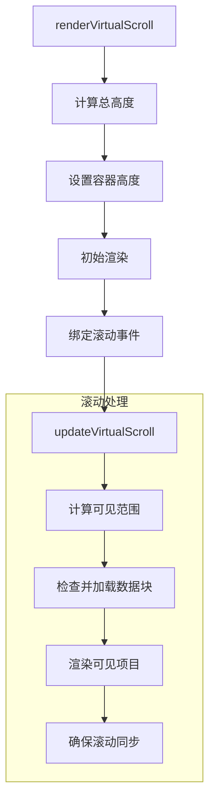
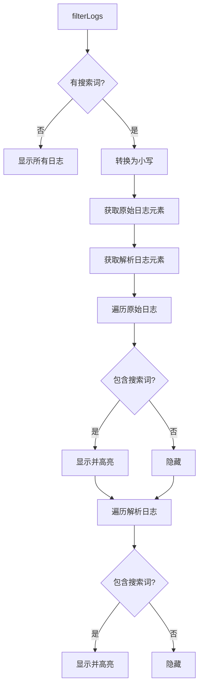
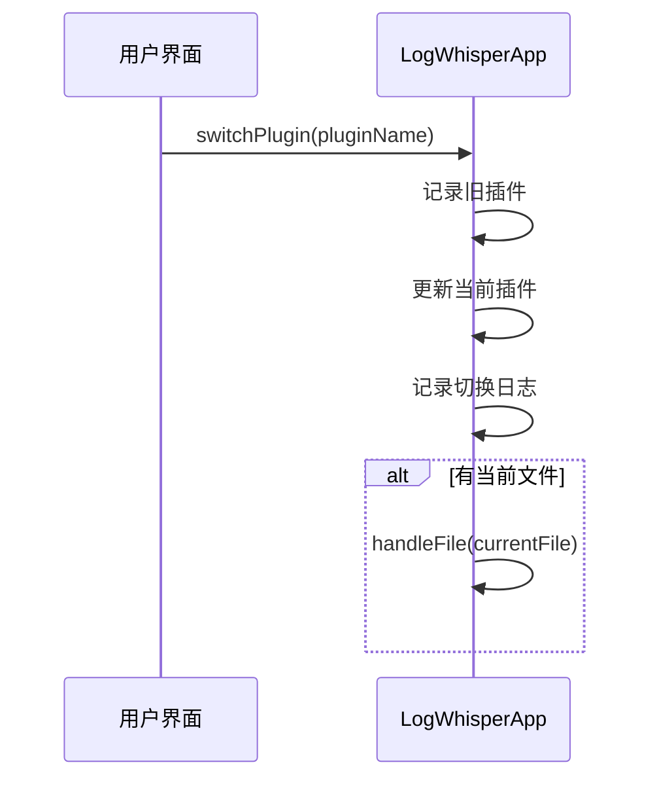
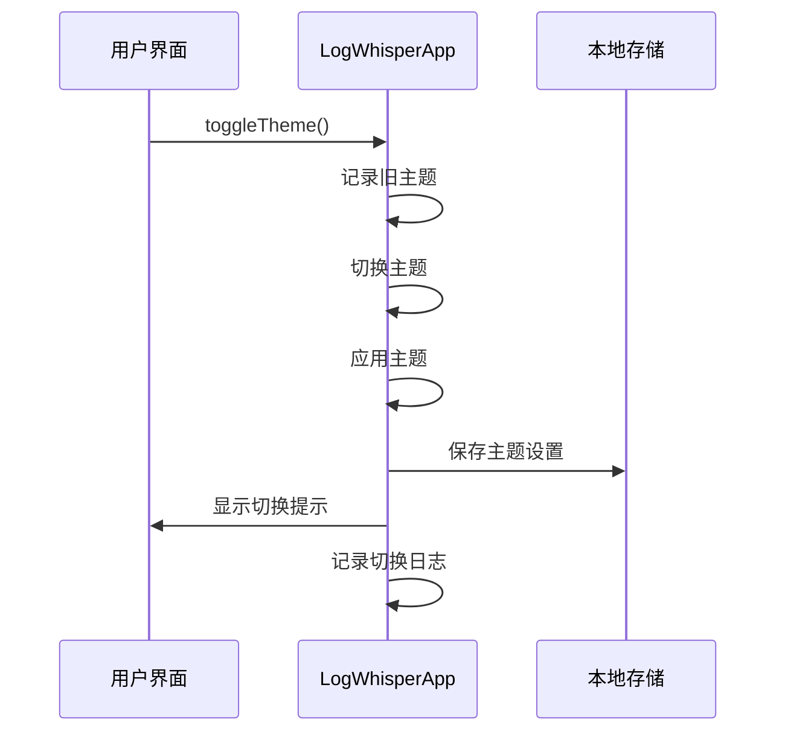

# 前端逻辑实现

<cite>
**Referenced Files in This Document**
- [main.js](file://src/main.js)
- [commands.rs](file://src-tauri/src/tauri/commands.rs)
- [handlers.rs](file://src-tauri/src/tauri/handlers.rs)
</cite>

## 目录
1. [项目结构](#项目结构)
2. [核心组件](#核心组件)
3. [初始化流程](#初始化流程)
4. [事件监听器注册](#事件监听器注册)
5. [文件处理机制](#文件处理机制)
6. [Tauri IPC通信集成](#tauri-ipc通信集成)
7. [大文件分块解析](#大文件分块解析)
8. [虚拟滚动渲染](#虚拟滚动渲染)
9. [核心交互逻辑](#核心交互逻辑)
10. [前后端接口契约](#前后端接口契约)
11. [错误处理与日志记录](#错误处理与日志记录)
12. [调试工具使用指南](#调试工具使用指南)

## 项目结构



**Diagram sources**
- [main.js](file://src/main.js)
- [commands.rs](file://src-tauri/src/tauri/commands.rs)
- [handlers.rs](file://src-tauri/src/tauri/handlers.rs)

**Section sources**
- [main.js](file://src/main.js)
- [commands.rs](file://src-tauri/src/tauri/commands.rs)
- [handlers.rs](file://src-tauri/src/tauri/handlers.rs)

## 核心组件

LogWhisperApp类是前端应用的核心组件，负责管理应用状态、处理用户交互、协调前后端通信。该类包含多个关键属性和方法，实现了完整的日志解析和展示功能。

**Section sources**
- [main.js](file://src/main.js#L1-L54)

## 初始化流程

LogWhisperApp的初始化流程通过`init()`方法实现，该方法在构造函数中被调用。初始化过程包括设置事件监听器、拖拽功能、主题管理和Tauri API初始化等关键步骤。



**Diagram sources**
- [main.js](file://src/main.js#L56-L76)

**Section sources**
- [main.js](file://src/main.js#L56-L76)

## 事件监听器注册

事件监听器注册通过`setupEventListeners()`方法实现，该方法为各种UI元素注册了相应的事件处理函数。包括文件选择、插件切换、搜索输入、主题切换等核心功能的事件监听。



**Diagram sources**
- [main.js](file://src/main.js#L94-L205)

**Section sources**
- [main.js](file://src/main.js#L94-L205)

## 文件处理机制

文件处理机制通过`handleFile()`方法实现，该方法负责处理用户选择的日志文件。处理流程包括文件验证、读取、解析和渲染等步骤。



**Diagram sources**
- [main.js](file://src/main.js#L231-L298)

**Section sources**
- [main.js](file://src/main.js#L231-L298)

## Tauri IPC通信集成

Tauri IPC通信通过`invokeTauriCommand()`方法实现，该方法封装了与后端的通信逻辑。在Tauri环境可用时调用实际的后端命令，否则使用模拟模式。



**Diagram sources**
- [main.js](file://src/main.js#L319-L326)

**Section sources**
- [main.js](file://src/main.js#L319-L326)

## 大文件分块解析

大文件分块解析通过`parseLargeFile()`方法实现，该方法将大文件分割成多个块进行处理，以提高性能和响应速度。



**Diagram sources**
- [main.js](file://src/main.js#L419-L440)

**Section sources**
- [main.js](file://src/main.js#L419-L440)

## 虚拟滚动渲染

虚拟滚动渲染通过`renderVirtualScroll()`方法实现，该方法创建虚拟滚动容器并绑定滚动事件，以优化大文件的渲染性能。



**Diagram sources**
- [main.js](file://src/main.js#L1386-L1404)

**Section sources**
- [main.js](file://src/main.js#L1386-L1404)

## 核心交互逻辑

### 搜索过滤

搜索过滤通过`filterLogs()`方法实现，该方法根据用户输入的搜索词过滤日志内容，并高亮匹配的文本。



**Diagram sources**
- [main.js](file://src/main.js#L1004-L1037)

**Section sources**
- [main.js](file://src/main.js#L1004-L1037)

### 插件切换

插件切换通过`switchPlugin()`方法实现，该方法更新当前插件并重新解析当前文件。



**Diagram sources**
- [main.js](file://src/main.js#L989-L1002)

**Section sources**
- [main.js](file://src/main.js#L989-L1002)

### 主题切换

主题切换通过`toggleTheme()`方法实现，该方法在亮色和暗色主题之间切换，并保存用户偏好。



**Diagram sources**
- [main.js](file://src/main.js#L1174-L1189)

**Section sources**
- [main.js](file://src/main.js#L1174-L1189)

## 前后端接口契约

前后端接口契约通过commands.rs和handlers.rs文件定义，确保数据结构的一致性。

### 前后端接口映射

| 前端调用 | 后端命令 | 请求结构 | 响应结构 |
|---------|---------|---------|---------|
| parse_file | parse_file | ParseFileRequest | ParseFileResponse |
| get_available_plugins | get_available_plugins | - | AvailablePluginsResponse |
| switch_plugin | switch_plugin | SwitchPluginRequest | SwitchPluginResponse |
| write_log | write_log | WriteLogRequest | WriteLogResponse |

```mermaid
classDiagram
    class ParseFileRequest {
        +file_path: String
        +plugin_name: Option<String>
    }
    
    class ParseFileResponse {
        +success: bool
        +result_set: Option<ParseResultSet>
        +error: Option<String>
    }
    
    class AvailablePluginsResponse {
        +plugins: Vec<PluginInfo>
    }
    
    class PluginInfo {
        +name: String
        +description: String
        +enabled: bool
    }
    
    class SwitchPluginRequest {
        +plugin_name: String
    }
    
    class SwitchPluginResponse {
        +success: bool
        +error: Option<String>
    }
    
    class WriteLogRequest {
        +content: String
        +append: bool
    }
    
    class WriteLogResponse {
        +success: bool
        +error: Option<String>
    }
    
    ParseFileRequest --> ParseFileResponse : "调用"
   