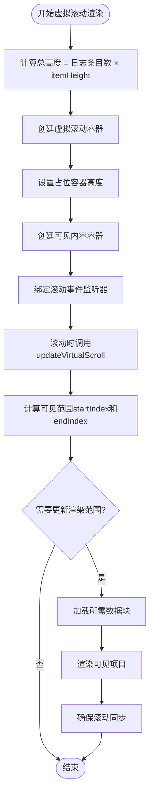
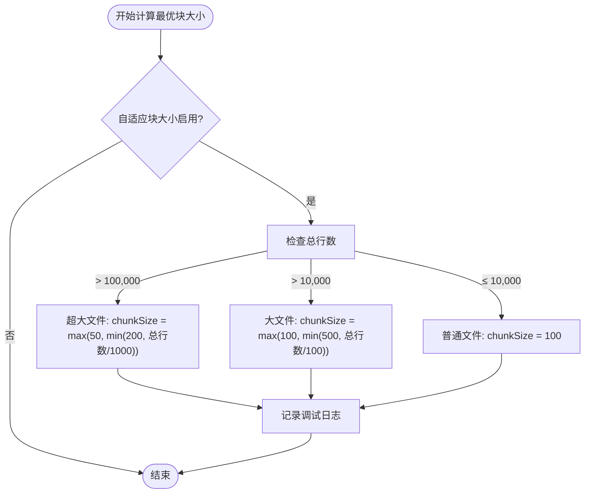
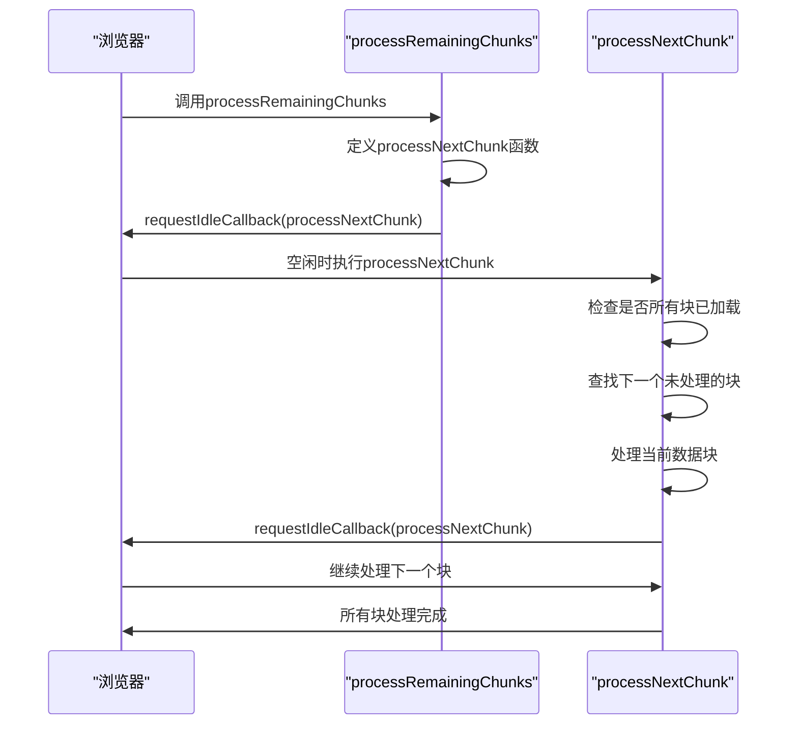
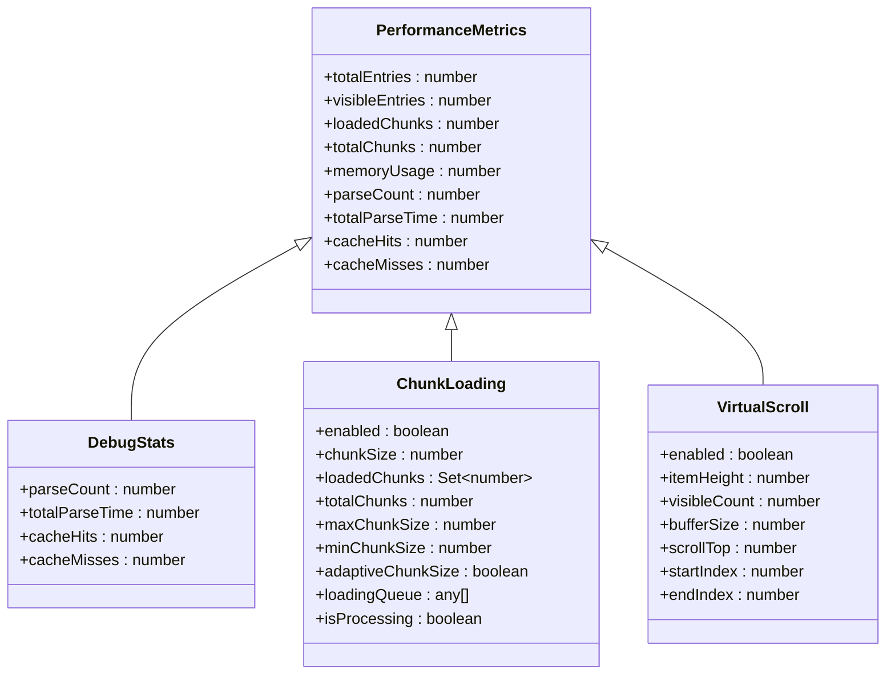

# 性能优化策略

<cite>
**本文档引用的文件**   
- [main.js](file://src/main.js)
- [file_reader.rs](file://src-tauri/src/parser/file_reader.rs)
- [performance.rs](file://src-tauri/src/utils/performance.rs)
- [renderer.rs](file://src-tauri/src/parser/renderer.rs)
- [log_parser.rs](file://src-tauri/src/parser/log_parser.rs)
- [commands.rs](file://src-tauri/src/tauri/commands.rs)
- [handlers.rs](file://src-tauri/src/tauri/handlers.rs)
</cite>

## 目录
1. [引言](#引言)
2. [虚拟滚动技术详解](#虚拟滚动技术详解)
3. [分块加载机制分析](#分块加载机制分析)
4. [性能监控面板功能](#性能监控面板功能)
5. [结论](#结论)

## 引言
LogWhisper是一款轻量级桌面日志分析工具，针对大文件日志处理场景，采用了虚拟滚动和分块加载两种核心性能优化技术。本文档深入解析这两种技术的实现原理，详细说明相关配置参数的作用和计算方式，以及性能监控面板的功能和使用方法。

## 虚拟滚动技术详解

### 虚拟滚动配置参数
虚拟滚动技术通过只渲染可见区域内的日志条目来显著提升渲染性能。其核心配置参数包括：

- **itemHeight**: 每个日志项的高度（默认60像素），用于计算容器总高度和可见范围
- **visibleCount**: 可见区域显示的项目数（默认20个），决定可视窗口大小
- **bufferSize**: 缓冲区大小（默认5个），在可见区域前后额外渲染的项目数，防止滚动时出现空白

这些参数共同决定了虚拟滚动的渲染策略，通过`renderVirtualScroll`方法创建虚拟滚动容器，并使用`updateVirtualScroll`方法根据滚动位置动态更新渲染范围。

**Diagram sources**
- [main.js](file://src/main.js#L1386-L1446)
- [main.js](file://src/main.js#L1510-L1543)

**Section sources**
- [main.js](file://src/main.js#L2-L54)
- [main.js](file://src/main.js#L1386-L1446)

### 虚拟滚动实现流程
虚拟滚动的实现流程包括容器初始化、滚动事件绑定和动态渲染更新三个主要阶段。首先通过`setupVirtualScrollContainer`方法创建具有特定CSS样式的虚拟滚动容器，然后绑定防抖处理的滚动事件，最后在`updateVirtualScroll`方法中根据当前滚动位置计算新的渲染范围。

当滚动位置变化时，系统会重新计算`startIndex`和`endIndex`，只有当渲染范围发生变化时才会触发重新渲染，这有效减少了不必要的DOM操作。同时，通过`transform: translateY`属性精确控制可见内容容器的位置，实现平滑的滚动效果。

## 分块加载机制分析

### 自适应块大小算法
分块加载机制通过`calculateOptimalChunkSize`方法实现自适应块大小调整，根据文件总行数动态优化`chunkSize`参数：

**Diagram sources**
- [main.js](file://src/main.js#L484-L500)

**Section sources**
- [main.js](file://src/main.js#L484-L500)
- [main.js](file://src/main.js#L2-L54)

该算法采用分级策略：
- 超大文件（>10万行）：使用较小的块大小（50-200），避免单次处理过多数据
- 大文件（>1万行）：使用中等块大小（100-500），平衡性能和内存使用
- 普通文件（≤1万行）：使用默认块大小（100），保证处理效率

### 空闲时间处理机制
`processRemainingChunks`方法利用`requestIdleCallback` API在浏览器空闲时间处理剩余数据块，避免阻塞主线程影响用户体验：

**Diagram sources**
- [main.js](file://src/main.js#L539-L574)

**Section sources**
- [main.js](file://src/main.js#L539-L574)
- [main.js](file://src/main.js#L504-L538)

该机制的工作流程如下：
1. 定义`processNextChunk`递归函数，用于处理单个数据块
2. 使用`requestIdleCallback`注册回调，在浏览器空闲时执行
3. 每次执行时查找并处理一个未加载的数据块
4. 处理完成后再次调用`requestIdleCallback`处理下一个块
5. 当所有块都处理完毕时停止递归

这种渐进式处理方式确保了UI的响应性，即使在处理大型日志文件时也能保持流畅的用户体验。

## 性能监控面板功能

### 性能指标采集
性能监控面板通过`getPerformanceMetrics`方法收集关键性能指标，为用户提供系统运行状态的实时反馈：

**Diagram sources**
- [main.js](file://src/main.js#L1991-L2023)
- [main.js](file://src/main.js#L2-L54)

**Section sources**
- [main.js](file://src/main.js#L1991-L2023)
- [main.js](file://src/main.js#L2-L54)

监控面板显示的主要指标包括：
- **总条目数**: 当前加载的日志总行数
- **可见条目数**: 当前可视区域内的日志条目数量
- **已加载块数/总块数**: 分块加载进度
- **内存使用**: JavaScript堆内存使用量（MB）
- **解析统计**: 解析次数、总解析时间、缓存命中/未命中次数

### 使用方法
性能监控面板可通过调试模式访问，提供以下功能：
- 实时性能指标显示
- 内存清理操作
- 日志级别设置
- 系统测试功能

用户可以通过面板监控系统性能，识别潜在的性能瓶颈，并进行相应的优化调整。面板还提供了内存清理功能，通过`cleanupInvisibleData`方法定期清理远离可见区域的数据，释放内存资源。

## 结论
LogWhisper通过虚拟滚动和分块加载两种技术的有机结合，实现了对大型日志文件的高效处理。虚拟滚动技术解决了大量DOM元素渲染的性能问题，而分块加载机制则优化了数据处理和内存使用。自适应块大小算法和`requestIdleCallback`的使用进一步提升了系统的响应性和用户体验。性能监控面板为开发者和高级用户提供了必要的工具来监控和优化系统性能，确保应用在各种使用场景下都能保持良好的运行状态。