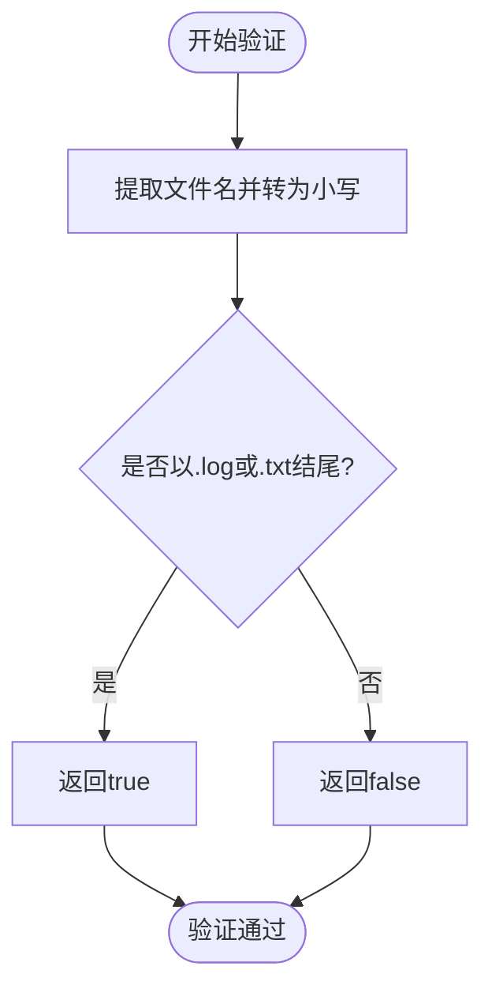
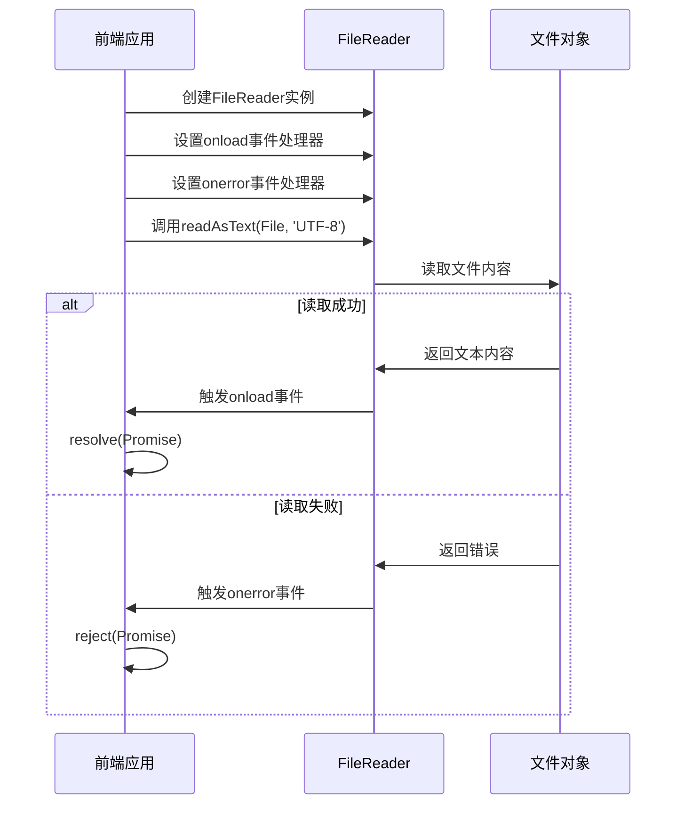
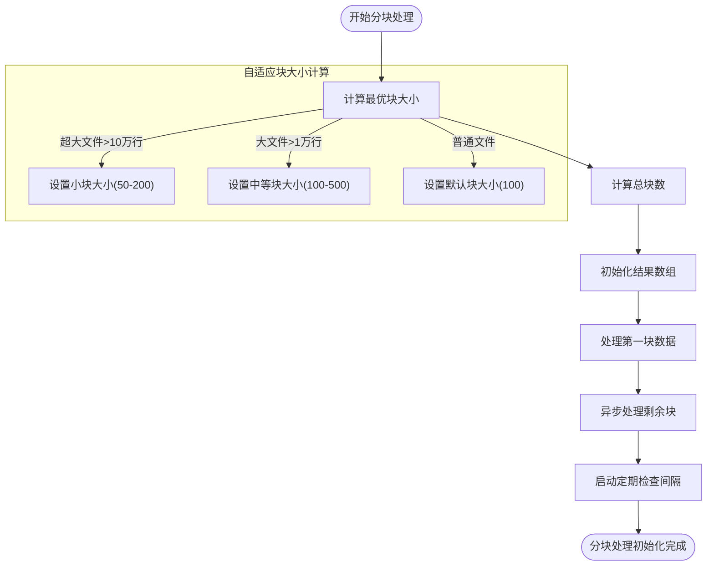
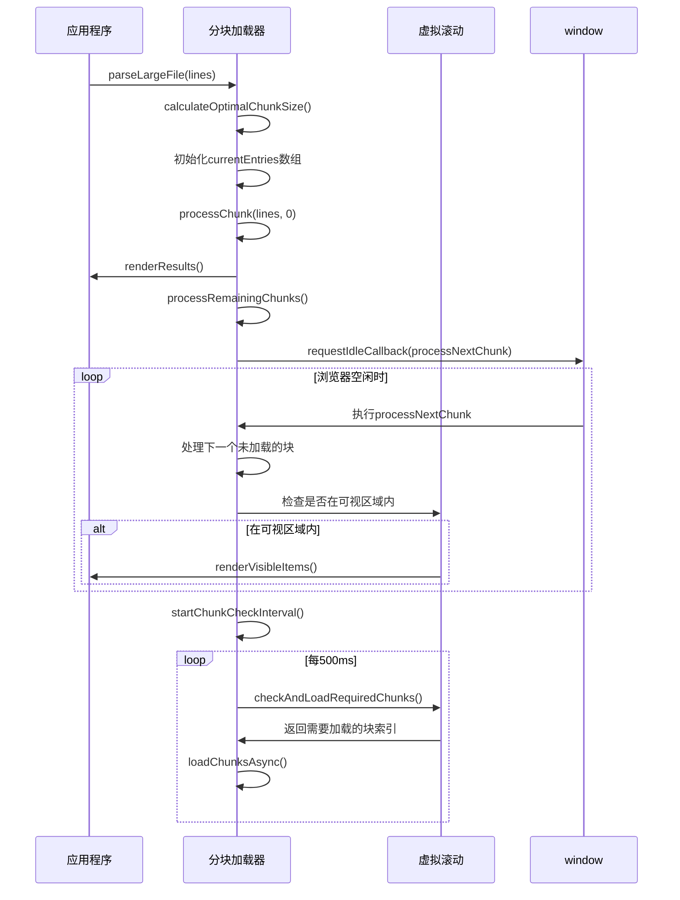
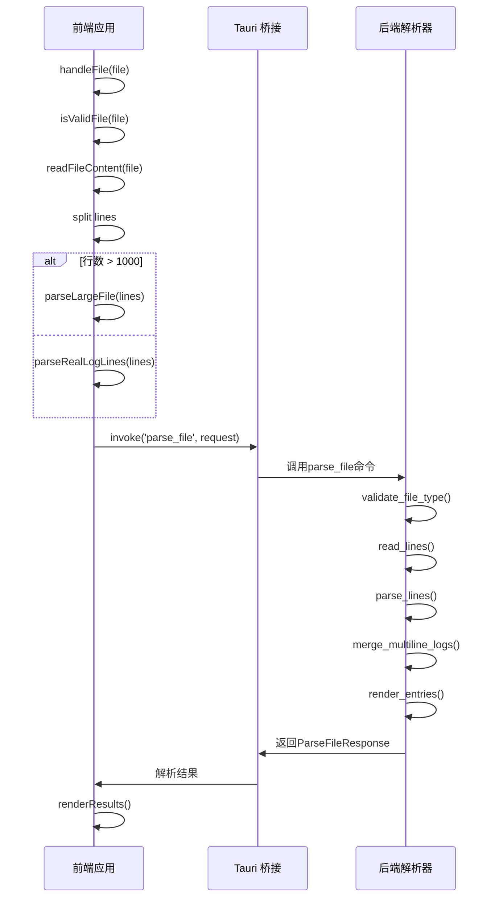
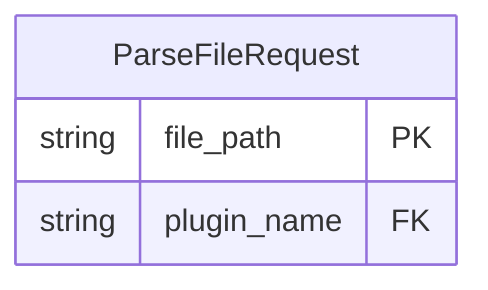
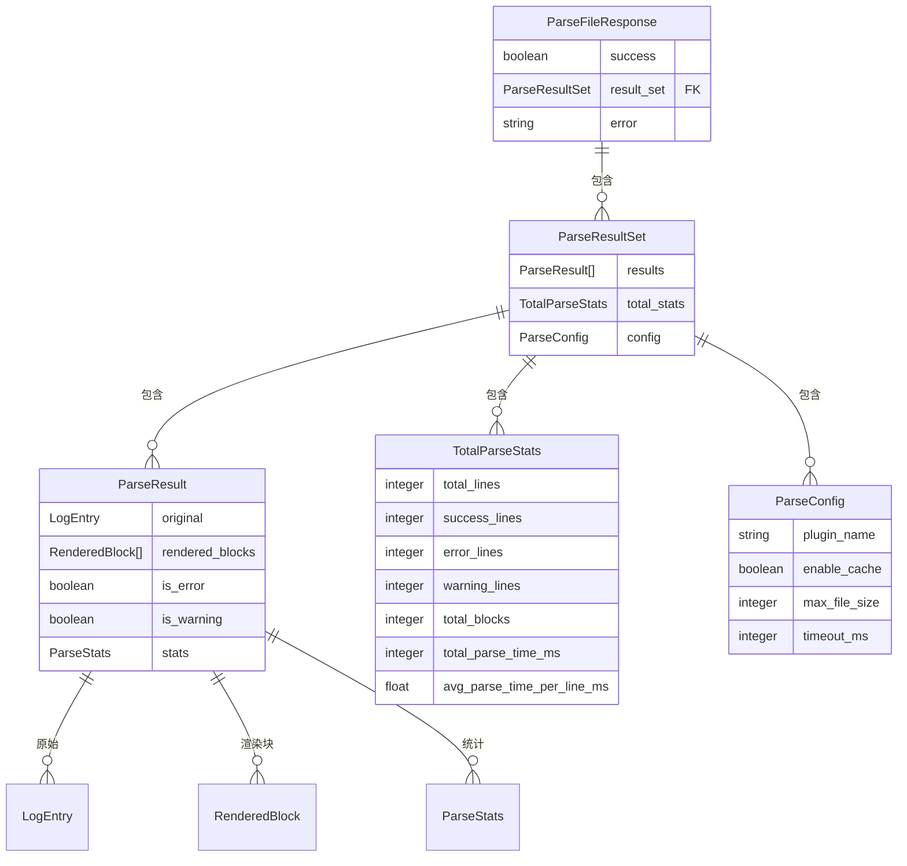

# 文件处理与解析流程

<cite>
**本文档引用的文件**
- [main.js](file://src/main.js)
- [commands.rs](file://src-tauri/src/tauri/commands.rs)
- [log_parser.rs](file://src-tauri/src/parser/log_parser.rs)
- [file_reader.rs](file://src-tauri/src/parser/file_reader.rs)
- [parse_result.rs](file://src-tauri/src/models/parse_result.rs)
</cite>

## 目录
1. [文件处理主流程](#文件处理主流程)
2. [文件验证与读取](#文件验证与读取)
3. [大文件分块解析策略](#大文件分块解析策略)
4. [前后端解析接口契约](#前后端解析接口契约)

## 文件处理主流程

`handleFile` 方法是文件处理的核心入口，负责协调整个文件解析流程。该方法首先进行文件验证和大小检查，然后根据文件大小决定采用直接解析还是分块解析策略。

**Section sources**
- [main.js](file://src/main.js#L231-L298)

## 文件验证与读取

### 文件类型验证逻辑

`isValidFile` 方法通过检查文件扩展名来验证文件类型。该方法将文件名转换为小写后，检查是否以 `.log` 或 `.txt` 结尾，仅允许这两种格式的文件被处理。

**Diagram sources**
- [main.js](file://src/main.js#L300-L304)

### 异步文件读取实现

`readFileContent` 方法使用 `FileReader` API 实现异步文件读取。该方法返回一个 Promise，当文件读取完成时解析为文件内容字符串，采用 UTF-8 编码读取文本文件。

**Diagram sources**
- [main.js](file://src/main.js#L306-L317)

## 大文件分块解析策略

当文件行数超过 1000 行且分块加载功能启用时，系统会调用 `parseLargeFile` 方法进行分块解析。该策略通过渐进式加载提高大文件处理的响应性能。

### 分块处理流程

**Diagram sources**
- [main.js](file://src/main.js#L419-L440)

### 分块处理机制

分块处理采用渐进式加载策略，优先处理第一块数据以快速显示部分内容，然后在浏览器空闲时通过 `requestIdleCallback` 异步处理剩余块。同时启动定期检查机制，根据可视区域需求动态加载必要数据块。

**Section sources**
- [main.js](file://src/main.js#L419-L440)

## 前后端解析接口契约

### 前后端调用流程

前端通过 Tauri 的 `invoke` 机制调用后端 `parse_file` 命令，实现跨进程通信。后端解析完成后将结果返回给前端进行渲染。

**Diagram sources**
- [main.js](file://src/main.js#L231-L298)
- [commands.rs](file://src-tauri/src/tauri/commands.rs#L68-L121)

### 数据传递格式

前后端通过定义良好的数据结构进行通信，确保类型安全和数据完整性。

#### 请求格式

#### 响应格式

**Diagram sources**
- [commands.rs](file://src-tauri/src/tauri/commands.rs#L68-L121)
- [parse_result.rs](file://src-tauri/src/models/parse_result.rs#L1-L285)