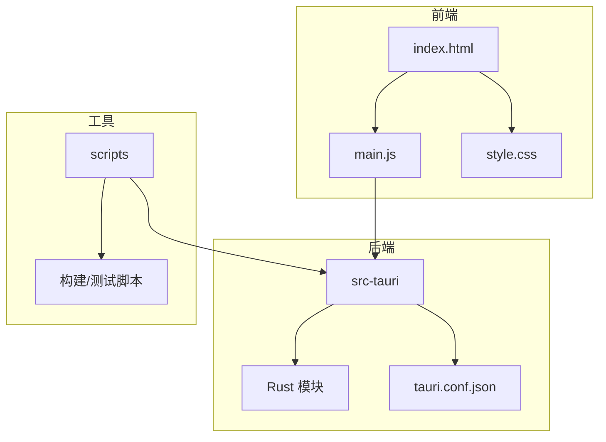
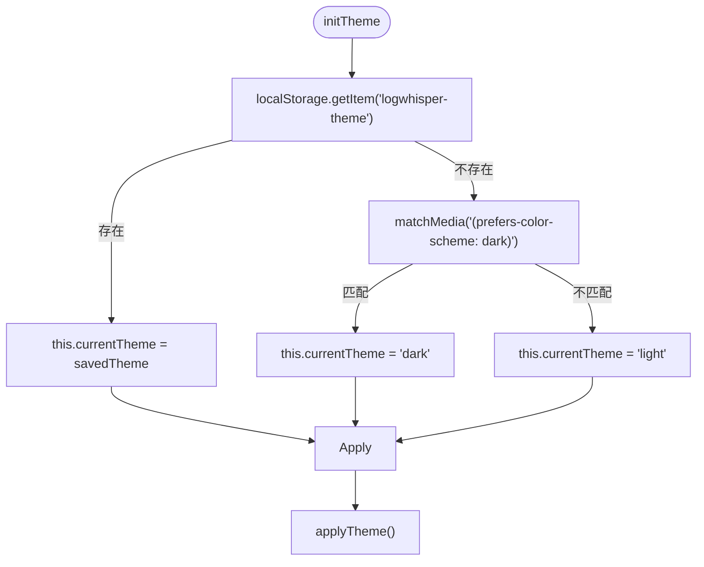
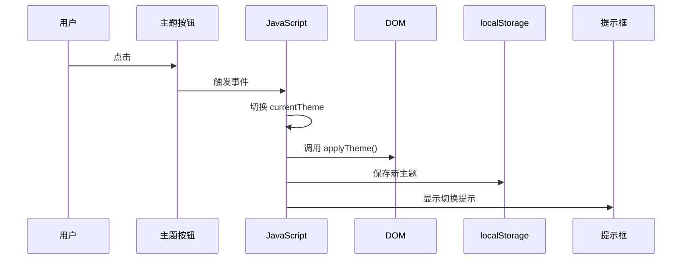
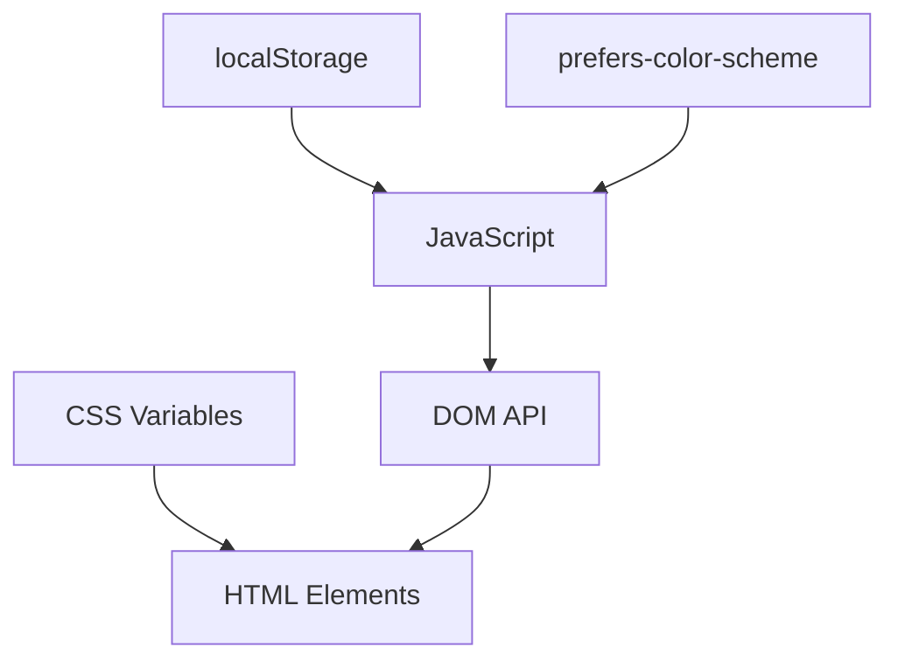

# 主题系统

<cite>
**本文档引用的文件**  
- [style.css](file://src/style.css)
- [main.js](file://src/main.js)
- [index.html](file://src/index.html)
</cite>

## 目录
1. [简介](#简介)
2. [项目结构](#项目结构)
3. [核心组件](#核心组件)
4. [架构概览](#架构概览)
5. [详细组件分析](#详细组件分析)
6. [依赖分析](#依赖分析)
7. [性能考虑](#性能考虑)
8. [故障排除指南](#故障排除指南)
9. [结论](#结论)

## 简介
LogWhisper 是一款用于解析和可视化日志文件的前端应用，支持亮色与暗色主题切换。本系统通过 CSS 变量实现主题管理，结合 JavaScript 动态控制 `data-theme` 属性，实现即时主题切换。主题系统不仅涵盖基础颜色、背景、文本、边框和阴影，还扩展至日志块渲染、滚动条样式、动画效果等，确保整体视觉一致性。此外，系统支持响应式设计与本地存储记忆功能，提升用户体验。

## 项目结构
LogWhisper 的项目结构清晰，分为前端资源、Tauri 后端逻辑与配置文件三大模块。前端部分位于 `src/` 目录，包含 HTML、CSS 和 JavaScript 文件；后端逻辑基于 Rust 编写，位于 `src-tauri/` 目录；构建与测试脚本集中于 `scripts/` 目录。



**Diagram sources**
- [index.html](file://src/index.html#L1-L248)
- [main.js](file://src/main.js#L1-L2094)
- [style.css](file://src/style.css#L1-L519)

**Section sources**
- [index.html](file://src/index.html#L1-L248)
- [main.js](file://src/main.js#L1-L2094)
- [style.css](file://src/style.css#L1-L519)

## 核心组件
主题系统由三大核心组件构成：CSS 变量定义、JavaScript 主题切换逻辑、HTML 结构绑定。`:root` 和 `[data-theme='dark']` 定义了亮色与暗色主题的颜色变量；`main.js` 中的 `initTheme()`、`toggleTheme()` 和 `applyTheme()` 方法负责初始化与切换主题；`index.html` 中的 `<body>` 元素通过 `data-theme` 属性绑定主题状态。

**Section sources**
- [style.css](file://src/style.css#L4-L210)
- [main.js](file://src/main.js#L1160-L1202)
- [index.html](file://src/index.html#L1-L248)

## 架构概览
主题系统的整体架构基于 CSS 自定义属性（CSS Variables）与 DOM 属性控制相结合的方式。CSS 层面通过 `:root` 定义默认亮色主题，通过 `[data-theme='dark']` 覆盖变量值实现暗色主题。JavaScript 层面通过监听按钮点击事件，调用 `toggleTheme()` 方法修改 `body` 元素的 `data-theme` 属性，触发 CSS 重新计算，实现无刷新主题切换。用户偏好通过 `localStorage` 持久化，系统默认主题通过 `prefers-color-scheme` 媒体查询自动适配。

```mermaid
graph LR
A[用户点击切换按钮] --> B[JavaScript: toggleTheme()]
B --> C[更新 currentTheme 状态]
C --> D[调用 applyTheme()]
D --> E[设置 body[data-theme]]
E --> F[CSS 变量重新计算]
F --> G[页面样式即时更新]
H[页面加载] --> I[initTheme()]
I --> J[读取 localStorage 或系统偏好]
J --> C
```

**Diagram sources**
- [main.js](file://src/main.js#L1160-L1202)
- [style.css](file://src/style.css#L4-L210)

## 详细组件分析

### 主题变量定义分析
CSS 变量在 `:root` 和 `[data-theme='dark']` 中系统性地组织为多个类别：基础色、背景色、文本色、边框色、阴影、渲染块背景等。每个变量命名清晰，语义明确，便于维护与扩展。

#### 亮色与暗色主题颜色映射
以下表格展示了主要颜色变量在两种主题下的映射关系：

| 变量名 | 亮色主题值 | 暗色主题值 | 用途 |
|--------|------------|------------|------|
| `--bg-primary` | `#ffffff` | `#0f172a` | 页面主背景 |
| `--text-primary` | `#1f2937` | `#f8fafc` | 主要文本颜色 |
| `--border-primary` | `#e5e7eb` | `#334155` | 主要边框颜色 |
| `--shadow-md` | `0 4px 6px -1px rgba(0,0,0,0.1)` | `0 4px 6px -1px rgba(0,0,0,0.4)` | 中等阴影 |
| `--color-primary` | `#1e3a8a` | `#3b82f6` | 主色调（按钮、链接） |

**Section sources**
- [style.css](file://src/style.css#L4-L210)

### 主题切换机制分析
主题切换由 JavaScript 控制，核心方法包括：

#### initTheme 方法
初始化主题，优先读取 `localStorage` 中保存的用户选择，若无则根据系统偏好自动设置。



**Diagram sources**
- [main.js](file://src/main.js#L1160-L1172)

#### toggleTheme 方法
切换主题状态，更新 `localStorage` 并显示提示。



**Diagram sources**
- [main.js](file://src/main.js#L1174-L1189)

#### applyTheme 方法
将当前主题应用到 DOM，通过设置 `body` 的 `data-theme` 属性和更新图标。

```mermaid
flowchart TD
A[applyTheme] --> B{currentTheme === 'dark'?}
B --> |是| C[body.setAttribute('data-theme', 'dark')]
B --> |否| D[body.setAttribute('data-theme', 'light')]
C --> E[themeIcon.textContent = '☀️']
D --> F[themeIcon.textContent = '🌙']
```

**Diagram sources**
- [main.js](file://src/main.js#L1191-L1202)

## 依赖分析
主题系统依赖于现代浏览器对 CSS 自定义属性和 `prefers-color-scheme` 媒体查询的支持。JavaScript 部分依赖 DOM API 进行属性操作与事件监听。UI 组件通过 `style` 属性或 CSS 类绑定变量，形成依赖链。



**Diagram sources**
- [style.css](file://src/style.css#L4-L210)
- [main.js](file://src/main.js#L1160-L1202)

## 性能考虑
主题切换为纯 CSS 变量更新，不涉及重排或重绘的大规模计算，性能开销极低。过渡动画通过 `transition` 属性实现，仅影响 `background-color` 和 `color`，避免性能瓶颈。`localStorage` 读写操作轻量，不影响主线程响应。

**Section sources**
- [style.css](file://src/style.css#L55-L56)
- [main.js](file://src/main.js#L1160-L1202)

## 故障排除指南
### 主题未生效
- 检查 `data-theme` 是否正确设置在 `<body>` 上
- 确认 CSS 文件已正确加载
- 验证变量名拼写是否一致

### 切换无动画
- 检查 `body` 是否定义了 `transition` 属性
- 确保修改的是 `data-theme` 而非直接修改样式

### 系统偏好未生效
- 确认浏览器支持 `window.matchMedia`
- 检查媒体查询语法是否正确

**Section sources**
- [style.css](file://src/style.css#L55-L56)
- [main.js](file://src/main.js#L1160-L1172)

## 结论
LogWhisper 的主题系统采用现代化的 CSS 变量与 JavaScript 控制相结合的方式，实现了高效、可维护、用户体验友好的亮色/暗色主题切换机制。系统设计充分考虑了可扩展性与性能，为后续新增主题或调整配色提供了良好基础。建议在自定义新主题时，遵循现有变量命名规范，保持视觉一致性，并通过 `localStorage` 记住用户选择，提升产品体验。