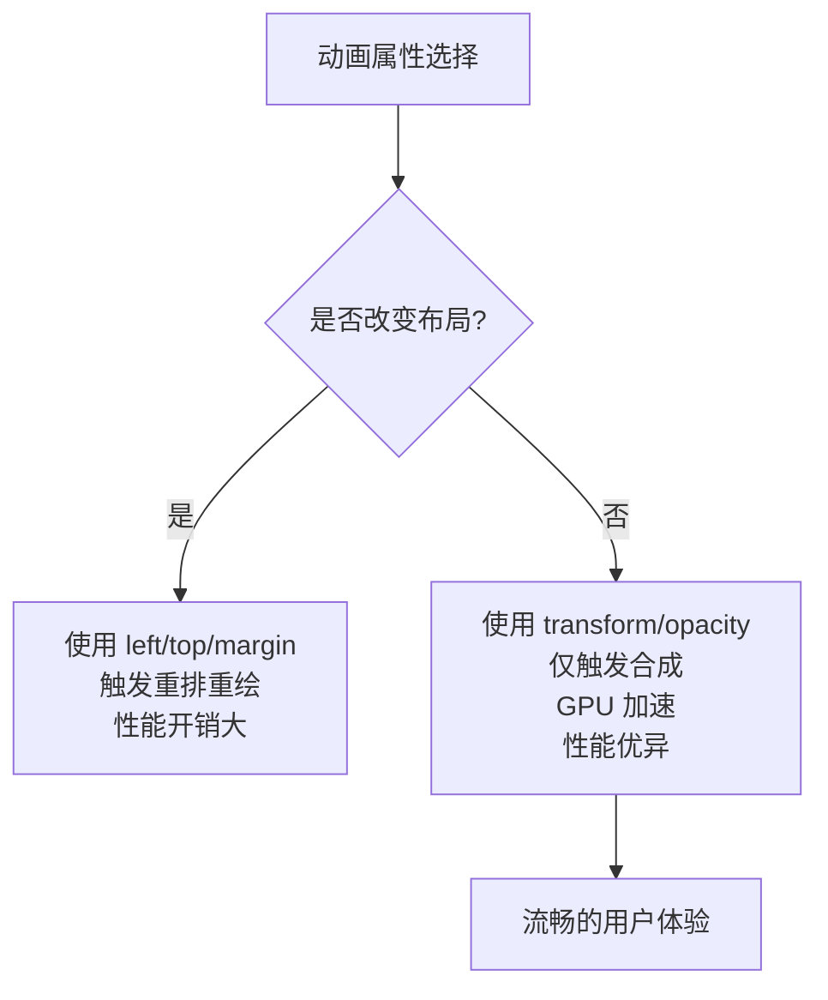

# 动画效果

<cite>
**Referenced Files in This Document**   
- [style.css](file://src/style.css)
- [main.js](file://src/main.js)
</cite>

## 目录
1. [加载旋转动画 (animate-spin)](#加载旋转动画-animate-spin)
2. [淡入动画 (fade-in)](#淡入动画-fade-in)
3. [滑入动画 (slide-in)](#滑入动画-slide-in)
4. [骨架屏动画 (loading-placeholder)](#骨架屏动画-loading-placeholder)
5. [动画性能考量](#动画性能考量)
6. [用户体验设计意图](#用户体验设计意图)

## 加载旋转动画 (animate-spin)

`animate-spin` 是一个持续无限循环的旋转动画，用于表示系统正在处理或加载中。该动画通过 `@keyframes spin` 定义，从 0 度旋转到 360 度，实现平滑的循环旋转效果。动画时长为 1 秒，采用线性缓动函数（`linear`），确保旋转速度均匀，符合加载指示器的视觉预期。

该动画通常应用于加载图标或按钮，为用户提供明确的等待反馈。

**Section sources**
- [style.css](file://src/style.css#L287-L294)

## 淡入动画 (fade-in)

`fade-in` 动画用于元素的平滑出现，通过改变透明度和垂直位置创造轻盈的入场效果。动画时长为 0.3 秒，使用 `ease-out` 缓动函数，使元素开始时较快显现，结束时逐渐放缓，符合自然运动规律。

动画从 `opacity: 0` 和 `transform: translateY(10px)` 开始，到 `opacity: 1` 和 `transform: translateY(0)` 结束，元素从下方 10 像素处向上滑动并同时变不透明，营造出“浮现”的视觉感受。

**Section sources**
- [style.css](file://src/style.css#L296-L309)

## 滑入动画 (slide-in)

`slide-in` 动画实现元素从左侧外滑入视图的效果。动画时长同样为 0.3 秒，采用 `ease-out` 缓动函数。元素从 `transform: translateX(-100%)`（完全在容器左侧之外）和 `opacity: 0` 的状态开始，平滑移动到 `transform: translateX(0)`（原始位置）并完全不透明。

此动画常用于侧边栏、模态框或列表项的进入，提供清晰的方向感和动态过渡。

**Section sources**
- [style.css](file://src/style.css#L311-L324)

## 骨架屏动画 (loading-placeholder)

`loading-placeholder` 动画用于在内容加载前显示占位符，提升用户等待体验。该动画通过 `@keyframes loading` 实现，通过周期性地改变背景位置（`background-position`）来模拟光效扫过的效果。

动画时长为 1.5 秒，并设置为无限循环。在 `main.js` 中，此动画被直接应用于虚拟滚动列表的加载项，通过内联样式 `animation: loading 1.5s infinite` 实现动态的骨架屏效果，让用户感知到内容正在加载中。

**Section sources**
- [style.css](file://src/style.css#L354-L362)
- [main.js](file://src/main.js#L1836-L1859)

## 动画性能考量

本项目中的所有动画均遵循现代 Web 性能最佳实践，优先使用 `transform` 和 `opacity` 属性来实现动画效果，而非传统的 `left`、`top` 或 `margin` 等会触发重排（reflow）和重绘（repaint）的属性。

- **旋转与位移**：`animate-spin` 使用 `transform: rotate()`，`fade-in` 和 `slide-in` 使用 `transform: translateX()` 和 `translateY()`。这些 `transform` 属性的动画通常由 GPU 加速，仅触发合成（compositing）阶段，对性能影响极小。
- **避免重排**：通过 `transform` 进行位移不会改变文档流，因此不会导致页面其他元素的重新布局，极大提升了动画流畅度，尤其在处理大量日志条目时至关重要。
- **硬件加速**：浏览器能够将使用 `transform` 的元素提升为独立的图层，利用 GPU 进行渲染，确保动画在各种设备上都能保持 60fps 的流畅帧率。

**Diagram sources**
- [style.css](file://src/style.css#L287-L324)

**Section sources**
- [style.css](file://src/style.css#L287-L324)

## 用户体验设计意图

动画在本系统中不仅是视觉装饰，更是提升用户体验的关键设计元素：

- **状态反馈**：`animate-spin` 明确告知用户系统正在处理，防止用户因无响应而重复操作。
- **平滑过渡**：`fade-in` 和 `slide-in` 动画使界面变化更加自然，减少视觉突兀感，帮助用户追踪元素的出现和消失。
- **加载感知**：`loading-placeholder` 的骨架屏动画有效管理用户期望，即使数据尚未完全加载，也能让用户感知到应用的响应性和进度，减少等待焦虑。
- **微交互**：如 `.copy-btn:hover` 的 `scale(1.05)` 效果，提供了即时的点击反馈，增强了界面的可交互性和活力。

这些精心设计的微交互共同构建了一个响应迅速、直观且愉悦的用户界面，显著提升了日志查看这一核心功能的可用性和满意度。

**Section sources**
- [style.css](file://src/style.css#L287-L362)