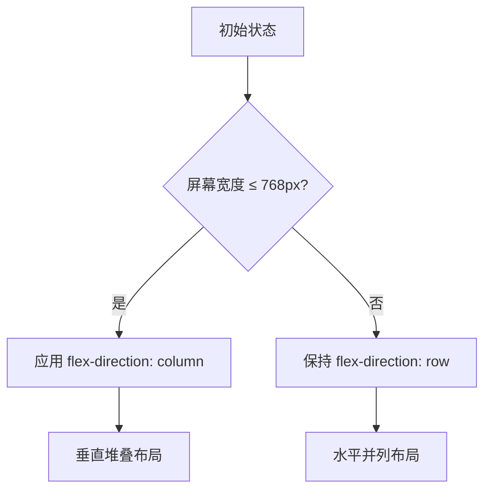

# 响应式设计优化

<cite>
**本文档引用文件**   
- [index.html](file://src/index.html)
- [style.css](file://src/style.css)
- [main.js](file://src/main.js)
</cite>

## 目录
1. [移动端适配策略](#移动端适配策略)
2. [布局重构机制](#布局重构机制)
3. [字体与内边距调整](#字体与内边距调整)
4. [flex-direction: column 布局转换](#flex-direction-column-布局转换)
5. [宽度类 w-1/2 的响应式行为](#宽度类-w-12-的响应式行为)
6. [搜索输入框尺寸适配](#搜索输入框尺寸适配)
7. [.virtual-log-item 紧凑显示模式](#virtual-log-item-紧凑显示模式)
8. [最佳实践与问题解决方案](#最佳实践与问题解决方案)

## 移动端适配策略

在小屏幕设备上，LogWhisper 通过 `@media (max-width: 768px)` 断点实现响应式布局调整，确保在移动设备上具有良好的可读性和操作便利性。该断点触发后，系统会自动重构页面布局，将原本并列的双栏结构转换为垂直堆叠结构，使用户能够在有限的屏幕空间内更方便地浏览和操作日志内容。

这种适配策略不仅提升了移动端的用户体验，还保持了功能完整性，使得核心功能如文件选择、插件切换、搜索过滤和主题切换等在小屏幕上依然可用且易于操作。

**Section sources**
- [style.css](file://src/style.css#L413-L485)
- [index.html](file://src/index.html#L24-L46)

## 布局重构机制

当屏幕宽度小于或等于 768px 时，CSS 媒体查询触发布局重构机制。该机制通过修改 Flexbox 容器的 `flex-direction` 属性，将原本水平排列的元素重新组织为垂直堆叠模式。主内容区域的两个子容器（原始日志和解析结果）从并列显示变为上下排列，充分利用垂直空间，避免了水平滚动带来的操作不便。

此外，工具栏中的搜索框和其他控件也进行了重新排列，确保所有功能按钮都能完整显示且点击区域足够大，符合移动端手指操作的习惯。

**Section sources**
- [style.css](file://src/style.css#L413-L485)
- [index.html](file://src/index.html#L24-L46)

## 字体与内边距调整

为了提升移动端的可读性，系统在小屏幕设备上对字体大小和内边距进行了优化调整。`.virtual-log-item` 类的 `padding` 从 8px 减少到 4px，`font-size` 从 13px 调整为 12px，从而实现更紧凑的显示效果。这些微调使得在有限的屏幕空间内可以显示更多的日志条目，同时保持足够的可读性。

这些样式调整通过媒体查询精确控制，仅在移动设备上生效，确保桌面端用户仍能享受宽松舒适的阅读体验。

**Section sources**
- [style.css](file://src/style.css#L413-L485)

## flex-direction: column 布局转换

`flex-direction: column` 的布局转换原理基于 CSS Flexbox 模型。在 `@media (max-width: 768px)` 条件下，`.flex` 类的 `flex-direction` 属性被重写为 `column`，导致其子元素按照垂直方向排列。这一变化直接影响了整个页面的结构，特别是主内容区域的左右分栏布局。

转换后，左侧的“原始日志”和右侧的“解析结果”不再并排显示，而是以上下顺序堆叠，形成更适合小屏幕阅读的信息流。这种布局转换不仅提高了空间利用率，还增强了内容的连贯性。

**Diagram sources**
- [style.css](file://src/style.css#L413-L485)

## 宽度类 w-1/2 的响应式行为

在桌面端，`w-1/2` 类将两个主内容区域各占据 50% 的宽度，形成对称的双栏布局。但在移动端，该类的宽度定义被媒体查询覆盖，设置为 `width: 100%`，使每个区域都能充分利用可用的屏幕宽度。

这种响应式行为确保了无论在何种设备上，内容区域都能完整显示且不留空白，避免了因宽度不足导致的内容截断或滚动问题。同时，这也简化了用户的浏览路径，无需左右滑动即可查看全部内容。

**Section sources**
- [style.css](file://src/style.css#L413-L485)
- [index.html](file://src/index.html#L24-L46)

## 搜索输入框尺寸适配

搜索输入框 `#searchInput` 在移动端的尺寸适配策略是将其宽度从 `w-64`（约 256px）固定为 `200px`。这一调整平衡了输入框的可用性和界面的整体美观度，既保证了足够的输入空间，又不会因过宽而挤占其他控件的位置。

此外，输入框的 `padding` 和 `font-size` 保持不变，确保文本清晰可读，点击区域足够大，符合移动端的交互规范。这种精细化的尺寸控制体现了对用户体验的深入考量。

**Section sources**
- [style.css](file://src/style.css#L413-L485)
- [index.html](file://src/index.html#L24-L46)

## .virtual-log-item 紧凑显示模式

`.virtual-log-item` 在移动端启用紧凑显示模式，通过减少 `padding` 至 `4px` 和降低 `font-size` 至 `12px` 来优化空间利用。这种模式特别适用于虚拟滚动场景，能够在有限的可视区域内渲染更多日志条目，提升浏览效率。

紧凑模式还配合了适当的行高和颜色对比度设置，确保即使在较小的字号下，文本依然清晰易读。这种设计在保证功能性的同时，最大限度地适应了移动设备的物理限制。

**Section sources**
- [style.css](file://src/style.css#L413-L485)
- [main.js](file://src/main.js#L1848-L1877)

## 最佳实践与问题解决方案

结合实际使用场景，响应式设计的最佳实践包括：优先考虑内容的可读性和操作的便捷性，合理利用媒体查询进行断点控制，以及对关键交互元素进行针对性优化。常见问题如内容溢出、点击区域过小等，可通过设置 `viewport` 元标签、使用相对单位和增加触摸目标尺寸等方式解决。

对于 LogWhisper 而言，持续监控用户反馈并迭代优化移动端体验是关键。例如，可根据用户习惯进一步调整断点值，或引入手势操作增强交互性。同时，性能优化也不容忽视，确保在低性能设备上也能流畅运行。

**Section sources**
- [style.css](file://src/style.css#L413-L485)
- [main.js](file://src/main.js#L110-L148)
- [index.html](file://src/index.html#L0-L25)