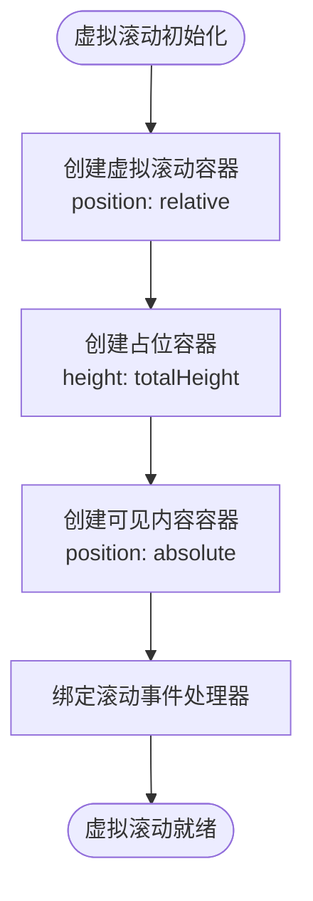
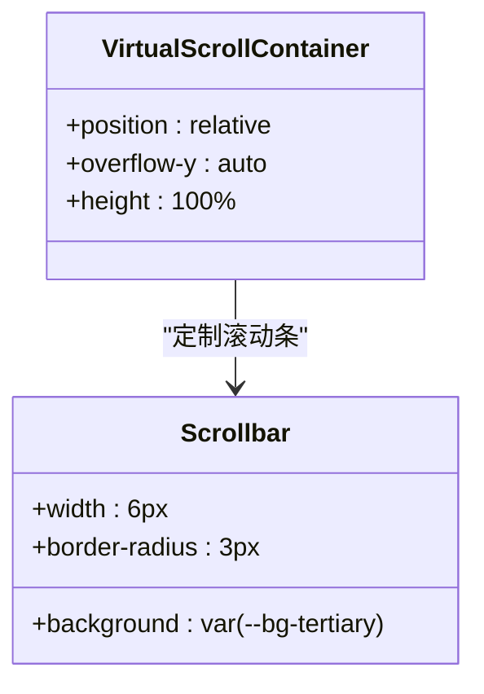
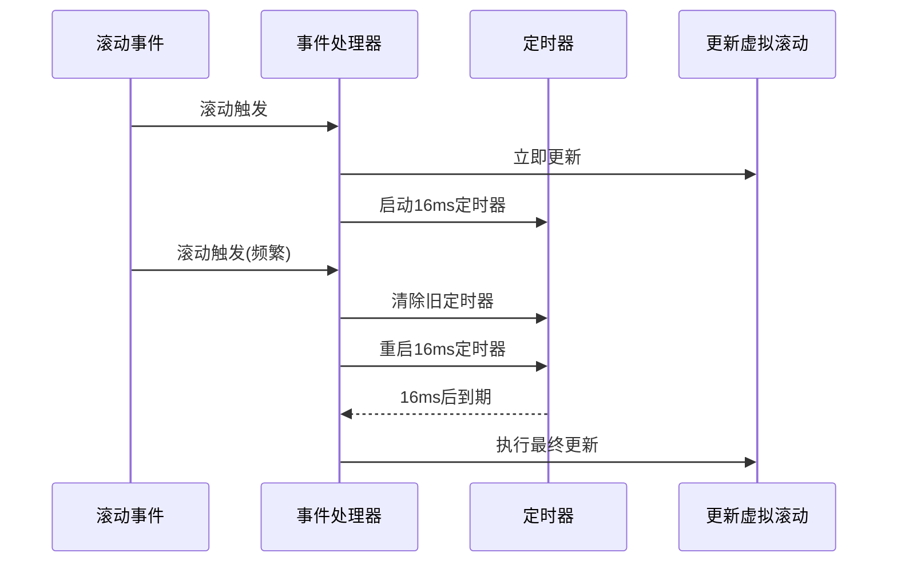
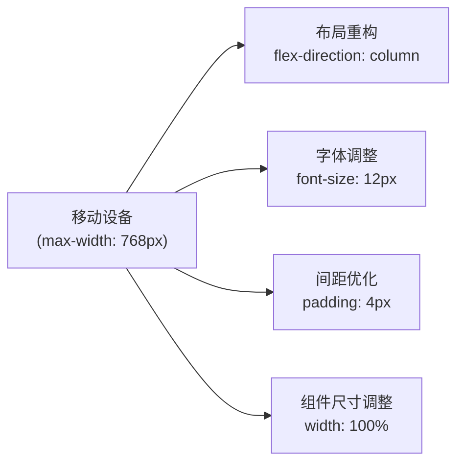

# 性能优化样式

<cite>
**Referenced Files in This Document**  
- [main.js](file://src/main.js)
- [style.css](file://src/style.css)
</cite>

## 目录
1. [虚拟滚动布局策略](#虚拟滚动布局策略)
2. [滚动容器性能优化](#滚动容器性能优化)
3. [精简滚动条设计](#精简滚动条设计)
4. [CSS属性选择优化](#css属性选择优化)
5. [样式层面的防抖与节流](#样式层面的防抖与节流)
6. [响应式移动适配策略](#响应式移动适配策略)

## 虚拟滚动布局策略

通过`.virtual-scroll-container`类实现的虚拟滚动机制，采用绝对定位布局来显著提升大规模日志渲染性能。该策略的核心在于仅渲染当前视口内可见的日志条目，而非一次性加载全部数据。

虚拟滚动容器通过三层嵌套结构实现高效渲染：
- 外层容器（`.virtual-scroll-container`）负责整体滚动行为
- 中间占位容器（`.virtual-scroll-placeholder`）维持整体滚动高度
- 内层可见内容容器（`.virtual-scroll-visible`）动态更新可见区域内容

这种布局方式有效减少了DOM节点数量，避免了浏览器对大量不可见元素的渲染开销。

**Section sources**
- [main.js](file://src/main.js#L1406-L1446)
- [style.css](file://src/style.css#L333-L335)

## 滚动容器性能优化

滚动容器的性能优化主要体现在两个方面：结构设计和事件处理。在结构上，通过`position: relative`和`overflow-y: auto`的组合，创建了一个独立的滚动上下文，隔离了滚动行为对其他页面元素的影响。

**Diagram sources**
- [main.js](file://src/main.js#L1406-L1446)

**Section sources**
- [main.js](file://src/main.js#L1406-L1446)
- [style.css](file://src/style.css#L333-L335)

## 精简滚动条设计

针对虚拟滚动容器，实现了专门的精简滚动条样式，以进一步优化性能表现。与全局滚动条相比，虚拟滚动容器的滚动条具有更小的宽度（6px）和更简单的样式。

**Diagram sources**
- [style.css](file://src/style.css#L378-L391)

**Section sources**
- [style.css](file://src/style.css#L378-L391)

## CSS属性选择优化

在CSS属性选择上，采用了多项性能优化策略。首先，避免使用昂贵的CSS属性如`box-shadow`和`border-radius`在滚动频繁更新的元素上。其次，对于需要动画效果的元素，仅对`transform`和`opacity`属性进行动画处理，这两者不会触发重排（reflow）和重绘（repaint）。

此外，通过CSS变量（Custom Properties）实现了主题系统的高效管理，减少了重复的CSS规则。所有颜色、背景、边框等样式均通过`var(--variable-name)`方式引用，使得主题切换时只需更改根元素的变量值，而无需重新计算大量样式规则。

**Section sources**
- [style.css](file://src/style.css#L1-L286)

## 样式层面的防抖与节流

在滚动事件处理中，应用了防抖（Debounce）思想来优化性能。通过设置16ms的延迟（约60fps），避免了滚动事件的频繁触发导致的性能瓶颈。

**Diagram sources**
- [main.js](file://src/main.js#L1448-L1508)

**Section sources**
- [main.js](file://src/main.js#L1448-L1508)

## 响应式移动适配策略

响应式设计采用了移动优先（Mobile-First）的策略，通过媒体查询在不同屏幕尺寸下调整布局和样式。在移动设备上（屏幕宽度≤768px），主要进行了以下适配：

- 布局重构：将水平布局改为垂直堆叠
- 字体大小调整：减小虚拟日志条目的字体大小
- 间距优化：减少内边距以适应小屏幕
- 组件尺寸：调整搜索输入框等组件的宽度

**Diagram sources**
- [style.css](file://src/style.css#L419-L433)

**Section sources**
- [style.css](file://src/style.css#L419-L433)