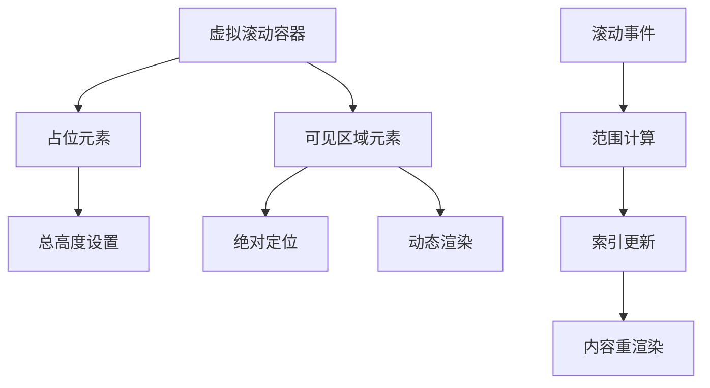
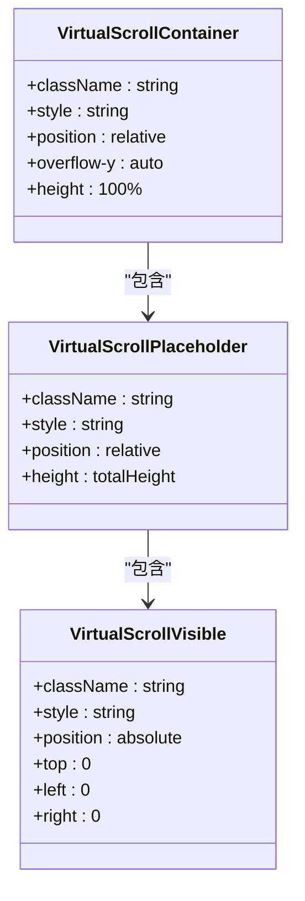
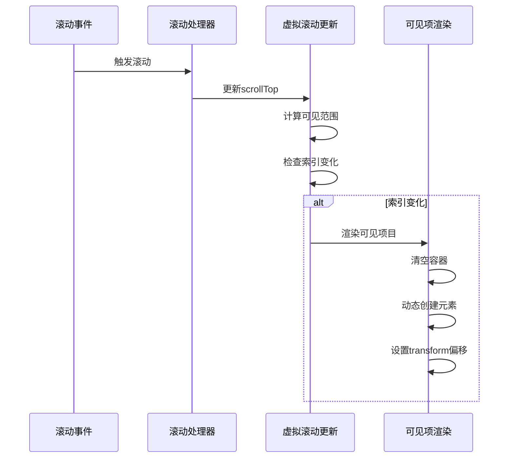
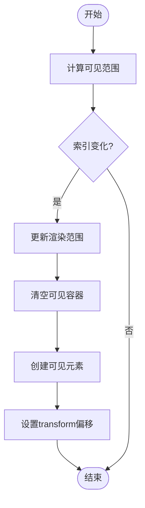

# 虚拟滚动性能优化

<cite>
**Referenced Files in This Document**  
- [main.js](file://src/main.js)
- [style.css](file://src/style.css)
</cite>

## 目录
1. [引言](#引言)
2. [虚拟滚动架构设计](#虚拟滚动架构设计)
3. [核心组件分析](#核心组件分析)
4. [性能优化策略](#性能优化策略)
5. [CSS样式优化](#css样式优化)
6. [实际应用场景](#实际应用场景)
7. [性能监控与调优建议](#性能监控与调优建议)
8. [结论](#结论)

## 引言
虚拟滚动技术是处理大规模数据渲染的核心解决方案，特别是在日志分析这类需要展示大量条目的场景中。传统的全量渲染方式会导致严重的性能问题，包括内存占用过高、页面卡顿和响应延迟。本文档深入分析虚拟滚动容器（.virtual-scroll-container）的性能优化策略，重点阐述通过绝对定位和动态渲染实现的高效渲染机制。

## 虚拟滚动架构设计



**Diagram sources**  
- [main.js](file://src/main.js#L1406-L1446)
- [style.css](file://src/style.css#L200-L220)

**Section sources**  
- [main.js](file://src/main.js#L1406-L1446)
- [style.css](file://src/style.css#L200-L220)

## 核心组件分析

### 虚拟滚动容器实现



**Diagram sources**  
- [main.js](file://src/main.js#L1406-L1446)
- [style.css](file://src/style.css#L200-L220)

**Section sources**  
- [main.js](file://src/main.js#L1406-L1446)

### 滚动事件处理机制



**Diagram sources**  
- [main.js](file://src/main.js#L1448-L1543)

**Section sources**  
- [main.js](file://src/main.js#L1448-L1543)

## 性能优化策略

### 动态渲染机制

虚拟滚动通过动态计算可见范围来减少DOM节点数量。系统根据当前滚动位置和容器高度，计算出需要渲染的起始和结束索引。



**Diagram sources**  
- [main.js](file://src/main.js#L1510-L1543)

**Section sources**  
- [main.js](file://src/main.js#L1510-L1543)

### 缓冲区策略
通过设置缓冲区大小（bufferSize），系统预加载可见区域前后一定数量的项目，避免滚动时出现空白。

```javascript
// 计算新的渲染范围
const newStartIndex = Math.max(0, startIndex - this.virtualScroll.bufferSize);
const newEndIndex = endIndex;
```

### 分块加载优化
对于超大文件，系统采用分块加载策略，按需加载数据块，减少初始加载时间。

```javascript
// 计算最优块大小
calculateOptimalChunkSize(totalLines) {
    if (totalLines > 100000) {
        this.chunkLoading.chunkSize = Math.max(50, Math.min(200, Math.floor(totalLines / 1000)));
    } else if (totalLines > 10000) {
        this.chunkLoading.chunkSize = Math.max(100, Math.min(500, Math.floor(totalLines / 100)));
    } else {
        this.chunkLoading.chunkSize = 100;
    }
}
```

## CSS样式优化

### 滚动容器样式
通过精确控制overflow-y属性，确保滚动行为的流畅性。

```css
.virtual-scroll-container {
    position: relative;
    overflow-y: auto;
    height: 100%;
}
```

### 轻量化滚动条设计
采用简洁的滚动条样式，减少视觉干扰和渲染开销。

```css
.virtual-scroll-container::-webkit-scrollbar {
    width: 6px;
}

.virtual-scroll-container::-webkit-scrollbar-track {
    background: var(--bg-tertiary);
}

.virtual-scroll-container::-webkit-scrollbar-thumb {
    background: var(--text-tertiary);
    border-radius: 3px;
}
```

### 过渡动画优化
合理使用transition属性，提升用户体验而不影响性能。

```css
.virtual-log-item {
    transition: background-color 0.2s ease;
}

.virtual-log-item:hover {
    background-color: var(--bg-hover);
}
```

**Section sources**  
- [style.css](file://src/style.css#L200-L250)

## 实际应用场景

### 大规模日志渲染
在处理包含数万行日志的文件时，虚拟滚动将DOM节点数量从数万个减少到几十个，显著提升渲染性能。

### 键盘导航支持
系统支持键盘导航，通过箭头键、Page Up/Down等快捷键实现高效浏览。

```javascript
handleKeyboardNavigation(e) {
    switch (e.key) {
        case 'ArrowUp':
            newScrollTop = Math.max(0, currentScrollTop - itemHeight);
            break;
        case 'ArrowDown':
            newScrollTop = Math.min(maxScrollTop, currentScrollTop + itemHeight);
            break;
    }
}
```

### 平滑滚动实现
采用缓动函数实现平滑滚动效果，提升用户体验。

```javascript
const easeOutCubic = 1 - Math.pow(1 - progress, 3);
const currentScrollTop = startScrollTop + distance * easeOutCubic;
```

**Section sources**  
- [main.js](file://src/main.js#L1990-L2088)

## 性能监控与调优建议

### 性能指标监控
系统提供性能面板，实时监控关键指标：

- 可见项目数量
- 总项目数量
- 已加载数据块
- 内存使用情况

### 内存优化策略
定期清理不可见区域的数据，释放内存资源。

```javascript
cleanupInvisibleData() {
    const visibleStart = this.virtualScroll.startIndex;
    const visibleEnd = this.virtualScroll.endIndex;
    const bufferSize = this.virtualScroll.bufferSize * 3;
    
    this.currentEntries.forEach((entry, index) => {
        if (index < visibleStart - bufferSize || index > visibleEnd + bufferSize) {
            // 清理远离可见区域的数据
        }
    });
}
```

### 调优建议
1. **合理设置缓冲区大小**：平衡性能和用户体验
2. **优化项目高度计算**：确保精确的范围计算
3. **监控内存使用**：及时清理不可见数据
4. **测试不同数据规模**：验证性能表现

**Section sources**  
- [main.js](file://src/main.js#L2100-L2150)

## 结论
虚拟滚动技术通过动态渲染和智能缓存策略，有效解决了大规模数据渲染的性能瓶颈。通过绝对定位和transform偏移，系统实现了高效的视觉滚动效果，同时大幅减少了DOM节点数量。结合CSS样式优化和内存管理策略，该方案为日志分析等大数据场景提供了流畅的用户体验。