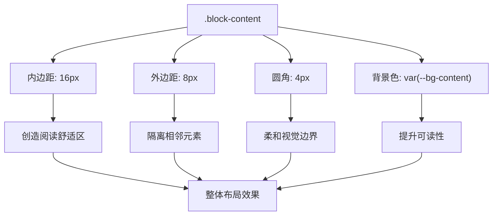
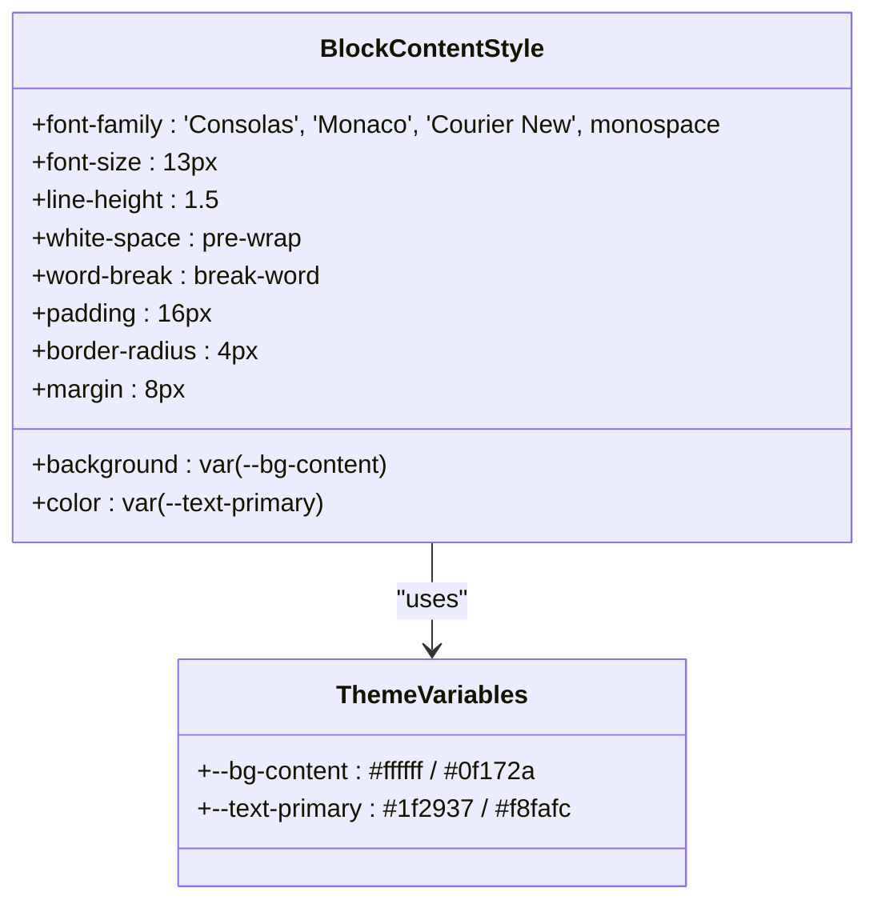

# 块内容样式

<cite>
**Referenced Files in This Document**   
- [style.css](file://src/style.css)
- [main.js](file://src/main.js)
</cite>

## 目录
1. [引言](#引言)
2. [排版样式设计](#排版样式设计)
3. [布局与视觉设计](#布局与视觉设计)
4. [等宽字体选择的重要性](#等宽字体选择的重要性)
5. [颜色对比度设计](#颜色对比度设计)
6. [结论](#结论)

## 引言
`.block-content` 类是日志内容展示的核心样式组件，负责确保代码和日志文本在不同主题下的清晰可读性。该类通过精心设计的排版、布局和色彩方案，为用户提供一致且舒适的阅读体验。本文将深入解析其样式设计原则及实现细节。

**Section sources**
- [style.css](file://src/style.css#L228-L294)

## 排版样式设计

### 字体族选择
`.block-content` 类采用 `'Consolas'`, `'Monaco'`, `'Courier New'` 作为首选字体族，并以 `monospace` 作为后备字体。这种选择确保了在不同操作系统和设备上都能呈现高质量的等宽字体效果。

### 字号与行高
该类设置了 `13px` 的字号和 `1.5` 的行高比例，提供了适中的文本密度，既保证了信息密度，又避免了视觉疲劳。

### 白色空间与换行策略
通过设置 `white-space: pre-wrap` 和 `word-break: break-word`，实现了对原始文本格式的保留同时支持长单词的自动换行，确保内容在不同屏幕尺寸下都能完整显示。

**Section sources**
- [style.css](file://src/style.css#L228-L294)

## 布局与视觉设计

### 内边距与外边距
`.block-content` 设置了 `16px` 的内边距和 `8px` 的外边距，创造了舒适的阅读空间，同时与其他界面元素保持适当距离。

### 圆角与背景色
该类应用了 `4px` 的圆角边框和 `var(--bg-content)` 定义的背景色，结合 `.rendered-block` 容器的 `8px` 圆角，形成了层次分明的视觉结构。

### 布局作用
这些布局属性共同作用，使代码内容区域具有明确的边界感和深度感，提升了整体界面的专业性和美观度。

**Diagram sources**
- [style.css](file://src/style.css#L228-L294)

**Section sources**
- [style.css](file://src/style.css#L228-L294)

## 等宽字体选择的重要性

### 日志内容展示需求
等宽字体对于日志内容展示至关重要，因为它们确保每个字符占据相同的水平空间，这对于对齐代码、SQL语句和结构化数据（如JSON）至关重要。

### 可读性优势
`Consolas`、`Monaco` 和 `Courier New` 都是专为屏幕阅读优化的等宽字体，具有清晰的字符区分度（如0与O，1与l与I），减少了阅读错误的可能性。

### 跨平台兼容性
通过提供多个平台特定的字体选项，系统能够根据运行环境自动选择最佳字体，确保在Windows、macOS和其他系统上都能获得最优显示效果。

**Section sources**
- [style.css](file://src/style.css#L228-L294)

## 颜色对比度设计

### 主题适应性
`.block-content` 使用CSS变量 `var(--text-primary)` 和 `var(--bg-content)` 来定义文本颜色和背景色，使其能够无缝适应亮色和暗色两种主题模式。

### 对比度标准
在亮色主题下，深灰色文本与白色背景形成良好对比；在暗色主题下，浅色文本与深色背景同样满足WCAG可访问性标准，确保了足够的对比度。

### 视觉一致性
通过与全局CSS变量的联动，`.block-content` 的颜色设计与其他界面组件保持一致，维护了整体UI的和谐统一。

**Diagram sources**
- [style.css](file://src/style.css#L228-L294)

**Section sources**
- [style.css](file://src/style.css#L1-L518)

## 结论
`.block-content` 类的样式设计体现了对用户体验的深刻理解。通过精心选择的等宽字体、合理的排版参数、清晰的布局结构和高对比度的颜色方案，该类成功地将复杂的日志内容转化为易于阅读和理解的信息。其基于CSS变量的主题适应能力进一步增强了系统的可维护性和可扩展性，为用户提供了一致且高质量的视觉体验。