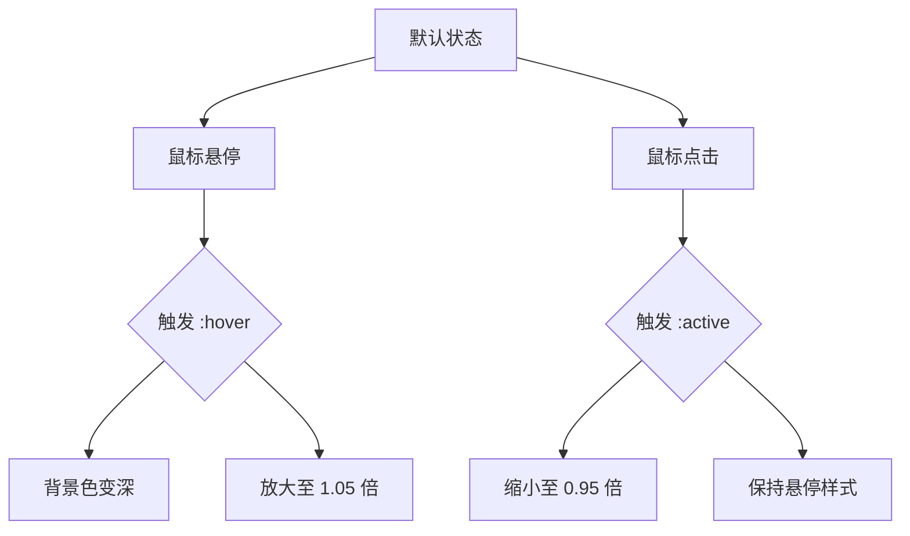
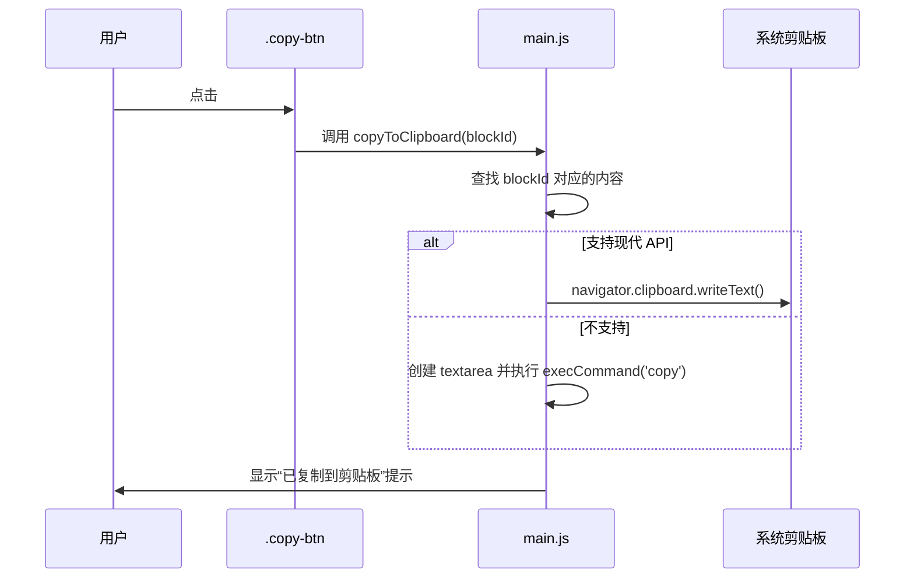

# 复制按钮样式

<cite>
**Referenced Files in This Document**  
- [style.css](file://src/style.css)
- [main.js](file://src/main.js)
</cite>

## 目录
1. [简介](#简介)
2. [核心视觉样式](#核心视觉样式)
3. [交互反馈机制](#交互反馈机制)
4. [主题颜色绑定](#主题颜色绑定)
5. [功能实现与事件绑定](#功能实现与事件绑定)
6. [复用性分析](#复用性分析)

## 简介
`.copy-btn` 是 LogWhisper 应用中用于复制渲染块内容的核心交互元素。该按钮通过精心设计的视觉样式与动态交互反馈，提升用户操作的可感知性与体验流畅度。其样式定义位于 `style.css` 文件中，并通过 JavaScript 实现功能绑定。

## 核心视觉样式

`.copy-btn` 按钮采用简洁现代的设计语言，确保在不同上下文中均具备良好的可读性与辨识度。其基础样式包括：

- **背景色**：使用 `--color-primary` 主色调变量，确保与应用整体配色协调。
- **文字颜色**：采用 `--text-inverse` 反色文本，保证在深色背景上的高对比度。
- **圆角**：设置 `4px` 圆角，使按钮外观柔和且符合现代 UI 趋势。
- **内边距**：水平 `8px`，垂直 `4px`，提供舒适的点击区域。
- **字体大小**：`12px`，适配紧凑布局场景。
- **光标样式**：设置为 `pointer`，明确指示其可点击性。
- **过渡动画**：启用 `all 0.2s ease`，使所有属性变化平滑进行。

**Section sources**
- [style.css](file://src/style.css#L235-L242)

## 交互反馈机制

为增强用户操作感知，`.copy-btn` 定义了 `:hover` 与 `:active` 两种状态的视觉反馈：

### :hover 状态
当用户将鼠标悬停在按钮上时：
- **背景色变化**：由 `--color-primary` 变为 `--color-primary-hover`，提供色彩层次变化。
- **缩放动画**：执行 `scale(1.05)`，轻微放大按钮，形成“浮起”效果，强化可交互感。

### :active 状态
当用户按下按钮时：
- **缩放动画**：执行 `scale(0.95)`，轻微缩小按钮，模拟物理按压反馈，增强操作确认感。

上述动画均通过 `transition: all 0.2s ease` 实现平滑过渡，避免突兀变化，提升用户体验。



**Diagram sources**
- [style.css](file://src/style.css#L244-L250)

**Section sources**
- [style.css](file://src/style.css#L244-L250)

## 主题颜色绑定

`.copy-btn` 的颜色设计与应用的主题系统深度集成，确保在亮色与暗色模式下均保持一致性：

- **背景色**：绑定 `--color-primary` 变量，在亮色主题下为深蓝色（`#1e3a8a`），在暗色主题下为亮蓝色（`#3b82f6`）。
- **悬停背景色**：绑定 `--color-primary-hover` 变量，提供协调的深浅变化。
- **文字颜色**：绑定 `--text-inverse` 变量，在亮色背景下为白色，在暗色背景下为深色，确保可读性。

这种基于 CSS 变量的绑定机制，使得按钮能自动适应主题切换，无需额外代码干预。

**Section sources**
- [style.css](file://src/style.css#L12-L20)
- [style.css](file://src/style.css#L62-L70)

## 功能实现与事件绑定

`.copy-btn` 的功能通过 `main.js` 中的 `copyToClipboard(blockId)` 方法实现。该方法负责将指定渲染块的内容写入系统剪贴板，并提供用户反馈。

### 事件绑定
按钮通过内联 `onclick` 属性绑定事件：
```html
<button onclick="app.copyToClipboard('${block.id}')" class="copy-btn">复制</button>
```

### 功能逻辑
- 使用现代 `navigator.clipboard.writeText()` API 进行复制。
- 提供降级方案：在不支持现代 API 的浏览器中，创建临时 `textarea` 元素并调用 `execCommand('copy')`。
- 操作成功后调用 `this.showToast('已复制到剪贴板')` 显示提示。
- 捕获异常并在失败时显示错误提示。



**Diagram sources**
- [main.js](file://src/main.js#L955-L976)

**Section sources**
- [main.js](file://src/main.js#L955-L976)
- [main.js](file://src/main.js#L888-L929)

## 复用性分析

`.copy-btn` 具备良好的复用性，主要体现在：

1. **组件化设计**：作为独立的 CSS 类，可在任意需要复制功能的上下文中复用。
2. **上下文无关**：其样式不依赖特定父级结构，仅需正确绑定 `onclick` 事件即可工作。
3. **主题自适应**：通过 CSS 变量自动适配亮色/暗色主题，无需修改样式代码。
4. **功能解耦**：样式与功能分离，`copyToClipboard` 方法可被其他 UI 元素调用。

该按钮主要应用于 `rendered-block` 的 `block-actions` 区域，为每种类型的渲染块（SQL、JSON、Error 等）提供统一的复制入口，确保交互一致性。

**Section sources**
- [main.js](file://src/main.js#L888-L929)
- [style.css](file://src/style.css#L235-L250)