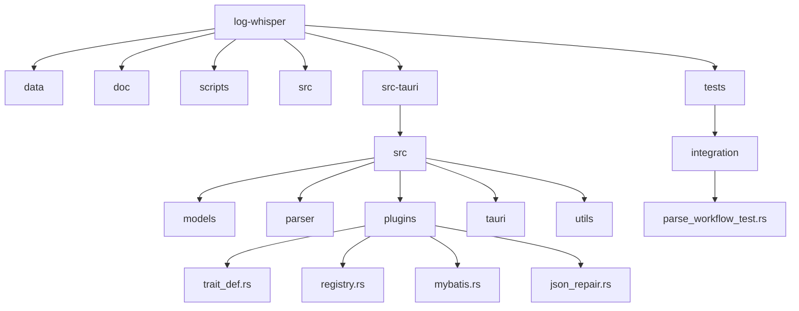
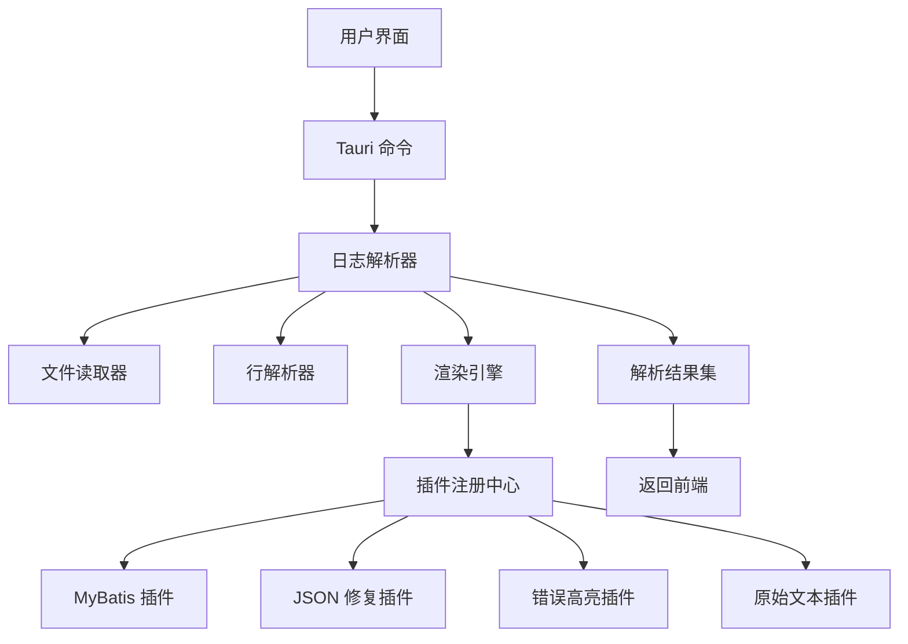

# 开发指南

<cite>
**本文档引用的文件**
- [main.rs](file://src-tauri/src/main.rs)
- [lib.rs](file://src-tauri/src/lib.rs)
- [Cargo.toml](file://src-tauri/Cargo.toml)
- [Cargo.toml](file://Cargo.toml)
- [trait_def.rs](file://src-tauri/src/plugins/trait_def.rs)
- [registry.rs](file://src-tauri/src/plugins/registry.rs)
- [mybatis.rs](file://src-tauri/src/plugins/mybatis.rs)
- [json_repair.rs](file://src-tauri/src/plugins/json_repair.rs)
- [parse_workflow_test.rs](file://tests/integration/parse_workflow_test.rs)
- [plugin_config.rs](file://src-tauri/src/models/plugin_config.rs)
- [doc/插件系统重构方案.md](file://doc/插件系统重构方案.md)
</cite>

## 目录
1. [简介](#简介)
2. [项目结构](#项目结构)
3. [核心组件](#核心组件)
4. [架构概述](#架构概述)
5. [详细组件分析](#详细组件分析)
6. [依赖分析](#依赖分析)
7. [性能考虑](#性能考虑)
8. [故障排除指南](#故障排除指南)
9. [结论](#结论)

## 简介
本开发指南旨在为 `log-whisper` 项目的贡献者提供标准化的开发流程。文档详细说明了如何添加新功能或修复缺陷，包括分支管理策略、代码格式化要求（rustfmt）、静态检查（clippy）等。重点指导插件开发流程：如何实现 `Plugin` trait、注册新插件、编写单元测试与集成测试。同时解释了 `Cargo.toml` 中依赖管理的最佳实践，以及如何更新 Rust 或 Node.js 依赖版本。此外，还提供了测试策略说明，包括如何运行单元测试与集成测试（`parse_workflow_test.rs`），并建议增加覆盖率。最后，说明了代码提交规范、PR 审查流程和文档更新要求，以确保代码库的质量与可维护性。

## 项目结构
`log-whisper` 项目采用模块化设计，主要分为前端资源、Tauri 后端逻辑、插件系统、解析器和测试等部分。项目结构清晰，便于维护和扩展。



**图示来源**
- [src-tauri/src/plugins/registry.rs](file://src-tauri/src/plugins/registry.rs)
- [src-tauri/src/plugins/trait_def.rs](file://src-tauri/src/plugins/trait_def.rs)
- [tests/integration/parse_workflow_test.rs](file://tests/integration/parse_workflow_test.rs)

**本节来源**
- [src-tauri/src/lib.rs](file://src-tauri/src/lib.rs)
- [src-tauri/src/plugins/mod.rs](file://src-tauri/src/plugins/mod.rs)
- [src-tauri/src/parser/mod.rs](file://src-tauri/src/parser/mod.rs)

## 核心组件
`log-whisper` 的核心组件包括插件系统、日志解析器、渲染引擎和状态管理。插件系统通过 `PluginRegistry` 实现插件的注册、管理和调用。日志解析器负责读取日志文件并解析为结构化数据。渲染引擎根据插件配置将解析结果渲染为可视化块。状态管理通过 Tauri 的 `AppState` 实现全局状态共享。

**本节来源**
- [src-tauri/src/lib.rs](file://src-tauri/src/lib.rs)
- [src-tauri/src/main.rs](file://src-tauri/src/main.rs)
- [src-tauri/src/tauri/state.rs](file://src-tauri/src/tauri/state.rs)

## 架构概述
`log-whisper` 采用前后端分离架构，前端使用 HTML/CSS/JS 实现用户界面，后端使用 Rust + Tauri 实现核心逻辑。插件系统作为核心扩展机制，支持动态加载和管理插件。日志解析流程包括文件读取、行解析、多行合并和渲染四个阶段。



**图示来源**
- [src-tauri/src/parser/log_parser.rs](file://src-tauri/src/parser/log_parser.rs)
- [src-tauri/src/tauri/commands.rs](file://src-tauri/src/tauri/commands.rs)
- [src-tauri/src/plugins/registry.rs](file://src-tauri/src/plugins/registry.rs)

## 详细组件分析

### 插件系统分析
`log-whisper` 的插件系统基于 trait 实现，所有插件必须实现 `LogRenderer` trait。插件注册中心负责管理插件的生命周期和调用。

#### 插件接口定义
```mermaid
classDiagram
    class LogRenderer {
        +can_handle(entry: &LogEntry) bool
        +render(entry: &LogEntry) Vec<RenderedBlock>
        +name() &str
        +description() &str
        +priority() u32
        +is_enabled() bool
        +set_enabled(enabled: bool)
    }
    
    class PluginLifecycle {
        +initialize() Result<(), String>
        +cleanup() Result<(), String>
        +reset() Result<(), String>
    }
    
    class PluginCapabilities {
        +supported_file_types() Vec<String>
        +max_file_size() Option<usize>
        +performance_rating() PerformanceRating
        +memory_usage_rating() MemoryUsageRating
    }
    
    LogRenderer <|-- MyBatisRenderer