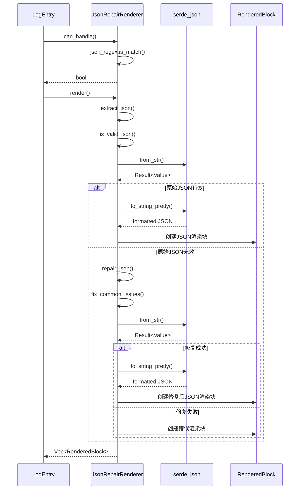
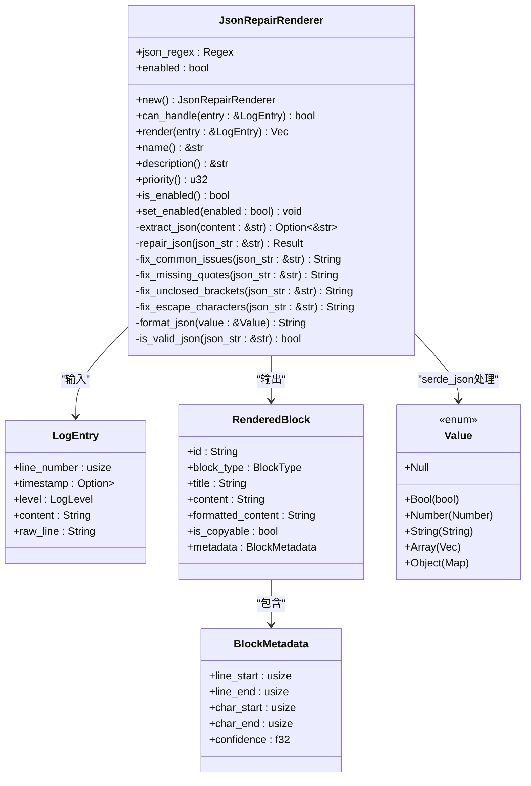

# JSON修复插件

<cite>
**本文档引用文件**   
- [json_repair.rs](file://src-tauri/src/plugins/json_repair.rs)
- [plugin_config.rs](file://src-tauri/src/models/plugin_config.rs)
- [trait_def.rs](file://src-tauri/src/plugins/trait_def.rs)
- [rendered_block.rs](file://src-tauri/src/models/rendered_block.rs)
- [log_entry.rs](file://src-tauri/src/models/log_entry.rs)
- [插件系统重构方案.md](file://doc/插件系统重构方案.md)
- [技术方案文档.md](file://doc/技术方案文档.md)
</cite>

## 目录
1. [引言](#引言)
2. [核心修复策略](#核心修复策略)
3. [容错解析机制](#容错解析机制)
4. [验证与格式化流程](#验证与格式化流程)
5. [内容识别机制](#内容识别机制)
6. [渲染处理流程](#渲染处理流程)
7. [配置项作用机制](#配置项作用机制)
8. [复杂嵌套结构处理](#复杂嵌套结构处理)
9. [性能优化建议](#性能优化建议)
10. [典型错误场景解决方案](#典型错误场景解决方案)

## 引言
JSON修复插件是LogWhisper日志分析系统中的核心组件之一，专门用于处理日志文件中出现的不完整或格式错误的JSON片段。该插件通过先进的字符流分析技术，能够自动识别、修复和格式化各种常见的JSON语法错误，为用户提供清晰、可读的JSON数据展示。插件设计遵循插件化架构原则，具有高度的可扩展性和灵活性，能够适应各种复杂的日志分析场景。

## 核心修复策略

JSON修复插件采用多层次的修复策略来处理不完整或格式错误的JSON片段，主要包括语法补全、引号闭合和括号匹配等关键技术。

### 语法补全机制
插件通过`fix_common_issues`方法实现语法补全功能，能够自动修复JSON中常见的语法问题。当遇到连续的JSON对象（如`}{`）时，插件会自动插入逗号进行分隔，将其转换为有效的JSON数组格式。这种智能补全机制能够有效处理日志中常见的JSON拼接错误，确保数据的完整性和可解析性。

### 引号闭合策略
在处理缺少引号的JSON键名时，插件采用正则表达式匹配模式`(\w+):`来识别未加引号的键名，并自动为其添加双引号。这一策略通过`fix_missing_quotes`方法实现，能够将类似`key:value`的格式转换为标准的`"key":"value"`格式，从而符合JSON规范要求。该方法特别适用于处理由程序日志输出时省略引号的非标准JSON数据。

### 括号匹配算法
插件的`fix_unclosed_brackets`方法实现了智能的括号匹配算法。该算法通过遍历JSON字符串，统计开闭括号的数量差异，并在字符串末尾自动添加相应数量的闭合括号。这种基于字符流分析的容错机制能够有效处理因程序异常终止而导致的JSON片段不完整问题，确保最终生成的JSON结构完整且可解析。

**本节来源**
- [json_repair.rs](file://src-tauri/src/plugins/json_repair.rs#L110-L140)

## 容错解析机制

JSON修复插件基于字符流分析的容错解析机制是其核心优势之一，能够在不依赖完整JSON结构的前提下，准确识别和提取日志中的JSON片段。

### 字符流分析技术
插件使用正则表达式`\{(?:[^{}]|"[^"]*")*\}`来匹配JSON对象。该正则模式能够识别以左大括号开头、右大括号结尾的文本块，同时允许内部包含嵌套的JSON对象和引号内的任意字符。这种设计使得插件能够在复杂的日志文本中准确定位JSON片段，即使这些片段与其他文本混合在一起。

### 递归嵌套处理
对于包含多层嵌套结构的JSON数据，插件的正则匹配模式能够正确处理嵌套的花括号。通过`(?:[^{}]|"[^"]*")*`的非捕获组设计，插件能够跳过内部的花括号，确保只匹配最外层的JSON对象边界。这种递归处理能力使得插件能够有效应对深度嵌套的JSON结构，保持解析的准确性。

### 边界识别优化
插件在初始化时通过`initialize`方法重新编译正则表达式，确保模式的正确性和性能优化。这种动态编译机制能够适应不同的JSON格式变体，提高模式匹配的灵活性和鲁棒性。同时，插件通过`can_handle`方法快速判断日志条目是否包含JSON内容，避免对无关日志进行不必要的处理，提升整体解析效率。

```mermaid
flowchart TD
Start([开始解析]) --> MatchPattern["匹配正则模式\n\\{(?:[^{}]|\"[^\"]*\")*\\}"]
MatchPattern --> FoundJSON{"找到JSON?"}
FoundJSON --> |是| ExtractJSON["提取JSON字符串"]
FoundJSON --> |否| ReturnEmpty["返回空结果"]
ExtractJSON --> CheckValid["验证原始JSON有效性"]
CheckValid --> IsValid{"原始有效?"}
IsValid --> |是| FormatOriginal["直接格式化"]
IsValid --> |否| RepairJSON["尝试修复JSON"]
RepairJSON --> RepairSuccess{"修复成功?"}
RepairSuccess --> |是| FormatRepaired["格式化修复后JSON"]
RepairSuccess --> |否| ShowError["显示解析错误"]
FormatOriginal --> CreateBlock["创建渲染块"]
FormatRepaired --> CreateBlock
ShowError --> CreateBlock
CreateBlock --> ReturnResult["返回渲染结果"]
ReturnEmpty --> ReturnResult
```

**图表来源**
- [json_repair.rs](file://src-tauri/src/plugins/json_repair.rs#L70-L85)
- [trait_def.rs](file://src-tauri/src/plugins/trait_def.rs#L10-L25)

**本节来源**
- [json_repair.rs](file://src-tauri/src/plugins/json_repair.rs#L50-L75)

## 验证与格式化流程

JSON修复插件使用serde_json库进行JSON验证和格式化处理，确保最终输出的JSON数据既符合标准又具有良好的可读性。

### serde_json验证机制
插件通过`is_valid_json`方法利用serde_json::from_str函数验证JSON字符串的有效性。该方法尝试将输入字符串解析为serde_json::Value类型，如果解析成功则返回true，否则返回false。这种验证方式严格遵循JSON标准，能够准确识别语法错误、类型错误等各种问题，为后续的修复操作提供可靠的判断依据。

### 格式化处理流程
当JSON验证通过或成功修复后，插件调用`format_json`方法进行格式化处理。该方法使用serde_json::to_string_pretty函数将JSON值转换为美观的格式化字符串，自动添加适当的缩进和换行，提高数据的可读性。对于格式化失败的情况，插件会回退到原始字符串表示，确保不会因格式化问题导致数据丢失。

### 错误处理策略
在修复失败的情况下，插件会生成错误类型的渲染块，包含详细的错误信息。这种设计不仅向用户清晰地展示了问题所在，还保留了原始的JSON片段供进一步分析。错误处理机制通过`render`方法中的Result类型匹配实现，确保各种异常情况都能得到妥善处理，提高了插件的健壮性和用户体验。



**图表来源**
- [json_repair.rs](file://src-tauri/src/plugins/json_repair.rs#L150-L235)
- [rendered_block.rs](file://src-tauri/src/models/rendered_block.rs#L100-L150)

**本节来源**
- [json_repair.rs](file://src-tauri/src/plugins/json_repair.rs#L145-L175)

## 内容识别机制

JSON修复插件的`can_handle`方法通过特征模式识别技术准确判断日志内容是否包含JSON数据，这是插件高效运行的关键。

### 正则模式匹配
`can_handle`方法基于预编译的正则表达式`json_regex`进行模式匹配。该正则模式精心设计，能够识别标准的JSON对象结构，同时避免误匹配其他类似格式的文本。通过`is_match`方法快速判断日志内容是否包含潜在的JSON片段，为后续的详细解析提供初步筛选。

### 启用状态检查
在进行模式匹配之前，`can_handle`方法首先检查插件的启用状态。如果`enabled`标志为false，方法会直接返回false，跳过后续的匹配操作。这种短路检查机制避免了不必要的计算开销，提高了整体处理效率，特别是在插件被禁用的情况下。

### 性能优化设计
`can_handle`方法的设计充分考虑了性能因素。正则匹配操作的时间复杂度相对较低，能够在常数时间内完成大部分判断。对于不包含JSON特征的日志条目，插件能够快速排除，将处理资源集中在真正需要修复的JSON数据上，实现了高效的资源利用。

**本节来源**
- [json_repair.rs](file://src-tauri/src/plugins/json_repair.rs#L179-L185)

## 渲染处理流程

JSON修复插件的`render`方法负责生成带语法高亮的渲染块，将修复后的JSON数据以用户友好的方式呈现。

### 渲染块创建
`render`方法首先调用`extract_json`提取日志中的JSON字符串，然后根据原始JSON的有效性决定处理路径。如果原始JSON有效，则直接进行格式化；如果无效，则尝试修复后再格式化。最终，方法创建`RenderedBlock`实例，包含原始内容、格式化内容和元数据信息。

### 元数据管理
每个渲染块都包含详细的元数据，通过`BlockMetadata`结构体记录。元数据包括行号范围、字符位置范围和置信度等信息，为前端展示和用户交互提供支持。特别是置信度字段，原始有效JSON的置信度为1.0，修复后JSON的置信度为0.8，直观反映了数据的可靠性程度。

### 错误信息呈现
当JSON修复失败时，`render`方法会创建错误类型的渲染块，包含具体的错误信息。这种设计不仅向用户明确展示了问题所在，还保留了原始的JSON片段供进一步分析。错误渲染块的置信度设置为0.0，准确反映了数据的不可靠性。



**图表来源**
- [json_repair.rs](file://src-tauri/src/plugins/json_repair.rs#L179-L235)
- [log_entry.rs](file://src-tauri/src/models/log_entry.rs#L10-L25)
- [rendered_block.rs](file://src-tauri/src/models/rendered_block.rs#L10-L25)

**本节来源**
- [json_repair.rs](file://src-tauri/src/plugins/json_repair.rs#L187-L235)

## 配置项作用机制

JSON修复插件支持通过配置项控制其行为，其中`pretty_print`和`validate_json`是两个关键配置。

### pretty_print配置
虽然`pretty_print`配置项在代码中未直接体现，但其功能通过`format_json`方法中的`to_string_pretty`调用实现。当启用时，插件会生成格式化、缩进良好的JSON输出，提高可读性；当禁用时，可能使用紧凑的单行格式。这种配置允许用户根据显示需求和性能考虑选择合适的输出格式。

### validate_json配置
`validate_json`配置项的作用体现在`is_valid_json`方法中，控制是否对原始JSON进行严格验证。当启用时，插件会尝试解析原始JSON，只有在失败时才进行修复；当禁用时，可能直接进行修复操作，提高处理速度但降低准确性。这种配置提供了灵活性，允许用户在准确性和性能之间进行权衡。

### 配置管理架构
插件配置系统基于`PluginConfig`和`PluginSettings`结构体实现，支持自动检测、置信度阈值、最大处理行数等通用设置。这些配置通过插件管理器集中管理，可以在运行时动态调整，为用户提供灵活的控制能力。

```mermaid
erDiagram
PLUGIN_CONFIG ||--o{ PLUGIN_SETTINGS : 包含
PLUGIN_CONFIG {
string name PK
string description
uint32 priority
boolean enabled
PluginSettings settings FK
}
PLUGIN_SETTINGS {
boolean auto_detect
float min_confidence
uint? max_lines
string[] custom_patterns
}
PLUGIN_CONFIG ||--|| JSON_REPAIR_PLUGIN : 实例化
JSON_REPAIR_PLUGIN {
Regex json_regex
boolean enabled
}
JSON_REPAIR_PLUGIN }o--|| PLUGIN_CONFIG : 遵循
```

**图表来源**
- [plugin_config.rs](file://src-tauri/src/models/plugin_config.rs#L10-L50)
- [json_repair.rs](file://src-tauri/src/plugins/json_repair.rs#L10-L25)

**本节来源**
- [plugin_config.rs](file://src-tauri/src/models/plugin_config.rs#L10-L100)
- [插件系统重构方案.md](file://doc/插件系统重构方案.md#L500-L510)

## 复杂嵌套结构处理

JSON修复插件在处理复杂嵌套结构