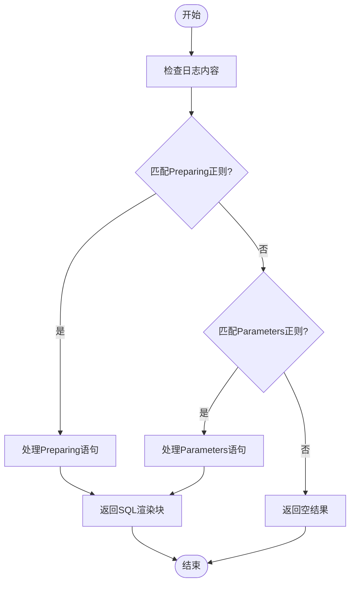

# MyBatis插件

<cite>
**本文档引用的文件**   
- [mybatis.rs](file://src-tauri/src/plugins/mybatis.rs)
- [trait_def.rs](file://src-tauri/src/plugins/trait_def.rs)
- [registry.rs](file://src-tauri/src/plugins/registry.rs)
- [rendered_block.rs](file://src-tauri/src/models/rendered_block.rs)
- [log_entry.rs](file://src-tauri/src/models/log_entry.rs)
- [技术方案文档.md](file://doc/技术方案文档.md)
- [插件系统重构方案.md](file://doc/插件系统重构方案.md)
</cite>

## 目录
1. [MyBatis插件实现机制](#mybatis插件实现机制)
2. [日志表达式解析与SQL还原](#日志表达式解析与sql还原)
3. [正则表达式匹配逻辑](#正则表达式匹配逻辑)
4. [参数替换算法](#参数替换算法)
5. [LogRenderer接口实现](#logrenderer接口实现)
6. [SQL格式化与高亮](#sql格式化与高亮)
7. [插件优先级与协作](#插件优先级与协作)
8. [配置选项与问题排查](#配置选项与问题排查)

## MyBatis插件实现机制

MyBatis插件作为LogWhisper日志分析工具的核心组件之一，实现了对MyBatis框架生成日志的智能解析。该插件通过实现`LogRenderer` trait接口，构建了一个完整的日志处理流水线。插件的核心是`MyBatisRenderer`结构体，它包含了处理MyBatis日志所需的所有状态和逻辑。

插件采用状态机模式管理解析过程，通过`MyBatisState`结构体维护当前SQL语句、参数列表和待处理的渲染块。这种设计确保了跨多行日志条目的连续性处理，能够正确关联"Preparing"和"Parameters"两个阶段的日志信息。插件的生命周期由`PluginLifecycle` trait管理，支持初始化、清理和重置操作，保证了资源的正确管理和状态的隔离。

**插件来源**
- [mybatis.rs](file://src-tauri/src/plugins/mybatis.rs#L1-L50)
- [trait_def.rs](file://src-tauri/src/plugins/trait_def.rs#L2-L43)

## 日志表达式解析与SQL还原

MyBatis插件的核心功能是识别并解析日志中的`#{}`和`${}`表达式，还原完整的SQL语句。虽然日志中直接显示的是使用`?`占位符的预编译SQL，但插件通过结合参数信息，能够重构出实际执行的SQL语句。

插件通过分析"Preparing"日志段落获取基础SQL模板，然后从"Parameters"日志段落提取实际参数值。在`merge_sql_with_params`方法中，插件遍历SQL模板中的每个`?`占位符，并按顺序替换为对应的参数值。参数替换过程考虑了数据类型，对字符串类型添加引号，对数值类型保持原样，从而生成语法正确的完整SQL语句。

**插件来源**
- [mybatis.rs](file://src-tauri/src/plugins/mybatis.rs#L139-L176)
- [rendered_block.rs](file://src-tauri/src/models/rendered_block.rs#L1-L20)

## 正则表达式匹配逻辑

MyBatis插件使用正则表达式精确匹配Prepared和Parameters日志段落。插件在初始化时创建了两个关键的正则表达式：`preparing_regex`用于匹配以"Preparing:"开头的日志，`parameters_regex`用于匹配以"Parameters:"开头的日志。

`can_handle`方法是插件处理能力的判断入口，它检查日志内容是否匹配任一正则表达式。这种设计实现了高效的日志过滤，确保只有相关的日志条目才会被进一步处理。正则表达式的模式设计考虑了日志格式的变体，使用`\s*`匹配可能存在的空白字符，提高了匹配的鲁棒性。



**图示来源**
- [mybatis.rs](file://src-tauri/src/plugins/mybatis.rs#L236-L281)
- [trait_def.rs](file://src-tauri/src/plugins/trait_def.rs#L2-L43)

## 参数替换算法

参数替换算法是MyBatis插件的核心处理逻辑，实现了从参数化SQL到完整SQL的转换。算法首先通过`parse_parameters`方法解析参数字符串，该方法实现了智能的参数分割，能够正确处理带引号的字符串参数和逗号分隔的参数列表。

`format_parameter`方法负责参数的类型化格式化，根据参数后缀（如(Integer)、(String)）或内容特征判断数据类型。对于字符串类型参数，自动添加单引号包围；对于数值类型，保持原始格式。这种智能格式化确保了生成的SQL语句语法正确，可以直接在数据库客户端中执行。

```mermaid
classDiagram
    class MyBatisRenderer {
        +preparing_regex: Regex
        +parameters_regex: Regex
        +state: MyBatisState
        +enabled: bool
        +new() MyBatisRenderer
        +handle_preparing(entry: &LogEntry) Vec<RenderedBlock>
        +handle_parameters(entry: &LogEntry) Vec<RenderedBlock>
        +parse_parameters(params_str: &str) Vec<String>
        +merge_sql_with_params(sql: &str, params: &[String]) String
        +format_parameter(param: &str) String
        +format_sql(sql: &str) String
    }
    
    class MyBatisState {
        +current_sql: Option<String>
        +current_params: Option<Vec<String>>
        +pending_blocks: Vec<RenderedBlock>
    }
    
    class LogEntry {
        +line_number: usize
        +timestamp: Option<DateTime<Utc>>
        +level: LogLevel
        +content: String
        +raw_line: String
    }
    
    class RenderedBlock {
        +id: String
        +block_type: BlockType
        +title: String
        +content: String
        +formatted_content: String
        +is_copyable: bool
        +metadata: BlockMetadata
    }
    
    MyBatisRenderer --> MyBatisState : "包含"
    MyBatisRenderer --> LogEntry : "处理"
    MyBatisRenderer --> RenderedBlock