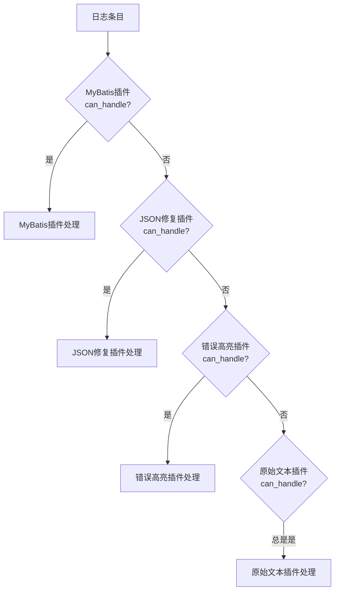
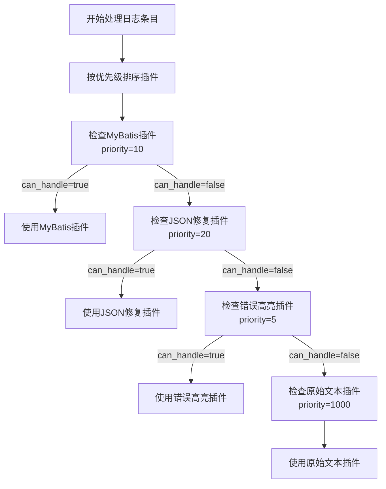
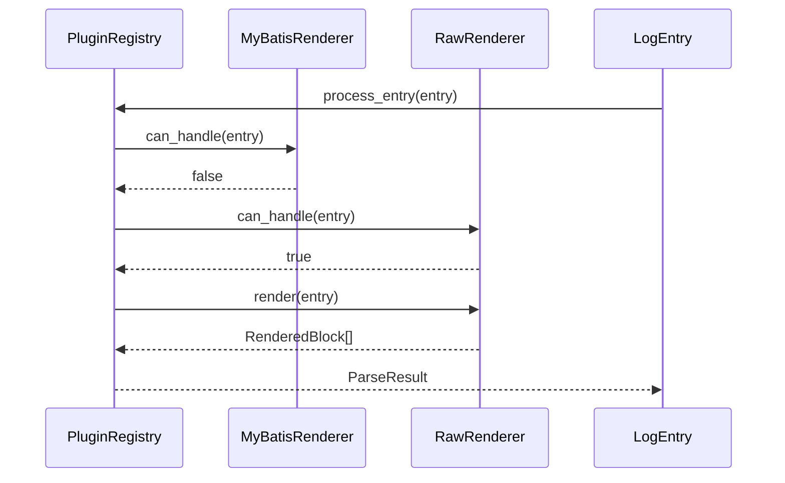

<cite>
**Referenced Files in This Document**   
- [raw.rs](file://src-tauri/src/plugins/raw.rs)
- [trait_def.rs](file://src-tauri/src/plugins/trait_def.rs)
- [registry.rs](file://src-tauri/src/plugins/registry.rs)
- [log_parser.rs](file://src-tauri/src/parser/log_parser.rs)
- [rendered_block.rs](file://src-tauri/src/models/rendered_block.rs)
- [log_entry.rs](file://src-tauri/src/models/log_entry.rs)
- [parse_result.rs](file://src-tauri/src/models/parse_result.rs)
</cite>

# 原始文本插件

## Table of Contents
1. [核心作用与兜底机制](#核心作用与兜底机制)
2. [can_handle方法设计](#can_handle方法设计)
3. [render方法转换逻辑](#render方法转换逻辑)
4. [优先级与插件选择](#优先级与插件选择)
5. [降级处理流程](#降级处理流程)
6. [调试与兼容性保障](#调试与兼容性保障)
7. [性能基准价值](#性能基准价值)
8. [使用场景对比](#使用场景对比)

## 核心作用与兜底机制

原始文本插件（RawRenderer）在日志解析系统中扮演着至关重要的兜底处理器角色。其核心设计目标是确保系统中所有日志条目都能被至少一个插件成功处理，从而避免解析流程的中断或数据丢失。该插件作为系统稳定性的最后一道防线，无论日志内容的格式多么异常或复杂，都能提供最基本的可视化能力。这种设计遵循了“至少提供原始信息”的可靠性原则，保证了用户在任何情况下都能查看到日志内容，即使无法进行高级解析。

**Section sources**
- [raw.rs](file://src-tauri/src/plugins/raw.rs#L1-L97)
- [registry.rs](file://src-tauri/src/plugins/registry.rs#L1-L243)

## can_handle方法设计

`can_handle`方法的设计体现了原始文本插件的兜底特性。该方法始终返回`true`，表明它能够处理任何日志条目。这种设计意图是明确的：作为系统中优先级最低但兼容性最强的插件，它必须在所有其他专用插件都无法处理时介入。方法的实现非常简洁，仅检查插件自身的启用状态，而不对日志内容进行任何模式匹配或格式分析。这种无条件接受的策略确保了处理流程的连续性，是实现“至少一个插件能处理”这一核心保障的关键。



**Diagram sources**
- [raw.rs](file://src-tauri/src/plugins/raw.rs#L45-L48)
- [registry.rs](file://src-tauri/src/plugins/registry.rs#L180-L220)

**Section sources**
- [raw.rs](file://src-tauri/src/plugins/raw.rs#L45-L48)
- [trait_def.rs](file://src-tauri/src/plugins/trait_def.rs#L2-L43)

## render方法转换逻辑

`render`方法的实现遵循了简单直接的转换逻辑。它接收一个`LogEntry`对象，将其内容通过`format_raw_text`方法进行基本的文本清理（如去除首尾空白），然后调用`RenderedBlock::raw`工厂方法创建一个类型为`BlockType::Raw`的渲染块。该方法不进行任何复杂的解析或格式化操作，仅将原始日志内容封装为标准的`RenderedBlock`结构，同时附带行号等元数据信息。这种轻量级的转换确保了最高的处理效率和最低的资源消耗。


**Diagram sources**
- [raw.rs](file://src-tauri/src/plugins/raw.rs#L50-L65)
- [rendered_block.rs](file://src-tauri/src/models/rendered_block.rs#L140-L145)

**Section sources**
- [raw.rs](file://src-tauri/src/plugins/raw.rs#L50-L65)
- [rendered_block.rs](file://src-tauri/src/models/rendered_block.rs#L140-L145)

## 优先级与插件选择

原始文本插件被赋予了最低的优先级（`priority=1000`），这在插件选择机制中具有重要意义。`PluginRegistry`在处理日志条目时，会按照优先级从高到低（数字从小到大）的顺序遍历所有启用的插件。只有当所有高优先级的专用插件（如MyBatis、JSON修复等）都返回`can_handle=false`时，系统才会尝试使用原始文本插件。这种基于优先级的排序机制确保了专用插件的优先使用权，同时保留了原始插件作为最终备选方案的角色，实现了功能与效率的最佳平衡。



**Diagram sources**
- [registry.rs](file://src-tauri/src/plugins/registry.rs#L180-L220)
- [raw.rs](file://src-tauri/src/plugins/raw.rs#L80-L83)

**Section sources**
- [registry.rs](file://src-tauri/src/plugins/registry.rs#L180-L220)
- [raw.rs](file://src-tauri/src/plugins/raw.rs#L80-L83)

## 降级处理流程

当系统中没有其他插件能够处理某个日志条目时，会触发降级处理流程。`PluginRegistry`的`process_entry`方法在遍历完所有高优先级插件后，如果未找到合适的处理器，会显式地调用原始文本插件进行处理。这一流程是系统鲁棒性的关键体现。即使日志格式完全未知或解析器出现故障，该机制也能保证日志内容不会丢失，而是以最基础的原始文本形式呈现给用户。这种优雅的降级策略避免了“全有或全无”的解析模式，提升了系统的整体可用性。



**Diagram sources**
- [registry.rs](file://src-tauri/src/plugins/registry.rs#L180-L220)
- [log_parser.rs](file://src-tauri/src/parser/log_parser.rs#L50-L150)

**Section sources**
- [registry.rs](file://src-tauri/src/plugins/registry.rs#L180-L220)

## 调试与兼容性保障

原始文本插件在调试和兼容性保障方面具有不可替代的价值。在开发和测试新插件时，它可以作为基准，帮助开发者验证原始日志内容是否被正确读取。当用户遇到解析异常时，切换到原始文本插件可以快速判断问题是出在日志源文件本身还是特定的解析逻辑上。此外，对于未来可能出现的、当前系统不支持的日志格式，该插件提供了无缝的兼容性保障，确保系统无需立即更新即可继续工作，为后续开发争取了宝贵时间。

**Section sources**
- [raw.rs](file://src-tauri/src/plugins/raw.rs#L1-L97)
- [log_entry.rs](file://src-tauri/src/models/log_entry.rs#L3-L16)

## 性能基准价值

由于其极简的处理逻辑，原始文本插件成为了系统性能的基准参照。它的处理速度评级为`VeryHigh`，内存使用评级为`Low`，这为评估其他更复杂插件的性能开销提供了直接的对比标准。通过比较同一日志文件在使用专用插件和原始插件时的解析时间，可以量化出高级解析功能所引入的性能成本。这种基准价值对于性能调优和资源规划至关重要，帮助开发者在功能丰富性与系统效率之间做出明智的权衡。

```mermaid
erDiagram
PLUGIN ||--o{ PERFORMANCE : has
PLUGIN {
string name
u32 priority
bool enabled
}
PERFORMANCE {
enum rating
enum memory_usage
u64 avg_process_time
}
class RawRenderer {
+priority: 1000
+performance_rating(): VeryHigh
+memory_usage_rating(): Low
}
class MyBatisRenderer {
+priority: 10
+performance_rating(): Medium
+memory_usage_rating(): Medium
}
```

**Diagram sources**
- [raw.rs](file://src-tauri/src/plugins/raw.rs#L110-L125)
- [trait_def.rs](file://src-tauri/src/plugins/trait_def.rs#L63-L84)

**Section sources**
- [raw.rs](file://src-tauri/src/plugins/raw.rs#L110-L125)

## 使用场景对比

| 使用场景 | 推荐插件 | 理由 |
| :--- | :--- | :--- |
| **标准MyBatis日志** | MyBatis插件 | 提供SQL参数还原、格式化等高级功能 |
| **包含损坏JSON的日志** | JSON修复插件 | 能自动修复语法错误并美化JSON结构 |
| **包含异常堆栈的日志** | 错误高亮插件 | 能识别并高亮显示错误和警告信息 |
| **未知或自定义格式日志** | 原始文本插件 | 确保内容可读，作为调试和兼容性保障 |
| **性能基准测试** | 原始文本插件 | 提供最低开销的处理性能作为参照 |
| **验证日志文件完整性** | 原始文本插件 | 直接查看原始内容，排除解析器干扰 |

**Section sources**
- [registry.rs](file://src-tauri/src/plugins/registry.rs#L60-L170)
- [raw.rs](file://src-tauri/src/plugins/raw.rs#L1-L97)