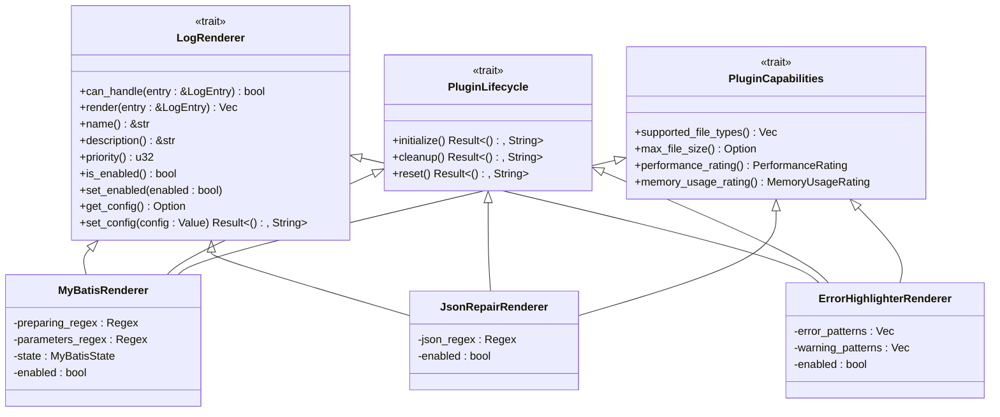
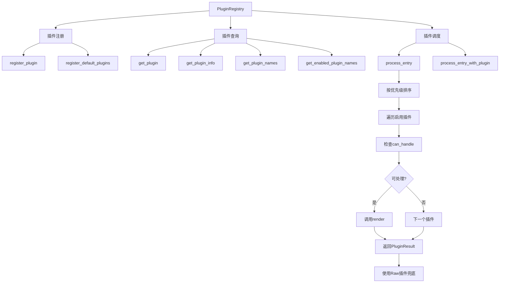

# 插件系统

<cite>
**本文档引用的文件**  
- [trait_def.rs](file://src-tauri/src/plugins/trait_def.rs)
- [registry.rs](file://src-tauri/src/plugins/registry.rs)
- [mybatis.rs](file://src-tauri/src/plugins/mybatis.rs)
- [json_repair.rs](file://src-tauri/src/plugins/json_repair.rs)
- [error_highlighter.rs](file://src-tauri/src/plugins/error_highlighter.rs)
- [rendered_block.rs](file://src-tauri/src/models/rendered_block.rs)
- [log_entry.rs](file://src-tauri/src/models/log_entry.rs)
- [renderer.rs](file://src-tauri/src/parser/renderer.rs)
- [log_parser.rs](file://src-tauri/src/parser/log_parser.rs)
</cite>

## 目录
1. [引言](#引言)
2. [核心接口设计](#核心接口设计)
3. [插件注册与管理](#插件注册与管理)
4. [核心插件实现分析](#核心插件实现分析)
5. [执行流程与上下文传递](#执行流程与上下文传递)
6. [插件开发指南](#插件开发指南)
7. [扩展性与维护性优势](#扩展性与维护性优势)

## 引言
log-whisper通过插件化架构实现了日志解析功能的灵活扩展。系统通过定义统一的插件接口，支持多种日志格式的智能识别与处理。插件系统采用模块化设计，各功能组件独立实现，通过注册中心统一管理，实现了高内聚、低耦合的系统架构。

## 核心接口设计

插件系统的核心是通过`trait_def.rs`文件中定义的`LogRenderer` trait来规范插件行为。该trait定义了插件必须实现的统一接口，确保所有插件遵循相同的行为模式。



**图示来源**  
- [trait_def.rs](file://src-tauri/src/plugins/trait_def.rs#L1-L223)
- [mybatis.rs](file://src-tauri/src/plugins/mybatis.rs#L1-L333)
- [json_repair.rs](file://src-tauri/src/plugins/json_repair.rs#L1-L236)
- [error_highlighter.rs](file://src-tauri/src/plugins/error_highlighter.rs#L1-L180)

**本节来源**  
- [trait_def.rs](file://src-tauri/src/plugins/trait_def.rs#L1-L223)

## 插件注册与管理

`registry.rs`文件实现了插件注册中心`PluginRegistry`，负责插件的动态注册、管理和调度。系统启动时自动注册所有内置插件，并通过优先级机制确定插件执行顺序。



**图示来源**  
- [registry.rs](file://src-tauri/src/plugins/registry.rs#L1-L242)

**本节来源**  
- [registry.rs](file://src-tauri/src/plugins/registry.rs#L1-L242)

## 核心插件实现分析

### MyBatis插件
MyBatis插件通过正则表达式识别"Preparing:"和"Parameters:"日志模式，解析SQL语句和参数，并将参数值还原到SQL中。插件使用状态机维护跨行SQL的解析上下文。

**本节来源**  
- [mybatis.rs](file://src-tauri/src/plugins/mybatis.rs#L1-L333)

### JSON修复插件
JSON修复插件识别日志中的JSON片段，尝试修复常见的语法错误，如缺少引号、未闭合括号等，并对有效JSON进行格式化展示。

**本节来源**  
- [json_repair.rs](file://src-tauri/src/plugins/json_repair.rs#L1-L236)

### 错误高亮插件
错误高亮插件通过关键词匹配识别错误和警告日志，使用正则表达式模式库进行精准匹配，并生成相应的高亮渲染块。

**本节来源**  
- [error_highlighter.rs](file://src-tauri/src/plugins/error_highlighter.rs#L1-L180)

## 执行流程与上下文传递

插件系统的执行流程由`renderer.rs`中的`RenderEngine`驱动，通过`log_parser.rs`中的`LogParser`集成到主解析流程中。系统采用异常隔离策略，确保单个插件故障不影响整体解析。

```mermaid
sequenceDiagram
participant Parser as LogParser
participant Engine as RenderEngine
participant Registry as PluginRegistry
participant Plugin as LogRenderer
Parser->>Engine : render_entry(entry)
Engine->>Registry : process_entry(entry)
Registry->>Registry : 按优先级排序插件
loop 遍历插件
Registry->>Registry : 获取下一个插件
Registry->>Plugin : can_handle(entry)
alt 可处理
Plugin-->>Registry : true
Registry->>Plugin : render(entry)
Plugin-->>Registry : PluginResult
Registry-->>Engine : PluginResult
Engine-->>Parser : ParseResult
break 结束循环
else 不可处理
Plugin-->>Registry : false
end
end
alt 无插件处理
Registry->>Registry : 使用Raw插件
Registry-->>Engine : PluginResult
Engine-->>Parser : ParseResult
end
```

**图示来源**  
- [renderer.rs](file://src-tauri/src/parser/renderer.rs#L1-L241)
- [log_parser.rs](file://src-tauri/src/parser/log_parser.rs#L1-L246)

**本节来源**  
- [renderer.rs](file://src-tauri/src/parser/renderer.rs#L1-L241)
- [log_parser.rs](file://src-tauri/src/parser/log_parser.rs#L1-L246)

## 插件开发指南

开发新插件需要实现`LogRenderer` trait，并注册到`PluginRegistry`。开发者需重点关注`can_handle`和`render`方法的实现，确保插件能正确识别和处理目标日志格式。

**本节来源**  
- [trait_def.rs](file://src-tauri/src/plugins/trait_def.rs#L1-L223)
- [registry.rs](file://src-tauri/src/plugins/registry.rs#L1-L242)

## 扩展性与维护性优势

插件化设计带来了显著的扩展性和维护性优势。新功能可以通过添加插件实现，无需修改核心代码；插件之间相互隔离，降低了耦合度；统一的接口规范简化了插件开发和测试流程。

**本节来源**  
- [trait_def.rs](file://src-tauri/src/plugins/trait_def.rs#L1-L223)
- [registry.rs](file://src-tauri/src/plugins/registry.rs#L1-L242)
- [mybatis.rs](file://src-tauri/src/plugins/mybatis.rs#L1-L333)
- [json_repair.rs](file://src-tauri/src/plugins/json_repair.rs#L1-L236)
- [error_highlighter.rs](file://src-tauri/src/plugins/error_highlighter.rs#L1-L180)