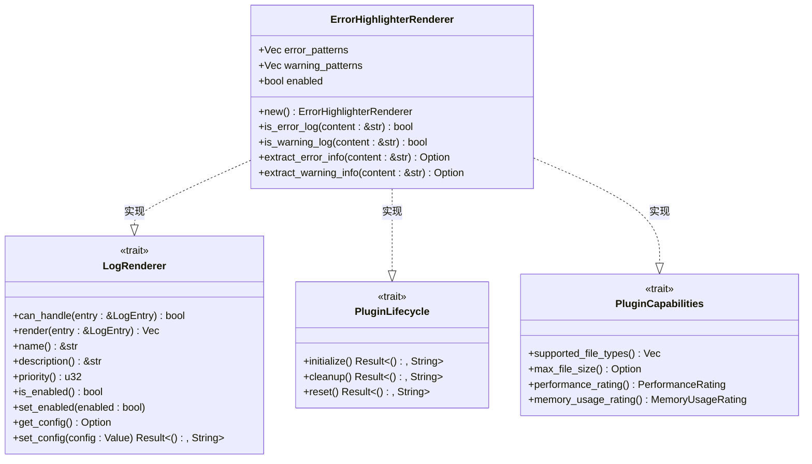
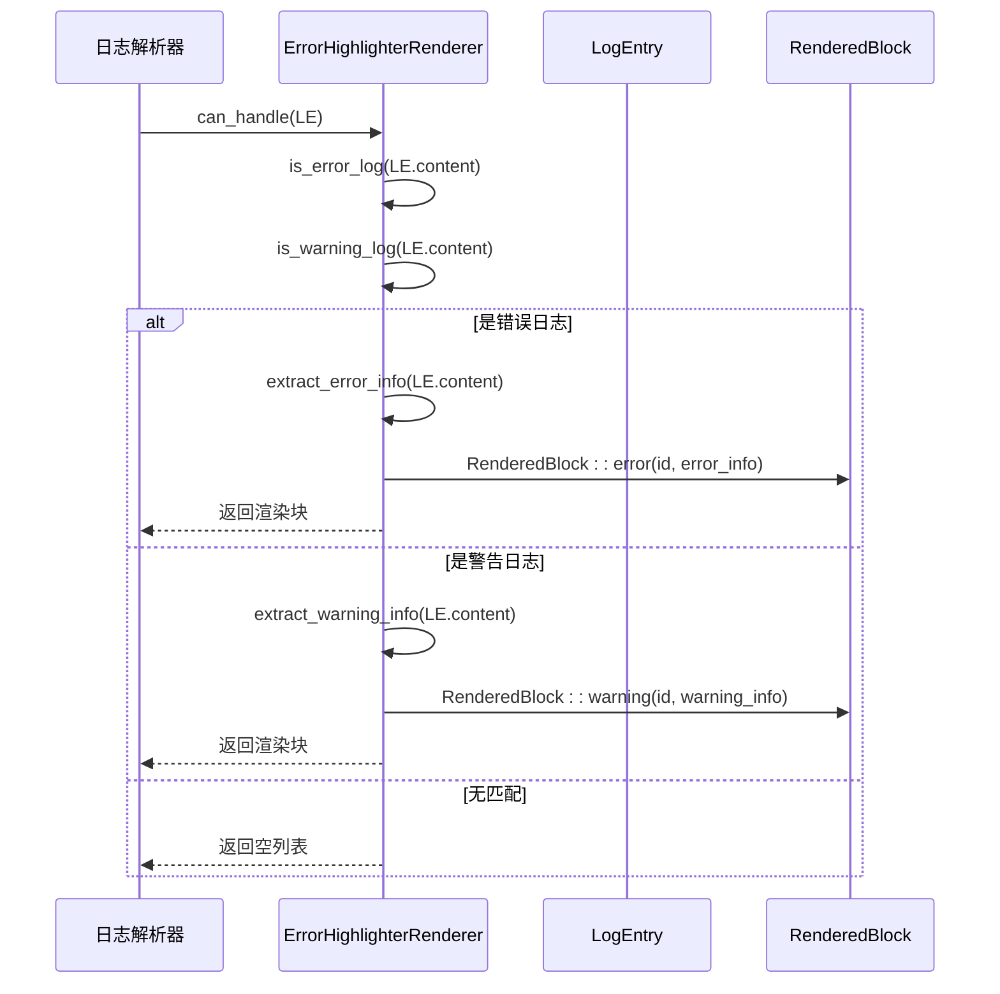
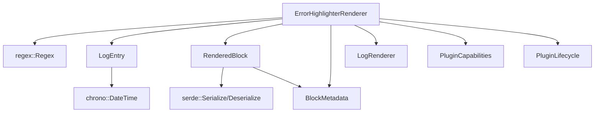

<cite>
**本文档引用的文件**   
- [error_highlighter.rs](file://src-tauri/src/plugins/error_highlighter.rs)
- [rendered_block.rs](file://src-tauri/src/models/rendered_block.rs)
- [log_entry.rs](file://src-tauri/src/models/log_entry.rs)
- [trait_def.rs](file://src-tauri/src/plugins/trait_def.rs)
</cite>

## 目录
1. [错误高亮插件](#错误高亮插件)
2. [核心组件](#核心组件)
3. [架构概述](#架构概述)
4. [详细组件分析](#详细组件分析)
5. [依赖分析](#依赖分析)
6. [性能考虑](#性能考虑)
7. [故障排除指南](#故障排除指南)
8. [结论](#结论)

## 错误高亮插件

错误高亮插件是日志分析系统中的关键组件，专门用于识别和可视化日志文件中的错误与警告信息。该插件通过预定义的正则表达式模式匹配机制，能够高效地扫描日志条目，自动检测包含"ERROR"、"WARN"、"Exception"等关键词的严重错误标识符。当检测到匹配项时，插件会生成带有特定CSS类名的RenderedBlock对象，这些对象随后被前端渲染系统用于应用醒目的颜色样式，实现直观的视觉高亮效果。

插件设计为优先级最高（priority=5），确保在插件处理链中优先执行，从而保证错误信息能够被及时捕获和呈现。此外，插件提供了`get_config`和`set_config`方法，支持用户自定义扩展高亮关键词，增强了系统的灵活性和可配置性。通过多级错误严重度的颜色区分策略，用户可以快速区分错误（红色）和警告（黄色）等不同级别的日志信息，极大地提升了日志排查的效率。

## 核心组件

错误高亮插件的核心由`ErrorHighlighterRenderer`结构体实现，该结构体维护了两组正则表达式模式：`error_patterns`用于匹配严重错误，`warning_patterns`用于匹配警告信息。插件通过`is_error_log`和`is_warning_log`方法对日志内容进行扫描，利用正则表达式的`is_match`功能实现高效的关键词匹配。一旦匹配成功，`extract_error_info`或`extract_warning_info`方法会提取具体的错误或警告信息，并通过`RenderedBlock::error`或`RenderedBlock::warning`工厂方法创建相应的渲染块。

插件的`priority`方法返回5，表明其在所有插件中具有最高优先级，确保在日志处理流程的早期阶段就能介入。`get_config`和`set_config`方法继承自`LogRenderer` trait，为插件提供了配置管理能力，允许外部系统查询和修改其配置，从而支持自定义高亮规则的扩展。

**Section sources**
- [error_highlighter.rs](file://src-tauri/src/plugins/error_highlighter.rs#L1-L180)

## 架构概述

```mermaid
graph TB
subgraph "前端展示层"
UI[用户界面]
CSS[CSS样式]
end
subgraph "插件处理层"
EHR[ErrorHighlighterRenderer]
LR[LogRenderer Trait]
PC[PluginCapabilities]
PL[PluginLifecycle]
end
subgraph "数据模型层"
LE[LogEntry]
RB[RenderedBlock]
BM[BlockMetadata]
end
LE --> EHR: 输入日志条目
EHR --> RB: 生成渲染块
RB --> UI: 前端渲染
CSS --> UI: 应用样式
EHR --> LR: 实现渲染接口
EHR --> PC: 实现能力接口
EHR --> PL: 实现生命周期
RB --> BM: 包含元数据
```

**Diagram sources **
- [error_highlighter.rs](file://src-tauri/src/plugins/error_highlighter.rs#L1-L180)
- [rendered_block.rs](file://src-tauri/src/models/rendered_block.rs#L1-L182)
- [log_entry.rs](file://src-tauri/src/models/log_entry.rs#L1-L137)
- [trait_def.rs](file://src-tauri/src/plugins/trait_def.rs#L1-L223)

## 详细组件分析

### ErrorHighlighterRenderer 分析

`ErrorHighlighterRenderer`是错误高亮功能的核心实现，它通过实现`LogRenderer` trait来集成到插件系统中。该组件负责处理日志条目的分析和渲染工作。

#### 类图


**Diagram sources **
- [error_highlighter.rs](file://src-tauri/src/plugins/error_highlighter.rs#L1-L180)
- [trait_def.rs](file://src-tauri/src/plugins/trait_def.rs#L1-L223)

#### 处理流程序列图


**Diagram sources **
- [error_highlighter.rs](file://src-tauri/src/plugins/error_highlighter.rs#L1-L180)

**Section sources**
- [error_highlighter.rs](file://src-tauri/src/plugins/error_highlighter.rs#L1-L180)

## 依赖分析



**Diagram sources **
- [error_highlighter.rs](file://src-tauri/src/plugins/error_highlighter.rs#L1-L180)
- [rendered_block.rs](file://src-tauri/src/models/rendered_block.rs#L1-L182)
- [log_entry.rs](file://src-tauri/src/models/log_entry.rs#L1-L137)
- [trait_def.rs](file://src-tauri/src/plugins/trait_def.rs#L1-L223)

**Section sources**
- [error_highlighter.rs](file://src-tauri/src/plugins/error_highlighter.rs#L1-L180)
- [rendered_block.rs](file://src-tauri/src/models/rendered_block.rs#L1-L182)
- [log_entry.rs](file://src-tauri/src/models/log_entry.rs#L1-L137)
- [trait_def.rs](file://src-tauri/src/plugins/trait_def.rs#L1-L223)

## 性能考虑

错误高亮插件在设计上充分考虑了性能因素。其`performance_rating`方法返回`PerformanceRating::VeryHigh`，表明该插件具有极高的处理效率。正则表达式模式被预先编译并缓存在`error_patterns`和`warning_patterns`向量中，避免了在每次调用时重复编译的开销。插件的`memory_usage_rating`为`MemoryUsageRating::Low`，说明其内存占用非常小。

由于插件优先级最高，它会在处理链的早期阶段运行，这有助于快速过滤出关键错误信息，减少后续插件的处理负担。正则匹配操作针对日志内容进行，算法复杂度主要取决于日志条目的长度和正则表达式的复杂度，但在实际应用中表现高效。

## 故障排除指南

如果错误高亮插件未能正确工作，请检查以下几点：
1. 确认插件已启用（`enabled`字段为`true`）
2. 检查日志条目内容是否包含预定义的错误或警告关键词
3. 验证正则表达式模式是否正确编译，`initialize`方法应无错误返回
4. 确认`LogEntry`对象的`content`字段包含完整的日志文本

**Section sources**
- [error_highlighter.rs](file://src-tauri/src/plugins/error_highlighter.rs#L1-L180)
- [trait_def.rs](file://src-tauri/src/plugins/trait_def.rs#L1-L223)

## 结论

错误高亮插件通过高效的正则表达式匹配机制，实现了对日志文件中关键错误标识符的精准识别。其设计优先级最高，确保了关键信息的及时捕获。通过`RenderedBlock`模型与前端CSS样式的结合，实现了直观的视觉高亮效果。插件的模块化设计和配置扩展能力使其既强大又灵活，是日志分析系统中不可或缺的组件。