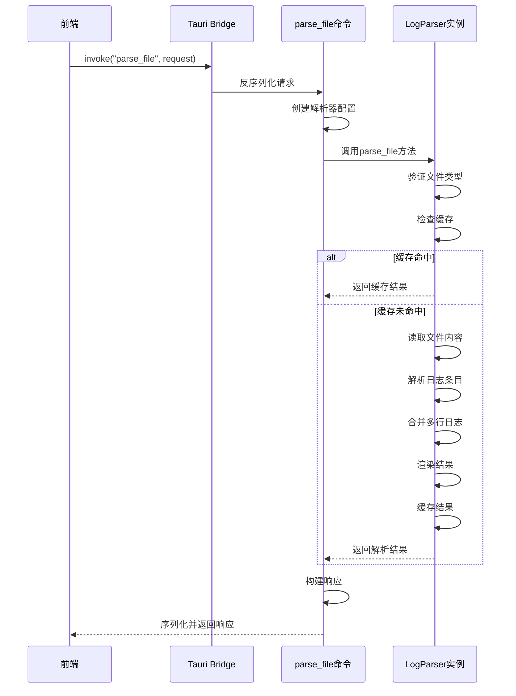
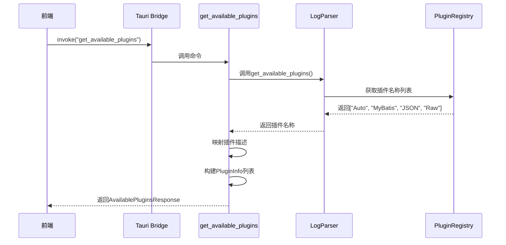
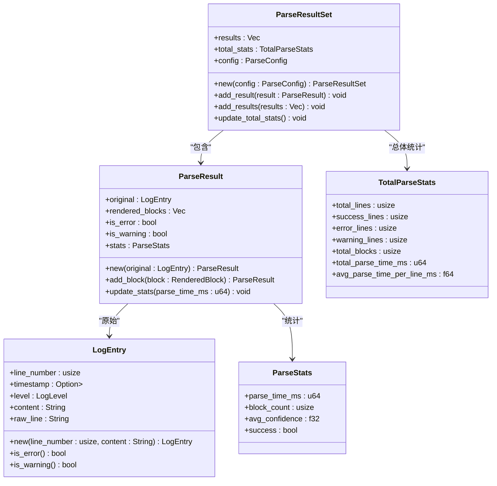
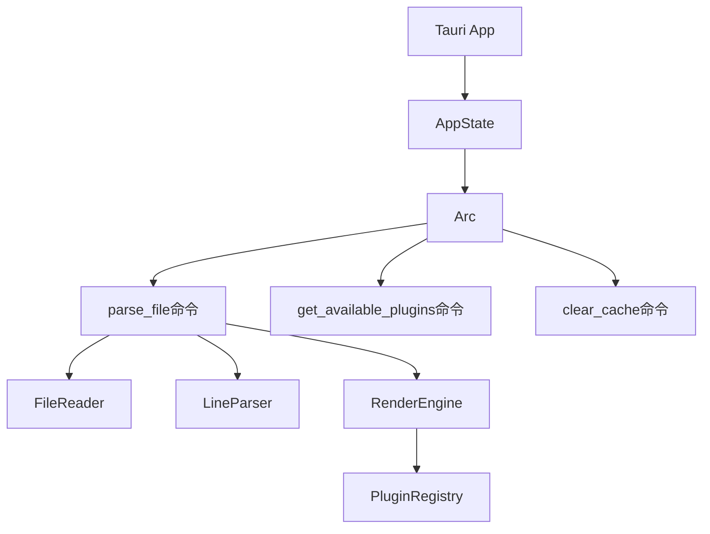

# Tauri命令接口

<cite>
**本文档引用的文件**   
- [commands.rs](file://src-tauri/src/tauri/commands.rs)
- [parse_result.rs](file://src-tauri/src/models/parse_result.rs)
- [log_parser.rs](file://src-tauri/src/parser/log_parser.rs)
- [state.rs](file://src-tauri/src/tauri/state.rs)
- [log_entry.rs](file://src-tauri/src/models/log_entry.rs)
- [renderer.rs](file://src-tauri/src/parser/renderer.rs)
- [registry.rs](file://src-tauri/src/plugins/registry.rs)
</cite>

## 目录
1. [简介](#简介)
2. [核心命令详解](#核心命令详解)
3. [请求/响应数据结构](#请求响应数据结构)
4. [命令执行流程](#命令执行流程)
5. [前端调用方式](#前端调用方式)
6. [共享状态机制](#共享状态机制)
7. [最佳实践与调试](#最佳实践与调试)

## 简介
`log-whisper` 是一个轻量级桌面日志分析工具，通过 Tauri 框架提供了一系列异步 Rust 命令接口，供前端调用以实现日志文件的解析、格式识别和插件管理功能。本文档详细说明了暴露给前端的核心命令函数，包括 `parse_file`、`get_supported_formats` 和 `get_available_plugins` 等，解析其请求/响应数据结构、序列化机制、业务逻辑流程以及前端调用方式。

**Section sources**
- [commands.rs](file://src-tauri/src/tauri/commands.rs#L1-L292)
- [lib.rs](file://src-tauri/src/lib.rs#L1-L70)

## 核心命令详解

### parse_file 命令
`parse_file` 是核心的日志文件解析命令，接收解析请求并返回解析结果。该命令为异步函数，使用 `#[tauri::command]` 宏标记，可在前端通过 `window.__TAURI__.tauri.invoke` 调用。



**Diagram sources**
- [commands.rs](file://src-tauri/src/tauri/commands.rs#L68-L121)
- [log_parser.rs](file://src-tauri/src/parser/log_parser.rs#L46-L118)

**Section sources**
- [commands.rs](file://src-tauri/src/tauri/commands.rs#L68-L121)
- [log_parser.rs](file://src-tauri/src/parser/log_parser.rs#L46-L118)

### get_supported_formats 命令
`get_supported_formats` 命令用于获取系统支持的日志文件格式列表。该命令同步返回支持的格式，目前包括 `.log` 和 `.txt` 两种格式。

**Section sources**
- [commands.rs](file://src-tauri/src/tauri/commands.rs#L123-L133)

### get_available_plugins 命令
`get_available_plugins` 命令用于获取当前可用的插件列表。该命令接收 `State<Arc<LogParser>>` 作为共享状态，调用 `LogParser` 实例的 `get_available_plugins` 方法获取插件名称，并通过 `get_plugin_description` 函数补充插件描述信息，最终返回包含名称、描述和启用状态的插件信息列表。



**Diagram sources**
- [commands.rs](file://src-tauri/src/tauri/commands.rs#L135-L160)
- [log_parser.rs](file://src-tauri/src/parser/log_parser.rs#L195-L198)
- [registry.rs](file://src-tauri/src/plugins/registry.rs#L1-L242)

**Section sources**
- [commands.rs](file://src-tauri/src/tauri/commands.rs#L135-L160)
- [log_parser.rs](file://src-tauri/src/parser/log_parser.rs#L195-L198)

## 请求响应数据结构

### ParseFileRequest 结构
定义了解析文件请求的数据结构，包含文件路径和可选的插件名称。

**Section sources**
- [commands.rs](file://src-tauri/src/tauri/commands.rs#L7-L12)

### ParseFileResponse 结构
定义了解析文件响应的数据结构，包含操作成功标志、解析结果集和错误信息。

**Section sources**
- [commands.rs](file://src-tauri/src/tauri/commands.rs#L14-L20)

### ParseResultSet 结构
`ParseResultSet` 是核心的解析结果集合，包含多个 `ParseResult` 实例、总体统计信息和解析配置。



**Diagram sources**
- [parse_result.rs](file://src-tauri/src/models/parse_result.rs#L1-L285)
- [log_entry.rs](file://src-tauri/src/models/log_entry.rs#L1-L137)

**Section sources**
- [parse_result.rs](file://src-tauri/src/models/parse_result.rs#L1-L285)

## 命令执行流程

### 参数校验
所有命令在执行前都会进行参数校验。`parse_file` 命令会验证文件路径是否存在、文件类型是否受支持（`.log` 或 `.txt`），并检查文件大小是否超过配置的最大限制（默认50MB）。

### 日志记录
系统集成了 `env_logger` 进行详细的日志记录。根据构建模式（debug/release），日志级别分别设置为 `debug` 或 `info`。命令执行过程中的关键步骤（如开始解析、读取文件、缓存检查等）都会记录 `info` 级别日志，详细信息则记录为 `debug` 或 `trace` 级别。

### 性能监控
每个解析操作都会记录性能指标。`parse_file` 命令使用 `std::time::Instant` 测量总耗时，并将结果存储在 `ParseResultSet` 的 `total_stats.total_parse_time_ms` 字段中。单个日志条目的解析耗时也会记录在 `ParseResult.stats.parse_time_ms` 中。

### 错误处理策略
系统采用分层的错误处理策略。底层操作（如文件读取、解析）返回具体的 `ParseError` 枚举，包含错误类型和消息。Tauri 命令层将这些错误转换为字符串，并封装在 `ParseFileResponse.error` 字段中返回给前端，确保错误信息能够正确传递。

**Section sources**
- [commands.rs](file://src-tauri/src/tauri/commands.rs#L68-L121)
- [log_parser.rs](file://src-tauri/src/parser/log_parser.rs#L46-L118)
- [parse_result.rs](file://src-tauri/src/models/parse_result.rs#L1-L285)

## 前端调用方式
前端通过 Tauri 提供的 JavaScript API 调用这些命令。使用 `window.__TAURI__.tauri.invoke` 方法发送命令，该方法返回一个 Promise，可通过 `then` 或 `async/await` 处理结果。

```javascript
// 使用 async/await 方式调用
async function parseLogFile(filePath, pluginName) {
  try {
    const request = {
      file_path: filePath,
      plugin_name: pluginName
    };
    
    const response = await window.__TAURI__.tauri.invoke('parse_file', request);
    
    if (response.success) {
      console.log('解析成功', response.result_set);
      // 处理解析结果
      displayResults(response.result_set);
    } else {
      console.error('解析失败', response.error);
      showError(response.error);
    }
  } catch (error) {
    console.error('调用失败', error);
    showError('命令调用失败: ' + error.message);
  }
}

// 调用获取支持格式
window.__TAURI__.tauri.invoke('get_supported_formats')
  .then(response => {
    console.log('支持的格式:', response.formats);
  })
  .catch(error => {
    console.error('获取格式失败:', error);
  });
```

**Section sources**
- [commands.rs](file://src-tauri/src/tauri/commands.rs#L68-L121)

## 共享状态机制
Tauri 应用通过 `State<Arc<LogParser>>` 在多个命令间共享 `LogParser` 实例。`AppState` 结构体在应用初始化时创建，并通过 `tauri::Builder::manage` 方法管理。`Arc<LogParser>` 确保了 `LogParser` 实例的线程安全共享，多个命令可以同时访问同一个解析器实例。



**Diagram sources**
- [state.rs](file://src-tauri/src/tauri/state.rs#L3-L13)
- [lib.rs](file://src-tauri/src/lib.rs#L1-L70)

**Section sources**
- [state.rs](file://src-tauri/src/tauri/state.rs#L3-L13)

## 最佳实践与调试

### 命令调用最佳实践
- 始终使用 `try-catch` 或 `.catch()` 处理 Promise 错误
- 对大文件解析设置合理的超时机制
- 利用缓存功能提高重复解析的性能
- 根据需要选择合适的插件，避免使用 "Auto" 模式进行精确控制

### 超时处理
前端应为长时间运行的命令（如大文件解析）实现超时处理：

```javascript
function invokeWithTimeout(command, payload, timeout = 30000) {
  return Promise.race([
    window.__TAURI__.tauri.invoke(command, payload),
    new Promise((_, reject) => 
      setTimeout(() => reject(new Error('命令超时')), timeout)
    )
  ]);
}

// 使用示例
invokeWithTimeout('parse_file', request, 60000)
  .then(handleResponse)
  .catch(handleError);
```

### 调试技巧
- 查看 `logs/` 目录下的日志文件获取详细执行信息
- 使用 `debug` 构建模式以获取更详细的日志输出
- 通过 `get_cache_stats` 命令监控缓存使用情况
- 利用浏览器开发者工具的网络面板观察 Tauri 命令调用

**Section sources**
- [commands.rs](file://src-tauri/src/tauri/commands.rs#L1-L292)
- [lib.rs](file://src-tauri/src/lib.rs#L1-L70)