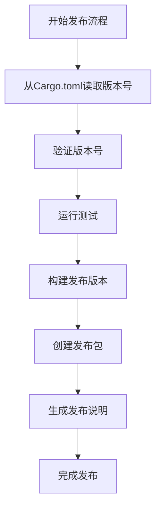
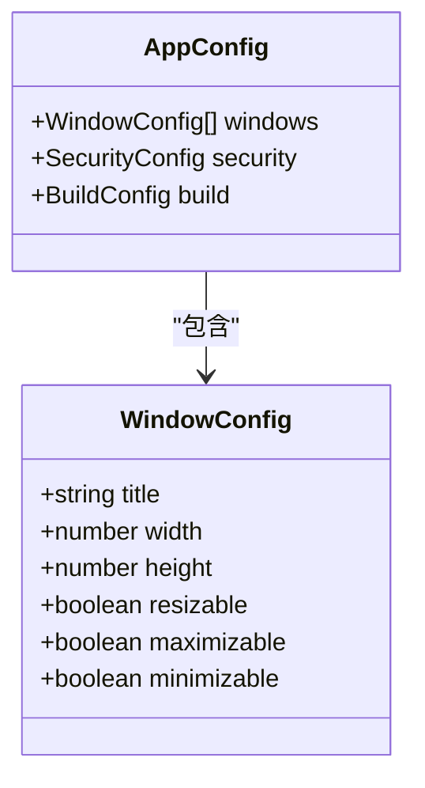
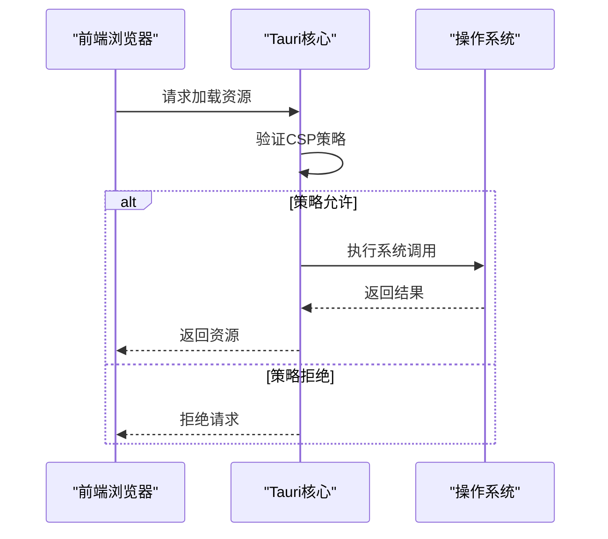
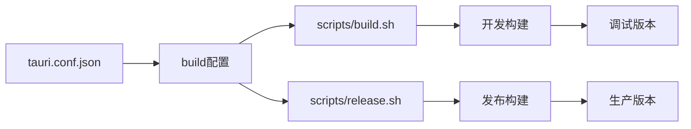

# Tauri配置管理

<cite>
**Referenced Files in This Document**   
- [tauri.conf.json](file://src-tauri/tauri.conf.json)
- [build.sh](file://scripts/build.sh)
- [release.sh](file://scripts/release.sh)
- [Cargo.toml](file://Cargo.toml)
</cite>

## 目录
1. [简介](#简介)
2. [应用元信息配置](#应用元信息配置)
3. [窗口行为配置](#窗口行为配置)
4. [安全策略配置](#安全策略配置)
5. [构建流程配置](#构建流程配置)
6. [多环境配置最佳实践](#多环境配置最佳实践)
7. [敏感信息保护](#敏感信息保护)
8. [结论](#结论)

## 简介
本文档深入解析log-whisper项目的Tauri配置管理，重点分析`tauri.conf.json`配置文件的各个字段含义及其在应用开发和发布过程中的作用。文档详细说明了应用元信息、窗口行为、安全策略、构建流程等方面的配置方法，并提供了多环境配置和敏感信息保护的最佳实践。

**Section sources**
- [tauri.conf.json](file://src-tauri/tauri.conf.json#L1-L22)

## 应用元信息配置

### 产品名称与版本管理
`tauri.conf.json`文件中的`productName`和`version`字段定义了应用的基本元信息。`productName`设置为"LogWhisper"，这将作为应用的显示名称，出现在窗口标题栏、任务管理器和安装程序中。`version`字段设置为"1.0.0"，遵循语义化版本控制规范，用于标识应用的版本号。

这些元信息在打包发布过程中起着关键作用。当执行构建脚本时，Tauri会读取这些信息并将其嵌入到生成的可执行文件中。在`release.sh`发布脚本中，系统会从`Cargo.toml`文件中提取版本号，确保前后端版本的一致性。

**Diagram sources**
- [release.sh](file://scripts/release.sh#L8-L80)
- [Cargo.toml](file://Cargo.toml#L1-L15)

**Section sources**
- [tauri.conf.json](file://src-tauri/tauri.conf.json#L2-L4)
- [release.sh](file://scripts/release.sh#L8-L12)

### 标识符与包命名
`identifier`字段设置为"com.logwhisper.app"，这是应用的唯一标识符，遵循反向域名命名约定。该标识符在以下场景中至关重要：
- 在操作系统中唯一标识应用实例
- 用于生成安装包的文件名
- 在应用更新时识别源应用
- 在系统注册表中创建应用条目

## 窗口行为配置

### 窗口尺寸与可调整性
`app.windows`配置项定义了桌面应用窗口的初始行为。当前配置中，`width`设置为1200像素，`height`设置为800像素，为用户提供了一个宽敞的工作区域，适合日志文件的查看和分析。

**Diagram sources**
- [tauri.conf.json](file://src-tauri/tauri.conf.json#L13-L16)

**Section sources**
- [tauri.conf.json](file://src-tauri/tauri.conf.json#L13-L16)

### 窗口标题设置
`title`字段设置为"LogWhisper"，这将显示在窗口的标题栏中。该配置确保用户能够清晰地识别当前运行的应用程序。窗口配置直接影响用户体验，合理的尺寸设置可以提高工作效率，避免频繁的窗口调整操作。

## 安全策略配置

### CSP规则与前端资源安全
虽然当前配置文件中未显式定义CSP（Content Security Policy）规则，但Tauri框架默认实施严格的安全策略。CSP规则用于限制前端资源的加载来源，防止跨站脚本攻击（XSS）等安全威胁。

**Diagram sources**
- [tauri.conf.json](file://src-tauri/tauri.conf.json#L1-L22)

**Section sources**
- [tauri.conf.json](file://src-tauri/tauri.conf.json#L1-L22)

### 默认安全机制
Tauri框架通过以下方式确保应用安全：
- 限制前端JavaScript的系统权限
- 验证所有跨进程通信
- 实施沙箱机制隔离前端和后端
- 提供安全的API调用接口

## 构建流程配置

### 构建脚本协同工作机制
`tauri.conf.json`文件中的`build`配置与`scripts/build.sh`和`release.sh`脚本协同工作，形成完整的构建发布流程。`frontendDist`字段设置为"../src"，指定了前端资源的输出目录。

**Diagram sources**
- [tauri.conf.json](file://src-tauri/tauri.conf.json#L5-L8)
- [build.sh](file://scripts/build.sh#L1-L35)
- [release.sh](file://scripts/release.sh#L1-L80)

**Section sources**
- [tauri.conf.json](file://src-tauri/tauri.conf.json#L5-L8)
- [build.sh](file://scripts/build.sh#L1-L35)
- [release.sh](file://scripts/release.sh#L1-L80)

### 构建流程详解
`build.sh`脚本执行以下步骤：
1. 检查Rust和Tauri CLI的安装状态
2. 清理之前的构建产物
3. 运行单元测试
4. 执行`cargo tauri build`命令生成应用

`release.sh`脚本在此基础上增加了发布相关的功能：
1. 从`Cargo.toml`读取版本号
2. 用户确认发布
3. 构建特定平台的发布版本
4. 创建发布包和发布说明文件

## 多环境配置最佳实践

### 环境变量注入
虽然当前配置未使用环境变量，但推荐的多环境配置方法包括：
- 使用`.env`文件管理不同环境的配置
- 在构建时通过命令行参数注入环境变量
- 使用Tauri的`withGlobalTauri` API在运行时获取环境信息

### 配置文件管理
建议的配置文件管理策略：
- 为不同环境创建独立的配置文件（如`tauri.dev.json`、`tauri.prod.json`）
- 使用符号链接在构建时切换配置
- 在CI/CD管道中自动选择适当的配置文件

## 敏感信息保护

### 配置文件安全
为保护敏感信息，建议：
- 将包含敏感信息的配置文件添加到`.gitignore`
- 使用加密的配置存储
- 在构建时通过安全的密钥管理系统注入敏感信息
- 定期审计配置文件中的权限设置

### 发布流程安全
`release.sh`脚本中的发布流程确保了构建的安全性：
- 通过用户确认防止意外发布
- 在发布前运行完整的测试套件
- 生成详细的发布说明文档
- 将发布产物组织在版本化的目录结构中

## 结论
Tauri配置管理是log-whisper项目成功的关键因素。通过合理配置`tauri.conf.json`文件，结合精心设计的构建脚本，实现了高效、安全的应用开发和发布流程。建议团队遵循文档中提到的最佳实践，持续优化配置管理策略，以支持项目的长期发展。