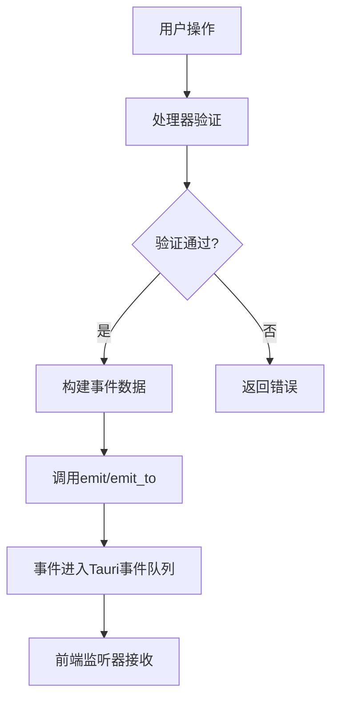

# 事件通信系统

<cite>
**本文档引用文件**  
- [events.rs](file://src-tauri/src/tauri/events.rs)
- [handlers.rs](file://src-tauri/src/tauri/handlers.rs)
- [main.js](file://src/main.js)
</cite>

## 目录
1. [简介](#简介)
2. [事件类型设计](#事件类型设计)
3. [事件处理器机制](#事件处理器机制)
4. [事件发射与监听实现](#事件发射与监听实现)
5. [前端事件监听示例](#前端事件监听示例)
6. [事件驱动架构优势](#事件驱动架构优势)

## 简介
LogWhisper 采用基于 Tauri 框架的事件驱动架构，实现前后端之间的实时通信。系统通过定义结构化的事件类型，结合事件发射与监听机制，实现了高效的用户交互响应、解析进度反馈和错误通知功能。该通信系统不仅解耦了前后端逻辑，还支持跨窗口通信，为应用提供了良好的响应性和实时更新能力。

## 事件类型设计

### ParseEvent 解析事件
`ParseEvent` 结构体用于传递日志解析过程中的状态信息，包含事件类型和数据两部分。事件类型 `ParseEventType` 枚举定义了四种状态：`Started`（开始）、`Progress`（进度）、`Completed`（完成）和 `Error`（错误）。数据部分 `ParseEventData` 包含文件路径、进度百分比、结果数量和错误消息等可选字段。

该事件类型在解析进度反馈场景中发挥关键作用，从前端拖拽文件开始，到解析完成或出错，整个生命周期通过不同类型的 `ParseEvent` 进行状态同步。

**Section sources**
- [events.rs](file://src-tauri/src/tauri/events.rs#L2-L25)

### UIEvent 用户界面事件
`UIEvent` 结构体用于捕获和传递用户交互行为。其事件类型 `UIEventType` 枚举定义了多种用户操作，包括 `FileDropped`（文件拖拽）、`PluginChanged`（插件切换）、`SearchPerformed`（搜索执行）、`SearchCleared`（搜索清除）、`ThemeChanged`（主题切换）和 `WindowResized`（窗口调整）。

数据部分 `UIEventData` 封装了与具体操作相关的参数，如文件路径、插件名称、搜索关键词、主题名称和窗口尺寸等。这种设计使得前端能够精确地将用户操作转化为结构化事件，传递给后端进行处理。

**Section sources**
- [events.rs](file://src-tauri/src/tauri/events.rs#L81-L107)

### ErrorEvent 错误事件
`ErrorEvent` 结构体专门用于错误通知，包含错误类型 `ErrorEventType`、错误消息和详细信息。错误类型枚举定义了 `ParseError`（解析错误）、`FileError`（文件错误）、`PluginError`（插件错误）和 `SystemError`（系统错误）四种情况。

该事件类型为系统提供了统一的错误处理机制，无论是解析过程中的格式错误，还是文件读取失败，亦或是插件运行异常，都能通过 `ErrorEvent` 及时通知前端，实现友好的错误提示和用户体验。

**Section sources**
- [events.rs](file://src-tauri/src/tauri/events.rs#L202-L217)

## 事件处理器机制

### FileDropHandler 文件拖拽处理器
`FileDropHandler` 是处理文件拖拽操作的核心组件。当用户将日志文件拖入应用时，该处理器首先验证文件扩展名（仅支持 `.log` 和 `.txt` 格式），然后通过 `window.emit` 方法发射 `file-dropped` 事件，将文件路径传递给前端。

此处理器确保了文件输入的安全性和有效性，同时触发后续的解析流程，是用户交互响应链的起点。

**Section sources**
- [handlers.rs](file://src-tauri/src/tauri/handlers.rs#L3-L4)

### PluginChangeHandler 插件切换处理器
`PluginChangeHandler` 负责处理插件切换逻辑。它验证插件名称的有效性（支持 "Auto"、"MyBatis"、"JSON"、"Raw" 四种插件），并通过 `app.emit_to` 方法向所有窗口广播 `plugin-changed` 事件。

该处理器体现了系统的可扩展性，允许用户根据日志类型选择最合适的解析插件，并通过事件机制实时更新解析结果。

**Section sources**
- [handlers.rs](file://src-tauri/src/tauri/handlers.rs#L44-L45)

## 事件发射与监听实现

### EventTarget 与跨窗口通信
系统利用 Tauri 提供的 `EventTarget` 枚举实现灵活的事件发射策略。`EventTarget::Any` 表示事件可被任意窗口接收，实现了跨窗口的广播通信。后端通过 `app.emit_to` 方法将事件发送到指定目标，而前端通过 `window.emit` 发送仅限当前窗口的事件。

这种设计支持多窗口应用场景，确保了事件传递的灵活性和可靠性。

**Section sources**
- [handlers.rs](file://src-tauri/src/tauri/handlers.rs#L46-L55)

### 事件发射流程
事件发射遵循统一的模式：处理器验证输入后，调用 `emit` 或 `emit_to` 方法，指定事件名称和携带的数据。例如，`ProgressHandler` 在解析过程中定期发射 `parse-progress` 事件，传递进度百分比，实现解析进度的实时反馈。



**Diagram sources**
- [handlers.rs](file://src-tauri/src/tauri/handlers.rs#L100-L117)

## 前端事件监听示例
前端通过 Tauri 的 JavaScript API 监听后端事件。核心代码模式如下：

```javascript
if (typeof window.__TAURI__ !== 'undefined') {
    window.__TAURI__.event.listen('parse-progress', (event) => {
        // 更新进度条
        updateProgressBar(event.payload);
    });
    
    window.__TAURI__.event.listen('file-error', (event) => {
        // 显示错误提示
        showError(event.payload);
    });
}
```

此代码片段展示了如何监听 `parse-progress` 和 `file-error` 事件，并根据事件负载更新 UI 状态。`window.__TAURI__.event.listen` 方法接收事件名称和回调函数，实现了事件驱动的 UI 更新。

**Section sources**
- [main.js](file://src/main.js#L81-L82)

## 事件驱动架构优势

### 解耦前后端逻辑
事件系统将前后端的直接调用关系转换为松耦合的发布-订阅模式。后端无需了解前端的具体实现，只需发射事件；前端也无需关心后端处理细节，只需监听感兴趣的事件。这种解耦提高了代码的可维护性和可测试性。

### 提升响应性
通过异步事件通信，系统避免了同步调用可能造成的界面卡顿。例如，解析大文件时，后端可以持续发射 `parse-progress` 事件，前端实时更新进度条，保持界面的流畅响应。

### 支持实时更新
事件驱动架构天然支持数据的实时同步。无论是解析结果的增量更新，还是用户设置的即时生效，都能通过事件机制快速传播到所有相关组件，为用户提供无缝的实时体验。