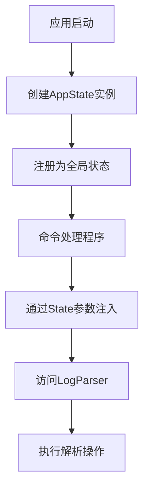
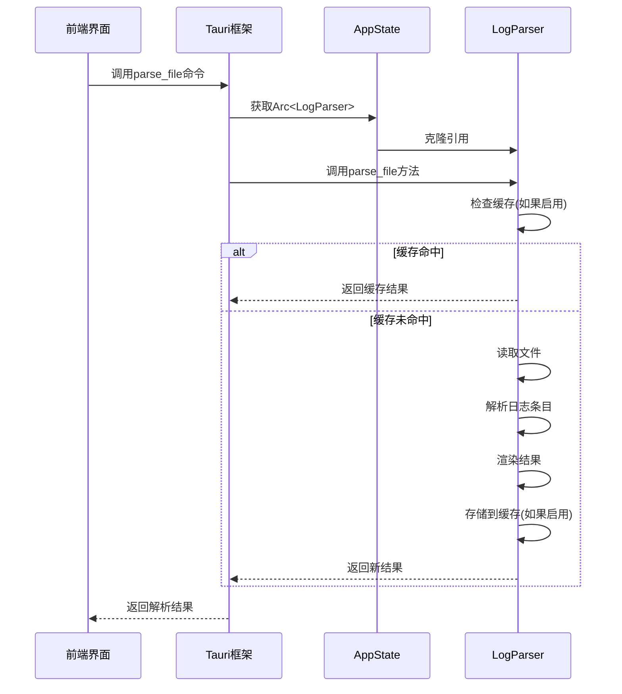

# 应用状态管理

<cite>
**Referenced Files in This Document**  
- [state.rs](file://src-tauri/src/tauri/state.rs)
- [log_parser.rs](file://src-tauri/src/parser/log_parser.rs)
- [main.rs](file://src-tauri/src/main.rs)
- [commands.rs](file://src-tauri/src/tauri/commands.rs)
</cite>

## 目录
1. [应用状态管理](#应用状态管理)
2. [AppState结构体设计](#appstate结构体设计)
3. [LogParser实例的生命周期管理](#logparser实例的生命周期管理)
4. [Tauri状态注入机制](#tauri状态注入机制)
5. [状态变更方法实现](#状态变更方法实现)
6. [实际应用场景分析](#实际应用场景分析)
7. [状态管理最佳实践](#状态管理最佳实践)

## AppState结构体设计

`AppState`结构体是log-whisper应用的核心状态容器，定义在`src-tauri/src/tauri/state.rs`文件中。该结构体通过精心设计的字段组合，实现了对应用全局状态的有效管理。

结构体包含四个主要字段：`parser`、`current_file`、`current_plugin`和`cache_enabled`。其中，`parser`字段是`Arc<LogParser>`类型的智能指针，用于跨线程安全地共享日志解析器实例。`current_file`字段使用`Option<String>`类型表示当前正在处理的文件路径，其`Option`包装允许清晰地区分"无文件打开"和"有文件打开"两种状态。`current_plugin`字段存储当前激活的插件名称，初始值设置为"Auto"，表示自动插件选择模式。`cache_enabled`字段是一个布尔值，用于控制解析结果缓存功能的开关状态。

这种设计体现了不可变性原则和单一职责原则，每个字段都有明确的语义和作用域，避免了状态的混乱和冲突。

**Section sources**
- [state.rs](file://src-tauri/src/tauri/state.rs#L3-L13)

## LogParser实例的生命周期管理

`LogParser`是日志解析的核心组件，其实例的生命周期管理通过`Arc`（原子引用计数）智能指针实现。`Arc`是Rust标准库提供的线程安全的引用计数指针，允许多个所有者共享同一块内存，当最后一个所有者离开作用域时，内存才会被释放。

在`AppState`的`new`方法中，`LogParser`实例通过`Arc::new(LogParser::new())`创建并包装。这种设计模式确保了`LogParser`实例可以在多个Tauri命令处理程序之间安全共享，而无需进行昂贵的克隆操作。每个需要访问解析器的命令处理程序都可以通过Tauri的状态管理机制获取`Arc<LogParser>`的克隆，这只会增加引用计数，而不会复制实际的解析器数据。

`LogParser`内部包含多个组件，如`FileReader`、`LineParser`、`RenderEngine`和`ParseCache`，这些组件共同协作完成日志文件的读取、解析和渲染。通过将`LogParser`包装在`Arc`中，整个解析器及其所有内部状态都可以被安全地跨线程访问，这对于Tauri应用的异步命令处理至关重要。

**Section sources**
- [state.rs](file://src-tauri/src/tauri/state.rs#L15-L24)
- [log_parser.rs](file://src-tauri/src/parser/log_parser.rs#L7-L14)

## Tauri状态注入机制

Tauri框架提供了强大的状态管理机制，允许在应用启动时注册全局可访问的状态对象。在`main.rs`文件中，通过`.manage(AppState::new())`调用，将新创建的`AppState`实例注册为应用的全局状态。

这种状态注入机制基于Rust的类型系统和所有权模型，确保了状态的安全访问。当Tauri命令需要访问应用状态时，可以通过`State<'_, T>`类型参数声明依赖。例如，在`commands.rs`文件中，`parse_file`命令的签名包含`parser: State<'_, Arc<LogParser>>`参数，这告诉Tauri框架从全局状态中提取`Arc<LogParser>`实例并注入到命令处理程序中。

这种依赖注入模式有几个重要优势：首先，它避免了全局变量的使用，提高了代码的可测试性和模块化程度；其次，它利用了Rust的编译时检查，确保状态访问的安全性；最后，它提供了清晰的依赖关系声明，使代码的意图更加明确。

**Diagram sources**
- [main.rs](file://src-tauri/src/main.rs#L15-L20)
- [commands.rs](file://src-tauri/src/tauri/commands.rs#L100-L110)

**Section sources**
- [main.rs](file://src-tauri/src/main.rs#L15-L35)
- [commands.rs](file://src-tauri/src/tauri/commands.rs#L100-L150)

## 状态变更方法实现

`AppState`结构体提供了多个方法来安全地变更内部状态，这些方法的设计遵循了Rust的所有权和借用规则，确保了状态变更的原子性和一致性。

`set_current_file`方法接受一个`String`类型的文件路径，并将其包装在`Some`变体中赋值给`current_file`字段。这种方法的签名`pub fn set_current_file(&mut self, file_path: String)`表明它需要可变借用`self`，这确保了在同一时间只有一个引用可以修改状态，防止了数据竞争。

`set_current_plugin`方法直接将传入的插件名称赋值给`current_plugin`字段。与文件路径不同，插件名称没有使用`Option`类型，因为应用总是需要一个激活的插件，即使是在"Auto"模式下。

`set_cache_enabled`方法用于控制缓存功能的开关状态。这个方法的设计考虑到了性能和内存使用的权衡，允许用户根据需要启用或禁用缓存。

这些状态变更方法都是同步的，它们直接修改`AppState`实例的字段，由于`AppState`本身是通过`manage`注册的，Tauri会确保在调用这些方法时获得适当的锁，从而保证线程安全。

**Section sources**
- [state.rs](file://src-tauri/src/tauri/state.rs#L26-L45)

## 实际应用场景分析

应用状态在文件解析和插件切换等核心功能中发挥着关键的协调作用。当用户选择一个日志文件进行解析时，前端通过Tauri的invoke机制调用`parse_file`命令，该命令首先通过`State`参数获取`Arc<LogParser>`实例。

在解析过程中，`LogParser`会根据当前配置（包括插件名称）决定如何处理日志条目。如果`current_plugin`设置为"Auto"，解析器会尝试自动检测最佳的插件；如果设置为特定插件名称，则直接使用该插件进行渲染。

插件切换场景展示了状态管理的动态性。当用户在UI中选择不同的插件时，前端调用相应的命令更新`AppState`中的`current_plugin`字段。下次文件解析时，新的插件设置就会生效。

缓存机制的集成进一步体现了状态管理的价值。`cache_enabled`字段控制着`LogParser`是否检查和存储缓存结果。当缓存启用时，相同的文件和插件组合的解析结果会被重用，显著提高了性能；当缓存禁用时，每次都会重新解析，确保了结果的实时性。

**Diagram sources**
- [state.rs](file://src-tauri/src/tauri/state.rs#L15-L45)
- [log_parser.rs](file://src-tauri/src/parser/log_parser.rs#L50-L150)
- [commands.rs](file://src-tauri/src/tauri/commands.rs#L100-L150)

## 状态管理最佳实践

在log-whisper的状态管理设计中，体现了一系列Rust和Tauri的最佳实践。

首先，不可变性原则得到了充分应用。`LogParser`实例本身是不可变的，所有的配置都在创建时确定。这种设计简化了并发控制，因为不可变数据可以在多个线程间安全共享而无需同步机制。

其次，并发访问控制通过`Arc`智能指针和Tauri的内部锁机制实现。`Arc`提供了线程安全的引用计数，而Tauri框架在状态访问时自动处理必要的同步，开发者无需手动管理互斥锁。

内存泄漏防范方面，`Arc`的引用计数机制确保了资源的及时释放。当最后一个`Arc`引用离开作用域时，`LogParser`实例及其所有组件都会被正确清理。此外，`ParseCache`组件实现了自身的清理策略，防止缓存无限增长。

最后，错误处理和边界情况的考虑也体现在状态设计中。`current_file`使用`Option<String>`而不是裸`String`，明确表示了"无文件"的状态；`current_plugin`的默认值"Auto"确保了即使在未明确设置的情况下，应用也能正常工作。

这些最佳实践共同构建了一个健壮、高效且易于维护的状态管理系统，为log-whisper应用的稳定运行提供了坚实的基础。

**Section sources**
- [state.rs](file://src-tauri/src/tauri/state.rs#L3-L45)
- [log_parser.rs](file://src-tauri/src/parser/log_parser.rs#L7-L246)