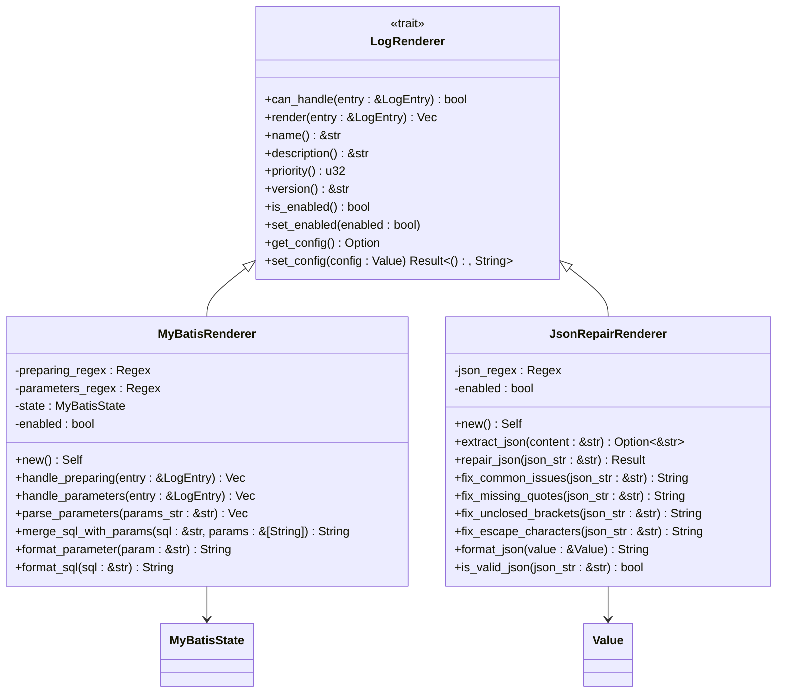
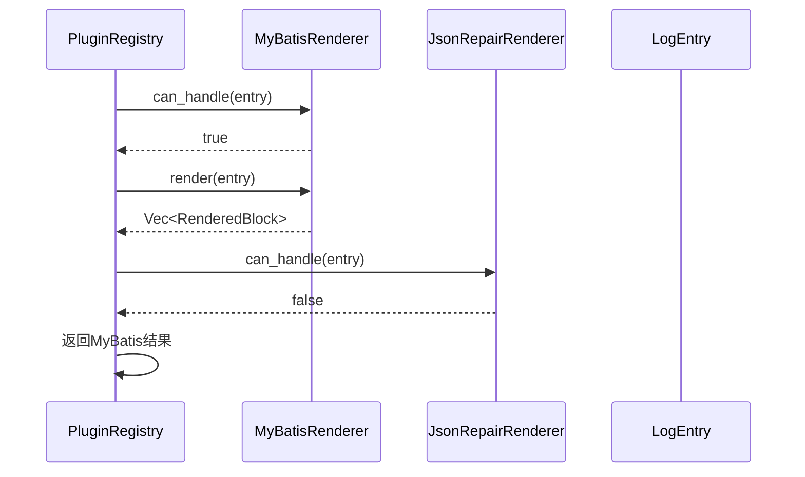
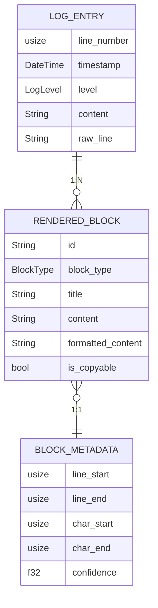

<cite>
**Referenced Files in This Document**   
- [trait_def.rs](file://src-tauri/src/plugins/trait_def.rs)
- [mybatis.rs](file://src-tauri/src/plugins/mybatis.rs)
- [json_repair.rs](file://src-tauri/src/plugins/json_repair.rs)
- [log_entry.rs](file://src-tauri/src/models/log_entry.rs)
- [rendered_block.rs](file://src-tauri/src/models/rendered_block.rs)
- [registry.rs](file://src-tauri/src/plugins/registry.rs)
- [renderer.rs](file://src-tauri/src/parser/renderer.rs)
</cite>

## 目录
1. [LogRenderer Trait定义](#logrenderer-trait定义)
2. [核心方法详解](#核心方法详解)
3. [线程安全与对象安全](#线程安全与对象安全)
4. [默认方法实现意图](#默认方法实现意图)
5. [具体插件实现分析](#具体插件实现分析)
6. [插件注册与调用流程](#插件注册与调用流程)
7. [数据结构关联](#数据结构关联)
8. [总结](#总结)

## LogRenderer Trait定义

`LogRenderer` Trait是日志解析系统插件架构的核心接口，定义了所有日志渲染插件必须实现的基本功能。该Trait采用Rust语言的Trait特性，通过定义一组方法契约，实现了插件系统的可扩展性和灵活性。插件开发者通过实现此Trait来创建自定义的日志解析逻辑，系统则通过Trait对象进行统一调用和管理。

**Section sources**
- [trait_def.rs](file://src-tauri/src/plugins/trait_def.rs#L3-L60)

## 核心方法详解

### can_handle 方法
`can_handle`方法用于判断当前插件是否支持处理特定的日志条目。该方法接收一个`LogEntry`引用作为参数，返回布尔值表示匹配结果。插件通过分析日志内容的特征（如特定关键字、正则表达式模式等）来决定是否介入处理。例如，MyBatis插件会检查日志中是否包含"Preparing:"或"Parameters:"等标识。

### render 方法
`render`方法执行实际的渲染逻辑，将原始日志条目转换为结构化的`RenderedBlock`向量。这是插件的核心处理逻辑，负责解析、格式化和丰富日志内容。方法返回一个`Vec<RenderedBlock>`，允许单个日志条目生成多个可视化块，支持复杂的数据呈现需求。

### 元信息方法
`name`和`description`方法提供插件的元信息，用于用户界面展示和插件管理。`name`返回插件的显示名称，`description`提供详细的插件功能描述，帮助用户理解插件用途。

### 优先级控制
`priority`方法决定插件的匹配顺序，返回一个`u32`类型的数值，数值越小优先级越高。系统在处理日志条目时，会按照优先级顺序尝试匹配插件，确保高优先级插件优先处理。这允许系统实现精确匹配优先于通用匹配的策略。

### 版本管理
`version`方法提供插件的版本信息，便于插件的版本控制和兼容性管理。系统可以通过版本信息判断插件的更新状态，支持向后兼容性检查。

### 启用状态管理
`is_enabled`和`set_enabled`方法用于管理插件的启用状态。`is_enabled`查询当前状态，`set_enabled`修改状态。这使得用户可以动态启用或禁用特定插件，不影响其他插件的正常运行。

### 配置管理
`get_config`和`set_config`方法支持插件配置的序列化与反序列化。`get_config`返回当前配置的JSON值，`set_config`接收JSON值并应用配置。这使得插件可以持久化用户自定义设置，如解析规则、显示偏好等。

**Section sources**
- [trait_def.rs](file://src-tauri/src/plugins/trait_def.rs#L3-L60)

## 线程安全与对象安全

`LogRenderer` Trait继承了`Send + Sync`两个重要的安全标记Trait，确保了插件可以在多线程环境下安全使用。`Send`表示类型的所有权可以在线程间转移，`Sync`表示类型可以通过共享引用在多个线程间安全共享。这一设计使得日志解析系统能够充分利用多核CPU的并行处理能力，提高日志处理的吞吐量。

通过要求所有实现`LogRenderer`的类型同时实现`Send + Sync`，系统保证了插件在跨线程调用时不会出现数据竞争或内存安全问题。这对于一个可能需要处理大量日志数据的系统至关重要，允许渲染引擎在多个工作线程中并行处理不同的日志条目。

**Diagram sources**
- [trait_def.rs](file://src-tauri/src/plugins/trait_def.rs#L3-L60)
- [mybatis.rs](file://src-tauri/src/plugins/mybatis.rs#L10-L333)
- [json_repair.rs](file://src-tauri/src/plugins/json_repair.rs#L10-L236)

## 默认方法实现意图

`LogRenderer` Trait为部分方法提供了默认实现，体现了设计者对插件开发便利性的考虑：

- `version`方法默认返回"1.0.0"，为新插件提供合理的默认版本号，避免开发者必须实现此方法。
- `is_enabled`默认返回`true`，确保新插件默认处于启用状态，符合用户期望。
- `set_enabled`提供空实现，允许插件选择性地重写此方法，对于不需要动态启用控制的简单插件可以忽略。
- `get_config`返回`None`，表示插件无配置，简化了无配置需求插件的实现。
- `set_config`返回`Ok(())`，提供无操作的默认行为，避免配置处理成为强制要求。

这些默认实现降低了插件开发的门槛，开发者可以根据实际需求选择性地重写方法，实现了"约定优于配置"的设计理念。

**Section sources**
- [trait_def.rs](file://src-tauri/src/plugins/trait_def.rs#L45-L60)

## 具体插件实现分析

### MyBatis插件实现
MyBatis插件通过正则表达式识别MyBatis框架生成的日志，特别是"Preparing:"和"Parameters:"模式。插件维护内部状态来关联SQL语句和参数，实现参数替换和SQL格式化。`can_handle`方法检查日志内容是否匹配预定义的正则模式，`render`方法解析SQL和参数，生成格式化的SQL块。

### JSON修复插件实现
JSON修复插件专注于识别和修复日志中的JSON数据。通过复杂的正则表达式提取JSON片段，然后应用一系列修复策略处理常见问题，如缺少引号、未闭合括号等。插件能够区分有效和无效JSON，对无效JSON尝试自动修复，并提供格式化输出。

**Diagram sources**
- [registry.rs](file://src-tauri/src/plugins/registry.rs#L150-L242)
- [mybatis.rs](file://src-tauri/src/plugins/mybatis.rs#L250-L333)
- [json_repair.rs](file://src-tauri/src/plugins/json_repair.rs#L150-L236)

**Section sources**
- [mybatis.rs](file://src-tauri/src/plugins/mybatis.rs#L10-L333)
- [json_repair.rs](file://src-tauri/src/plugins/json_repair.rs#L10-L236)

## 插件注册与调用流程

插件系统通过`PluginRegistry`管理所有插件实例。系统启动时，`registry.rs`文件中的注册中心初始化并注册所有内置插件。当处理日志条目时，渲染引擎调用注册中心的`process_entry`方法，该方法按优先级顺序遍历启用的插件，调用每个插件的`can_handle`方法进行匹配，一旦找到匹配插件即调用其`render`方法生成结果。

这一流程确保了插件系统的高效性和可预测性。优先级机制保证了特定插件优先于通用插件处理，状态管理确保了插件的启用/禁用控制，而统一的调用接口简化了系统架构。

**Section sources**
- [registry.rs](file://src-tauri/src/plugins/registry.rs#L150-L242)
- [renderer.rs](file://src-tauri/src/parser/renderer.rs#L50-L150)

## 数据结构关联

`LogRenderer` Trait与系统其他核心数据结构紧密关联。`LogEntry`作为输入参数，包含原始日志信息；`RenderedBlock`作为输出结果，表示结构化的可视化块。这种设计实现了关注点分离，插件只需关注解析逻辑，而不必处理日志读取或结果展示的细节。

**Diagram sources**
- [log_entry.rs](file://src-tauri/src/models/log_entry.rs#L5-L137)
- [rendered_block.rs](file://src-tauri/src/models/rendered_block.rs#L5-L182)

**Section sources**
- [log_entry.rs](file://src-tauri/src/models/log_entry.rs#L5-L137)
- [rendered_block.rs](file://src-tauri/src/models/rendered_block.rs#L5-L182)

## 总结

`LogRenderer` Trait作为插件系统的核心接口，通过精心设计的方法契约实现了高度的灵活性和可扩展性。其继承`Send + Sync`确保了跨线程安全调用，支持系统的高性能并行处理。默认方法实现降低了插件开发的复杂性，而优先级机制和状态管理提供了精细的控制能力。

通过MyBatis和JSON修复等具体插件的实现，展示了该Trait在实际应用中的强大功能。插件注册中心和渲染引擎的配合，构建了一个完整、高效的插件生态系统，为日志解析功能的持续扩展奠定了坚实基础。