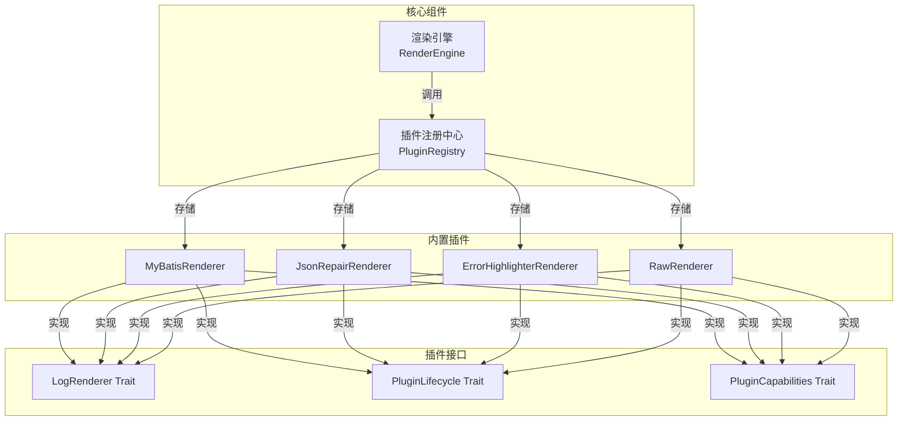
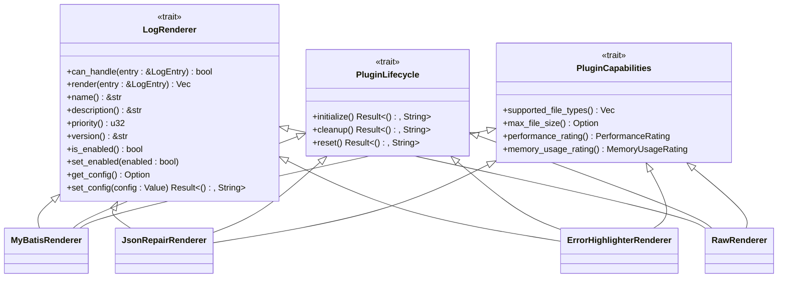
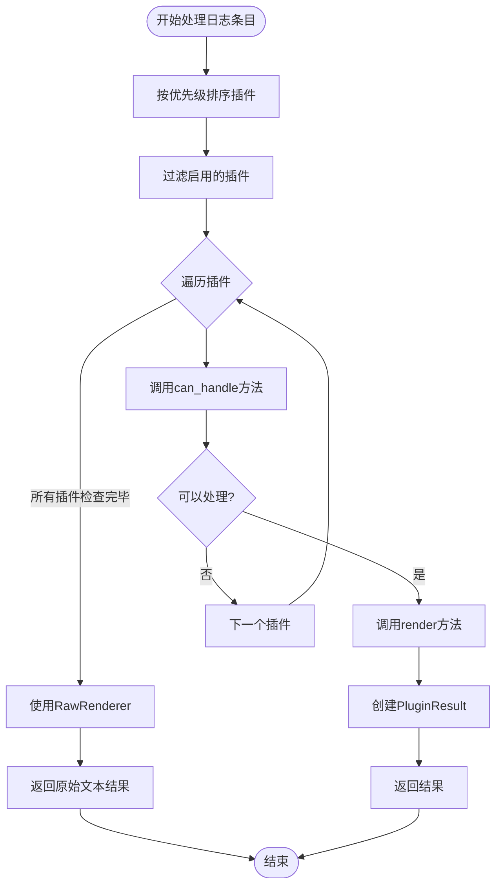
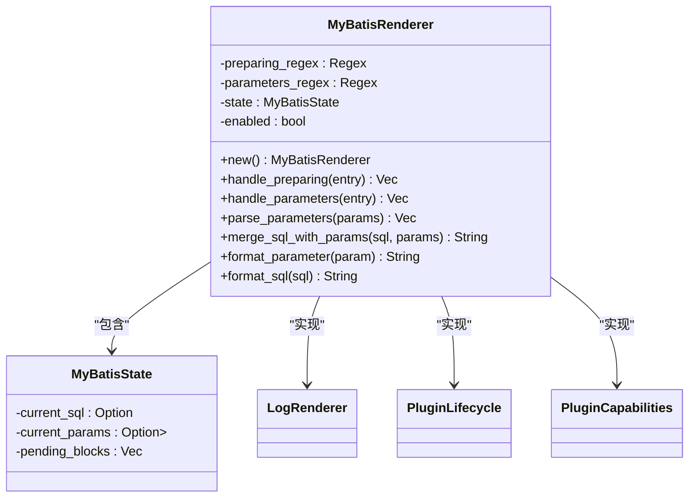
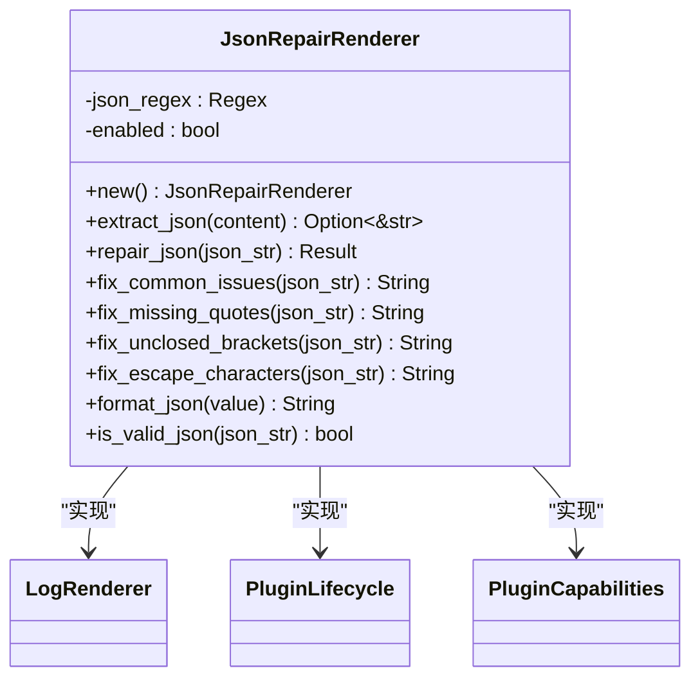
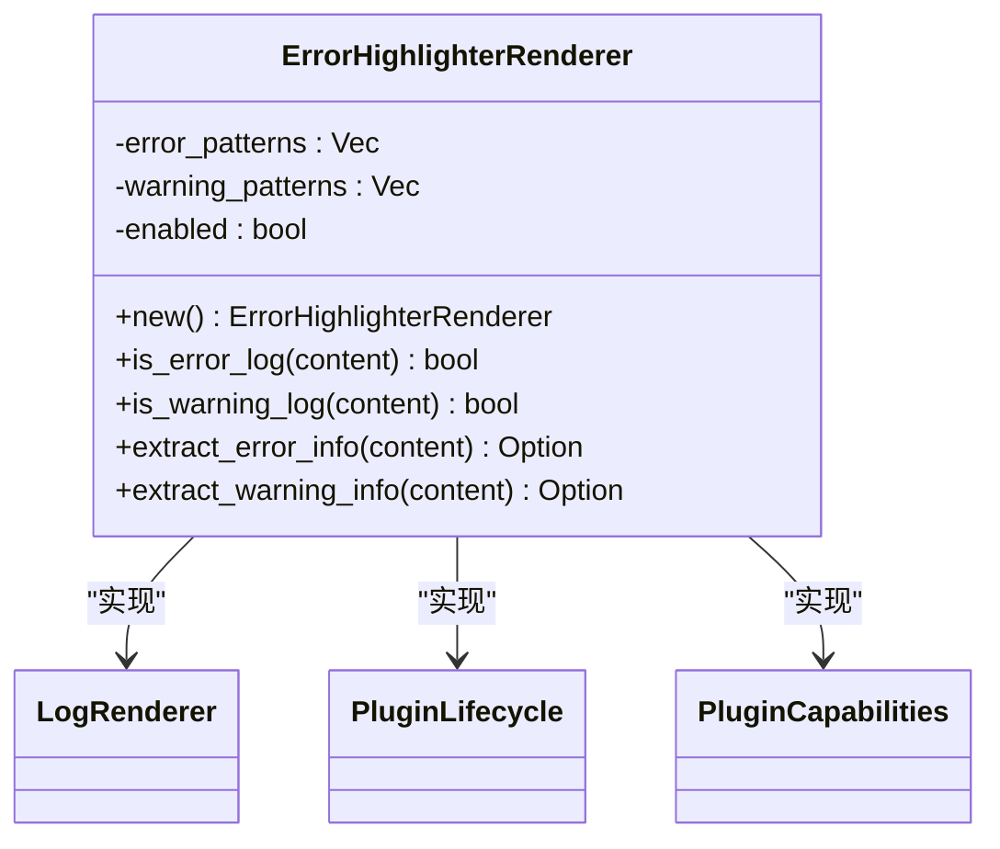
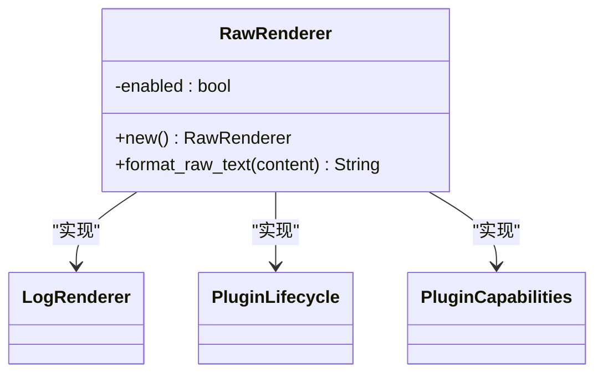
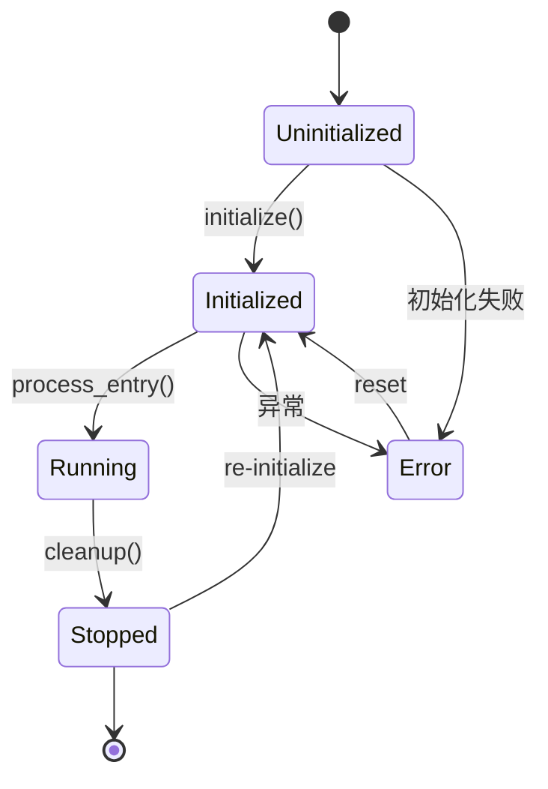

# 插件机制

<cite>
**本文档引用的文件**   
- [trait_def.rs](file://src-tauri/src/plugins/trait_def.rs)
- [registry.rs](file://src-tauri/src/plugins/registry.rs)
- [mybatis.rs](file://src-tauri/src/plugins/mybatis.rs)
- [json_repair.rs](file://src-tauri/src/plugins/json_repair.rs)
- [error_highlighter.rs](file://src-tauri/src/plugins/error_highlighter.rs)
- [raw.rs](file://src-tauri/src/plugins/raw.rs)
- [renderer.rs](file://src-tauri/src/parser/renderer.rs)
- [log_entry.rs](file://src-tauri/src/models/log_entry.rs)
- [rendered_block.rs](file://src-tauri/src/models/rendered_block.rs)
- [parse_result.rs](file://src-tauri/src/models/parse_result.rs)
- [插件系统重构方案.md](file://doc/插件系统重构方案.md)
</cite>

## 目录
1. [引言](#引言)
2. [核心架构设计](#核心架构设计)
3. [LogRenderer Trait 接口详解](#logrenderer-trait-接口详解)
4. [插件注册与管理机制](#插件注册与管理机制)
5. [插件优先级调度逻辑](#插件优先级调度逻辑)
6. [具体插件实现分析](#具体插件实现分析)
7. [插件生命周期管理](#插件生命周期管理)
8. [插件开发规范与模板](#插件开发规范与模板)
9. [未来扩展性支持](#未来扩展性支持)
10. [附录](#附录)

## 引言
LogWhisper 采用基于 Trait 的插件化架构设计，实现了高度可扩展的日志处理系统。该架构通过定义标准化的接口（Trait），允许不同功能的插件以统一的方式集成到核心系统中。插件系统支持动态注册、优先级调度和线程安全执行，为日志解析、渲染、过滤和导出等功能提供了灵活的扩展能力。本文档全面阐述了插件机制的设计原理、核心组件和开发规范，旨在为开发者提供完整的插件开发指导。

## 核心架构设计



**图示来源**
- [trait_def.rs](file://src-tauri/src/plugins/trait_def.rs#L2-L43)
- [registry.rs](file://src-tauri/src/plugins/registry.rs#L8-L13)
- [mybatis.rs](file://src-tauri/src/plugins/mybatis.rs#L15-L333)
- [json_repair.rs](file://src-tauri/src/plugins/json_repair.rs#L15-L236)
- [error_highlighter.rs](file://src-tauri/src/plugins/error_highlighter.rs#L15-L180)
- [raw.rs](file://src-tauri/src/plugins/raw.rs#L15-L97)

**本节来源**
- [插件系统重构方案.md](file://doc/插件系统重构方案.md#L1-L608)
- [registry.rs](file://src-tauri/src/plugins/registry.rs#L8-L13)

## LogRenderer Trait 接口详解



**图示来源**
- [trait_def.rs](file://src-tauri/src/plugins/trait_def.rs#L2-L43)

**本节来源**
- [trait_def.rs](file://src-tauri/src/plugins/trait_def.rs#L2-L43)

LogRenderer Trait 是插件系统的核心接口，定义了所有日志渲染插件必须实现的方法。该 Trait 继承了 Send 和 Sync 标记 Trait，确保插件实例可以在多线程环境中安全地传递和共享。接口主要包含以下方法：

- **can_handle**: 检查插件是否能够处理指定的日志条目，基于日志内容特征进行判断
- **render**: 对符合条件的日志条目进行处理，返回一个或多个渲染块（RenderedBlock）
- **name**: 返回插件的名称，用于标识和显示
- **description**: 返回插件的描述信息，说明其功能和用途
- **priority**: 返回插件的优先级数值，数字越小优先级越高
- **version**: 返回插件版本号，默认实现为"1.0.0"
- **is_enabled/set_enabled**: 获取和设置插件的启用状态
- **get_config/set_config**: 获取和设置插件的配置信息

此外，系统还定义了 PluginLifecycle 和 PluginCapabilities 两个辅助 Trait，分别用于管理插件生命周期和声明插件能力。

## 插件注册与管理机制

```mermaid
sequenceDiagram
participant App as 应用程序
participant Registry as PluginRegistry
participant Plugin as 插件实例
App->>Registry : 创建注册中心
Registry->>Registry : register_default_plugins()
Registry->>Registry : 注册MyBatis插件
Registry->>Registry : 注册JSON修复插件
Registry->>Registry : 注册错误高亮插件
Registry->>Registry : 注册原始文本插件
App->>Registry : get_plugin("MyBatis")
Registry-->>App : 返回Arc<RwLock<dyn LogRenderer>>
App->>Registry : enable_plugin("JSON")
Registry-->>App : Result<(), String>
App->>Registry : process_entry(log_entry)
Registry->>Registry : 按优先级排序插件
loop 优先级从高到低
Registry->>Plugin : can_handle(entry)
alt 可以处理
Plugin-->>Registry : true
Registry->>Plugin : render(entry)
Plugin-->>Registry : RenderedBlock[]
Registry-->>App : PluginResult
break
else 不能处理
Plugin-->>Registry : false
end
end
```

**图示来源**
- [registry.rs](file://src-tauri/src/plugins/registry.rs#L8-L13)
- [trait_def.rs](file://src-tauri/src/plugins/trait_def.rs#L2-L43)

**本节来源**
- [registry.rs](file://src-tauri/src/plugins/registry.rs#L8-L13)

插件注册与管理通过 PluginRegistry 结构体实现。该注册中心在应用启动时初始化，内部使用 HashMap 存储插件实例和插件信息。关键特性包括：

- **线程安全存储**: 插件实例存储在 `Arc<RwLock<dyn LogRenderer + Send + Sync>>` 中，确保多线程环境下的安全访问
- **默认插件注册**: 在构造函数中自动注册 MyBatis、JSON修复、错误高亮和原始文本等内置插件
- **插件信息管理**: 维护独立的插件信息哈希表，包含名称、描述、优先级、启用状态等元数据
- **动态操作接口**: 提供注册、获取、启用、禁用插件的方法
- **默认插件设置**: 支持设置和获取默认插件名称

注册中心采用惰性初始化策略，在创建实例时即完成所有默认插件的注册，确保系统启动后即可使用完整功能。

## 插件优先级调度逻辑



**图示来源**
- [registry.rs](file://src-tauri/src/plugins/registry.rs#L8-L13)

**本节来源**
- [registry.rs](file://src-tauri/src/plugins/registry.rs#L8-L13)

插件优先级调度是渲染引擎的核心决策逻辑。当处理日志条目时，系统按照以下流程执行：

1. **优先级排序**: 将所有插件按 priority 数值从小到大排序，确保高优先级插件先被检查
2. **状态过滤**: 只考虑处于启用状态的插件，跳过被禁用的插件
3. **能力检测**: 依次调用每个插件的 can_handle 方法，检测其是否能处理当前日志条目
4. **执行渲染**: 一旦发现能处理的插件，立即调用其 render 方法进行渲染，并返回结果
5. **降级处理**: 如果没有插件能处理，则使用优先级最低的 RawRenderer 返回原始文本

这种调度策略确保了特定格式的日志（如 MyBatis SQL）能够被专门的插件优先处理，而普通日志则由通用插件处理，实现了精准和高效的日志解析。

## 具体插件实现分析

### MyBatis 插件实现



**图示来源**
- [mybatis.rs](file://src-tauri/src/plugins/mybatis.rs#L15-L333)

**本节来源**
- [mybatis.rs](file://src-tauri/src/plugins/mybatis.rs#L15-L333)

MyBatisRenderer 专门用于解析 MyBatis 框架生成的日志，能够识别 "Preparing:" 和 "Parameters:" 格式的日志条目。其实现特点包括：

- **正则表达式匹配**: 使用正则表达式精确匹配 SQL 准备和参数传递的日志格式
- **状态管理**: 通过 MyBatisState 结构体维护解析状态，支持跨多行日志的上下文关联
- **SQL 合并**: 将分离的 SQL 语句和参数合并为完整的可执行 SQL
- **智能格式化**: 自动识别参数类型并添加适当的引号，同时对 SQL 进行美化格式化
- **高优先级**: 设置 priority 为 10，确保在其他插件之前被检查

### JSON 修复插件实现



**图示来源**
- [json_repair.rs](file://src-tauri/src/plugins/json_repair.rs#L15-L236)

**本节来源**
- [json_repair.rs](file://src-tauri/src/plugins/json_repair.rs#L15-L236)

JsonRepairRenderer 专注于 JSON 数据的修复和格式化，其主要功能包括：

- **JSON 提取**: 使用正则表达式从日志文本中提取可能的 JSON 片段
- **语法修复**: 自动修复常见的 JSON 语法错误，如缺少逗号、引号、闭合括号等
- **转义处理**: 正确处理各种转义字符，确保 JSON 的有效性
- **格式化输出**: 将修复后的 JSON 进行美化排版，提高可读性
- **错误反馈**: 当修复失败时，生成错误块提供诊断信息

该插件优先级为 20，位于错误高亮之后，MyBatis 之前，适合处理包含 JSON 数据的一般日志。

### 错误高亮插件实现



**图示来源**
- [error_highlighter.rs](file://src-tauri/src/plugins/error_highlighter.rs#L15-L180)

**本节来源**
- [error_highlighter.rs](file://src-tauri/src/plugins/error_highlighter.rs#L15-L180)

ErrorHighlighterRenderer 是系统中优先级最高的插件（priority=5），负责识别和突出显示错误和警告日志。其实现特点：

- **多模式匹配**: 使用多个正则表达式模式匹配各种错误和警告关键词
- **即时响应**: 对包含 "error"、"exception"、"warn" 等关键词的日志立即做出反应
- **信息提取**: 不仅识别错误，还能提取具体的错误信息片段
- **高性能**: 采用简单的字符串匹配算法，确保极快的处理速度
- **通用性**: 支持所有文件类型，无大小限制

### 原始文本插件实现



**图示来源**
- [raw.rs](file://src-tauri/src/plugins/raw.rs#L15-L97)

**本节来源**
- [raw.rs](file://src-tauri/src/plugins/raw.rs#L15-L97)

RawRenderer 作为最后的备选插件，具有最低优先级（1000），其功能简单但重要：

- **无条件处理**: can_handle 方法始终返回 true，确保任何日志都能被至少一个插件处理
- **原始输出**: 基本不改变日志内容，只进行必要的空白清理
- **高可靠性**: 实现简单，几乎不会出现处理错误
- **兜底保障**: 当其他所有插件都无法处理时，提供最基本的日志显示功能

## 插件生命周期管理



**图示来源**
- [trait_def.rs](file://src-tauri/src/plugins/trait_def.rs#L2-L43)

**本节来源**
- [trait_def.rs](file://src-tauri/src/plugins/trait_def.rs#L2-L43)

插件生命周期通过 PluginLifecycle Trait 进行管理，定义了插件从创建到销毁的完整过程：

- **Uninitialized (未初始化)**: 插件刚被创建，尚未准备就绪
- **Initialized (已初始化)**: 插件完成初始化，可以接受处理请求
- **Running (运行中)**: 插件正在处理日志条目
- **Stopped (已停止)**: 插件被清理，释放资源
- **Error (错误状态)**: 插件在初始化或运行中遇到错误

系统提供了 initialize、cleanup 和 reset 三个生命周期方法，允许插件在不同阶段执行相应的操作。例如，MyBatis 插件在初始化时重新编译正则表达式，在清理时重置内部状态。

## 插件开发规范与模板

```mermaid
flowchart TD
    Start([新建插件模块]) --> DefineStruct