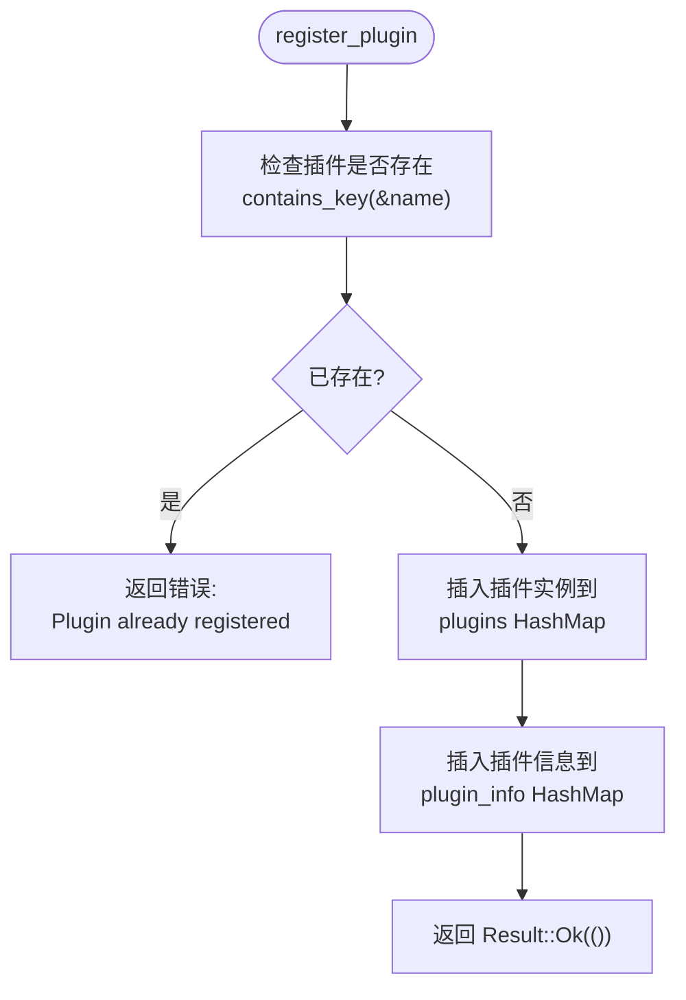
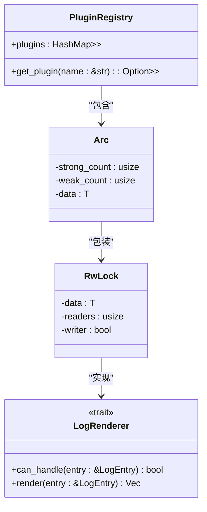
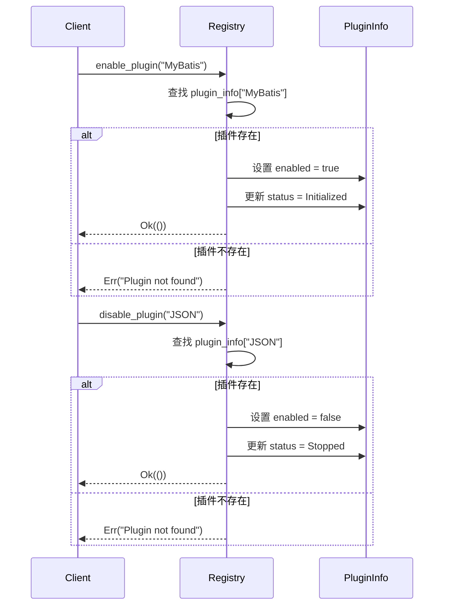
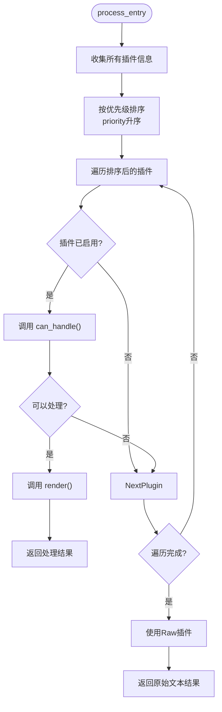

# 插件注册与管理

<cite>
**Referenced Files in This Document**   
- [registry.rs](file://src-tauri/src/plugins/registry.rs)
- [trait_def.rs](file://src-tauri/src/plugins/trait_def.rs)
- [plugin_config.rs](file://src-tauri/src/models/plugin_config.rs)
- [renderer.rs](file://src-tauri/src/parser/renderer.rs)
- [commands.rs](file://src-tauri/src/tauri/commands.rs)
</cite>

## 目录
1. [核心管理方法实现机制](#核心管理方法实现机制)
2. [插件注册与存在性检查](#插件注册与存在性检查)
3. [线程安全的插件获取](#线程安全的插件获取)
4. [插件启用与禁用状态管理](#插件启用与禁用状态管理)
5. [错误处理策略分析](#错误处理策略分析)
6. [自定义插件注册示例](#自定义插件注册示例)
7. [优先级配置对调度的影响](#优先级配置对调度的影响)

## 核心管理方法实现机制

插件系统的核心管理功能由`PluginRegistry`结构体提供，该结构体实现了插件的注册、获取、启用和禁用等关键操作。这些方法共同构成了插件生命周期管理的基础，确保了系统的灵活性和可扩展性。

**Section sources**
- [registry.rs](file://src-tauri/src/plugins/registry.rs#L81-L142)

## 插件注册与存在性检查

`register_plugin`方法负责将新插件安全地插入到系统中。该方法首先执行存在性检查，通过`contains_key`方法验证插件名称是否已存在于`plugins`哈希映射中。如果插件已存在，则返回包含错误信息的`Result::Err`，防止重复注册。

当通过存在性检查后，方法同时将插件实例和其元数据分别插入到两个独立的哈希映射中：`plugins`存储实际的插件对象（包装在`Arc<RwLock<T>>`中），而`plugin_info`存储与该插件相关的元数据信息。这种分离设计使得插件功能与元数据管理解耦，提高了系统的可维护性。

**Diagram sources**
- [registry.rs](file://src-tauri/src/plugins/registry.rs#L81-L96)

**Section sources**
- [registry.rs](file://src-tauri/src/plugins/registry.rs#L81-L96)

## 线程安全的插件获取

`get_plugin`方法通过克隆`Arc<RwLock<T>>`实现线程安全的插件共享。该方法接收插件名称作为参数，在`plugins`哈希映射中查找对应的插件引用。由于哈希映射中的值本身就是`Arc<RwLock<dyn LogRenderer + Send + Sync>>`类型，查找操作返回的是一个只读引用。

关键的线程安全机制体现在`.cloned()`调用上：这会克隆`Arc`智能指针，增加其内部引用计数，从而允许多个线程安全地共享同一插件实例。调用者获得的是一个独立的`Arc`副本，可以在自己的线程上下文中使用，而无需担心生命周期或所有权问题。

**Diagram sources**
- [registry.rs](file://src-tauri/src/plugins/registry.rs#L98-L101)
- [trait_def.rs](file://src-tauri/src/plugins/trait_def.rs#L1-L20)

**Section sources**
- [registry.rs](file://src-tauri/src/plugins/registry.rs#L98-L101)

## 插件启用与禁用状态管理

`enable_plugin`和`disable_plugin`方法负责更新插件的启用状态和相关状态信息。这两个方法都接收插件名称作为参数，并在`plugin_info`哈希映射中查找对应的`PluginInfo`实例。

`enable_plugin`方法将`PluginInfo`中的`enabled`字段设置为`true`，并将`status`更新为`PluginStatus::Initialized`，表示插件已初始化并准备就绪。相反，`disable_plugin`方法将`enabled`字段设置为`false`，并将`status`更新为`PluginStatus::Stopped`，表示插件已停止运行。

两种方法都采用了相同的错误处理模式：如果指定名称的插件不存在，则返回`Result::Err`；如果操作成功，则返回`Result::Ok(())`。这种统一的返回类型使得调用者可以一致地处理成功和失败情况。

**Diagram sources**
- [registry.rs](file://src-tauri/src/plugins/registry.rs#L122-L142)

**Section sources**
- [registry.rs](file://src-tauri/src/plugins/registry.rs#L122-L142)

## 错误处理策略分析

插件管理系统实现了清晰的错误处理策略，主要通过`Result<(), String>`返回类型来区分成功和失败情况。系统定义了两种主要的错误场景：

1. **插件重复注册**：当尝试注册已存在的插件时，`register_plugin`方法返回包含具体插件名称的错误消息，如"Plugin 'MyBatis' already registered"。这种具体的错误信息有助于调试和问题定位。

2. **插件未找到**：当尝试启用、禁用或获取不存在的插件时，相关方法返回"Plugin 'XXX' not found"格式的错误消息。这种一致的错误格式使得前端可以统一处理这些错误情况。

所有错误处理都遵循Rust的`Result`类型模式，强制调用者显式处理可能的错误，避免了异常传播的不确定性。错误信息以字符串形式返回，便于直接显示给用户或记录到日志中。

**Section sources**
- [registry.rs](file://src-tauri/src/plugins/registry.rs#L81-L96)
- [registry.rs](file://src-tauri/src/plugins/registry.rs#L122-L142)

## 自定义插件注册示例

虽然代码库中没有直接的调用示例，但基于`register_plugin`方法的签名，可以推断出自定义插件注册的标准流程。调用者需要准备三个参数：插件名称、插件实例（包装在`Arc<RwLock<T>>`中）和`PluginInfo`元数据对象。

典型的注册流程包括：首先创建插件实现的实例，然后使用`Arc::new(RwLock::new(plugin_instance))`进行包装以支持多线程访问，接着创建包含插件详细信息的`PluginInfo`对象，最后调用`register_plugin`方法完成注册。注册成功后，插件即可通过名称被系统其他部分获取和使用。

**Section sources**
- [registry.rs](file://src-tauri/src/plugins/registry.rs#L81-L96)

## 优先级配置对调度的影响

插件优先级在`process_entry`方法中发挥关键作用，直接影响插件的调度顺序。系统通过以下机制实现优先级调度：

1. 收集所有插件信息并创建元组列表
2. 按`priority`字段对列表进行排序（数值越小优先级越高）
3. 按排序后的顺序依次尝试每个启用的插件
4. 第一个成功处理日志条目的插件将被使用

这种设计确保了高优先级插件（如`ErrorHighlighter`优先级为5）在调度时优先于低优先级插件（如`Raw`优先级为1000）。优先级机制允许系统根据插件的专业化程度进行优化，确保更专业的解析器优先尝试处理，只有当它们无法处理时才回退到通用插件。

**Diagram sources**
- [registry.rs](file://src-tauri/src/plugins/registry.rs#L144-L194)

**Section sources**
- [registry.rs](file://src-tauri/src/plugins/registry.rs#L144-L194)