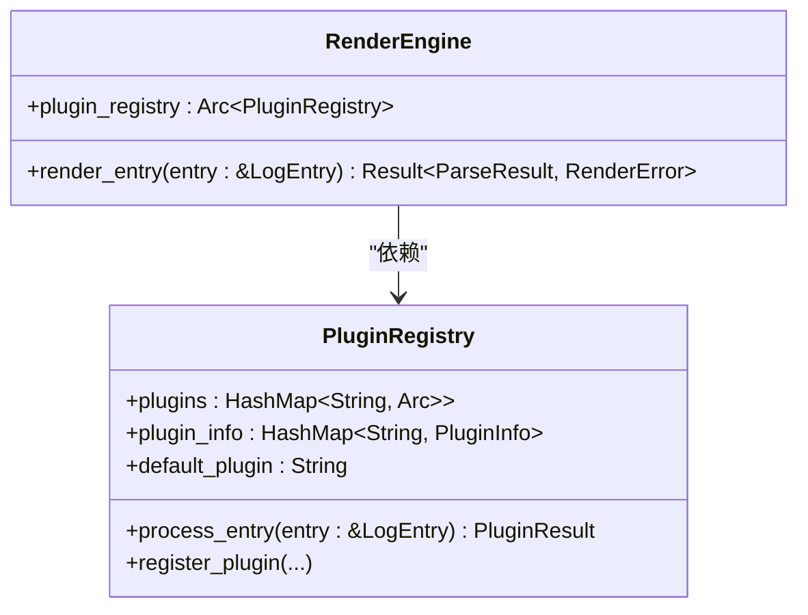

# 插件注册中心

<cite>
**本文档中引用的文件**  
- [registry.rs](file://src-tauri/src/plugins/registry.rs)
- [trait_def.rs](file://src-tauri/src/plugins/trait_def.rs)
- [mybatis.rs](file://src-tauri/src/plugins/mybatis.rs)
- [json_repair.rs](file://src-tauri/src/plugins/json_repair.rs)
- [error_highlighter.rs](file://src-tauri/src/plugins/error_highlighter.rs)
- [raw.rs](file://src-tauri/src/plugins/raw.rs)
- [plugin_config.rs](file://src-tauri/src/models/plugin_config.rs)
- [renderer.rs](file://src-tauri/src/parser/renderer.rs)
</cite>

## 目录
1. [简介](#简介)
2. [核心结构与字段](#核心结构与字段)
3. [构造函数与内置插件注册](#构造函数与内置插件注册)
4. [关键方法解析](#关键方法解析)
5. [插件调度逻辑分析](#插件调度逻辑分析)
6. [插件注册与调用流程示例](#插件注册与调用流程示例)
7. [依赖关系与集成点](#依赖关系与集成点)

## 简介
`PluginRegistry` 是日志解析系统中的核心组件，负责管理所有日志渲染插件的生命周期、优先级调度和执行流程。作为插件系统的中枢，它实现了线程安全的插件共享机制，并通过优先级排序策略确保最合适的插件被优先调用。该组件支持动态注册、启用/禁用插件，并提供自动回退到原始文本渲染的兜底机制，保障系统在任何情况下都能正常输出日志内容。

## 核心结构与字段
`PluginRegistry` 结构体包含三个核心字段，分别用于存储插件实例、元数据信息和默认插件配置。

### 插件实例存储（plugins）
使用 `HashMap<String, Arc<RwLock<dyn LogRenderer + Send + Sync>>>` 类型的哈希表存储所有已注册的插件实例。通过 `Arc<RwLock<>>` 包装，确保多个线程可以安全地共享和访问插件对象，同时允许在必要时进行独占写操作。

### 插件元数据（plugin_info）
维护一个 `HashMap<String, PluginInfo>`，用于保存每个插件的详细信息，包括名称、描述、版本、作者、优先级、启用状态和当前运行状态。`PluginInfo` 结构体还实现了链式调用方法（如 `with_priority`），便于构建时配置。

### 默认插件（default_plugin）
字符串字段，记录当前设置的默认渲染器名称。初始值为 `"Auto"`，表示自动选择最佳匹配插件。可通过 `set_default_plugin` 方法修改。

**Section sources**
- [registry.rs](file://src-tauri/src/plugins/registry.rs#L5-L20)
- [trait_def.rs](file://src-tauri/src/plugins/trait_def.rs#L89-L161)

## 构造函数与内置插件注册
`new()` 构造函数初始化 `PluginRegistry` 实例并自动调用 `register_default_plugins()` 方法注册四个内置插件：MyBatis、JSON修复、错误高亮和原始文本渲染器。

### 内置插件及其优先级
| 插件名称 | 优先级 | 功能描述 |
|--------|------|--------|
| ErrorHighlighter | 5 | 错误高亮插件，优先级最高，用于快速识别错误日志 |
| MyBatis | 10 | MyBatis SQL 解析器，解析Prepare和Parameters语句 |
| JSON | 20 | JSON 修复和格式化，处理日志中的JSON数据 |
| Raw | 1000 | 原始文本显示，作为兜底插件，优先级最低 |

每个插件均以 `Arc<RwLock<>>` 形式封装后存入 `plugins` 映射表，同时其元数据信息通过 `PluginInfo::new().with_priority()` 链式调用设置后存入 `plugin_info` 映射表。

**Section sources**
- [registry.rs](file://src-tauri/src/plugins/registry.rs#L25-L108)
- [mybatis.rs](file://src-tauri/src/plugins/mybatis.rs#L15-L30)
- [json_repair.rs](file://src-tauri/src/plugins/json_repair.rs#L15-L30)
- [error_highlighter.rs](file://src-tauri/src/plugins/error_highlighter.rs#L15-L30)
- [raw.rs](file://src-tauri/src/plugins/raw.rs#L15-L30)

## 关键方法解析
`PluginRegistry` 提供了完整的插件管理接口，涵盖注册、查询、启停控制等功能。

### register_plugin
注册新插件，接受插件名称、实例和元数据信息。若名称已存在则返回错误，否则将插件插入两个哈希表中。

### get_plugin 与 get_plugin_info
分别用于获取指定名称的插件实例和元数据信息。`get_plugin` 返回 `Option<Arc<RwLock<...>>>`，便于后续加锁调用。

### enable_plugin 与 disable_plugin
控制插件的启用状态。启用时同时更新插件状态为 `Initialized`，禁用时更新为 `Stopped`。

### set_default_plugin
设置默认插件名称，仅当插件存在时生效。

### get_enabled_plugin_names
返回所有已启用插件的名称列表，用于外部查询当前激活的插件集。

**Section sources**
- [registry.rs](file://src-tauri/src/plugins/registry.rs#L109-L149)
- [trait_def.rs](file://src-tauri/src/plugins/trait_def.rs#L130-L140)

## 插件调度逻辑分析
`process_entry` 方法是插件调度的核心，决定了如何选择并执行最适合的渲染器。

### 调度流程
```mermaid
flowchart TD
Start([开始处理日志条目]) --> SortPlugins["按优先级排序启用的插件"]
SortPlugins --> LoopStart{遍历排序后的插件}
LoopStart --> CanHandle{插件 can_handle(entry)?}
CanHandle --> |是| Render["调用 render(entry)"]
Render --> CreateResult["创建成功结果"]
CreateResult --> ReturnResult["返回结果"]
CanHandle --> |否| NextPlugin["下一个插件"]
NextPlugin --> LoopStart
LoopStart --> NoMatch{无插件匹配?}
NoMatch --> |是| UseRaw["使用 Raw 插件渲染"]
UseRaw --> ReturnRaw["返回原始文本结果"]
NoMatch --> |否| ReturnResult
ReturnResult --> End([结束])
ReturnRaw --> End
```

**Diagram sources**
- [registry.rs](file://src-tauri/src/plugins/registry.rs#L150-L206)

### 优先级排序机制
首先从 `plugin_info` 中提取所有插件信息，按 `priority` 字段升序排序（数值越小优先级越高），然后依次尝试每个启用的插件。

### 匹配与渲染
对每个插件调用 `can_handle` 方法判断是否支持当前日志条目。一旦匹配成功，立即调用 `render` 方法生成 `RenderedBlock` 列表，并封装为 `PluginResult::success` 返回。

### 兜底策略
若所有插件均无法处理，系统自动使用 `RawRenderer` 进行原始文本渲染，确保总有输出结果。此插件的 `can_handle` 恒返回 `true`，且优先级设为 1000，保证其作为最后备选。

**Section sources**
- [registry.rs](file://src-tauri/src/plugins/registry.rs#L150-L206)
- [raw.rs](file://src-tauri/src/plugins/raw.rs#L45-L60)

## 插件注册与调用流程示例
以下为典型的插件使用流程：

1. **初始化注册中心**
   ```rust
   let registry = PluginRegistry::new();
   ```

2. **注册自定义插件（可选）**
   ```rust
   let custom_plugin = Arc::new(RwLock::new(CustomRenderer::new()));
   let plugin_info = PluginInfo::new("Custom".to_string(), "自定义解析器".to_string(), "1.0.0".to_string(), "User".to_string()).with_priority(15);
   registry.register_plugin("Custom".to_string(), custom_plugin, plugin_info);
   ```

3. **处理日志条目**
   ```rust
   let entry = LogEntry { line_number: 1, content: "Preparing: SELECT * FROM users".to_string() };
   let result = registry.process_entry(&entry);
   ```

4. **结果处理**
   - 若匹配 MyBatis 插件，则返回格式化后的 SQL 块
   - 若无匹配，则由 Raw 插件返回原始文本

**Section sources**
- [registry.rs](file://src-tauri/src/plugins/registry.rs#L150-L206)
- [mybatis.rs](file://src-tauri/src/plugins/mybatis.rs#L100-L150)

## 依赖关系与集成点
`PluginRegistry` 与其他核心组件紧密协作，形成完整的日志处理链。

### 与渲染引擎的集成
`RenderEngine` 持有 `Arc<PluginRegistry>` 的引用，通过 `render_entry` 方法间接调用 `process_entry`，实现日志条目的批量渲染。



**Diagram sources**
- [registry.rs](file://src-tauri/src/plugins/registry.rs#L5-L20)
- [renderer.rs](file://src-tauri/src/parser/renderer.rs#L5-L20)

### 插件生命周期管理
`initialize_all_plugins` 和 `cleanup_all_plugins` 方法用于统一管理所有插件的状态转换，配合 `PluginLifecycle` trait 实现插件的初始化与清理。

**Section sources**
- [registry.rs](file://src-tauri/src/plugins/registry.rs#L207-L241)
- [trait_def.rs](file://src-tauri/src/plugins/trait_def.rs#L30-L50)