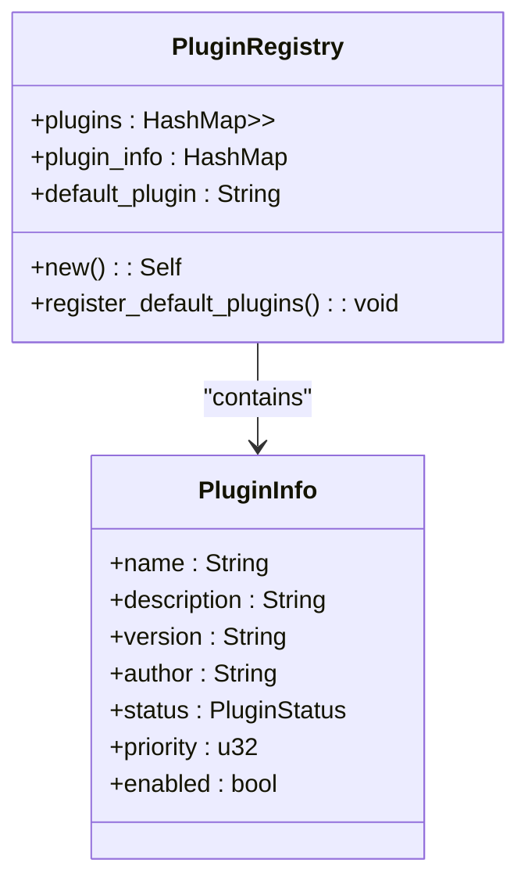
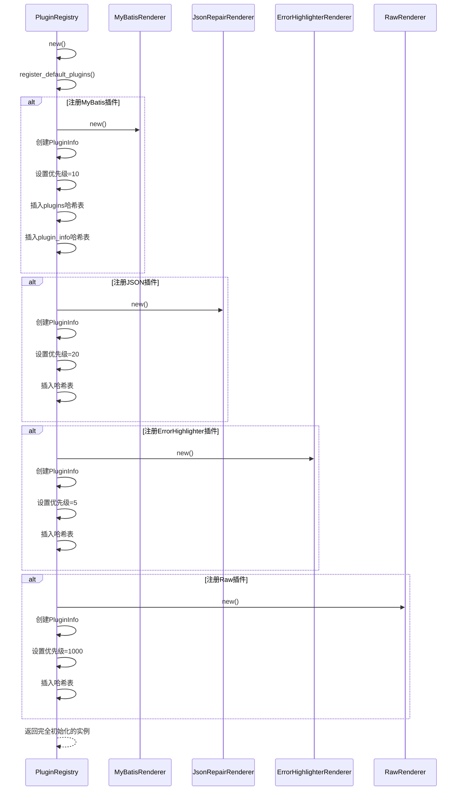

<cite>
**Referenced Files in This Document**  
- [registry.rs](file://src-tauri/src/plugins/registry.rs)
- [mybatis.rs](file://src-tauri/src/plugins/mybatis.rs)
- [json_repair.rs](file://src-tauri/src/plugins/json_repair.rs)
- [error_highlighter.rs](file://src-tauri/src/plugins/error_highlighter.rs)
- [raw.rs](file://src-tauri/src/plugins/raw.rs)
- [trait_def.rs](file://src-tauri/src/plugins/trait_def.rs)
- [plugin_config.rs](file://src-tauri/src/models/plugin_config.rs)
</cite>

## 目录
1. [插件注册中心初始化](#插件注册中心初始化)
2. [结构体字段初始化过程](#结构体字段初始化过程)
3. [内置插件注册流程](#内置插件注册流程)
4. [插件优先级设计分析](#插件优先级设计分析)
5. [默认插件机制解析](#默认插件机制解析)
6. [Default trait实现机制](#default-trait实现机制)

## 插件注册中心初始化

`PluginRegistry`的初始化过程始于`new()`方法的调用，该方法作为结构体的构造函数，负责创建并配置一个新的插件注册中心实例。此方法遵循典型的Rust构造模式，首先通过字段初始化语法创建一个`PluginRegistry`实例，然后立即调用`register_default_plugins()`方法来完成内置插件的注册。整个初始化过程是原子性的，确保返回的实例始终处于完全配置的状态。

`new()`方法的设计体现了"构造即就绪"（Construct-and-Ready）的原则。它不仅负责分配内存和初始化基本字段，还主动触发了插件系统的自举（bootstrap）过程。这种设计避免了将对象创建与系统初始化分离所带来的复杂性，客户端代码无需关心额外的初始化步骤，只需调用`PluginRegistry::new()`即可获得一个功能完备的插件管理器。

**Section sources**
- [registry.rs](file://src-tauri/src/plugins/registry.rs#L15-L25)

## 结构体字段初始化过程

`PluginRegistry`结构体包含三个核心字段：`plugins`、`plugin_info`和`default_plugin`，它们在`new()`方法中被初始化。

`plugins`字段是一个`HashMap<String, Arc<RwLock<dyn LogRenderer + Send + Sync>>>`类型的哈希表，用于存储所有已注册插件的实例。在初始化时，它通过调用`HashMap::new()`创建一个空的哈希表。这种设计确保了插件实例的线程安全共享，`Arc`（原子引用计数）允许多个所有者共享同一份数据，而`RwLock`则提供了读写锁机制，使得多个读操作可以并发执行，而写操作则互斥进行。

`plugin_info`字段是另一个`HashMap<String, PluginInfo>`类型的哈希表，用于存储与每个插件关联的元数据信息，如名称、描述、版本、作者、优先级和启用状态。与`plugins`类似，它也在初始化时被创建为空哈希表。这种分离数据（插件实例）与元数据（插件信息）的设计模式，提高了系统的灵活性和可维护性。

`default_plugin`字段是一个`String`类型，其初始值被设置为`"Auto"`。这个字段存储了当前默认插件的名称，是系统自动选择处理逻辑的依据。



**Diagram sources**
- [registry.rs](file://src-tauri/src/plugins/registry.rs#L5-L13)
- [trait_def.rs](file://src-tauri/src/plugins/trait_def.rs#L150-L180)

**Section sources**
- [registry.rs](file://src-tauri/src/plugins/registry.rs#L15-L25)

## 内置插件注册流程

`register_default_plugins()`方法是`PluginRegistry`初始化过程中的关键环节，它负责创建并注册四个核心内置插件：MyBatis、JSON、ErrorHighlighter和Raw。该方法的执行流程是顺序且确定的，确保了每次初始化都能产生一致的插件集合。

方法首先创建`MyBatisRenderer`的新实例，并将其包装在`Arc<RwLock<>>`中以保证线程安全。随后，它创建一个`PluginInfo`对象，明确指定该插件的名称为"MyBatis"，并调用`with_priority(10)`方法将其优先级设置为10。最后，插件实例和其信息分别被插入到`plugins`和`plugin_info`哈希表中。

此过程对JSON、ErrorHighlighter和Raw插件重复执行。值得注意的是，每个插件的创建都通过其各自的`new()`方法完成，这保证了插件自身内部状态的正确初始化。例如，`MyBatisRenderer`在其`new()`方法中会预编译用于匹配日志中SQL语句的正则表达式。



**Diagram sources**
- [registry.rs](file://src-tauri/src/plugins/registry.rs#L27-L100)
- [mybatis.rs](file://src-tauri/src/plugins/mybatis.rs#L25-L35)
- [json_repair.rs](file://src-tauri/src/plugins/json_repair.rs#L15-L25)
- [error_highlighter.rs](file://src-tauri/src/plugins/error_highlighter.rs#L15-L35)
- [raw.rs](file://src-tauri/src/plugins/raw.rs#L15-L25)

**Section sources**
- [registry.rs](file://src-tauri/src/plugins/registry.rs#L27-L100)

## 插件优先级设计分析

插件的优先级设置是`PluginRegistry`调度机制的核心，它决定了在自动处理模式下哪个插件会被优先选择。优先级通过`PluginInfo`结构体的`priority`字段表示，数值越小代表优先级越高。

- **ErrorHighlighter (优先级 5)**：拥有最高的优先级，确保任何包含错误或警告信息的日志条目都能被第一时间识别和高亮。这种设计意图是将最关键的诊断信息置于最前端，帮助用户快速定位问题。
- **MyBatis (优先级 10)**：次高优先级，针对特定的MyBatis框架日志。它需要在JSON插件之前运行，因为MyBatis日志中的SQL参数可能包含JSON片段，优先解析SQL可以避免被通用JSON解析器误处理。
- **JSON (优先级 20)**：中等优先级，负责修复和格式化日志中的JSON数据。它在MyBatis之后运行，可以处理那些未被MyBatis插件完全解析的JSON内容。
- **Raw (优先级 1000)**：最低优先级，作为“兜底”（fallback）插件。当所有其他插件都无法处理某条日志时，`RawRenderer`会介入，确保用户至少能看到原始文本内容。

这种分层的优先级体系实现了“特化优先于通用”的设计原则。更具体、更专业的插件（如MyBatis）优先于更通用的插件（如JSON）运行，而最通用的插件（Raw）则作为最后的保障。

**Section sources**
- [registry.rs](file://src-tauri/src/plugins/registry.rs#L40-L95)
- [trait_def.rs](file://src-tauri/src/plugins/trait_def.rs#L160-L165)

## 默认插件机制解析

`default_plugin`字段的默认值被设置为字符串`"Auto"`，这代表了一种特殊的处理模式。当系统需要处理日志条目时，如果当前的`default_plugin`是`"Auto"`，`PluginRegistry`会自动执行一个选择算法。

该算法首先从`plugin_info`哈希表中获取所有已启用的插件，并根据它们的`priority`字段进行升序排序。然后，它会遍历这个排序后的列表，依次调用每个插件的`can_handle()`方法。第一个返回`true`的插件将被用来处理该日志条目。如果所有插件都返回`false`，系统最终会回退到`Raw`插件。

`"Auto"`模式的设计意图是提供一种“开箱即用”的智能体验。用户无需手动选择插件，系统会根据日志内容的特征自动选择最合适的解析器。这极大地简化了用户操作，同时保证了处理的准确性和效率。

**Section sources**
- [registry.rs](file://src-tauri/src/plugins/registry.rs#L22-L23)
- [registry.rs](file://src-tauri/src/plugins/registry.rs#L102-L145)

## Default trait实现机制

`PluginRegistry`为`Default` trait提供了实现，其`default()`方法直接委托给`new()`方法。这种实现方式确保了`Default` trait的行为与显式的构造函数完全一致。

```rust
impl Default for PluginRegistry {
    fn default() -> Self {
        Self::new()
    }
}
```

这种设计具有多重优势。首先，它保证了单一的初始化入口，避免了代码重复和潜在的不一致性。无论用户是通过`PluginRegistry::new()`还是`Default::default()`来创建实例，得到的都是一个经过`register_default_plugins()`完全初始化的对象。

其次，它符合Rust社区的惯例。许多标准库和流行crate都采用这种模式，使得`PluginRegistry`的使用方式对Rust开发者来说非常直观和自然。用户可以将其用于需要默认值的场景，例如在结构体字段初始化或集合的`with_capacity()`方法中。

**Section sources**
- [registry.rs](file://src-tauri/src/plugins/registry.rs#L235-L240)