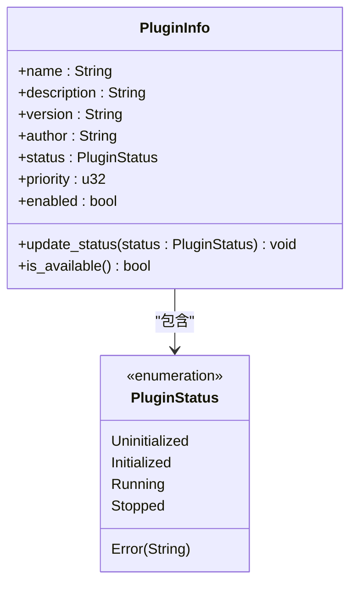
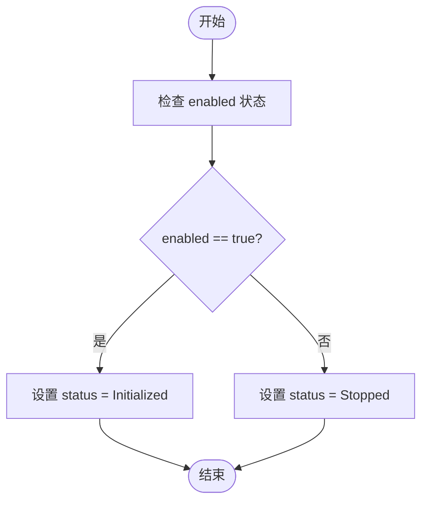
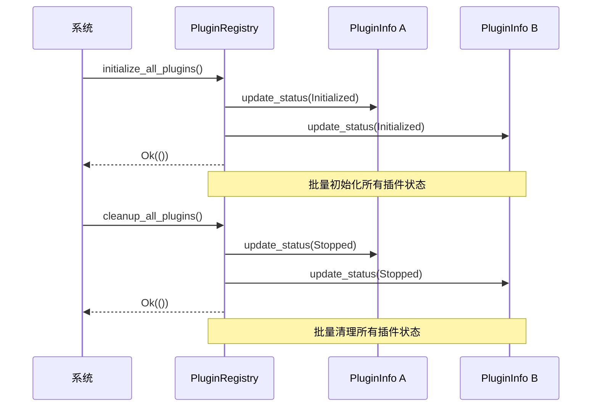
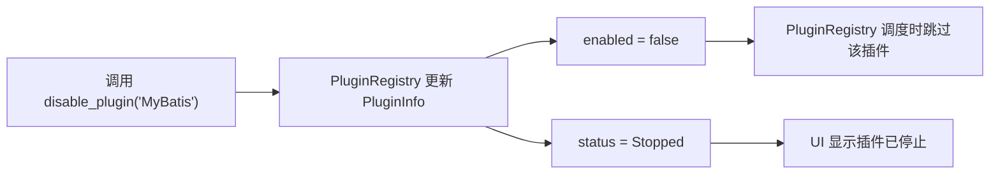

<cite>
**本文档引用文件**  
- [registry.rs](file://src-tauri/src/plugins/registry.rs)
- [trait_def.rs](file://src-tauri/src/plugins/trait_def.rs)
- [插件系统重构方案.md](file://doc/插件系统重构方案.md)
- [mybatis.rs](file://src-tauri/src/plugins/mybatis.rs)
- [json_repair.rs](file://src-tauri/src/plugins/json_repair.rs)
</cite>

## 目录
1. [插件状态管理](#插件状态管理)
2. [核心数据结构](#核心数据结构)
3. [状态管理机制](#状态管理机制)
4. [批量状态操作](#批量状态操作)
5. [状态与行为的关联性](#状态与行为的关联性)
6. [高级功能应用](#高级功能应用)

## 插件状态管理

本文档系统阐述了LogWhisper插件系统中插件状态的管理机制。该系统通过`PluginRegistry`（插件注册中心）统一管理所有插件的生命周期和运行状态，确保了插件行为的可预测性和系统的稳定性。状态管理不仅涉及简单的启用/禁用，还通过`PluginStatus`枚举精确跟踪插件的初始化、运行和停止等关键阶段，为系统提供了强大的生命周期钩子能力。

**Section sources**
- [插件系统重构方案.md](file://doc/插件系统重构方案.md#L57-L83)

## 核心数据结构

插件状态管理的核心依赖于两个关键的数据结构：`PluginInfo`结构体和`PluginStatus`枚举。

### PluginInfo 结构体

`PluginInfo`是插件的元数据容器，它不仅存储插件的名称、描述、版本和作者等基本信息，更重要的是，它通过两个字段来管理插件的运行时状态：
- **`enabled` (布尔字段)**: 这是一个简单的开关，用于控制插件是否参与日志处理流程。当`enabled`为`false`时，插件将被`PluginRegistry`在调度时忽略。
- **`status` (PluginStatus 枚举)**: 这是一个更精细的状态机，用于跟踪插件在其生命周期内的具体阶段。

### PluginStatus 枚举

`PluginStatus`枚举定义了插件可能处于的多种状态，为系统提供了丰富的状态信息：
- **`Uninitialized` (未初始化)**: 插件刚被创建，但尚未进行任何初始化操作。
- **`Initialized` (已初始化)**: 插件已完成初始化，可以被启用。
- **`Running` (运行中)**: 插件当前正在处理日志条目。
- **`Stopped` (已停止)**: 插件已停止运行，通常在禁用或清理时设置。
- **`Error(String)` (错误状态)**: 插件在运行过程中遇到了错误，字符串字段包含错误详情。

这种将“启用/禁用”与“生命周期状态”分离的设计，使得系统可以独立地控制插件的可用性（`enabled`）和其内部的运行状态（`status`），从而实现了更灵活和健壮的管理。

**Diagram sources**
- [trait_def.rs](file://src-tauri/src/plugins/trait_def.rs#L104-L136)

**Section sources**
- [trait_def.rs](file://src-tauri/src/plugins/trait_def.rs#L104-L136)

## 状态管理机制

`PluginRegistry`作为插件状态的中央管理者，提供了多种方法来查询和修改`PluginInfo`中的状态。

### 状态查询

`PluginRegistry`通过`get_plugin_info`方法暴露插件的完整信息，调用者可以检查`enabled`字段来判断插件是否激活，并通过`status`字段了解其当前的生命周期阶段。`PluginInfo`自身还提供了一个`is_available`方法，该方法结合了`enabled`和`status`两个条件，只有当插件被启用且不处于错误状态时才返回`true`，为系统提供了一个便捷的可用性判断接口。

### 状态更新

状态的更新主要通过`PluginRegistry`提供的方法来完成。例如，`enable_plugin`方法会将指定插件的`enabled`字段设置为`true`，并将其`status`更新为`Initialized`，表示插件已准备好运行。反之，`disable_plugin`方法则会执行相反的操作。

**Diagram sources**
- [registry.rs](file://src-tauri/src/plugins/registry.rs#L120-L142)

**Section sources**
- [registry.rs](file://src-tauri/src/plugins/registry.rs#L120-L142)

## 批量状态操作

为了在系统启动和关闭时高效地管理所有插件，`PluginRegistry`提供了两个关键的批量操作方法。

### initialize_all_plugins 方法

此方法在系统启动时被调用。它会遍历`plugin_info`哈希表中的所有插件，并将它们的`status`统一更新为`Initialized`。根据代码注释，实际的初始化工作（如编译正则表达式）在插件创建时已经完成，因此该方法主要是一个状态同步操作，为所有插件进入“待命”状态。

### cleanup_all_plugins 方法

此方法在系统关闭时被调用。它会遍历所有插件，并将它们的`status`更新为`Stopped`。这为插件提供了一个优雅的退出信号，尽管在当前实现中，具体的清理逻辑（如释放资源）需要在插件自身的`PluginLifecycle`实现中完成。

这两个方法作为系统级的生命周期钩子，极大地简化了对大量插件的统一管理，确保了系统在启动和关闭时的一致性。

**Diagram sources**
- [registry.rs](file://src-tauri/src/plugins/registry.rs#L218-L234)

**Section sources**
- [registry.rs](file://src-tauri/src/plugins/registry.rs#L218-L234)

## 状态与行为的关联性

插件的状态变更不仅仅是元数据的更新，它与插件的实际行为紧密关联。

### disable_plugin 方法的双重作用

`disable_plugin`方法是一个典型的例子。当调用此方法时，它会执行两个关键操作：
1.  将`PluginInfo`的`enabled`字段设置为`false`。
2.  调用`update_status(PluginStatus::Stopped)`将插件状态更新为`Stopped`。

这种双重操作确保了插件不仅在逻辑上被禁用（`enabled=false`），其状态也反映了它已停止运行的事实。这为系统其他部分（如UI）提供了清晰的信号。

### 插件自身的状态感知

插件实现（如`MyBatisRenderer`和`JsonRepairRenderer`）在`can_handle`方法中会检查自身的`enabled`状态。这表明，`PluginRegistry`的调度逻辑依赖于`PluginInfo`中的`enabled`字段，而插件自身也通过`set_enabled`方法来同步这个状态。这种设计实现了状态管理的闭环。

**Section sources**
- [registry.rs](file://src-tauri/src/plugins/registry.rs#L133-L142)
- [mybatis.rs](file://src-tauri/src/plugins/mybatis.rs#L270-L275)
- [json_repair.rs](file://src-tauri/src/plugins/json_repair.rs#L160-L165)

## 高级功能应用

精细的状态管理为实现高级功能提供了坚实的基础。

### 资源清理

`cleanup_all_plugins`方法为系统提供了一个统一的资源清理入口。虽然当前的`PluginInfo`状态更新是第一步，但可以在此基础上扩展。例如，`PluginLifecycle` trait中的`cleanup`方法可以被`PluginRegistry`在调用`cleanup_all_plugins`时一并触发，确保每个插件都能执行其特定的清理逻辑（如关闭文件句柄、释放内存缓存）。

### 动态重载

状态机是实现插件动态重载的关键。一个可能的流程是：
1.  用户请求重载某个插件。
2.  系统调用`disable_plugin`，将插件状态设为`Stopped`并禁用。
3.  系统从磁盘重新加载插件代码。
4.  系统调用`enable_plugin`，将插件状态设为`Initialized`并启用。

在整个过程中，`PluginStatus`的变化清晰地记录了重载的各个阶段，使得系统可以安全地管理插件的生命周期，避免在重载过程中处理日志。

**Section sources**
- [插件系统重构方案.md](file://doc/插件系统重构方案.md#L2.6.2)