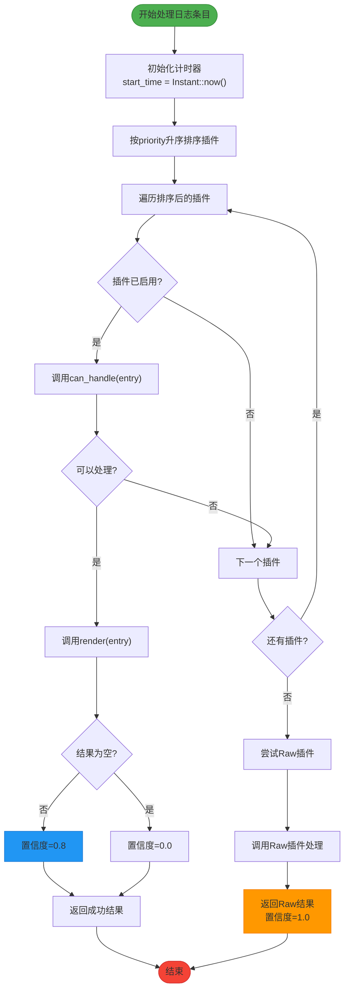

# 插件调度机制

<cite>
**Referenced Files in This Document**   
- [registry.rs](file://src-tauri/src/plugins/registry.rs)
- [trait_def.rs](file://src-tauri/src/plugins/trait_def.rs)
- [rendered_block.rs](file://src-tauri/src/models/rendered_block.rs)
- [parse_result.rs](file://src-tauri/src/models/parse_result.rs)
- [performance.rs](file://src-tauri/src/utils/performance.rs)
</cite>

## 目录
1. [插件调度算法](#插件调度算法)
2. [优先级排序机制](#优先级排序机制)
3. [插件匹配流程](#插件匹配流程)
4. [性能监控逻辑](#性能监控逻辑)
5. [置信度计算规则](#置信度计算规则)
6. [兜底策略分析](#兜底策略分析)
7. [整体流程图](#整体流程图)

## 插件调度算法

`process_entry`方法实现了核心的插件调度算法，负责根据日志条目内容自动选择最合适的插件进行处理。该算法通过优先级排序、能力检测和结果生成三个阶段完成调度决策，确保系统能够智能地处理各种类型的日志数据。

**Section sources**
- [registry.rs](file://src-tauri/src/plugins/registry.rs#L159-L196)

## 优先级排序机制

插件调度系统采用基于`priority`字段的升序排序策略，体现高优先级（数值小）插件优先匹配的设计原则。在`process_entry`方法中，首先通过`self.plugin_info.iter().collect()`获取所有插件信息，然后使用`sort_by_key`方法按`priority`字段进行升序排序。

这种设计确保了关键插件（如错误高亮插件，优先级为5）能够在普通插件之前被尝试匹配，从而实现对重要日志特征的优先处理。排序后的插件列表按照优先级从高到低（数值从小到大）的顺序进行遍历，保证了调度决策的确定性和可预测性。

**Section sources**
- [registry.rs](file://src-tauri/src/plugins/registry.rs#L162-L164)
- [trait_def.rs](file://src-tauri/src/plugins/trait_def.rs#L30-L34)

## 插件匹配流程

插件匹配流程通过`can_handle`谓词判断和`render`方法调用两个核心步骤实现。在遍历排序后的插件列表时，系统首先检查插件的启用状态，然后通过`can_handle`方法判断插件是否能够处理当前日志条目。

`can_handle`谓词的作用机制是让每个插件根据其专业领域知识判断是否适合处理特定的日志条目。例如，MyBatis插件会检查日志中是否包含SQL语句特征，JSON修复插件会验证内容是否为有效或可修复的JSON格式。一旦找到能够处理的插件，立即调用其`render`方法生成`RenderedBlock`序列，并返回处理结果，避免不必要的后续检查。

**Section sources**
- [registry.rs](file://src-tauri/src/plugins/registry.rs#L166-L178)
- [trait_def.rs](file://src-tauri/src/plugins/trait_def.rs#L5-L10)

## 性能监控逻辑

系统集成了精细的性能监控逻辑，使用`std::time::Instant`计时器对每个插件的处理耗时进行毫秒级统计。在`process_entry`方法开始时创建`start_time`计时器，当插件成功处理或完成所有尝试后，通过`start_time.elapsed().as_millis()`计算实际处理时间。

这种性能监控不仅为用户提供了处理效率的直观反馈，也为系统优化提供了数据支持。处理耗时作为`PluginResult`的一部分返回，可以用于插件性能评估、瓶颈分析和用户体验优化，确保系统在功能性和性能之间保持良好平衡。

**Section sources**
- [registry.rs](file://src-tauri/src/plugins/registry.rs#L160-L161)
- [performance.rs](file://src-tauri/src/utils/performance.rs#L1-L175)

## 置信度计算规则

置信度计算遵循明确的规则：成功处理且产生非空结果时置信度为0.8，产生空结果时置信度为0.0。这一规则在`process_entry`方法中通过条件判断实现：`let confidence = if blocks.is_empty() { 0.0 } else { 0.8 };`。

这种二元置信度模型简化了决策过程，同时提供了足够的信息区分有效处理和无效处理。高置信度（0.8）表示插件成功识别并处理了日志内容，低置信度（0.0）则表明虽然插件认为自己可以处理，但实际未能生成有意义的输出，可能需要进一步分析或采用其他处理策略。

**Section sources**
- [registry.rs](file://src-tauri/src/plugins/registry.rs#L176-L177)
- [trait_def.rs](file://src-tauri/src/plugins/trait_def.rs#L180-L188)

## 兜底策略分析

当所有注册插件都无法处理日志条目时，系统自动回退到Raw插件作为兜底策略。这一机制通过在主循环后添加专门的Raw插件处理分支实现：`if let Some(raw_plugin) = self.plugins.get("Raw")`。

Raw插件的优先级设置为1000，确保它在正常情况下最后被尝试。这种设计既保证了专业插件的优先处理权，又确保了系统不会因无法处理某些日志而失败。兜底策略显著提升了系统的鲁棒性，确保所有日志条目都能得到至少最基本的处理，维持了用户体验的连续性和系统的可靠性。

**Section sources**
- [registry.rs](file://src-tauri/src/plugins/registry.rs#L180-L190)
- [registry.rs](file://src-tauri/src/plugins/registry.rs#L29-L35)

## 整体流程图

**Diagram sources**
- [registry.rs](file://src-tauri/src/plugins/registry.rs#L159-L196)