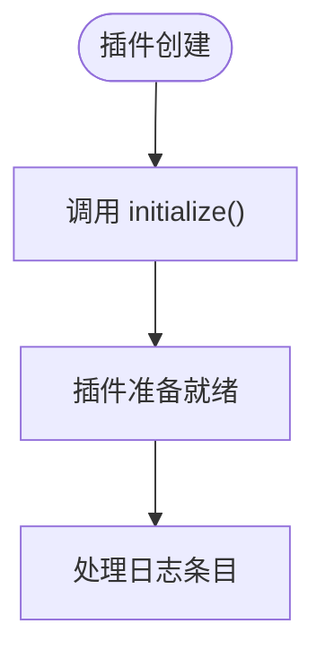
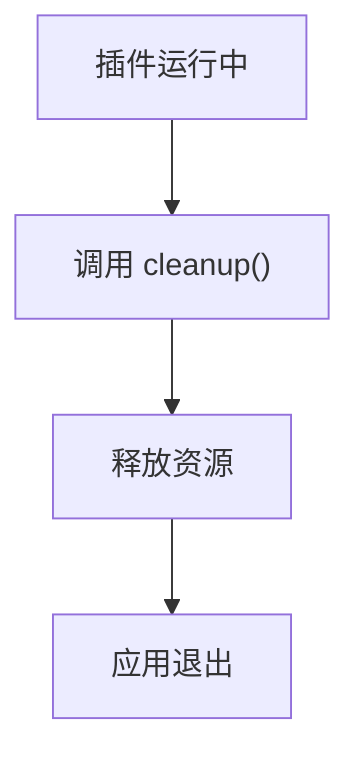
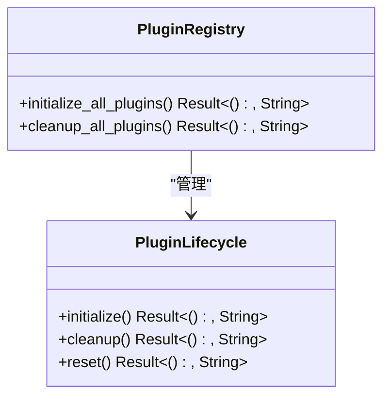

<cite>
**本文档中引用的文件**
- [trait_def.rs](file://src-tauri/src/plugins/trait_def.rs)
- [registry.rs](file://src-tauri/src/plugins/registry.rs)
- [mybatis.rs](file://src-tauri/src/plugins/mybatis.rs)
- [json_repair.rs](file://src-tauri/src/plugins/json_repair.rs)
- [error_highlighter.rs](file://src-tauri/src/plugins/error_highlighter.rs)
- [raw.rs](file://src-tauri/src/plugins/raw.rs)
</cite>

## 目录
1. [插件生命周期管理](#插件生命周期管理)
2. [核心生命周期方法](#核心生命周期方法)
3. [应用级生命周期管理](#应用级生命周期管理)
4. [热加载场景应用](#热加载场景应用)
5. [生命周期钩子使用模式](#生命周期钩子使用模式)

## 插件生命周期管理

插件系统通过 `PluginLifecycle` Trait 提供了标准化的生命周期管理机制，确保插件在不同阶段能够正确地进行资源管理和状态维护。该机制为插件开发者提供了清晰的生命周期回调接口，使插件能够在创建、运行和销毁等关键节点执行必要的操作。

`PluginLifecycle` Trait 定义了三个核心方法：`initialize`、`cleanup` 和 `reset`，分别对应插件的初始化、清理和重置阶段。这些方法的默认实现为空，允许插件根据实际需求选择性地重写。这种设计模式既保证了接口的统一性，又提供了足够的灵活性，使不同类型的插件可以根据自身特性实现特定的生命周期逻辑。

**Section sources**
- [trait_def.rs](file://src-tauri/src/plugins/trait_def.rs#L45-L61)

## 核心生命周期方法

### initialize 方法

`initialize` 方法在插件创建后被调用，主要用于执行资源准备和初始化操作。该方法在插件实例化后立即执行，是插件进行内部状态初始化、资源分配和依赖配置的关键时机。

在 `MyBatisRenderer` 插件中，`initialize` 方法用于重新编译正则表达式，确保插件在运行时能够正确识别 MyBatis 日志中的 SQL 语句和参数。同样，`JsonRepairRenderer` 和 `ErrorHighlighterRenderer` 插件也利用此方法初始化各自的正则表达式模式，为后续的日志解析工作做好准备。

**Diagram sources**
- [trait_def.rs](file://src-tauri/src/plugins/trait_def.rs#L48-L51)
- [mybatis.rs](file://src-tauri/src/plugins/mybatis.rs#L247-L254)

### cleanup 方法

`cleanup` 方法在应用退出前被调用，负责释放插件占用的资源。该方法是插件进行优雅关闭的关键环节，确保所有分配的资源都能被正确回收，避免内存泄漏和其他资源浪费问题。

`MyBatisRenderer` 插件在 `cleanup` 方法中清空了当前的 SQL 语句、参数列表和待处理的渲染块，将插件状态恢复到初始状态。其他插件虽然没有复杂的资源管理需求，但也实现了该方法以备将来扩展。

**Diagram sources**
- [trait_def.rs](file://src-tauri/src/plugins/trait_def.rs#L53-L56)
- [mybatis.rs](file://src-tauri/src/plugins/mybatis.rs#L256-L260)

### reset 方法

`reset` 方法用于将插件恢复到初始状态，清除所有运行时产生的数据和状态。虽然当前实现中该方法为空，但它为未来可能的状态管理需求提供了扩展点。

该方法特别适用于需要维护内部状态的插件，在需要重置插件状态时（如配置变更、用户请求等场景）可以调用此方法。默认的空实现表明，大多数插件不需要显式的重置逻辑，状态管理由其他机制处理。

**Section sources**
- [trait_def.rs](file://src-tauri/src/plugins/trait_def.rs#L58-L61)

## 应用级生命周期管理

### PluginRegistry 统一管理

`PluginRegistry` 作为插件系统的中枢，提供了 `initialize_all_plugins` 和 `cleanup_all_plugins` 方法，实现了对所有插件生命周期的统一管理。这种集中式管理方式确保了插件生命周期操作的一致性和可靠性。

`initialize_all_plugins` 方法遍历所有注册的插件，更新其状态为"已初始化"。虽然插件的初始化工作主要在创建时完成，但此方法提供了统一的状态管理接口。`cleanup_all_plugins` 方法则在应用退出前被调用，将所有插件的状态更新为"已停止"，完成优雅的资源清理。

**Diagram sources**
- [registry.rs](file://src-tauri/src/plugins/registry.rs#L208-L227)
- [trait_def.rs](file://src-tauri/src/plugins/trait_def.rs#L45-L61)

### 生命周期协调机制

应用通过 `PluginRegistry` 协调所有插件的生命周期，确保在系统启动和关闭时能够正确地初始化和清理所有插件。这种设计模式实现了关注点分离：插件负责自身的具体初始化和清理逻辑，而 `PluginRegistry` 负责协调和管理这些操作的执行时机。

在系统启动时，`PluginRegistry` 首先创建并注册所有默认插件，然后调用 `initialize_all_plugins` 方法完成初始化。在系统关闭时，`cleanup_all_plugins` 方法确保所有插件都能有机会执行清理操作，维护系统的稳定性和可靠性。

**Section sources**
- [registry.rs](file://src-tauri/src/plugins/registry.rs#L208-L227)

## 热加载场景应用

### 动态加载时的初始化

在热加载场景下，当动态加载新插件时，系统会自动调用插件的 `initialize` 方法。这一机制确保了新加载的插件能够正确地进行资源准备和状态初始化，立即进入可用状态。

例如，当用户通过插件市场安装新的日志解析插件时，系统会实例化插件对象并立即调用其 `initialize` 方法，完成必要的初始化工作。这种设计使得插件能够在不重启应用的情况下被动态加载和使用。

### 卸载前的资源清理

在卸载插件前，系统会调用其 `cleanup` 方法，确保插件能够释放所有占用的资源。这对于维护应用的稳定性和性能至关重要，特别是在频繁加载和卸载插件的场景下。

热加载机制与生命周期管理的结合，使得插件系统能够支持灵活的插件管理策略。开发者可以利用这些生命周期钩子实现复杂的资源管理逻辑，如缓存清理、连接关闭、文件句柄释放等。

**Section sources**
- [trait_def.rs](file://src-tauri/src/plugins/trait_def.rs#L45-L61)
- [registry.rs](file://src-tauri/src/plugins/registry.rs#L208-L227)

## 生命周期钩子使用模式

### 默认空实现的优势

`PluginLifecycle` Trait 的三个方法都提供了默认的空实现，这一设计具有多重优势。首先，它降低了插件开发的门槛，新插件无需实现所有生命周期方法即可正常工作。其次，它提供了良好的向后兼容性，新增的生命周期方法不会破坏现有插件。

这种"按需重写"的模式鼓励插件开发者只在确实需要时才实现特定的生命周期方法，避免了不必要的代码复杂性。同时，它也为未来的扩展留下了空间，可以在不破坏现有接口的情况下添加新的生命周期阶段。

### 实际使用示例

从现有插件的实现可以看出，`initialize` 方法主要用于资源初始化，如正则表达式的编译；`cleanup` 方法则用于状态清理和资源释放。`reset` 方法虽然目前未被使用，但为未来可能的状态管理需求提供了扩展点。

这种生命周期管理机制不仅适用于当前的日志解析插件，也为未来可能引入的更复杂插件（如网络连接插件、数据库插件等）提供了坚实的基础。通过统一的生命周期接口，不同类型的插件可以以一致的方式管理其资源和状态。

**Section sources**
- [mybatis.rs](file://src-tauri/src/plugins/mybatis.rs#L247-L260)
- [json_repair.rs](file://src-tauri/src/plugins/json_repair.rs#L208-L214)
- [error_highlighter.rs](file://src-tauri/src/plugins/error_highlighter.rs#L154-L168)