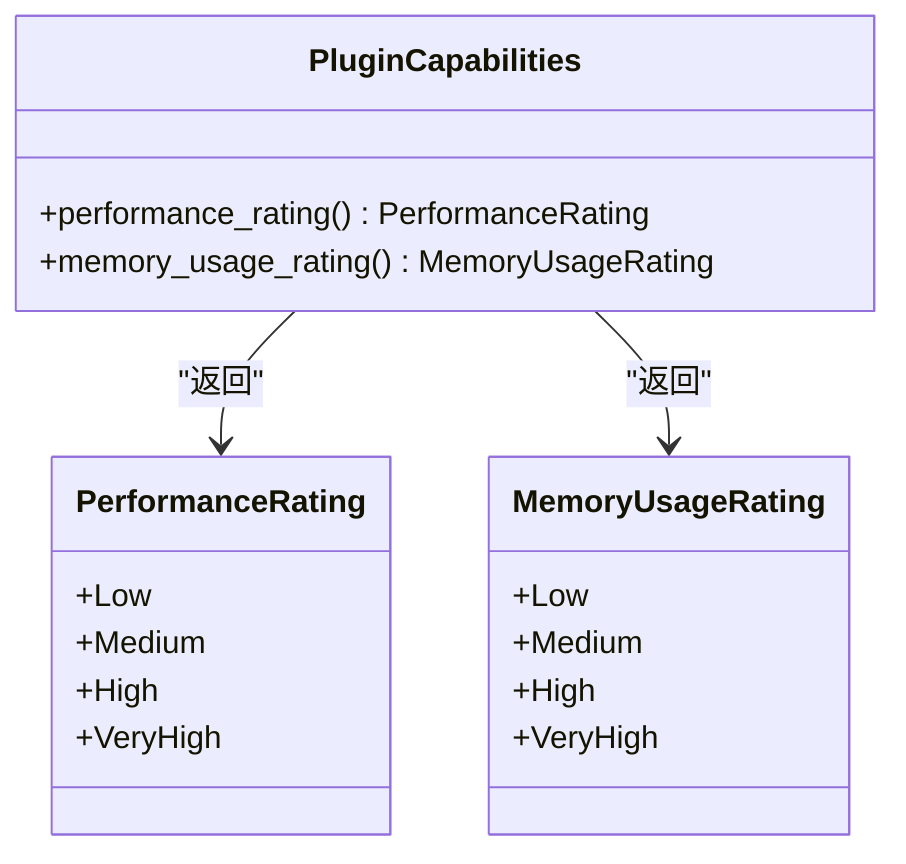
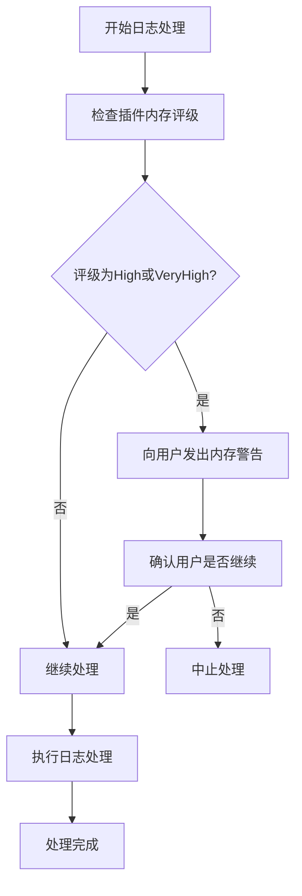
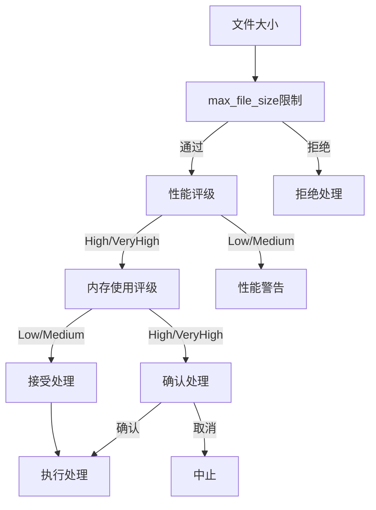
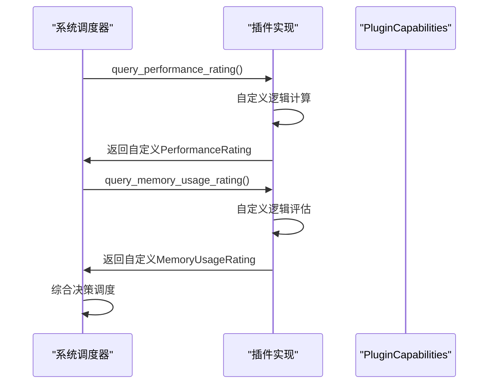

# 性能与内存评级

<cite>
**Referenced Files in This Document**  
- [trait_def.rs](file://src-tauri/src/plugins/trait_def.rs)
- [performance.rs](file://src-tauri/src/utils/performance.rs)
</cite>

## 目录
1. [引言](#引言)
2. [核心枚举设计](#核心枚举设计)
3. [性能评级系统](#性能评级系统)
4. [内存使用评级系统](#内存使用评级系统)
5. [值语义与派生trait](#值语义与派生trait)
6. [资源约束协同机制](#资源约束协同机制)
7. [插件自定义评级](#插件自定义评级)
8. [系统调度影响](#系统调度影响)

## 引言
本文档系统阐述`PerformanceRating`和`MemoryUsageRating`两个枚举类型在日志分析系统中的设计目的与实际应用。这两个评级系统构成了插件资源特征的核心描述框架，为异步任务调度、用户提示和资源分配提供了关键决策依据。

## 核心枚举设计
`PerformanceRating`和`MemoryUsageRating`是定义在插件系统核心模块中的两个枚举类型，它们共同构成了插件资源消耗特征的标准化描述体系。

**Diagram sources**
- [trait_def.rs](file://src-tauri/src/plugins/trait_def.rs#L86-L93)
- [trait_def.rs](file://src-tauri/src/plugins/trait_def.rs#L95-L102)

**Section sources**
- [trait_def.rs](file://src-tauri/src/plugins/trait_def.rs#L86-L102)

## 性能评级系统

### 评级等级与量化标准
`PerformanceRating`枚举定义了四个处理速度等级：`Low`（低）、`Medium`（中）、`High`（高）和`VeryHigh`（非常高）。这些等级量化了插件的处理速度特征，为系统调度提供了明确的性能指标。

### 决策作用机制
性能评级在系统中发挥着关键的决策作用：
- **异步任务调度**：高评级插件被优先调度，确保关键处理任务的及时完成
- **用户提示**：根据插件性能向用户提供处理时间预估，提升用户体验
- **资源分配**：高性能插件可获得更多的CPU时间片和优先级

该评级系统与`PluginCapabilities` trait中的`performance_rating`方法协同工作，为每个插件提供标准化的性能描述接口。

**Section sources**
- [trait_def.rs](file://src-tauri/src/plugins/trait_def.rs#L86-L93)
- [trait_def.rs](file://src-tauri/src/plugins/trait_def.rs#L105-L108)

## 内存使用评级系统

### 评级等级与量化标准
`MemoryUsageRating`枚举同样定义了四个内存占用等级：`Low`（低）、`Medium`（中）、`High`（高）和`VeryHigh`（非常高）。这些等级反映了插件在处理日志数据时的内存消耗水平。

### 资源预估价值
在处理大文件日志时，内存使用评级具有重要的资源预估价值：
- **内存规划**：系统可根据评级预估处理特定日志文件所需的内存资源
- **风险预警**：高内存评级插件在处理大文件时会触发内存不足预警
- **资源优化**：系统可基于评级动态调整内存分配策略

**Diagram sources**
- [trait_def.rs](file://src-tauri/src/plugins/trait_def.rs#L95-L102)

**Section sources**
- [trait_def.rs](file://src-tauri/src/plugins/trait_def.rs#L95-L102)
- [trait_def.rs](file://src-tauri/src/plugins/trait_def.rs#L109-L112)

## 值语义与派生trait
`PerformanceRating`和`MemoryUsageRating`通过派生`Clone`、`Copy`、`PartialEq`、`Eq`等trait，实现了高效的值语义设计。

### 值语义优势
- **`Clone`和`Copy`**：枚举值可以被高效复制，避免了堆分配和引用计数的开销
- **`PartialEq`和`Eq`**：支持枚举值的直接比较，简化了评级比较逻辑
- **栈存储**：所有枚举实例都存储在栈上，提高了访问速度和内存局部性

这种设计确保了评级信息在系统各组件间传递时的高效性和一致性，同时避免了引用生命周期管理的复杂性。

**Section sources**
- [trait_def.rs](file://src-tauri/src/plugins/trait_def.rs#L86-L87)
- [trait_def.rs](file://src-tauri/src/plugins/trait_def.rs#L95-L96)

## 资源约束协同机制
性能评级和内存使用评级与`max_file_size`限制共同构成了完整的资源约束体系。

### 协同工作流程
1. **初步筛选**：系统首先根据`max_file_size`限制筛选可处理的插件
2. **资源评估**：对通过筛选的插件，评估其性能和内存评级
3. **综合决策**：结合文件大小、处理速度和内存消耗，做出最优调度决策

这种多层次的约束机制确保了系统在处理各种规模日志文件时的稳定性和效率。

**Diagram sources**
- [trait_def.rs](file://src-tauri/src/plugins/trait_def.rs#L103-L112)

**Section sources**
- [trait_def.rs](file://src-tauri/src/plugins/trait_def.rs#L103-L112)

## 插件自定义评级
插件实现者可以通过重写`performance_rating`和`memory_usage_rating`方法来提供自定义评级。

### 自定义实现

**Diagram sources**
- [trait_def.rs](file://src-tauri/src/plugins/trait_def.rs#L105-L112)

**Section sources**
- [trait_def.rs](file://src-tauri/src/plugins/trait_def.rs#L105-L112)

## 系统调度影响
评级不准确可能对系统调度产生严重影响：

### 潜在问题
- **性能低估**：实际性能低于评级可能导致系统响应延迟和用户体验下降
- **内存高估**：实际内存消耗高于评级可能引发内存溢出和系统崩溃
- **资源浪费**：性能高估可能导致系统为低效插件分配过多资源

### 风险缓解
系统应建立评级验证机制，通过实际运行时监控来校准插件评级，确保评级的准确性和可靠性。

**Section sources**
- [trait_def.rs](file://src-tauri/src/plugins/trait_def.rs#L105-L112)