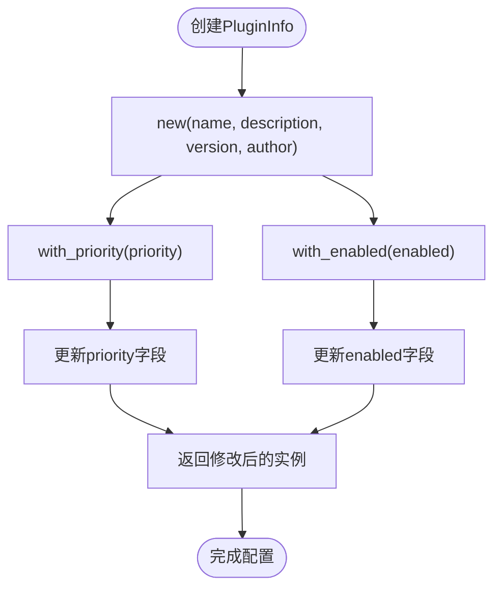
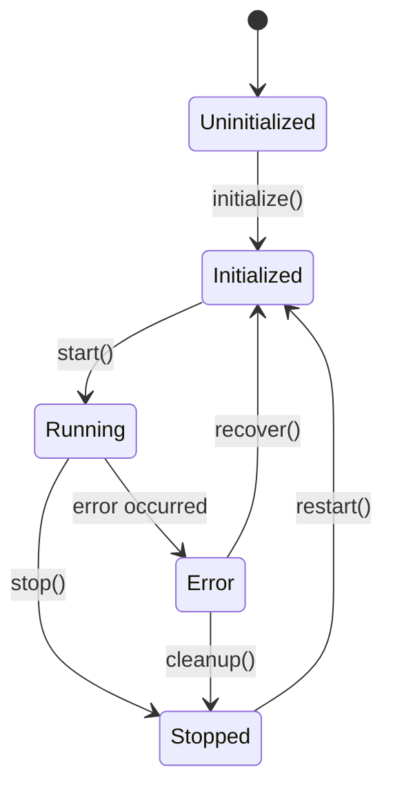

# 插件元数据结构

<cite>
**Referenced Files in This Document**  
- [trait_def.rs](file://src-tauri/src/plugins/trait_def.rs#L104-L222)
</cite>

## 目录
1. [简介](#简介)
2. [核心字段解析](#核心字段解析)
3. [构造与构建器模式](#构造与构建器模式)
4. [优先级机制](#优先级机制)
5. [启用状态管理](#启用状态管理)
6. [状态机与生命周期](#状态机与生命周期)
7. [可用性判断逻辑](#可用性判断逻辑)

## 简介
`PluginInfo` 结构体是插件管理系统中的核心元数据载体，负责存储和管理插件的标识信息、运行状态和配置参数。该结构体定义了插件在系统中的基本属性，包括名称、描述、版本、作者等基本信息，以及优先级、启用状态和运行状态等控制属性。通过这一统一的数据结构，系统能够有效地识别、调度和管理各类插件，确保日志解析流程的有序执行。

**Section sources**
- [trait_def.rs](file://src-tauri/src/plugins/trait_def.rs#L119-L136)

## 核心字段解析
`PluginInfo` 结构体由多个字段组成，共同构成了插件的完整元数据信息。其中，`name`、`description`、`version` 和 `author` 四个字段构成了插件的基本标识体系：

- **name**: 插件的唯一名称，用于在系统中区分不同插件
- **description**: 插件的功能描述，提供用户可读的说明信息
- **version**: 插件的版本号，遵循语义化版本规范
- **author**: 插件的开发者或维护者信息

这些字段在插件注册和展示时起着关键作用，为用户提供必要的识别信息，同时也为系统内部的插件管理和依赖解析提供基础数据支持。

**Section sources**
- [trait_def.rs](file://src-tauri/src/plugins/trait_def.rs#L119-L136)

## 构造与构建器模式
`PluginInfo` 提供了 `new()` 构造函数用于创建插件信息实例，该函数接收名称、描述、版本和作者四个必填参数，并将状态初始化为 `Uninitialized`，优先级设为默认值100，启用状态设为 `true`。

此外，结构体实现了流畅的构建器模式（Fluent Builder Pattern），通过 `with_priority` 和 `with_enabled` 等方法支持链式调用，允许在创建实例后便捷地配置各项属性。这种设计模式提高了代码的可读性和易用性，使插件配置过程更加直观和灵活。

**Diagram sources**
- [trait_def.rs](file://src-tauri/src/plugins/trait_def.rs#L140-L156)

**Section sources**
- [trait_def.rs](file://src-tauri/src/plugins/trait_def.rs#L140-L156)

## 优先级机制
`priority` 字段是一个 `u32` 类型的数值，用于控制插件在解析链中的执行顺序。系统遵循"数值越小优先级越高"的原则进行插件调度，这意味着优先级值为1的插件会比优先级值为100的插件更早执行。

这一机制允许系统根据插件的重要性和处理需求进行精细化的调度控制。例如，基础解析插件可以设置较低的优先级值以确保首先执行，而特定格式处理插件则可以根据需要设置相应的优先级，从而构建出合理的解析流水线。

**Section sources**
- [trait_def.rs](file://src-tauri/src/plugins/trait_def.rs#L133)

## 启用状态管理
`enabled` 布尔字段用于控制插件的启用状态，直接影响插件是否参与日志解析流程。该字段与 `set_enabled` 方法形成联动机制，允许通过编程方式动态开启或关闭插件功能。

当 `enabled` 为 `true` 时，插件处于激活状态，可以正常参与日志处理；当为 `false` 时，插件被禁用，系统将跳过该插件的执行。这种灵活的控制机制使得用户可以根据实际需求动态调整插件组合，优化系统性能和资源利用。

**Section sources**
- [trait_def.rs](file://src-tauri/src/plugins/trait_def.rs#L135)
- [trait_def.rs](file://src-tauri/src/plugins/trait_def.rs#L152-L156)

## 状态机与生命周期
`status` 字段采用 `PluginStatus` 枚举类型，定义了插件的五种状态：`Uninitialized`（未初始化）、`Initialized`（已初始化）、`Running`（运行中）、`Stopped`（已停止）和 `Error`（错误状态）。这些状态构成了插件的完整生命周期模型。

状态转换遵循严格的规则：插件从 `Uninitialized` 开始，经过初始化进入 `Initialized` 状态，在执行时变为 `Running`，执行完成后转为 `Stopped`。当发生错误时，无论当前处于何种状态，都会转换为 `Error` 状态。这种状态机设计确保了插件生命周期的可控性和可预测性，为系统稳定运行提供了保障。

**Diagram sources**
- [trait_def.rs](file://src-tauri/src/plugins/trait_def.rs#L104-L117)
- [trait_def.rs](file://src-tauri/src/plugins/trait_def.rs#L160-L164)

**Section sources**
- [trait_def.rs](file://src-tauri/src/plugins/trait_def.rs#L104-L117)
- [trait_def.rs](file://src-tauri/src/plugins/trait_def.rs#L160-L164)

## 可用性判断逻辑
`is_available` 方法用于综合判断插件的可用性，其逻辑基于两个关键条件：`enabled` 状态和 `Error` 状态。只有当插件处于启用状态（`enabled == true`）且不处于错误状态时，方法才返回 `true`。

这一判断机制为前端界面提供了可靠的插件状态展示依据。系统可以通过调用此方法快速筛选出可用的插件列表，避免将已禁用或出错的插件呈现给用户，从而提升用户体验和系统可靠性。同时，该方法也为插件调度器提供了决策支持，确保只有健康的插件才能参与日志解析流程。

**Section sources**
- [trait_def.rs](file://src-tauri/src/plugins/trait_def.rs#L166-L170)