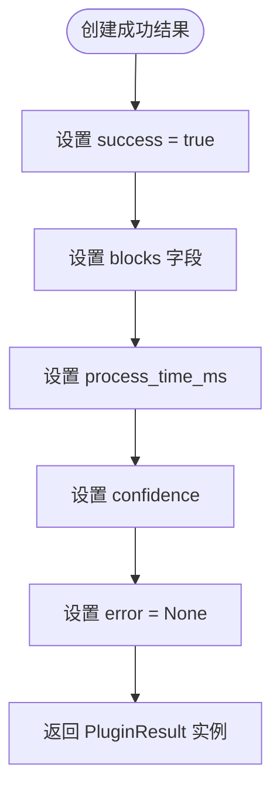
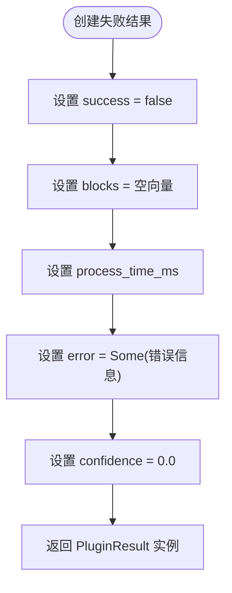
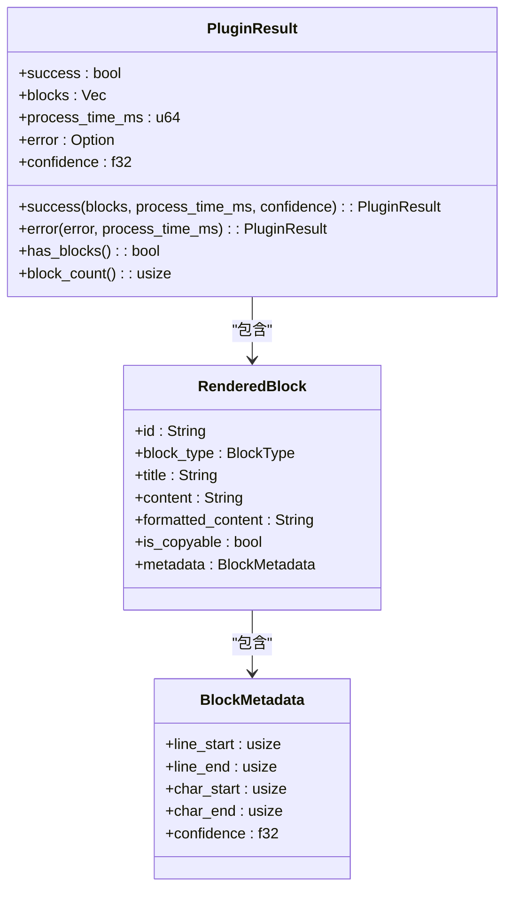
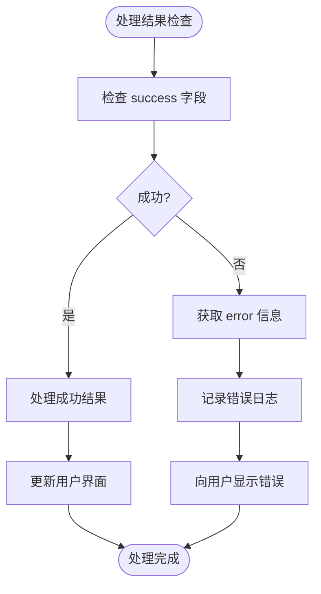

# 插件结果模型

<cite>
**本文档引用的文件**   
- [plugin_result.rs](file://src-tauri\src\plugins\trait_def.rs#L175-L222)
- [rendered_block.rs](file://src-tauri\src\models\rendered_block.rs#L2-L19)
- [registry.rs](file://src-tauri\src\plugins\registry.rs#L160-L241)
</cite>

## 目录
1. [简介](#简介)
2. [核心字段设计](#核心字段设计)
3. [结果构造方法](#结果构造方法)
4. [辅助查询方法](#辅助查询方法)
5. [实际应用流程](#实际应用流程)
6. [多插件竞争机制](#多插件竞争机制)
7. [性能监控与用户反馈](#性能监控与用户反馈)
8. [错误处理机制](#错误处理机制)
9. [总结](#总结)

## 简介
`PluginResult` 结构体是日志解析系统中插件处理结果的核心数据模型，用于封装插件对日志条目的处理状态、渲染内容、性能指标和置信度等关键信息。该结构体在插件与主系统之间建立了标准化的通信接口，确保了不同插件输出结果的一致性和可预测性。

**插件结果模型** 作为系统架构中的关键组件，不仅承载了处理成败状态，还通过丰富的元数据支持双栏界面展示、性能监控和多插件竞争决策等多种功能。

## 核心字段设计

### 成功状态字段（success）
`success` 字段是一个布尔类型，用于表示插件处理日志条目的成败状态。当插件成功识别并解析日志内容时，该字段被设置为 `true`；当处理失败或无法处理时，设置为 `false`。这一字段与错误处理机制紧密关联，为上层系统提供了快速判断处理结果的依据。

### 渲染块字段（blocks）
`blocks` 字段是一个 `RenderedBlock` 向量，用于承载最终的渲染内容。每个 `RenderedBlock` 对象包含块的唯一标识、类型、标题、内容、格式化内容、可复制性以及元数据等信息。这些渲染块直接支撑了系统的双栏界面展示，左侧显示原始日志，右侧展示结构化解析结果。

### 处理耗时字段（process_time_ms）
`process_time_ms` 字段是一个 `u64` 类型的无符号整数，用于记录插件处理单个日志条目所消耗的时间（以毫秒为单位）。该字段为性能监控提供了精确的数据支持，同时可用于向用户反馈处理速度，提升用户体验。

### 错误信息字段（error）
`error` 字段采用 `Option<String>` 类型设计，优雅地表达了可选的错误信息。当处理成功时，该字段为 `None`；当处理失败时，包含具体的错误描述字符串。这种设计避免了空指针异常，同时保持了内存效率。

### 置信度字段（confidence）
`confidence` 字段是一个 `f32` 类型的浮点数，表示插件对解析结果的置信度评分，取值范围为 0.0~1.0。该字段在多插件竞争场景下作为选择最优结果的关键依据，高置信度的结果将优先被采用。

**Section sources**
- [trait_def.rs](file://src-tauri\src\plugins\trait_def.rs#L175-L188)

## 结果构造方法

### 成功结果构造（success）
`success()` 静态方法用于创建表示成功处理的结果对象。该方法接收渲染块列表、处理耗时和置信度作为参数，初始化一个 `PluginResult` 实例，并将 `success` 字段设为 `true`，`error` 字段设为 `None`。



**Diagram sources**
- [trait_def.rs](file://src-tauri\src\plugins\trait_def.rs#L190-L198)

### 失败结果构造（error）
`error()` 静态方法用于创建表示失败处理的结果对象。该方法接收错误信息字符串和处理耗时作为参数，初始化一个 `PluginResult` 实例，并将 `success` 字段设为 `false`，`blocks` 字段设为空向量，`confidence` 字段设为 0.0。



**Diagram sources**
- [trait_def.rs](file://src-tauri\src\plugins\trait_def.rs#L199-L207)

## 辅助查询方法

### 块数量查询（block_count）
`block_count()` 方法返回当前结果中包含的渲染块数量。该方法通过调用底层向量的 `len()` 方法实现，为统计分析和界面展示提供了便利。

### 块存在性检查（has_blocks）
`has_blocks()` 方法检查结果中是否包含任何渲染块，返回一个布尔值。该方法通过检查 `blocks` 向量是否为空来实现，常用于快速判断处理结果的有效性。



**Diagram sources**
- [trait_def.rs](file://src-tauri\src\plugins\trait_def.rs#L175-L222)
- [rendered_block.rs](file://src-tauri\src\models\rendered_block.rs#L2-L19)

**Section sources**
- [trait_def.rs](file://src-tauri\src\plugins\trait_def.rs#L208-L222)

## 实际应用流程
在实际应用中，`PluginResult` 被广泛用于插件注册中心的处理流程。当系统需要处理日志条目时，会调用 `process_entry()` 或 `process_entry_with_plugin()` 方法，这些方法最终返回 `PluginResult` 对象。处理流程包括：启动计时器、调用插件的 `can_handle()` 和 `render()` 方法、计算置信度、构造结果对象等步骤。

```mermaid
sequenceDiagram
participant Registry as 插件注册中心
participant Plugin as 插件实例
participant Result as PluginResult
Registry->>Registry : 开始处理日志条目
Registry->>Registry : 记录开始时间
loop 遍历已启用插件
Registry->>Plugin : 调用 can_handle()
alt 可以处理
Plugin-->>Registry : 返回 true
Registry->>Plugin : 调用 render()
Plugin-->>Registry : 返回渲染块
Registry->>Result : 调用 success() 构造结果
break 返回结果
else 无法处理
Plugin-->>Registry : 返回 false
end
end
alt 无插件可处理
Registry->>Result : 调用 error() 构造失败结果
end
Registry-->>调用者 : 返回 PluginResult
```

**Diagram sources**
- [registry.rs](file://src-tauri\src\plugins\registry.rs#L160-L241)

## 多插件竞争机制
在多插件竞争场景下，系统会根据插件的优先级和置信度来选择最优结果。`PluginResult` 的 `confidence` 字段在此机制中扮演关键角色。系统首先按优先级排序插件，然后依次尝试处理，成功处理的插件返回的结果置信度通常较高。对于特殊插件如原始文本插件，即使成功处理，其置信度也相对较低。

## 性能监控与用户反馈
`process_time_ms` 字段为性能监控提供了精确的数据支持。系统可以收集所有处理结果的耗时数据，计算平均处理时间、最大处理时间等统计指标。这些数据可用于：
- 识别性能瓶颈插件
- 优化插件执行顺序
- 向用户展示处理进度和速度
- 实现超时控制和资源管理

## 错误处理机制
`PluginResult` 的错误处理机制通过 `success` 和 `error` 字段协同工作。当处理失败时，`success` 为 `false`，`error` 包含具体错误信息；当处理成功时，`success` 为 `true`，`error` 为 `None`。这种设计模式使得调用者可以安全地检查处理结果，无需担心空指针异常。



**Diagram sources**
- [trait_def.rs](file://src-tauri\src\plugins\trait_def.rs#L175-L222)

## 总结
`PluginResult` 结构体作为插件系统的核心数据模型，通过精心设计的字段和方法，实现了处理状态表示、结果承载、性能监控、错误处理和置信度评估等多种功能。其设计体现了 Rust 语言的安全性、性能和表达力优势，为日志解析系统的稳定运行和功能扩展提供了坚实基础。