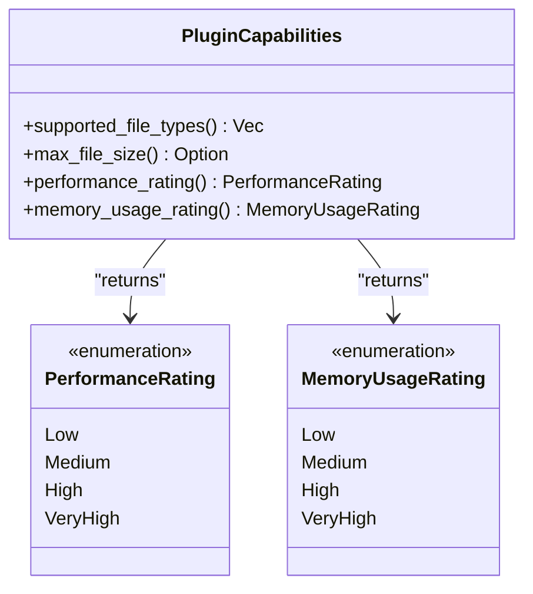
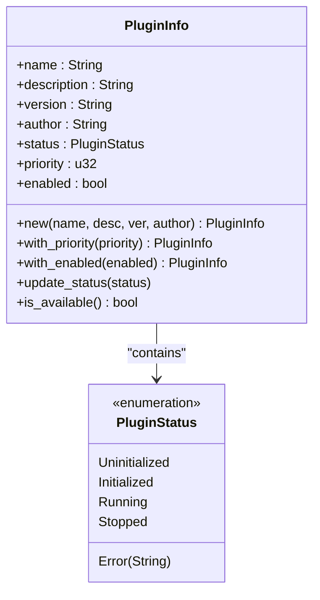
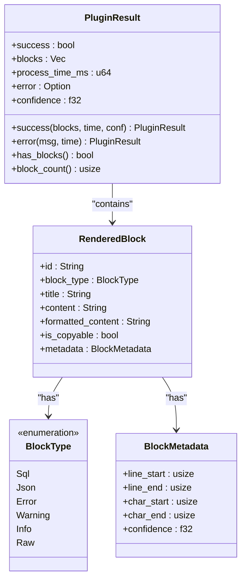

# 插件能力与元数据

<cite>
**Referenced Files in This Document**  
- [trait_def.rs](file://src-tauri/src/plugins/trait_def.rs)
- [registry.rs](file://src-tauri/src/plugins/registry.rs)
- [rendered_block.rs](file://src-tauri/src/models/rendered_block.rs)
</cite>

## 目录
1. [插件能力接口](#插件能力接口)
2. [性能与资源评级系统](#性能与资源评级系统)
3. [插件信息结构体](#插件信息结构体)
4. [插件结果结构体](#插件结果结构体)
5. [插件注册中心实现](#插件注册中心实现)

## 插件能力接口

`PluginCapabilities` 特性（Trait）定义了插件系统中各插件应具备的核心能力接口，为日志解析插件提供标准化的能力声明机制。该接口通过一系列方法明确插件的功能边界与系统资源需求。

`supported_file_types` 方法用于声明插件支持处理的文件类型，返回一个字符串向量，包含如 `.log`、`.txt` 等文件扩展名。默认实现返回 `["*"]`，表示支持所有文件类型，子类可重写此方法以限定特定支持范围。

`max_file_size` 方法定义了插件可处理的最大文件大小限制，返回 `Option<usize>` 类型。`None` 表示无限制，而具体数值则以字节为单位设定上限，用于防止大文件导致内存溢出或性能下降。

**Section sources**
- [trait_def.rs](file://src-tauri/src/plugins/trait_def.rs#L63-L84)

## 性能与资源评级系统

系统通过两个枚举类型对插件的性能特征进行量化评估，辅助调度决策。

`PerformanceRating` 枚举表示插件的处理速度评级，包含 `Low`、`Medium`、`High` 和 `VeryHigh` 四个等级。该评级影响插件在处理流水线中的优先级排序，高性能插件将被优先尝试。

`MemoryUsageRating` 枚举表示插件的内存使用量评级，同样包含 `Low`、`Medium`、`High` 和 `VeryHigh` 四个等级。低内存使用评级的插件更适合在资源受限环境中运行。

这两个评级方法作为 `PluginCapabilities` 接口的一部分，允许系统根据当前资源状况动态选择最合适的插件组合。



**Diagram sources**
- [trait_def.rs](file://src-tauri/src/plugins/trait_def.rs#L86-L102)

## 插件信息结构体

`PluginInfo` 结构体封装了插件的完整元数据信息，是插件在系统中的核心描述对象。

其字段包括：
- **name**: 插件名称，用于唯一标识
- **description**: 插件功能描述
- **version**: 版本号，遵循语义化版本规范
- **author**: 开发者或团队信息
- **status**: 当前运行状态，使用 `PluginStatus` 枚举表示
- **priority**: 调度优先级数值，越小优先级越高
- **enabled**: 启用状态标志，控制插件是否参与处理

`PluginStatus` 枚举定义了插件的生命周期状态，包括 `Uninitialized`（未初始化）、`Initialized`（已初始化）、`Running`（运行中）、`Stopped`（已停止）和 `Error(String)`（错误状态，附带错误信息）。

该结构体提供了 `new` 构造方法及 `with_priority`、`with_enabled` 等链式调用方法，便于创建和配置插件信息实例。



**Diagram sources**
- [trait_def.rs](file://src-tauri/src/plugins/trait_def.rs#L104-L136)

## 插件结果结构体

`PluginResult` 结构体用于封装插件处理日志条目后的输出结果，提供统一的结果表示格式。

其核心字段包括：
- **success**: 布尔标志，指示处理是否成功
- **blocks**: `RenderedBlock` 对象向量，包含渲染后的内容块
- **process_time_ms**: 处理耗时（毫秒），用于性能监控
- **error**: 可选的错误信息字符串
- **confidence**: 置信度评分（0.0-1.0），表示结果可靠性

系统提供了 `success` 和 `error` 两个静态构造方法，简化成功与失败结果的创建。`has_blocks` 和 `block_count` 方法便于快速检查结果内容。

`RenderedBlock` 结构体进一步定义了渲染内容的详细信息，包括块类型（`BlockType`）、标题、原始与格式化内容、可复制性标志及包含位置信息的元数据（`BlockMetadata`）。



**Diagram sources**
- [trait_def.rs](file://src-tauri/src/plugins/trait_def.rs#L175-L188)
- [rendered_block.rs](file://src-tauri/src/models/rendered_block.rs#L2-L19)

## 插件注册中心实现

`PluginRegistry` 结构体实现了插件的集中管理与调度逻辑，是插件系统的核心协调组件。

注册中心维护两个哈希映射：`plugins` 存储插件实例（`Arc<RwLock<dyn LogRenderer>>`），`plugin_info` 存储对应的 `PluginInfo` 元数据。系统在初始化时自动注册默认插件集，包括 MyBatis、JSON 修复、错误高亮和原始文本渲染器。

关键功能包括：
- **插件注册与查询**：通过 `register_plugin`、`get_plugin` 等方法管理插件生命周期
- **启用状态控制**：`enable_plugin` 和 `disable_plugin` 方法动态控制插件可用性
- **优先级调度**：`process_entry` 方法按优先级顺序尝试启用的插件，选择首个能处理当前日志条目的插件
- **结果封装**：测量处理时间并生成包含性能指标的 `PluginResult`

当没有插件能处理条目时，系统自动降级使用原始文本插件，确保基本的可读性。注册中心通过读写锁保证多线程环境下的安全访问。

```mermaid
sequenceDiagram
participant Client as "处理请求"
participant Registry as "PluginRegistry"
participant Plugin as "LogRenderer Plugin"
Client->>Registry : process_entry(entry)
Registry->>Registry : start_time = now()
Registry->>Registry : sort plugins by priority
loop 按优先级遍历插件
Registry->>Registry : get next plugin
alt 插件已启用
Registry->>Plugin : can_handle(entry)
alt 可处理
Plugin-->>Registry : true
Registry->>Plugin : render(entry)
Plugin-->>Registry : blocks
Registry->>Registry : create success result
Registry-->>Client : PluginResult
break 处理完成
else 不可处理
Plugin-->>Registry : false
end
end
end
alt 无插件可处理
Registry->>Registry : use Raw plugin
Registry-->>Client : fallback result
end
```

**Diagram sources**
- [registry.rs](file://src-tauri/src/plugins/registry.rs#L5-L242)