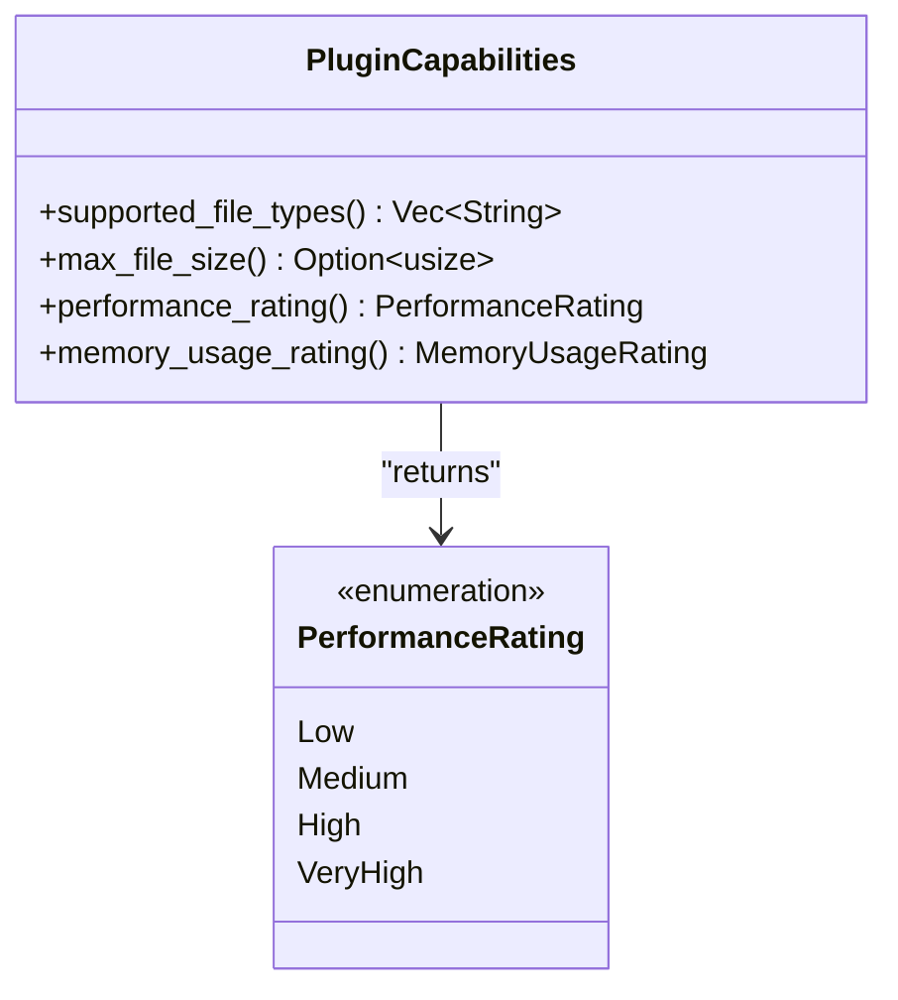
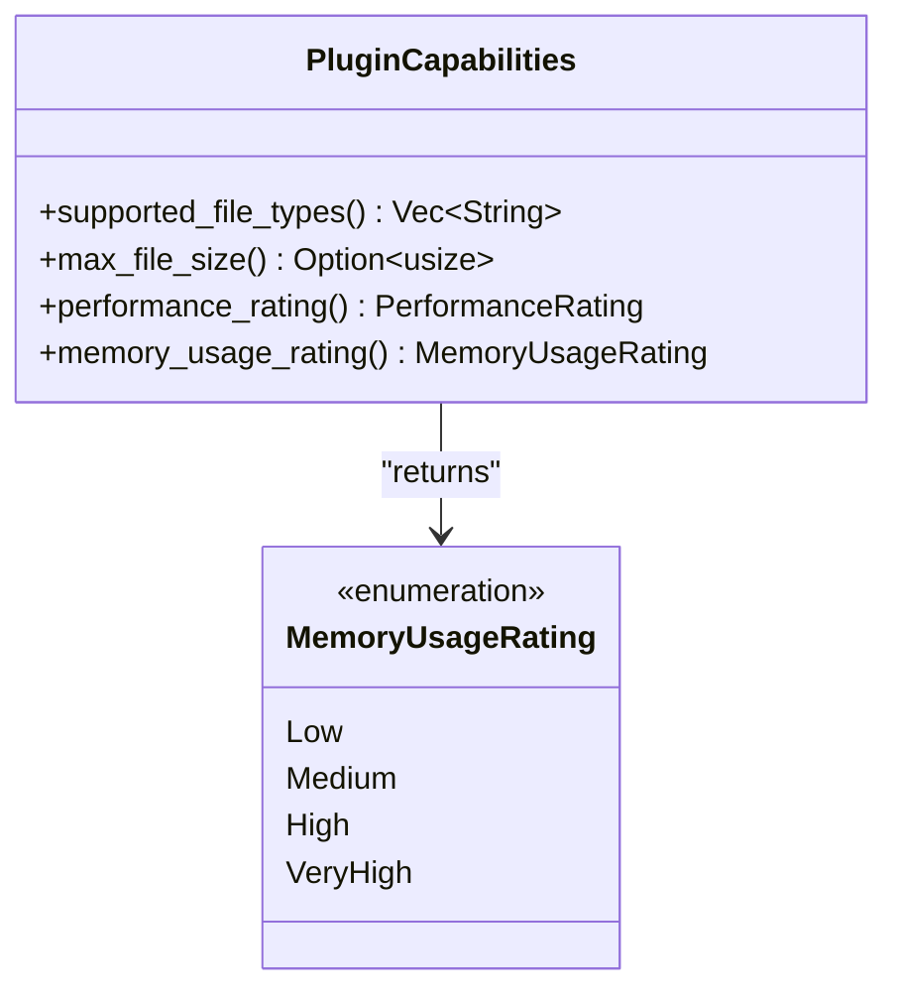
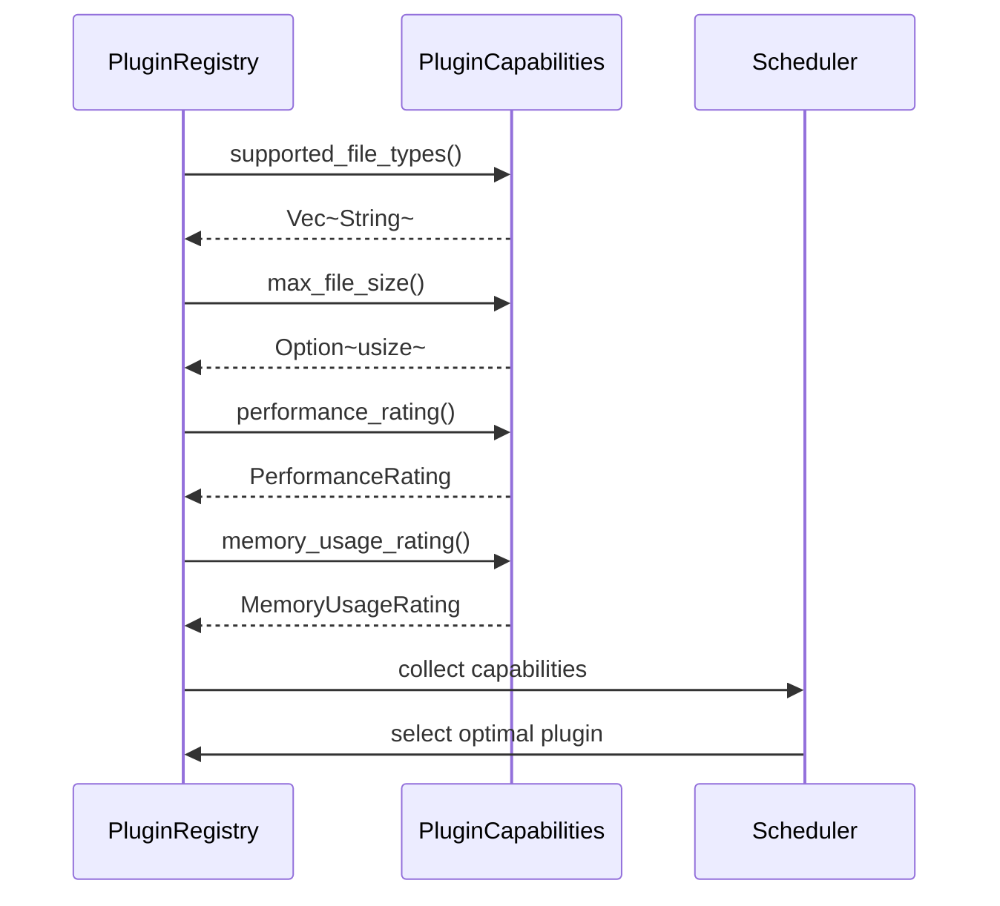

<cite>
**Referenced Files in This Document**   
- [trait_def.rs](file://src-tauri/src/plugins/trait_def.rs)
- [registry.rs](file://src-tauri/src/plugins/registry.rs)
- [performance.rs](file://src-tauri/src/utils/performance.rs)
- [renderer.rs](file://src-tauri/src/parser/renderer.rs)
</cite>

# 插件能力接口

## Table of Contents
1. [插件能力接口概述](#插件能力接口概述)
2. [文件类型支持机制](#文件类型支持机制)
3. [文件大小限制策略](#文件大小限制策略)
4. [性能评级系统](#性能评级系统)
5. [内存使用评级](#内存使用评级)
6. [能力契约的调度应用](#能力契约的调度应用)

## 插件能力接口概述

`PluginCapabilities` Trait作为插件系统的核心能力契约，定义了插件在文件处理能力、性能特征和资源消耗方面的标准化接口。该Trait通过四个核心方法为插件注册器提供决策依据，实现了插件能力的可量化评估和智能调度。作为系统架构的关键抽象层，`PluginCapabilities`不仅规范了插件的能力声明方式，还为资源敏感环境下的优化调度提供了数据基础。

**Section sources**
- [trait_def.rs](file://src-tauri/src/plugins/trait_def.rs#L63-L84)

## 文件类型支持机制

`supported_file_types`方法通过返回`Vec<String>`类型声明插件支持的文件扩展名，构成了插件与文件类型之间的匹配桥梁。该方法的默认实现返回包含通配符`"*"`的向量，表明插件默认支持所有文件类型。具体实现中，插件可通过重写此方法返回特定扩展名数组，如`[".log", ".txt", ".out"]`，从而精确声明其处理范围。这种设计既保证了新插件的即插即用性，又允许专业插件进行精细化的能力声明，为插件注册器的智能选择提供了基础数据。

**Section sources**
- [trait_def.rs](file://src-tauri/src/plugins/trait_def.rs#L66-L68)

## 文件大小限制策略

`max_file_size`方法通过返回`Option<usize>`类型定义插件可处理的最大文件字节数限制，体现了灵活的资源管理策略。当方法返回`None`时，表示插件对文件大小无限制，可处理任意大小的文件；当返回`Some(size)`时，则明确指定了字节级别的处理上限。这种设计模式既满足了轻量级插件对大文件处理的规避需求，又为高性能插件提供了处理大型日志文件的能力空间。插件注册器在调度时会结合此信息，确保大文件不会被分配给处理能力有限的插件，从而避免系统资源耗尽。

**Section sources**
- [trait_def.rs](file://src-tauri/src/plugins/trait_def.rs#L70-L72)

## 性能评级系统

`performance_rating`方法返回`PerformanceRating`枚举类型，用于量化评估插件的处理速度。该枚举包含`Low`、`Medium`、`High`和`VeryHigh`四个等级，为调度决策提供了明确的性能参考。在实际应用中，高评级插件会被优先分配给实时性要求高的任务，而低评级插件则适用于后台批处理场景。值得注意的是，系统中存在多个`PerformanceRating`枚举定义，`PluginCapabilities` Trait使用的是位于`trait_def.rs`中的版本，该版本专为插件能力评估设计，与`utils/performance.rs`中用于运行时监控的评级系统相区分，体现了关注点分离的设计原则。

**Diagram sources**
- [trait_def.rs](file://src-tauri/src/plugins/trait_def.rs#L86-L93)

**Section sources**
- [trait_def.rs](file://src-tauri/src/plugins/trait_def.rs#L74-L76)
- [performance.rs](file://src-tauri/src/utils/performance.rs#L84-L91)
- [renderer.rs](file://src-tauri/src/parser/renderer.rs#L224-L231)

## 内存使用评级

`memory_usage_rating`方法通过返回`MemoryUsageRating`枚举反映插件的内存消耗特征，与性能评级共同构成资源消耗的二维评估模型。该枚举同样包含`Low`、`Medium`、`High`和`VeryHigh`四个等级，使插件注册器能够在性能和内存之间进行权衡决策。在资源敏感环境下，系统可优先选择内存评级高而性能评级适中的插件组合，实现资源利用的最优化。这种设计特别适用于内存受限的设备或需要长时间运行的监控场景，通过动态调度策略避免内存泄漏和资源争用问题。

**Diagram sources**
- [trait_def.rs](file://src-tauri/src/plugins/trait_def.rs#L95-L102)

**Section sources**
- [trait_def.rs](file://src-tauri/src/plugins/trait_def.rs#L78-L80)

## 能力契约的调度应用

`PluginCapabilities` Trait的能力声明被插件注册器系统性地收集并用于智能调度决策。`PluginRegistry`结构体在处理日志条目时，会综合考虑各插件的能力评级、文件类型支持和大小限制，按照优先级排序后选择最合适的插件进行处理。这种基于能力契约的调度机制不仅提高了处理效率，还增强了系统的稳定性和可预测性。通过将能力评估与调度逻辑解耦，系统实现了插件的热插拔和动态配置，为未来的功能扩展和性能优化奠定了坚实基础。

**Diagram sources**
- [trait_def.rs](file://src-tauri/src/plugins/trait_def.rs#L63-L84)
- [registry.rs](file://src-tauri/src/plugins/registry.rs#L8-L13)

**Section sources**
- [trait_def.rs](file://src-tauri/src/plugins/trait_def.rs#L63-L84)
- [registry.rs](file://src-tauri/src/plugins/registry.rs#L15-L242)