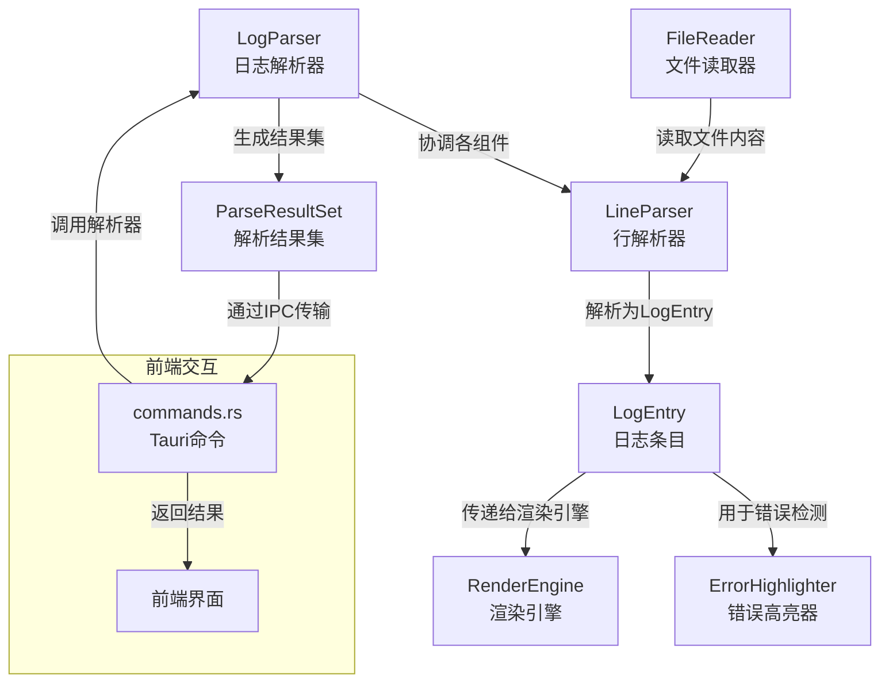
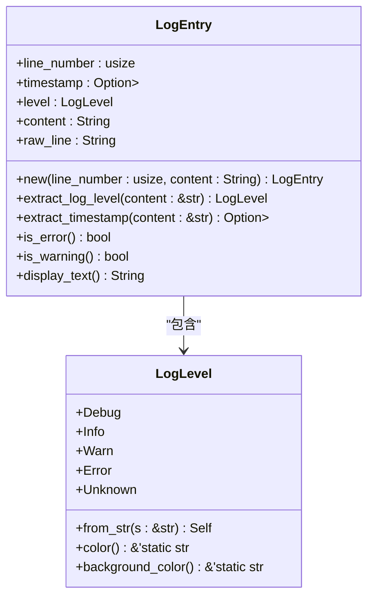
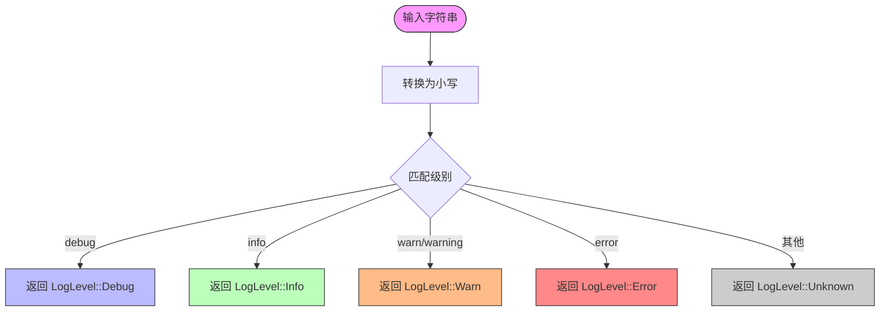
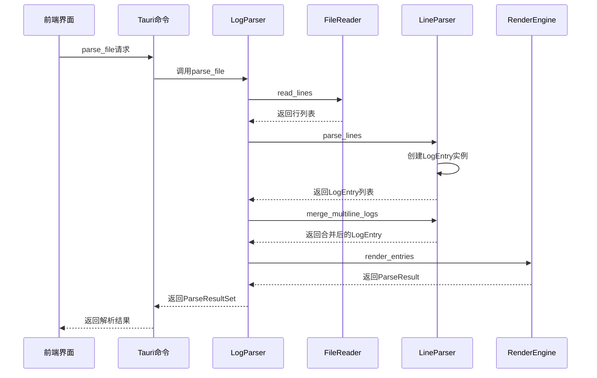
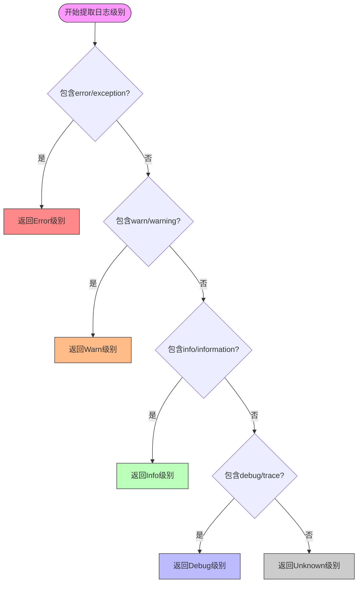
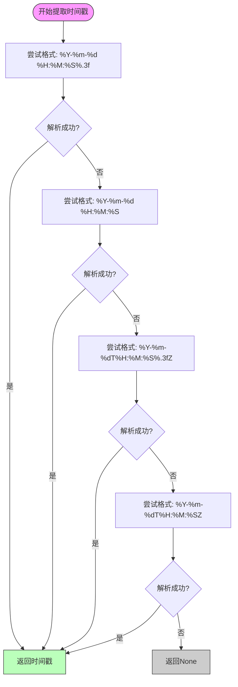
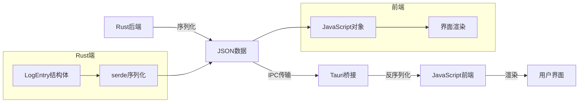
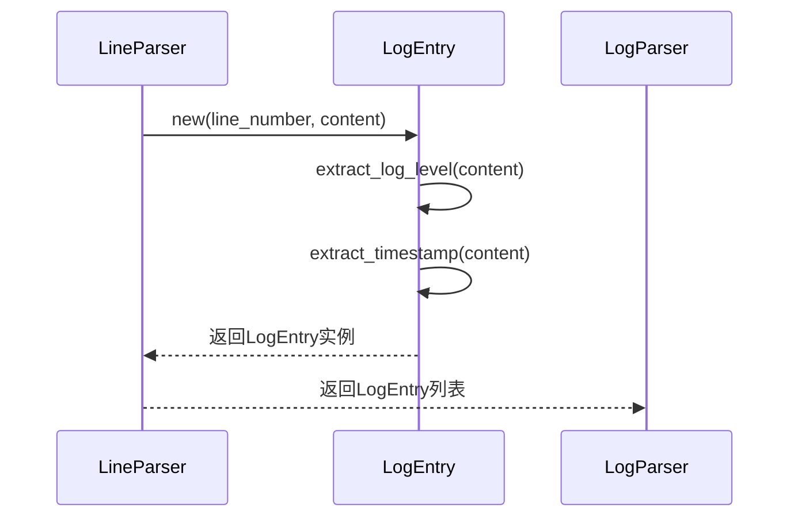
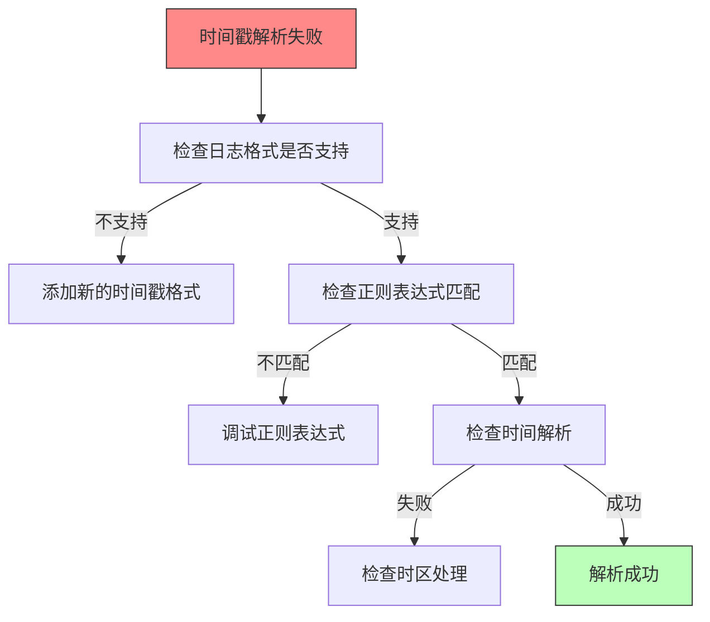

# LogEntry 模型

<cite>
**Referenced Files in This Document**   
- [log_entry.rs](file://src-tauri/src/models/log_entry.rs)
- [line_parser.rs](file://src-tauri/src/parser/line_parser.rs)
- [log_parser.rs](file://src-tauri/src/parser/log_parser.rs)
- [commands.rs](file://src-tauri/src/tauri/commands.rs)
- [file_reader.rs](file://src-tauri/src/parser/file_reader.rs)
- [mod.rs](file://src-tauri/src/models/mod.rs)
</cite>

## 目录
1. [简介](#简介)
2. [核心组件](#核心组件)
3. [LogEntry 数据模型详解](#logentry-数据模型详解)
4. [LogLevel 枚举实现机制](#loglevel-枚举实现机制)
5. [日志解析流程](#日志解析流程)
6. [辅助方法与错误检测](#辅助方法与错误检测)
7. [序列化与跨进程通信](#序列化与跨进程通信)
8. [常见问题排查](#常见问题排查)
9. [结论](#结论)

## 简介

`LogEntry` 是 log-whisper 日志分析系统中的核心数据模型，负责表示和处理单条日志记录。该模型在日志解析、分析和可视化过程中扮演着关键角色，为整个系统的功能实现提供了基础数据结构支持。

**Section sources**
- [log_entry.rs](file://src-tauri/src/models/log_entry.rs#L1-L137)

## 核心组件

`LogEntry` 模型是 log-whisper 系统中日志处理流程的核心组成部分，与其他多个组件协同工作以实现完整的日志分析功能。



**Diagram sources**
- [log_entry.rs](file://src-tauri/src/models/log_entry.rs#L1-L137)
- [line_parser.rs](file://src-tauri/src/parser/line_parser.rs#L1-L246)
- [log_parser.rs](file://src-tauri/src/parser/log_parser.rs#L1-L247)
- [commands.rs](file://src-tauri/src/tauri/commands.rs#L1-L293)

**Section sources**
- [log_entry.rs](file://src-tauri/src/models/log_entry.rs#L1-L137)
- [line_parser.rs](file://src-tauri/src/parser/line_parser.rs#L1-L246)
- [log_parser.rs](file://src-tauri/src/parser/log_parser.rs#L1-L247)

## LogEntry 数据模型详解

`LogEntry` 结构体定义了日志条目的核心属性，每个字段都有明确的语义定义和使用场景。

### 字段语义与使用场景



**Diagram sources**
- [log_entry.rs](file://src-tauri/src/models/log_entry.rs#L1-L137)

#### line_number 字段

`line_number` 字段表示日志条目在原始文件中的行号，类型为 `usize`。该字段在日志定位、错误追踪和上下文分析中起着重要作用，允许用户快速定位到日志文件中的具体位置。

#### timestamp 字段

`timestamp` 字段表示日志条目的时间戳，类型为 `Option<DateTime<Utc>>`。该字段可能为空，因为并非所有日志条目都包含有效的时间戳信息。时间戳用于日志排序、时间序列分析和性能监控。

#### level 字段

`level` 字段表示日志级别，类型为 `LogLevel` 枚举。该字段是日志分类和过滤的核心依据，直接影响日志的显示样式和处理策略。

#### content 字段

`content` 字段存储日志的实际内容，类型为 `String`。该字段包含日志消息的主体部分，是日志分析的主要数据来源。

#### raw_line 字段

`raw_line` 字段保存原始的行内容，类型为 `String`。与 `content` 字段不同，`raw_line` 保持了日志条目的原始格式，用于需要完整原始信息的场景。

**Section sources**
- [log_entry.rs](file://src-tauri/src/models/log_entry.rs#L1-L137)

## LogLevel 枚举实现机制

`LogLevel` 枚举是日志级别管理的核心，提供了从字符串解析、UI渲染支持等多种功能。

### from_str 解析逻辑

`from_str` 方法实现了从字符串到 `LogLevel` 枚举的转换逻辑，支持多种常见的日志级别表示形式：



**Diagram sources**
- [log_entry.rs](file://src-tauri/src/models/log_entry.rs#L20-L40)

### UI 渲染方法

`LogLevel` 枚举提供了 `color` 和 `background_color` 方法，用于在用户界面中根据日志级别应用不同的样式：

```mermaid
classDiagram
class LogLevel {
+color() &'static str
+background_color() &'static str
}
LogLevel -->|Debug| "text-gray-500 bg-gray-50"
LogLevel -->|Info| "text-blue-600 bg-blue-50"
LogLevel -->|Warn| "text-yellow-600 bg-yellow-50"
LogLevel -->|Error| "text-red-600 bg-red-50"
LogLevel -->|Unknown| "text-gray-400 bg-gray-50"
```

这些方法返回的 CSS 类名可以直接应用于前端界面，实现不同日志级别的视觉区分。

**Section sources**
- [log_entry.rs](file://src-tauri/src/models/log_entry.rs#L42-L75)

## 日志解析流程

`LogEntry` 模型在日志解析流程中扮演着核心角色，从原始文件到最终可视化结果的转换过程涉及多个组件的协作。

### 解析流程概述



**Diagram sources**
- [log_parser.rs](file://src-tauri/src/parser/log_parser.rs#L1-L247)
- [file_reader.rs](file://src-tauri/src/parser/file_reader.rs#L1-L201)
- [line_parser.rs](file://src-tauri/src/parser/line_parser.rs#L1-L246)

### extract_log_level 和 extract_timestamp 实现

`extract_log_level` 和 `extract_timestamp` 是 `LogEntry` 模型中的关键内部方法，负责从日志内容中提取重要信息。

#### extract_log_level 正则匹配策略

`extract_log_level` 方法使用关键词匹配策略来确定日志级别：



**Diagram sources**
- [log_entry.rs](file://src-tauri/src/models/log_entry.rs#L100-L115)

#### extract_timestamp 时间解析策略

`extract_timestamp` 方法支持多种常见的时间戳格式，通过预定义的格式数组进行逐个尝试解析：



**Diagram sources**
- [log_entry.rs](file://src-tauri/src/models/log_entry.rs#L117-L137)

**Section sources**
- [log_entry.rs](file://src-tauri/src/models/log_entry.rs#L100-L137)
- [line_parser.rs](file://src-tauri/src/parser/line_parser.rs#L100-L175)

## 辅助方法与错误检测

`LogEntry` 模型提供了多个辅助方法，用于简化日志分析和错误检测过程。

### is_error 和 is_warning 判断逻辑

`is_error` 和 `is_warning` 方法是日志分析中的重要工具，它们的判断逻辑如下：

```mermaid
classDiagram
class LogEntry {
+is_error() bool
+is_warning() bool
}
LogEntry -->|is_error| "level == Error"
LogEntry -->|is_error| "content包含error/exception/failed"
LogEntry -->|is_warning| "level == Warn"
LogEntry -->|is_warning| "content包含warn"
```

`is_error` 方法不仅检查日志级别是否为 `Error`，还检查内容中是否包含 "error"、"exception" 或 "failed" 等关键词，提高了错误检测的准确性。

`is_warning` 方法同样采用双重判断策略，既检查日志级别也检查内容关键词。

**Section sources**
- [log_entry.rs](file://src-tauri/src/models/log_entry.rs#L130-L137)

## 序列化与跨进程通信

`LogEntry` 模型通过 serde 属性支持跨 Tauri IPC 的序列化传输，这是实现前后端通信的关键。

### serde 属性说明

`LogEntry` 结构体使用了 `#[derive(Serialize, Deserialize)]` 属性，使其能够被序列化为 JSON 格式并通过 Tauri 的 IPC 机制在 Rust 后端和前端 JavaScript 之间传输。



**Diagram sources**
- [log_entry.rs](file://src-tauri/src/models/log_entry.rs#L1-L137)
- [commands.rs](file://src-tauri/src/tauri/commands.rs#L1-L293)

### 创建与使用示例

`LogEntry` 模型在日志解析流程中的创建和使用遵循特定的模式：



**Section sources**
- [log_entry.rs](file://src-tauri/src/models/log_entry.rs#L80-L137)
- [line_parser.rs](file://src-tauri/src/parser/line_parser.rs#L50-L80)

## 常见问题排查

在使用 `LogEntry` 模型时，可能会遇到一些常见问题，特别是时间戳解析失败的情况。

### 时间戳解析失败排查建议



当遇到时间戳解析失败时，建议按照以下步骤进行排查：
1. 确认日志文件中的时间戳格式是否在支持的列表中
2. 检查正则表达式是否能正确匹配时间戳部分
3. 验证时间解析格式字符串是否与实际格式匹配
4. 确认时区处理是否正确

**Section sources**
- [log_entry.rs](file://src-tauri/src/models/log_entry.rs#L117-L137)
- [line_parser.rs](file://src-tauri/src/parser/line_parser.rs#L100-L175)

## 结论

`LogEntry` 模型是 log-whisper 系统的核心数据结构，它不仅定义了日志条目的基本属性，还提供了丰富的功能来支持日志解析、分析和可视化。通过合理的字段设计、灵活的解析策略和强大的序列化支持，`LogEntry` 模型为整个系统的稳定运行提供了坚实的基础。