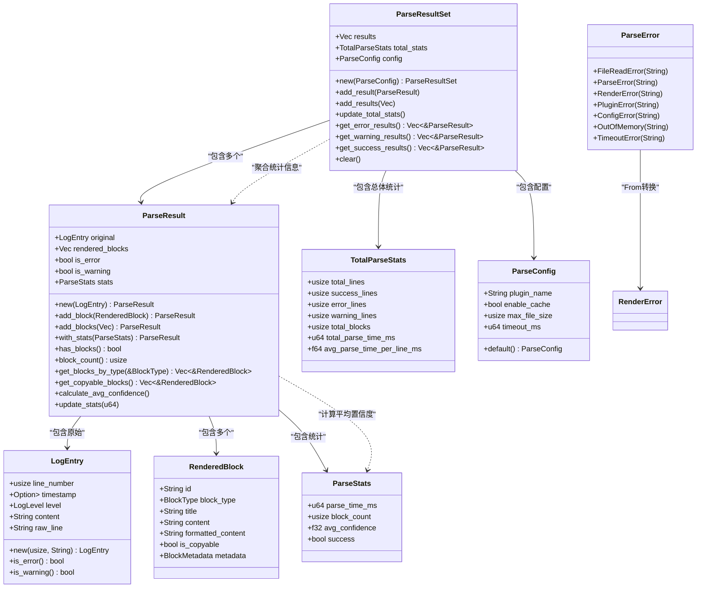
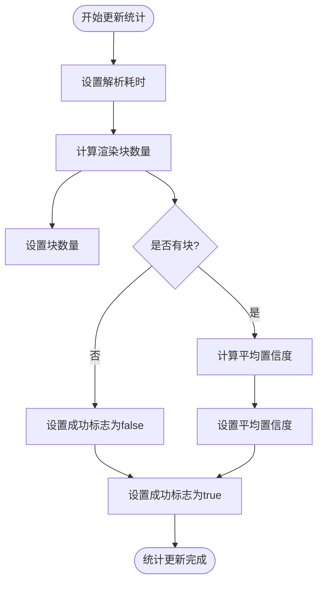
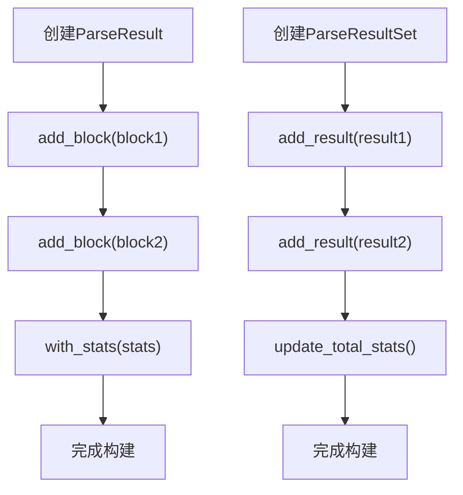

# ParseResult 与结果集模型

<cite>
**本文档引用的文件**
- [parse_result.rs](file://src-tauri/src/models/parse_result.rs)
- [rendered_block.rs](file://src-tauri/src/models/rendered_block.rs)
- [log_entry.rs](file://src-tauri/src/models/log_entry.rs)
- [renderer.rs](file://src-tauri/src/parser/renderer.rs)
- [log_parser.rs](file://src-tauri/src/parser/log_parser.rs)
- [desktop-schema.json](file://src-tauri/gen/schemas/desktop-schema.json)
</cite>

## 目录
1. [简介](#简介)
2. [核心数据结构](#核心数据结构)
3. [ParseResult 结构详解](#parseresult-结构详解)
4. [ParseStats 统计信息](#parsestats-统计信息)
5. [ParseResultSet 结果集合](#parseresultset-结果集合)
6. [ParseError 错误类型](#parseerror-错误类型)
7. [ParseConfig 配置项](#parseconfig-配置项)
8. [核心操作方法](#核心操作方法)
9. [JSON 序列化结构](#json-序列化结构)
10. [实际解析结果样例](#实际解析结果样例)

## 简介
本文档深入解析日志解析系统中的核心结果模型，重点阐述 `ParseResult` 及其相关类型的组织结构和功能特性。文档系统化地说明了日志解析结果的生成、统计、聚合和错误处理机制，为开发者和使用者提供全面的技术参考。

## 核心数据结构
日志解析结果模型由多个核心结构体组成，它们共同构成了完整的解析结果体系。这些结构体通过清晰的层次关系组织解析产出，提供了丰富的元数据和统计信息。



**图示来源**
- [parse_result.rs](file://src-tauri/src/models/parse_result.rs#L4-L199)
- [rendered_block.rs](file://src-tauri/src/models/rendered_block.rs#L2-L19)
- [log_entry.rs](file://src-tauri/src/models/log_entry.rs#L3-L16)

## ParseResult 结构详解
`ParseResult` 是日志解析的核心结构体，它封装了单个日志条目的完整解析结果。该结构体通过多个字段组织解析产出，提供了丰富的上下文信息。

### 原始日志关联
`ParseResult` 通过 `original` 字段与原始 `LogEntry` 建立直接关联，确保解析结果与源数据的完整对应关系。这种设计保证了在需要时可以追溯到原始日志内容，为后续的验证和调试提供了便利。

### 渲染块管理
`rendered_blocks` 字段维护了解析产出的 `RenderedBlock` 列表，这些块代表了从原始日志中提取和格式化的结构化内容。每个 `RenderedBlock` 都包含类型、标题、内容等元数据，形成了层次化的解析结果。

### 错误与警告标志
`is_error` 和 `is_warning` 标志位与原始日志级别建立了联动机制。这些标志位的值由 `LogEntry` 的 `is_error()` 和 `is_warning()` 方法决定，实现了基于内容和级别的双重判断逻辑。

**本节来源**
- [parse_result.rs](file://src-tauri/src/models/parse_result.rs#L4-L17)
- [log_entry.rs](file://src-tauri/src/models/log_entry.rs#L3-L16)

## ParseStats 统计信息
`ParseStats` 结构体提供了详细的解析性能统计信息，这些数据对于监控解析过程和优化系统性能具有重要价值。

### 统计指标说明
- **解析耗时（parse_time_ms）**：记录单次解析操作的耗时（毫秒），用于性能监控和瓶颈分析
- **渲染块数量（block_count）**：统计成功生成的渲染块总数，反映解析的丰富程度
- **置信度均值（avg_confidence）**：计算所有渲染块置信度的平均值，评估解析质量
- **解析成功标志（success）**：指示本次解析是否成功生成了有效结果

### 计算逻辑
统计信息的计算主要在 `ParseResult` 的 `update_stats` 方法中完成。该方法在解析完成后被调用，自动计算并填充各项统计指标。其中，平均置信度的计算通过遍历所有渲染块的元数据完成。



**图示来源**
- [parse_result.rs](file://src-tauri/src/models/parse_result.rs#L19-L30)
- [parse_result.rs](file://src-tauri/src/models/parse_result.rs#L108-L120)

**本节来源**
- [parse_result.rs](file://src-tauri/src/models/parse_result.rs#L19-L30)

## ParseResultSet 结果集合
`ParseResultSet` 结构体用于聚合多个 `ParseResult`，形成完整的解析结果集。它不仅包含所有单个解析结果，还维护了总体统计信息。

### 总体统计信息
`TotalParseStats` 结构体提供了全局视角的统计指标：
- **总行数（total_lines）**：参与解析的日志总行数
- **成功解析行数（success_lines）**：成功生成解析结果的行数
- **错误行数（error_lines）**：被标记为错误的日志行数
- **警告行数（warning_lines）**：被标记为警告的日志行数
- **总渲染块数（total_blocks）**：所有解析结果中渲染块的总数
- **总解析时间（total_parse_time_ms）**：整个解析过程的总耗时
- **平均每行解析时间（avg_parse_time_per_line_ms）**：总耗时除以总行数

### 动态更新机制
当向 `ParseResultSet` 添加新的 `ParseResult` 时，`update_total_stats` 方法会自动更新总体统计信息。该方法通过遍历所有结果，累加各项指标并重新计算平均值。

```mermaid
sequenceDiagram
participant PRS as ParseResultSet
participant PR as ParseResult
participant TS as TotalParseStats
PRS->>PRS : add_result(PR)
PRS->>PRS : update_total_stats()
PRS->>TS : total_lines = results.len()
PRS->>TS : success_lines = filter success results
PRS->>TS : error_lines = filter error results
PRS->>TS : warning_lines = filter warning results
PRS->>TS : total_blocks = sum block counts
PRS->>TS : calculate avg time per line
PRS-->> : 更新完成
```

**图示来源**
- [parse_result.rs](file://src-tauri/src/models/parse_result.rs#L158-L186)
- [parse_result.rs](file://src-tauri/src/models/parse_result.rs#L245-L285)

**本节来源**
- [parse_result.rs](file://src-tauri/src/models/parse_result.rs#L158-L186)

## ParseError 错误类型
`ParseError` 枚举定义了日志解析过程中可能遇到的各种错误类型，为错误处理提供了清晰的分类体系。

### 错误分类
- **文件读取错误（FileReadError）**：文件系统相关的读取问题
- **解析错误（ParseError）**：日志内容解析过程中的问题
- **渲染错误（RenderError）**：结果渲染阶段的错误
- **插件错误（PluginError）**：插件执行过程中的问题
- **配置错误（ConfigError）**：配置参数不正确或缺失
- **内存不足（OutOfMemory）**：系统资源不足
- **超时错误（TimeoutError）**：操作超时

### 转换实现
`ParseError` 实现了从 `RenderError` 到 `ParseError` 的转换（`From<RenderError>` trait）。这种设计允许在渲染层抛出的错误能够无缝地传递到解析层，保持了错误处理的一致性。

```mermaid
classDiagram
class ParseError {
+FileReadError(String)
+ParseError(String)
+RenderError(String)
+PluginError(String)
+ConfigError(String)
+OutOfMemory(String)
+TimeoutError(String)
}
class RenderError {
+RenderFailed(String)
+PluginError(String)
+ConfigError(String)
}
ParseError <|-- RenderError : "From转换"
note right of ParseError
From<RenderError> 实现：
- RenderFailed → RenderError
- PluginError → PluginError
- ConfigError → ConfigError
end note
```

**图示来源**
- [parse_result.rs](file://src-tauri/src/models/parse_result.rs#L122-L145)
- [renderer.rs](file://src-tauri/src/parser/renderer.rs#L188-L199)

**本节来源**
- [parse_result.rs](file://src-tauri/src/models/parse_result.rs#L122-L145)

## ParseConfig 配置项
`ParseConfig` 结构体定义了影响解析行为的关键配置参数，为用户提供了解析过程的控制能力。

### 配置参数
- **插件名称（plugin_name）**：指定使用的解析插件，支持 "Auto" 自动选择
- **启用缓存（enable_cache）**：控制是否使用解析结果缓存
- **最大文件大小（max_file_size）**：限制可解析文件的最大字节数
- **超时时间（timeout_ms）**：设置解析操作的最大允许时间

### 默认配置
系统提供了合理的默认配置值：
- 插件名称：Auto（自动选择）
- 启用缓存：true
- 最大文件大小：50MB
- 超时时间：30秒

这些配置项在 `LogParser` 创建时被应用，影响整个解析流程的行为。

**本节来源**
- [parse_result.rs](file://src-tauri/src/models/parse_result.rs#L188-L199)
- [log_parser.rs](file://src-tauri/src/parser/log_parser.rs#L15-L45)

## 核心操作方法
`ParseResult` 和 `ParseResultSet` 提供了一系列核心操作方法，支持对解析结果的灵活处理。

### ParseResult 操作
- **add_block**：向结果中添加单个渲染块
- **add_blocks**：批量添加多个渲染块
- **get_blocks_by_type**：按类型筛选渲染块
- **get_copyable_blocks**：获取所有可复制的块
- **update_stats**：更新解析统计信息

### ParseResultSet 操作
- **add_result**：向结果集中添加单个解析结果
- **add_results**：批量添加多个解析结果
- **get_error_results**：获取所有错误结果
- **get_warning_results**：获取所有警告结果
- **get_success_results**：获取所有成功解析的结果
- **clear**：清空结果集

这些方法的设计遵循了流式接口（fluent interface）模式，支持方法链式调用。



**图示来源**
- [parse_result.rs](file://src-tauri/src/models/parse_result.rs#L45-L120)
- [parse_result.rs](file://src-tauri/src/models/parse_result.rs#L245-L285)

**本节来源**
- [parse_result.rs](file://src-tauri/src/models/parse_result.rs#L45-L120)

## JSON 序列化结构
通过 `desktop-schema.json` 文件，可以了解整个结果结构的 JSON 序列化格式。该结构定义了 `ParseResult` 及其相关类型的序列化规范。

### 结构特点
- 所有结构体都实现了 `Serialize` 和 `Deserialize` trait
- 使用标准的 JSON 数据类型（字符串、数字、布尔值、数组、对象）
- 保持了与 Rust 结构体字段的直接映射关系
- 支持嵌套结构的序列化和反序列化

这种设计使得解析结果可以在不同系统组件之间高效传输，并支持持久化存储。

**本节来源**
- [desktop-schema.json](file://src-tauri/gen/schemas/desktop-schema.json)
- [parse_result.rs](file://src-tauri/src/models/parse_result.rs)

## 实际解析结果样例
以下是一个典型的解析结果 JSON 样例，展示了实际输出的结构和内容：

```json
{
  "results": [
    {
      "original": {
        "line_number": 1,
        "timestamp": "2024-01-01T10:00:00Z",
        "level": "Error",
        "content": "ERROR 2024-01-01 10:00:00 Exception in thread \"main\" java.lang.NullPointerException",
        "raw_line": "ERROR 2024-01-01 10:00:00 Exception in thread \"main\" java.lang.NullPointerException"
      },
      "rendered_blocks": [
        {
          "id": "block-1",
          "block_type": "Error",
          "title": "错误