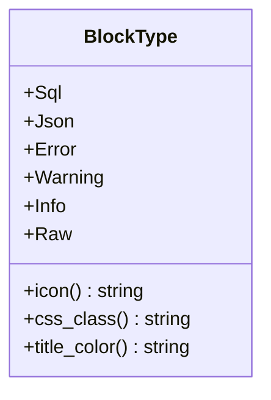
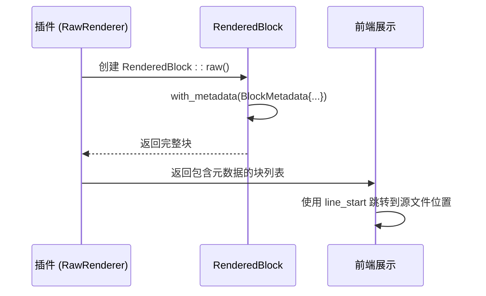
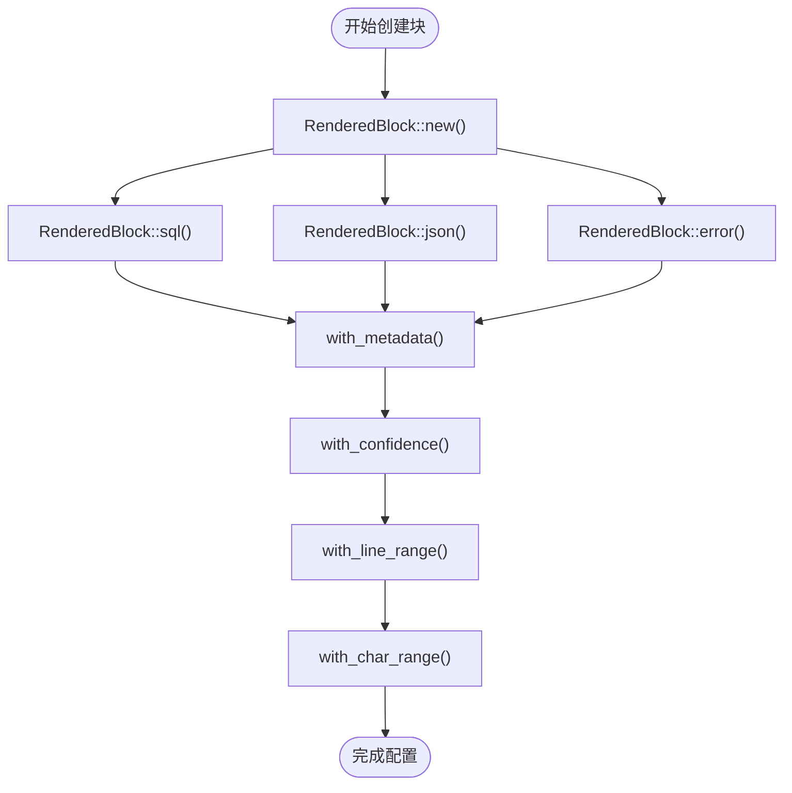

# RenderedBlock 模型

<cite>
**本文档引用的文件**  
- [rendered_block.rs](file://src-tauri/src/models/rendered_block.rs)
- [raw.rs](file://src-tauri/src/plugins/raw.rs)
- [renderer.rs](file://src-tauri/src/parser/renderer.rs)
- [registry.rs](file://src-tauri/src/plugins/registry.rs)
- [plugin_config.rs](file://src-tauri/src/models/plugin_config.rs)
- [parse_result.rs](file://src-tauri/src/models/parse_result.rs)
- [main.js](file://src/main.js)
</cite>

## 目录
1. [简介](#简介)
2. [核心数据结构](#核心数据结构)
3. [块类型与前端样式集成](#块类型与前端样式集成)
4. [元数据与定位机制](#元数据与定位机制)
5. [构造方法与链式配置](#构造方法与链式配置)
6. [序列化与通信一致性](#序列化与通信一致性)
7. [插件渲染流程应用](#插件渲染流程应用)
8. [调试策略](#调试策略)

## 简介
`RenderedBlock` 是日志可视化系统中的核心渲染单元，用于封装日志条目中可被识别和格式化的逻辑块。该模型在后端解析引擎与前端展示层之间起到桥梁作用，通过结构化的数据传递实现日志内容的智能高亮、分类展示和交互支持。其设计目标是提供一个灵活、可扩展且语义清晰的可视化渲染基础。

## 核心数据结构

`RenderedBlock` 结构体定义了可视化渲染块的所有核心属性，每个字段均有明确的设计意图和使用场景：

- **id**: 唯一标识符，用于在前端 DOM 中定位和管理特定的渲染块，确保更新和交互的精确性。
- **block_type**: 枚举类型，定义了块的语义类别（如 SQL、JSON、错误等），是决定渲染样式和行为的关键。
- **title**: 显示在块顶部的标题，为用户提供直观的内容分类信息。
- **content**: 原始的、未经格式化的文本内容，用于复制和底层处理。
- **formatted_content**: 经过插件处理后的富文本内容，可能包含 Markdown、代码高亮等，直接用于前端展示。
- **is_copyable**: 布尔值，指示该块的内容是否允许用户复制，控制交互行为。
- **metadata**: 包含位置信息和置信度的元数据结构，用于精确定位和质量评估。

**本节来源**  
- [rendered_block.rs](file://src-tauri/src/models/rendered_block.rs#L1-L20)

## 块类型与前端样式集成

`BlockType` 枚举定义了六种核心的渲染类型：`Sql`、`Json`、`Error`、`Warning`、`Info` 和 `Raw`。每种类型都通过三个方法与前端样式紧密集成：

**图示来源**  
- [rendered_block.rs](file://src-tauri/src/models/rendered_block.rs#L22-L70)

- **icon() 方法**: 返回一个 Unicode 图标（如 `🔍` 代表 SQL，`⚠️` 代表错误），在前端用于视觉提示，增强信息的可读性。
- **css_class() 方法**: 返回 Tailwind CSS 类名（如 `border-green-200 bg-green-50`），直接应用于渲染块的容器，实现基于类型的背景色和边框样式。
- **title_color() 方法**: 返回文本颜色类名（如 `text-green-700`），用于设置标题的颜色，与块的整体色调保持一致。

这种设计将样式逻辑内聚在模型内部，确保了前后端对同一类型块的样式理解完全一致，避免了因配置不同步导致的显示问题。

**本节来源**  
- [rendered_block.rs](file://src-tauri/src/models/rendered_block.rs#L22-L70)

## 元数据与定位机制

`BlockMetadata` 结构体负责存储渲染块的上下文信息，是实现精确定位和质量控制的核心：

- **行号范围 (line_start, line_end)**: 记录该块内容在原始日志文件中的起始和结束行号。这对于在大型日志文件中快速跳转到源位置至关重要。
- **字符位置范围 (char_start, char_end)**: 记录该块内容在对应行中的起始和结束字符索引。这使得高亮和选择操作可以精确到字符级别。
- **置信度 (confidence)**: 一个 0.0 到 1.0 的浮点数，表示解析引擎对该块识别结果的可信程度。高置信度意味着解析结果非常可靠，低置信度则提示结果可能需要人工验证。

这些元数据由解析插件在处理日志条目时填充。例如，`RawRenderer` 插件会将其处理的行号和完整字符范围填入元数据，并设置置信度为 1.0，因为它只是原样输出。

**图示来源**  
- [rendered_block.rs](file://src-tauri/src/models/rendered_block.rs#L72-L85)
- [raw.rs](file://src-tauri/src/plugins/raw.rs#L40-L45)

**本节来源**  
- [rendered_block.rs](file://src-tauri/src/models/rendered_block.rs#L72-L85)

## 构造方法与链式配置

`RenderedBlock` 提供了便捷的静态构造方法和流畅的链式配置方法，极大地简化了对象的创建和初始化：

- **静态构造方法**: 如 `sql()`、`json()`、`error()` 等。这些方法预设了 `block_type` 和 `title`，开发者只需传入 `id` 和内容即可快速创建特定类型的块，减少了样板代码。
- **链式配置方法**: 如 `with_metadata()`、`with_confidence()`、`with_line_range()` 等。这些方法接收参数，修改内部状态后返回 `self`，允许开发者以 `RenderedBlock::sql(...).with_confidence(0.95).with_line_range(10, 10)` 的方式连续调用，使代码更加简洁和可读。

**图示来源**  
- [rendered_block.rs](file://src-tauri/src/models/rendered_block.rs#L87-L182)

**本节来源**  
- [rendered_block.rs](file://src-tauri/src/models/rendered_block.rs#L87-L182)

## 序列化与通信一致性

`RenderedBlock` 模型通过 `serde` 库实现了序列化和反序列化功能。这使得该结构体可以轻松地在后端（Rust）和前端（JavaScript）之间进行 JSON 格式的数据交换。

- **前后端通信**: 当后端解析引擎生成 `RenderedBlock` 实例后，`serde` 会将其自动序列化为 JSON 对象。前端通过 Tauri API 接收此 JSON，并反序列化为 JavaScript 对象，从而在 UI 中渲染。
- **数据一致性**: `serde` 的强类型保证了数据结构的完整性。前后端对 `RenderedBlock` 的字段定义必须严格匹配，任何不一致都会导致序列化/反序列化失败，从而在开发阶段就能发现接口问题，确保了数据传输的可靠性。

**本节来源**  
- [rendered_block.rs](file://src-tauri/src/models/rendered_block.rs#L1-L2)
- [parse_result.rs](file://src-tauri/src/models/parse_result.rs#L1-L5)

## 插件渲染流程应用

`RenderedBlock` 是插件系统工作的核心输出。整个渲染流程如下：

1.  **日志条目输入**: `RenderEngine` 接收一个 `LogEntry`。
2.  **插件处理**: `PluginRegistry` 根据优先级调用各个 `LogRenderer` 插件的 `can_handle` 方法。
3.  **块生成**: 一旦插件确认可以处理，其 `render` 方法被调用，返回一个 `Vec<RenderedBlock>`。
4.  **结果组装**: `RenderEngine` 将这些块添加到 `ParseResult` 中，并通过 Tauri 命令返回给前端。

例如，`MyBatisRenderer` 插件会将日志中的 "Preparing:" 和 "Parameters:" 语句解析为独立的 `Sql` 和 `Info` 类型的 `RenderedBlock`。

**本节来源**  
- [rendered_block.rs](file://src-tauri/src/models/rendered_block.rs)
- [renderer.rs](file://src-tauri/src/parser/renderer.rs)
- [registry.rs](file://src-tauri/src/plugins/registry.rs)
- [trait_def.rs](file://src-tauri/src/plugins/trait_def.rs)

## 调试策略

置信度 (`confidence`) 是评估解析质量的关键指标。当出现置信度过低的情况时，可采取以下调试策略：

- **检查插件配置**: 查看 `PluginConfig` 中的 `min_confidence` 阈值（默认为 0.5），确认是否过低导致了低质量结果被接受。
- **分析日志模式**: 低置信度通常意味着日志内容不符合插件的预期模式。检查原始日志，确认其格式是否与插件支持的格式一致。
- **启用调试日志**: 在 `plugin_config.rs` 和 `encoding_detector.rs` 中存在对置信度的检查和断言，启用调试模式可以输出更详细的处理过程，帮助定位问题根源。
- **验证解析逻辑**: 检查相关插件（如 `MyBatisRenderer`）的 `can_handle` 和 `render` 方法，确保其正则表达式或解析逻辑能够正确匹配目标日志。

**本节来源**  
- [plugin_config.rs](file://src-tauri/src/models/plugin_config.rs#L34)
- [encoding_detector.rs](file://src-tauri/src/utils/encoding_detector.rs#L95)
- [rendered_block.rs](file://src-tauri/src/models/rendered_block.rs#L166)