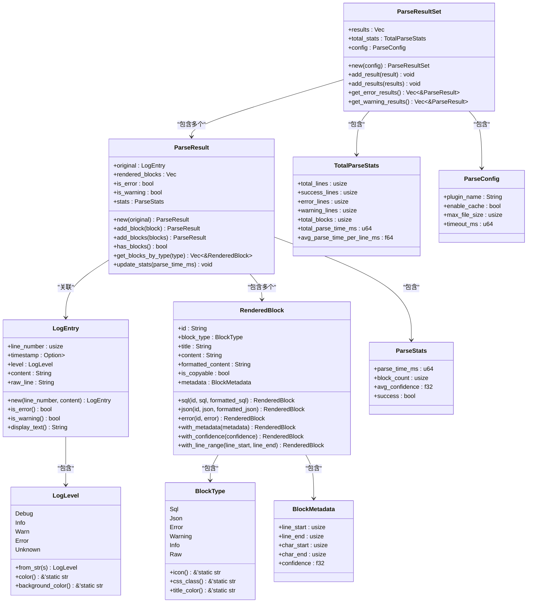
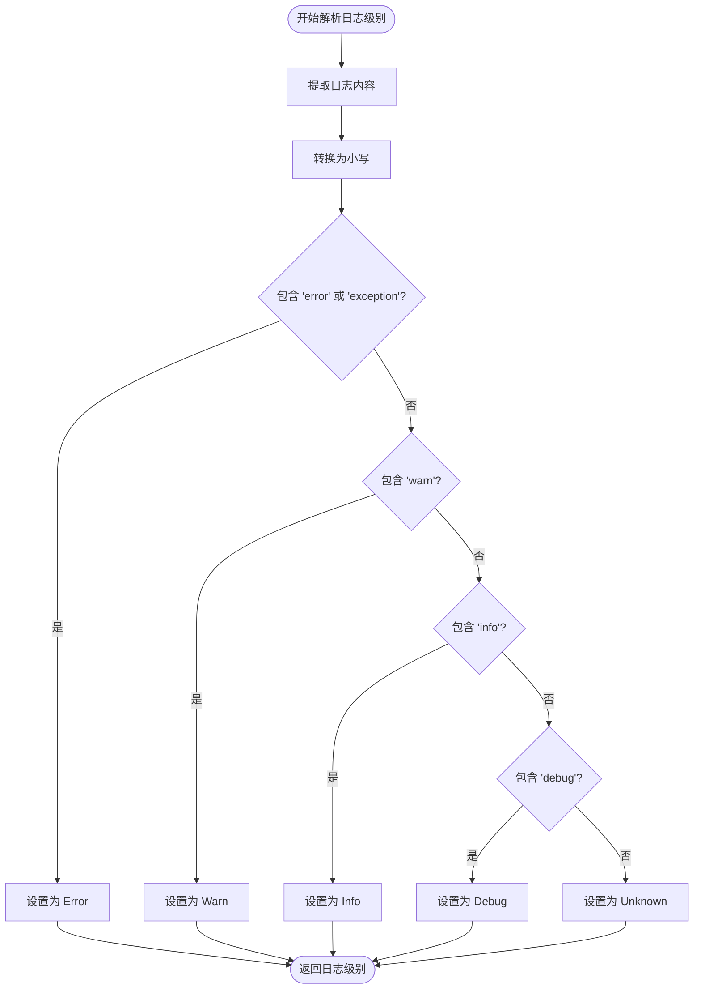
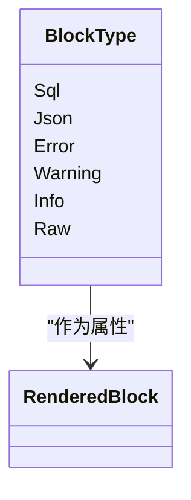
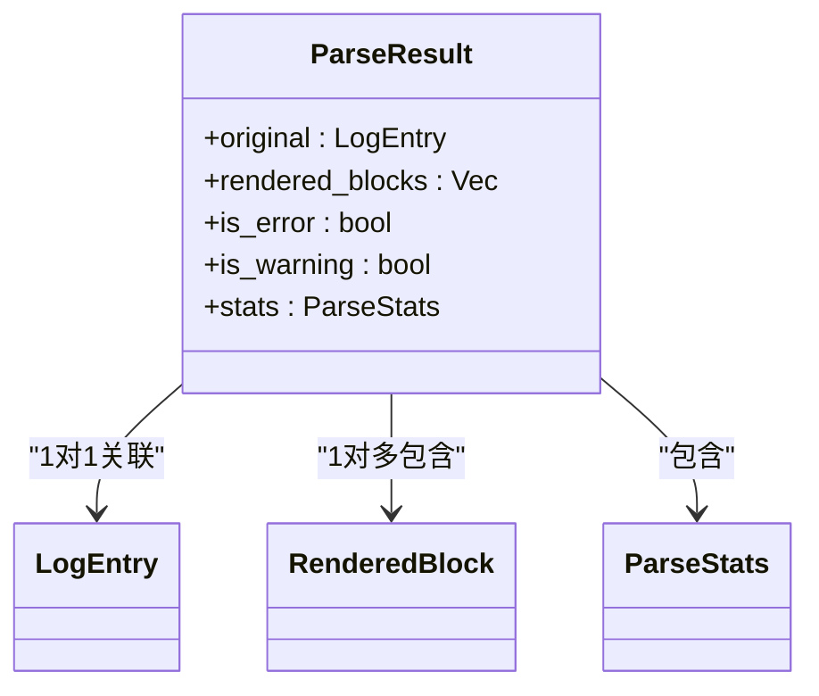
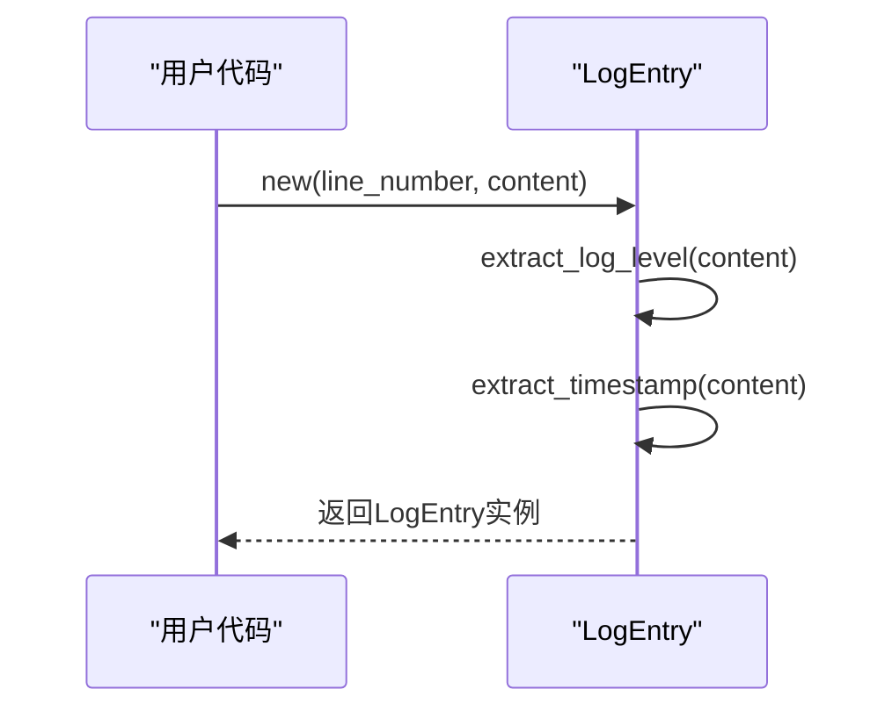
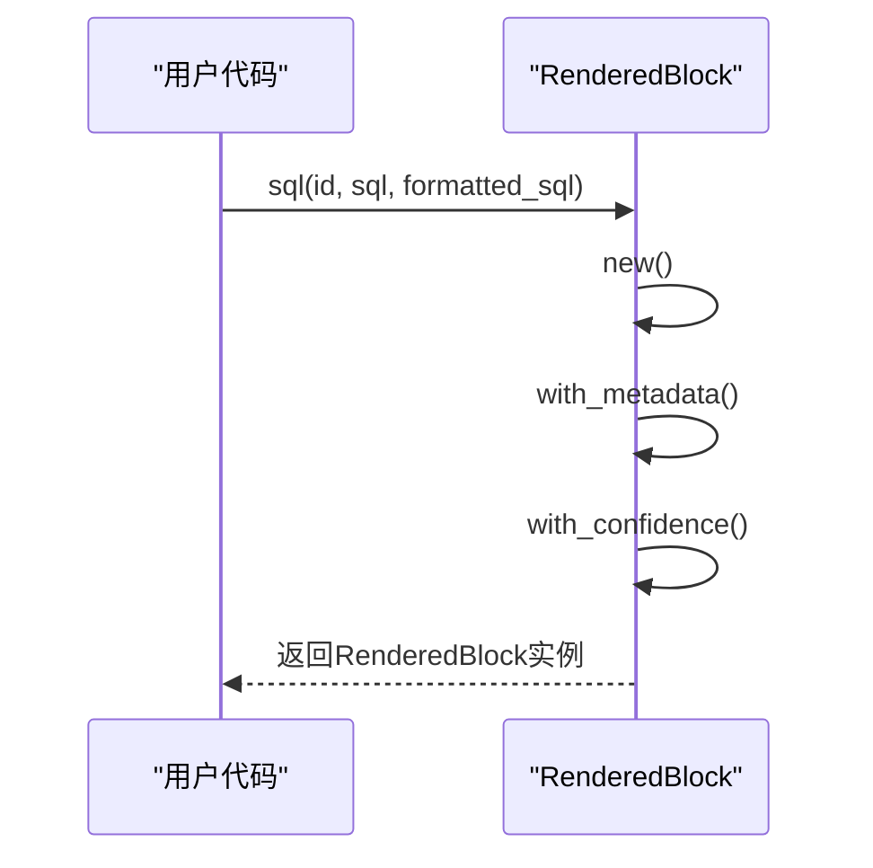
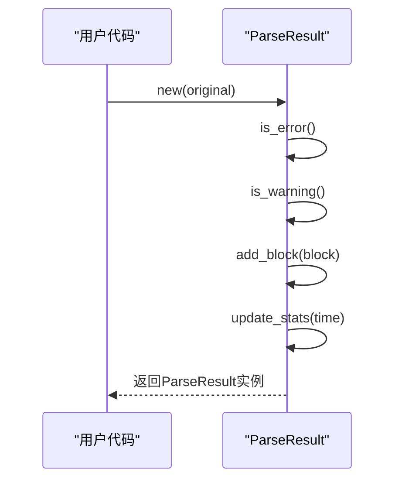

# 数据模型

<cite>
**Referenced Files in This Document**   
- [log_entry.rs](file://src-tauri/src/models/log_entry.rs)
- [rendered_block.rs](file://src-tauri/src/models/rendered_block.rs)
- [parse_result.rs](file://src-tauri/src/models/parse_result.rs)
- [desktop-schema.json](file://src-tauri/gen/schemas/desktop-schema.json)
- [mod.rs](file://src-tauri/src/models/mod.rs)
</cite>

## 目录
1. [核心数据结构](#核心数据结构)
2. [LogEntry模型详解](#logentry模型详解)
3. [RenderedBlock模型详解](#renderedblock模型详解)
4. [解析结果模型](#解析结果模型)
5. [序列化机制](#序列化机制)
6. [JSON数据表示](#json数据表示)
7. [使用示例与操作指南](#使用示例与操作指南)

## 核心数据结构

log-whisper系统的核心数据模型由多个相互关联的结构体和枚举组成，形成了完整的日志解析和展示体系。主要包含LogEntry（原始日志条目）、RenderedBlock（渲染块）和ParseResult（解析结果）三个核心组件，通过serde序列化机制实现跨IPC通信。



**Diagram sources**
- [log_entry.rs](file://src-tauri/src/models/log_entry.rs#L3-L16)
- [rendered_block.rs](file://src-tauri/src/models/rendered_block.rs#L2-L19)
- [parse_result.rs](file://src-tauri/src/models/parse_result.rs#L4-L17)

**Section sources**
- [log_entry.rs](file://src-tauri/src/models/log_entry.rs#L3-L138)
- [rendered_block.rs](file://src-tauri/src/models/rendered_block.rs#L2-L183)
- [parse_result.rs](file://src-tauri/src/models/parse_result.rs#L4-L286)

## LogEntry模型详解

LogEntry模型是日志解析的基础单元，用于表示日志文件中的单个日志条目。该模型通过结构化的字段设计，完整地捕获了日志条目的关键信息。

### 核心字段语义

LogEntry模型包含以下核心字段，每个字段都有明确的语义和用途：

- **line_number**: 表示该日志条目在原始日志文件中的行号，类型为`usize`。此字段用于在日志文件中精确定位日志条目的位置，便于用户快速导航和引用。
- **timestamp**: 表示日志条目的时间戳，类型为`Option<DateTime<Utc>>`。该字段使用UTC时区存储时间信息，`Option`类型表明时间戳可能不存在于某些日志条目中。
- **level**: 表示日志级别，类型为`LogLevel`枚举。此字段用于分类日志条目的严重程度，是日志过滤和分析的重要依据。
- **content**: 存储日志条目的主要内容，类型为`String`。此字段包含解析后的日志文本，通常不包含时间戳和级别等元数据。
- **raw_line**: 保存原始的完整日志行内容，类型为`String`。此字段用于保留日志的原始格式，便于后续重新解析或调试。

### 日志级别解析逻辑

LogLevel枚举定义了系统支持的日志级别分类，包括Debug、Info、Warn、Error和Unknown五种类型。该枚举提供了智能的字符串解析逻辑，能够从各种格式的日志文本中准确识别日志级别。



**Diagram sources**
- [log_entry.rs](file://src-tauri/src/models/log_entry.rs#L18-L26)

**Section sources**
- [log_entry.rs](file://src-tauri/src/models/log_entry.rs#L18-L50)

### 时间戳提取机制

LogEntry模型内置了智能的时间戳提取功能，能够识别多种常见的时间戳格式。系统支持以下时间戳格式的自动解析：

- `YYYY-MM-DD HH:MM:SS.fff` (如 2024-01-01 10:00:00.123)
- `YYYY-MM-DD HH:MM:SS` (如 2024-01-01 10:00:00)
- `YYYY-MM-DDTHH:MM:SS.fffZ` (ISO 8601格式)
- `YYYY-MM-DDTHH:MM:SSZ` (ISO 8601格式)

时间戳提取采用模式匹配的方式，系统会依次尝试各种预定义的格式模式，直到成功解析或所有模式都失败。这种设计确保了对不同日志格式的广泛兼容性。

**Section sources**
- [log_entry.rs](file://src-tauri/src/models/log_entry.rs#L100-L120)

## RenderedBlock模型详解

RenderedBlock模型用于封装可交互的解析结果块，将原始日志内容转换为结构化的、用户友好的展示形式。

### 块类型分类

BlockType枚举定义了系统支持的渲染块类型，每种类型对应不同的内容特征和展示样式：

- **Sql**: 用于封装SQL查询语句，提供语法高亮和格式化功能
- **Json**: 用于封装JSON数据，支持格式化显示和折叠展开
- **Error**: 用于封装错误信息，突出显示以引起用户注意
- **Warning**: 用于封装警告信息，提供适当的视觉提示
- **Info**: 用于封装一般信息，采用中性样式展示
- **Raw**: 用于封装原始文本内容，保持原有格式



**Diagram sources**
- [rendered_block.rs](file://src-tauri/src/models/rendered_block.rs#L21-L30)

**Section sources**
- [rendered_block.rs](file://src-tauri/src/models/rendered_block.rs#L21-L45)

### 元数据与定位信息

BlockMetadata结构体提供了渲染块的详细定位信息和质量评估，包含以下关键字段：

- **line_start** 和 **line_end**: 定义了渲染块在原始日志文件中的行号范围，用于精确的源码定位
- **char_start** 和 **char_end**: 定义了渲染块在原始文本中的字符位置范围，支持更精细的定位
- **confidence**: 表示解析结果的置信度，取值范围为0.0到1.0，用于评估解析结果的可靠性

这些元数据字段使得系统能够实现"点击渲染块跳转到原始日志位置"的功能，增强了用户体验。

**Section sources**
- [rendered_block.rs](file://src-tauri/src/models/rendered_block.rs#L70-L83)

### 置信度机制

置信度(confidence)是RenderedBlock模型的重要特性，用于量化解析结果的可靠性。系统通过以下方式计算和使用置信度：

- 初始置信度默认为1.0，表示完全可信
- 当解析结果存在不确定性时，系统会相应降低置信度值
- 用户可以通过`with_confidence()`方法手动设置置信度
- 系统会自动将置信度限制在0.0到1.0的有效范围内

置信度信息可用于前端界面的视觉提示，如低置信度的结果可以显示为半透明或添加警告图标。

**Section sources**
- [rendered_block.rs](file://src-tauri/src/models/rendered_block.rs#L83-L90)

## 解析结果模型

ParseResult模型是日志解析的核心输出，它将原始日志条目与一个或多个渲染块关联起来，形成完整的解析结果。

### 结构组成

ParseResult模型包含以下主要组成部分：

- **original**: 关联的原始LogEntry对象，保留了日志的原始信息
- **rendered_blocks**: 渲染块列表，包含从原始日志解析出的所有可交互内容块
- **is_error** 和 **is_warning**: 布尔标志，表示该日志是否为错误或警告级别
- **stats**: 解析统计信息，包含性能指标和质量评估



**Diagram sources**
- [parse_result.rs](file://src-tauri/src/models/parse_result.rs#L4-L17)

**Section sources**
- [parse_result.rs](file://src-tauri/src/models/parse_result.rs#L4-L30)

### 统计信息

ParseStats结构体提供了详细的解析过程统计信息，包括：

- **parse_time_ms**: 解析耗时（毫秒），用于性能监控
- **block_count**: 渲染块数量，反映解析的丰富程度
- **avg_confidence**: 平均置信度，评估整体解析质量
- **success**: 是否成功解析的标志

这些统计信息对于系统性能优化和质量控制至关重要。

**Section sources**
- [parse_result.rs](file://src-tauri/src/models/parse_result.rs#L20-L30)

## 序列化机制

系统采用serde库实现数据结构的序列化，确保数据能够在Rust后端和前端JavaScript之间高效、可靠地传输。

### serde属性应用

所有核心数据结构都使用了serde的`Serialize`和`Deserialize`派生宏，这使得它们能够：

- 自动转换为JSON格式进行IPC通信
- 从JSON格式反序列化为Rust对象
- 保持数据结构的完整性

```rust
#[derive(Debug, Clone, Serialize, Deserialize)]
pub struct LogEntry {
    // 字段定义
}
```

这种设计简化了跨语言数据交换的复杂性，提高了开发效率。

**Section sources**
- [log_entry.rs](file://src-tauri/src/models/log_entry.rs#L4-L5)
- [rendered_block.rs](file://src-tauri/src/models/rendered_block.rs#L3-L4)
- [parse_result.rs](file://src-tauri/src/models/parse_result.rs#L5-L6)

## JSON数据表示

desktop-schema.json文件定义了数据模型的JSON表示形式，为前端与后端的通信提供了标准化的接口规范。

### 模式定义

该JSON Schema文件详细描述了CapabilityFile的结构，包括：

- 单个Capability的定义
- Capability数组的定义
- Capability对象的定义
- 各种权限条目的结构

这些定义确保了配置文件的正确性和一致性。

**Section sources**
- [desktop-schema.json](file://src-tauri/gen/schemas/desktop-schema.json#L0-L799)

## 使用示例与操作指南

### 创建日志条目



**Diagram sources**
- [log_entry.rs](file://src-tauri/src/models/log_entry.rs#L52-L58)

### 构建渲染块



**Diagram sources**
- [rendered_block.rs](file://src-tauri/src/models/rendered_block.rs#L92-L110)

### 处理解析结果



**Diagram sources**
- [parse_result.rs](file://src-tauri/src/models/parse_result.rs#