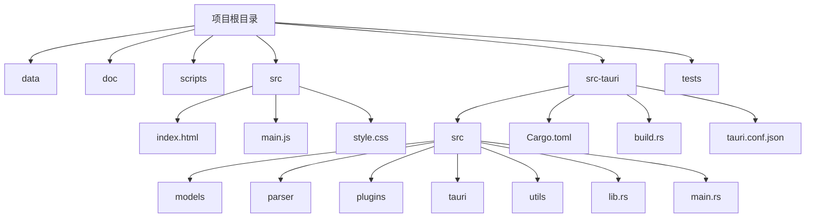
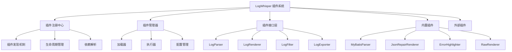
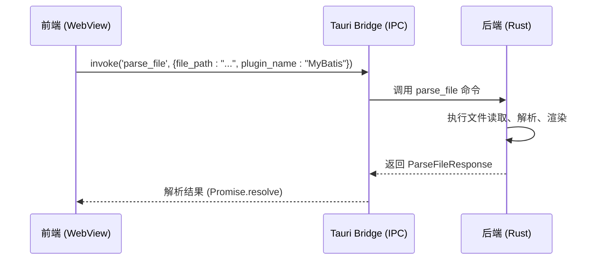

# 架构设计

<cite>
**本文档引用的文件**  
- [main.js](file://src/main.js)
- [lib.rs](file://src-tauri/src/lib.rs)
- [main.rs](file://src-tauri/src/main.rs)
- [tauri.conf.json](file://src-tauri/tauri.conf.json)
- [state.rs](file://src-tauri/src/tauri/state.rs)
- [commands.rs](file://src-tauri/src/tauri/commands.rs)
- [log_parser.rs](file://src-tauri/src/parser/log_parser.rs)
- [file_reader.rs](file://src-tauri/src/parser/file_reader.rs)
- [renderer.rs](file://src-tauri/src/parser/renderer.rs)
- [registry.rs](file://src-tauri/src/plugins/registry.rs)
</cite>

## 目录
1. [简介](#简介)
2. [项目结构](#项目结构)
3. [模块化与插件化架构](#模块化与插件化架构)
4. [Tauri 框架与 IPC 通信](#tauri-框架与-ipc-通信)
5. [前后端职责划分](#前后端职责划分)
6. [异步非阻塞 I/O 与大文件处理](#异步非阻塞-io-与大文件处理)
7. [状态管理机制](#状态管理机制)
8. [配置文件分析](#配置文件分析)
9. [系统上下文与组件交互](#系统上下文与组件交互)

## 简介
LogWhisper 是一个基于 Tauri 框架构建的日志分析工具，旨在提供高效、可扩展的日志解析与可视化功能。本架构设计文档详细阐述其模块化与插件化系统架构，说明 Tauri 如何桥接前端界面与 Rust 后端，实现安全高效的进程间通信（IPC）。文档还将分析前后端职责划分、异步 I/O 优势、状态管理机制、项目目录结构及核心配置，帮助开发者全面理解系统技术布局。

## 项目结构
LogWhisper 的项目结构清晰地分离了前端与后端代码，遵循 Tauri 推荐的目录组织方式。`src/` 目录存放前端资源（HTML、CSS、JavaScript），而 `src-tauri/` 目录则包含 Rust 后端逻辑、构建脚本和配置文件。



**图示来源**  
- [项目结构规划.md](file://doc/项目结构规划.md)

**本节来源**  
- [项目结构规划.md](file://doc/项目结构规划.md)

## 模块化与插件化架构
LogWhisper 的核心优势在于其高度模块化和可扩展的插件化架构。该设计允许系统动态加载和管理不同类型的日志处理插件，极大地提升了灵活性和可维护性。

### 插件系统设计
根据《插件系统重构方案》文档，新架构旨在解决旧版硬编码、缺乏扩展性等问题。其设计目标包括高度可扩展、配置驱动、插件隔离和性能优化。



**图示来源**  
- [插件系统重构方案.md](file://doc/插件系统重构方案.md#L22-L53)

### 插件注册中心
`PluginRegistry` 结构体是插件系统的核心，负责管理所有插件的注册、查询和生命周期。它使用 `HashMap` 存储不同类型的插件（解析器、渲染器等），并利用 `Arc<RwLock<T>>` 确保线程安全，允许多个线程并发读取。

```rust
pub struct PluginRegistry {
    parsers: Arc<RwLock<HashMap<String, Box<dyn LogParser + Send + Sync>>>>,
    renderers: Arc<RwLock<HashMap<String, Box<dyn LogRenderer + Send + Sync>>>>,
    filters: Arc<RwLock<HashMap<String, Box<dyn LogFilter + Send + Sync>>>>,
    exporters: Arc<RwLock<HashMap<String, Box<dyn LogExporter + Send + Sync>>>>,
    plugin_configs: Arc<RwLock<HashMap<String, PluginConfig>>>,
}
```

**本节来源**  
- [插件系统重构方案.md](file://doc/插件系统重构方案.md#L57-L83)
- [registry.rs](file://src-tauri/src/plugins/registry.rs#L8-L13)

### 插件配置系统
插件配置通过 `PluginConfig` 和 `PluginManifest` 结构体实现，支持启用/禁用、优先级设置、依赖管理和条件执行，使插件行为完全可配置。

```rust
pub struct PluginConfig {
    pub name: String,
    pub version: String,
    pub enabled: bool,
    pub priority: i32,
    pub dependencies: Vec<String>,
    pub settings: HashMap<String, serde_json::Value>,
    pub conditions: Vec<PluginCondition>,
}

pub enum PluginCondition {
    FileExtension(String),
    ContentPattern(String),
    LogLevel(String),
    Custom(String),
}
```

**本节来源**  
- [插件系统重构方案.md](file://doc/插件系统重构方案.md#L84-L129)

## Tauri 框架与 IPC 通信
Tauri 框架是连接 LogWhisper 前端（WebView）与后端（Rust）的桥梁，通过安全的 IPC 机制实现双向通信。

### IPC 命令定义
后端通过 `#[tauri::command]` 宏暴露一系列异步函数，这些函数可被前端 JavaScript 调用。`tauri.conf.json` 中的 `invoke_handler` 列表定义了所有可用的命令。



**本节来源**  
- [commands.rs](file://src-tauri/src/tauri/commands.rs)
- [main.js](file://src/main.js#L200-L250)

### 安全高效的通信
Tauri 的 IPC 机制基于消息传递，所有调用都是异步的，避免了阻塞主线程。它还提供了强大的安全模型，通过 `tauri.conf.json` 严格限制应用权限，确保后端操作的安全性。

**本节来源**  
- [lib.rs](file://src-tauri/src/lib.rs)
- [tauri.conf.json