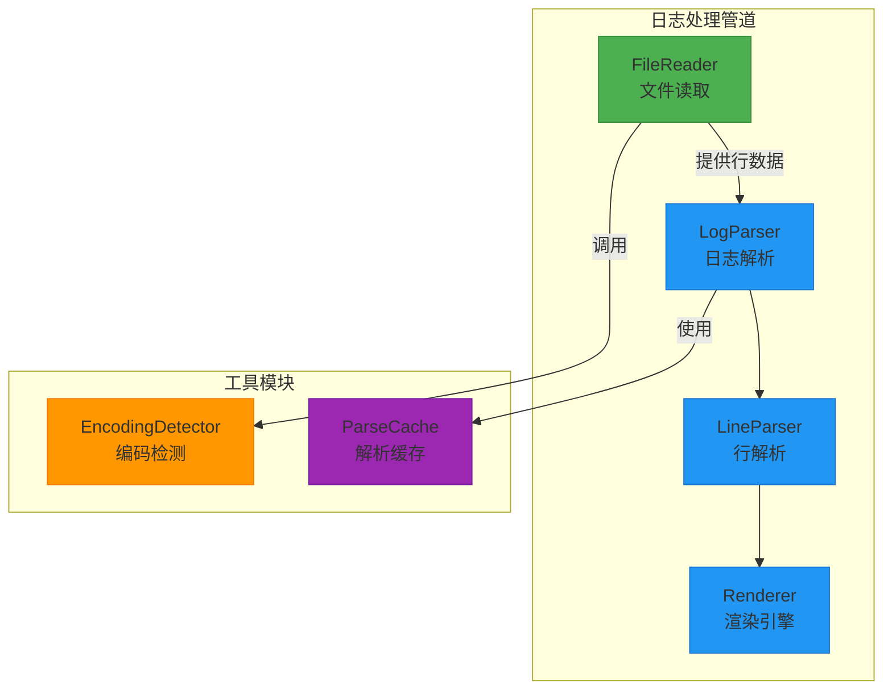
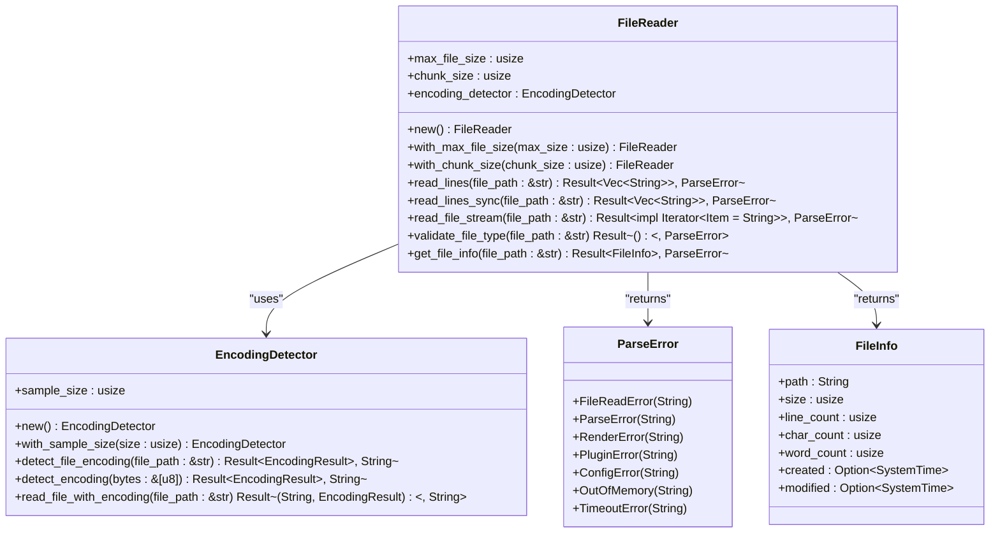
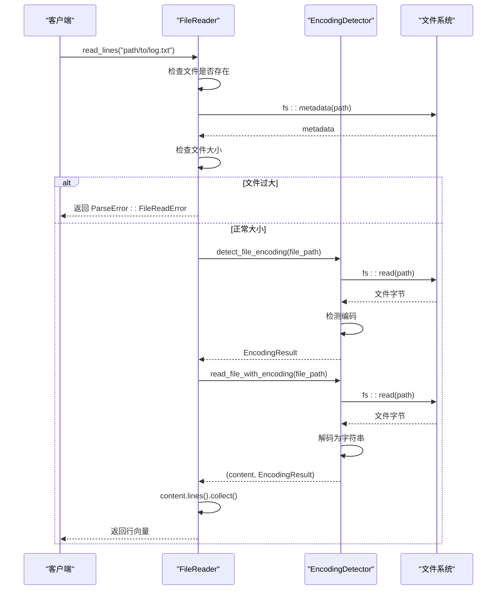
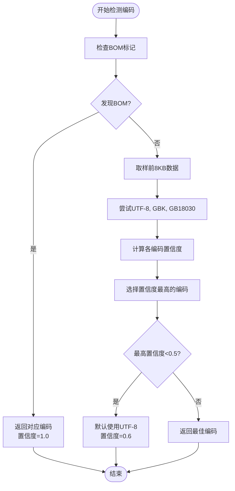
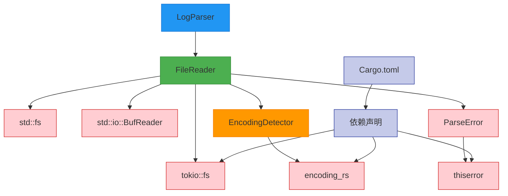

<cite>
**Referenced Files in This Document**  
- [file_reader.rs](file://src-tauri/src/parser/file_reader.rs)
- [encoding_detector.rs](file://src-tauri/src/utils/encoding_detector.rs)
- [log_parser.rs](file://src-tauri/src/parser/log_parser.rs)
- [parse_result.rs](file://src-tauri/src/models/parse_result.rs)
- [log_entry.rs](file://src-tauri/src/models/log_entry.rs)
- [mod.rs](file://src-tauri/src/parser/mod.rs)
- [mod.rs](file://src-tauri/src/utils/mod.rs)
- [Cargo.toml](file://src-tauri/Cargo.toml)
</cite>

## 目录
1. [文件读取器](#文件读取器)
2. [核心组件](#核心组件)
3. [架构概述](#架构概述)
4. [详细组件分析](#详细组件分析)
5. [依赖分析](#依赖分析)
6. [性能考量](#性能考量)
7. [故障排除指南](#故障排除指南)

## 文件读取器

本文档详细描述了文件读取器模块的设计与实现，重点阐述其如何通过流式读取方式高效处理大体积日志文件。该模块基于 `BufReader` 实现了内存友好的文件读取机制，并结合 Tokio 异步运行时进行非阻塞 I/O 操作，确保在处理大型日志文件时不会阻塞主线程。核心方法 `read_lines` 能够按行分割日志内容并返回异步流（Stream），为后续的解析流程提供支持。模块集成了自动编码检测功能，能够识别 UTF-8、GBK 等多种编码格式，并进行相应的转换。内存管理策略通过配置缓冲区大小来避免一次性加载整个文件，从而有效控制内存使用。错误处理机制涵盖了文件权限、路径不存在或读取中断等常见异常情况。此外，该模块与 `LogParser` 等其他组件紧密协作，构成了完整的日志处理管道。文档还提供了性能调优建议，例如根据硬件环境调整块大小以优化读取性能。

## 核心组件

文件读取器模块的核心组件包括 `FileReader` 结构体、`EncodingDetector` 编码检测器以及相关的错误处理和数据结构。`FileReader` 是主要的文件操作接口，提供了异步和同步两种读取模式，支持按行读取和流式读取。它通过 `max_file_size` 和 `chunk_size` 配置项来控制内存使用和读取性能。`EncodingDetector` 负责检测文件的字符编码，利用 BOM 标记和内容分析算法来判断文件的实际编码格式，并返回置信度评分。`ParseError` 枚举定义了所有可能的错误类型，包括文件读取错误、解析错误和渲染错误，为上层调用者提供了清晰的错误信息。`FileInfo` 结构体则封装了文件的元数据信息，如大小、行数、创建时间等，便于用户了解文件的基本情况。

**Section sources**
- [file_reader.rs](file://src-tauri/src/parser/file_reader.rs#L1-L201)
- [encoding_detector.rs](file://src-tauri/src/utils/encoding_detector.rs#L1-L277)
- [parse_result.rs](file://src-tauri/src/models/parse_result.rs#L1-L286)

## 架构概述

文件读取器模块是日志处理系统的基础组件，位于整个数据处理管道的最前端。它负责从磁盘读取原始日志文件，并将其转换为可供后续处理的结构化数据流。该模块与 `LogParser` 模块紧密协作，`LogParser` 依赖 `FileReader` 提供的行数据进行进一步的解析和渲染。`EncodingDetector` 作为独立的工具模块，被 `FileReader` 调用以完成编码检测和转换任务。整个模块的设计遵循了清晰的职责分离原则，`FileReader` 专注于 I/O 操作，`EncodingDetector` 专注于编码处理，而错误处理和数据结构则被封装在独立的模块中。这种设计使得各组件可以独立开发和测试，提高了代码的可维护性和可扩展性。

**Diagram sources**
- [file_reader.rs](file://src-tauri/src/parser/file_reader.rs#L1-L201)
- [log_parser.rs](file://src-tauri/src/parser/log_parser.rs#L1-L247)
- [mod.rs](file://src-tauri/src/parser/mod.rs#L1-L12)
- [mod.rs](file://src-tauri/src/utils/mod.rs#L1-L12)

## 详细组件分析

### FileReader 分析

`FileReader` 是文件读取器模块的核心实现，它提供了多种读取文件的方法，以适应不同的使用场景。其主要功能包括文件读取、编码检测、大小限制和错误处理。

#### 类图

**Diagram sources**
- [file_reader.rs](file://src-tauri/src/parser/file_reader.rs#L1-L201)
- [encoding_detector.rs](file://src-tauri/src/utils/encoding_detector.rs#L1-L277)
- [parse_result.rs](file://src-tauri/src/models/parse_result.rs#L1-L286)
- [log_entry.rs](file://src-tauri/src/models/log_entry.rs#L1-L138)

#### 方法调用序列图

**Diagram sources**
- [file_reader.rs](file://src-tauri/src/parser/file_reader.rs#L1-L201)
- [encoding_detector.rs](file://src-tauri/src/utils/encoding_detector.rs#L1-L277)

### EncodingDetector 分析

`EncodingDetector` 模块负责检测和处理文件的字符编码，确保日志内容能够被正确解析和显示。

#### 编码检测流程图

**Diagram sources**
- [encoding_detector.rs](file://src-tauri/src/utils/encoding_detector.rs#L1-L277)

## 依赖分析

文件读取器模块的依赖关系清晰且层次分明。它直接依赖于 Rust 标准库的 `std::fs` 和 `std::io` 模块进行文件 I/O 操作，以及 `tokio::fs` 模块实现异步文件操作。`encoding_rs` 库被用于实际的编码检测和转换工作。`serde` 和 `thiserror` 等库则用于数据序列化和错误处理。`FileReader` 模块依赖于 `EncodingDetector` 模块来完成编码相关的任务，而 `LogParser` 模块又依赖于 `FileReader` 来获取原始日志数据。这种依赖关系形成了一个清晰的调用链，从最底层的文件 I/O 到上层的业务逻辑处理。

**Diagram sources**
- [file_reader.rs](file://src-tauri/src/parser/file_reader.rs#L1-L201)
- [encoding_detector.rs](file://src-tauri/src/utils/encoding_detector.rs#L1-L277)
- [Cargo.toml](file://src-tauri/Cargo.toml#L1-L56)

**Section sources**
- [file_reader.rs](file://src-tauri/src/parser/file_reader.rs#L1-L201)
- [encoding_detector.rs](file://src-tauri/src/utils/encoding_detector.rs#L1-L277)
- [Cargo.toml](file://src-tauri/Cargo.toml#L1-L56)

## 性能考量

文件读取器模块在设计时充分考虑了性能因素。通过使用 `BufReader` 和可配置的 `chunk_size`，模块能够在减少系统调用次数的同时，有效控制内存占用。异步 I/O 操作确保了在读取大文件时 UI 线程不会被阻塞，提供了流畅的用户体验。编码检测算法通过只读取文件的前 8KB 数据来进行分析，避免了对整个文件的扫描，大大提高了检测速度。对于超大文件，模块提供了流式读取接口 `read_file_stream`，允许逐行处理数据，从而将内存使用量降至最低。性能