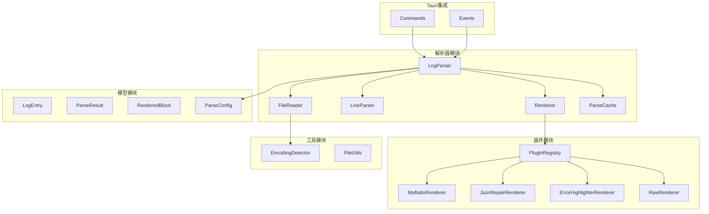
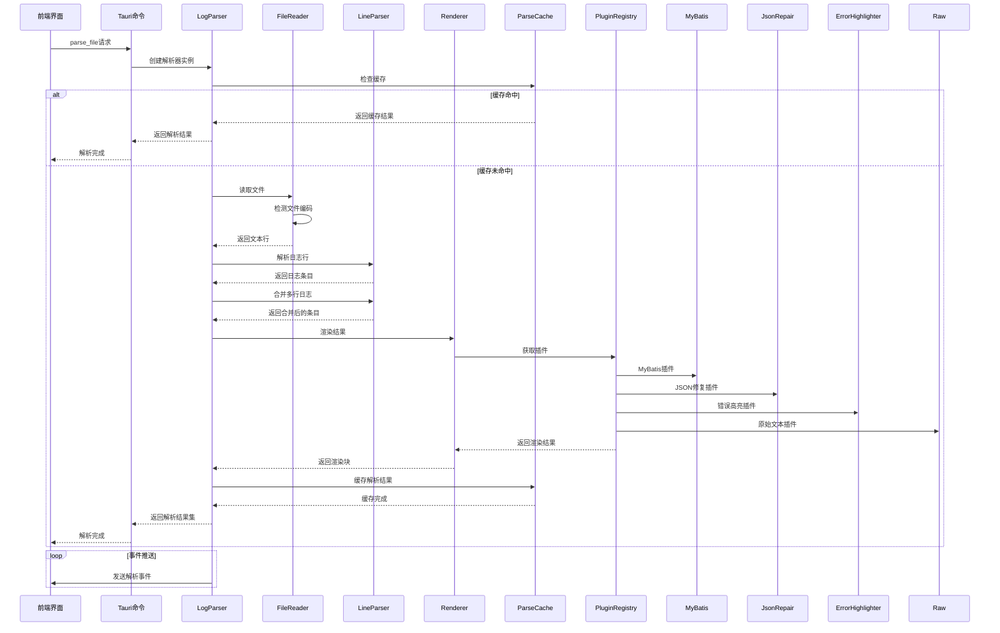
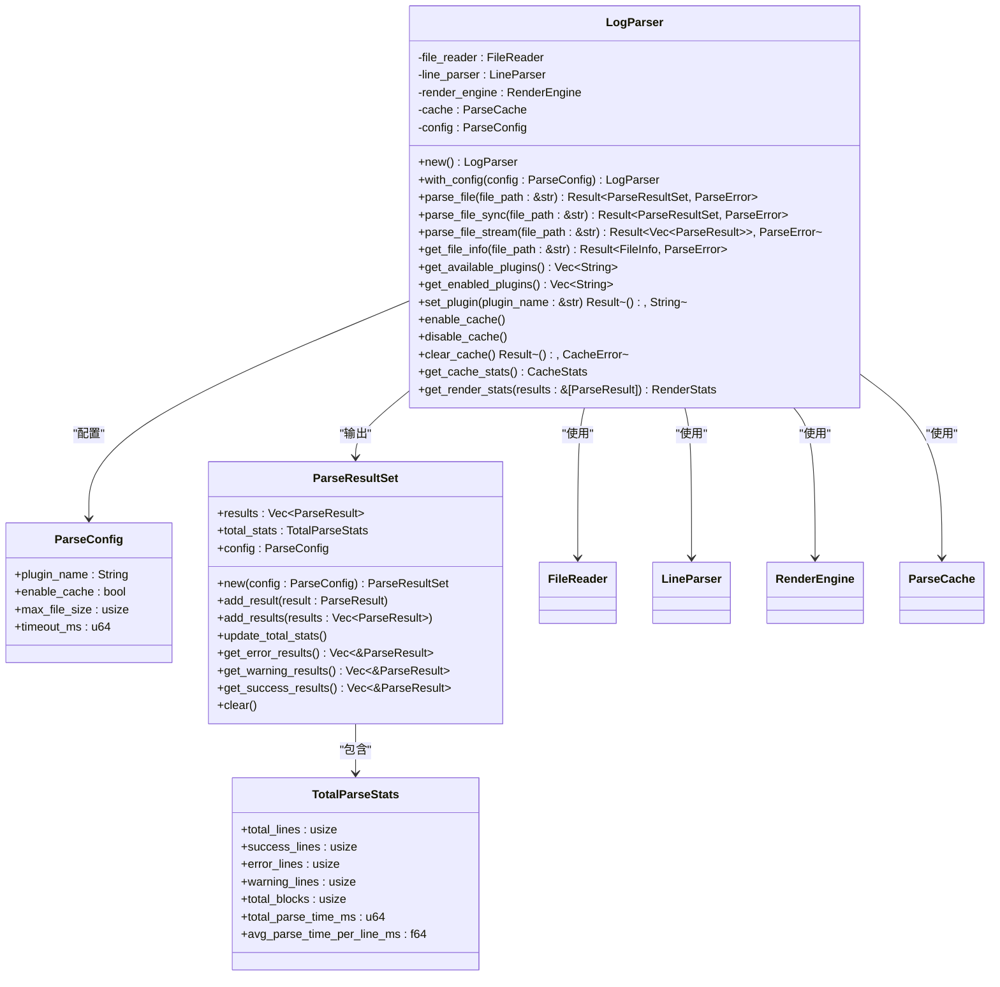

# 日志解析引擎

<cite>
**本文档引用的文件**
- [log_parser.rs](file://src-tauri/src/parser/log_parser.rs)
- [file_reader.rs](file://src-tauri/src/parser/file_reader.rs)
- [line_parser.rs](file://src-tauri/src/parser/line_parser.rs)
- [renderer.rs](file://src-tauri/src/parser/renderer.rs)
- [commands.rs](file://src-tauri/src/tauri/commands.rs)
- [events.rs](file://src-tauri/src/tauri/events.rs)
- [cache.rs](file://src-tauri/src/parser/cache.rs)
- [encoding_detector.rs](file://src-tauri/src/utils/encoding_detector.rs)
- [log_entry.rs](file://src-tauri/src/models/log_entry.rs)
- [parse_result.rs](file://src-tauri/src/models/parse_result.rs)
- [plugin_config.rs](file://src-tauri/src/models/plugin_config.rs)
- [rendered_block.rs](file://src-tauri/src/models/rendered_block.rs)
- [registry.rs](file://src-tauri/src/plugins/registry.rs)
- [mybatis.rs](file://src-tauri/src/plugins/mybatis.rs)
- [json_repair.rs](file://src-tauri/src/plugins/json_repair.rs)
- [error_highlighter.rs](file://src-tauri/src/plugins/error_highlighter.rs)
</cite>

## 目录
1. [简介](#简介)
2. [项目结构](#项目结构)
3. [核心组件](#核心组件)
4. [架构概述](#架构概述)
5. [详细组件分析](#详细组件分析)
6. [依赖分析](#依赖分析)
7. [性能考虑](#性能考虑)
8. [故障排除指南](#故障排除指南)
9. [结论](#结论)

## 简介
日志解析引擎是LogWhisper系统的核心组件，负责将原始日志文件转换为结构化、可交互的可视化结果。该引擎通过协调FileReader、LineParser和Renderer三大组件，实现了从文件读取到行解析再到插件化渲染的完整数据流处理。引擎支持异步处理链，能够高效处理大型日志文件，并通过事件系统向前端推送解析状态。系统采用插件化架构，支持MyBatis SQL解析、JSON修复、错误高亮等多种功能，可根据日志内容自动选择最佳解析策略。

## 项目结构
日志解析引擎的代码组织遵循清晰的模块化结构，主要分为解析器、模型、插件、Tauri集成和工具等核心模块。

**图示来源**
- [log_parser.rs](file://src-tauri/src/parser/log_parser.rs)
- [file_reader.rs](file://src-tauri/src/parser/file_reader.rs)
- [line_parser.rs](file://src-tauri/src/parser/line_parser.rs)
- [renderer.rs](file://src-tauri/src/parser/renderer.rs)
- [registry.rs](file://src-tauri/src/plugins/registry.rs)
- [commands.rs](file://src-tauri/src/tauri/commands.rs)
- [events.rs](file://src-tauri/src/tauri/events.rs)

**本节来源**
- [src-tauri/src/parser](file://src-tauri/src/parser)
- [src-tauri/src/models](file://src-tauri/src/models)
- [src-tauri/src/plugins](file://src-tauri/src/plugins)
- [src-tauri/src/tauri](file://src-tauri/src/tauri)
- [src-tauri/src/utils](file://src-tauri/src/utils)

## 核心组件
日志解析引擎的核心由LogParser、FileReader、LineParser和Renderer四个主要组件构成。LogParser作为协调中心，管理整个解析流程的状态和配置。FileReader负责文件的读取和编码检测，支持大文件的分块处理。LineParser执行日志行的解析和多行日志的合并，提取时间戳和日志级别等关键信息。Renderer通过插件注册中心调用相应的插件对解析后的日志条目进行渲染，生成结构化的可视化结果。这些组件通过清晰的接口契约进行通信，确保了系统的可维护性和扩展性。

**本节来源**
- [log_parser.rs](file://src-tauri/src/parser/log_parser.rs)
- [file_reader.rs](file://src-tauri/src/parser/file_reader.rs)
- [line_parser.rs](file://src-tauri/src/parser/line_parser.rs)
- [renderer.rs](file://src-tauri/src/parser/renderer.rs)

## 架构概述
日志解析引擎采用分层架构设计，各组件职责明确，协同工作完成端到端的日志处理任务。

**图示来源**
- [log_parser.rs](file://src-tauri/src/parser/log_parser.rs)
- [commands.rs](file://src-tauri/src/tauri/commands.rs)
- [events.rs](file://src-tauri/src/tauri/events.rs)
- [file_reader.rs](file://src-tauri/src/parser/file_reader.rs)
- [line_parser.rs](file://src-tauri/src/parser/line_parser.rs)
- [renderer.rs](file://src-tauri/src/parser/renderer.rs)
- [cache.rs](file://src-tauri/src/parser/cache.rs)
- [registry.rs](file://src-tauri/src/plugins/registry.rs)

## 详细组件分析

### LogParser分析
LogParser是日志解析引擎的核心协调者，负责管理整个解析流程的生命周期和状态。

**图示来源**
- [log_parser.rs](file://src-tauri/src/parser/log_parser.rs)
- [parse