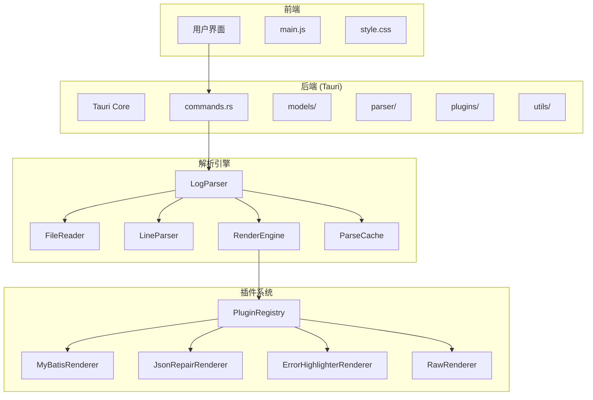
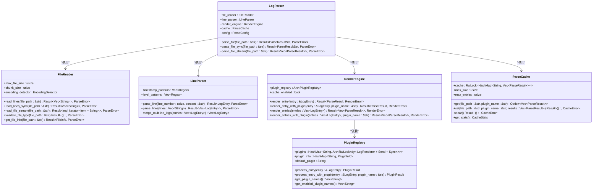
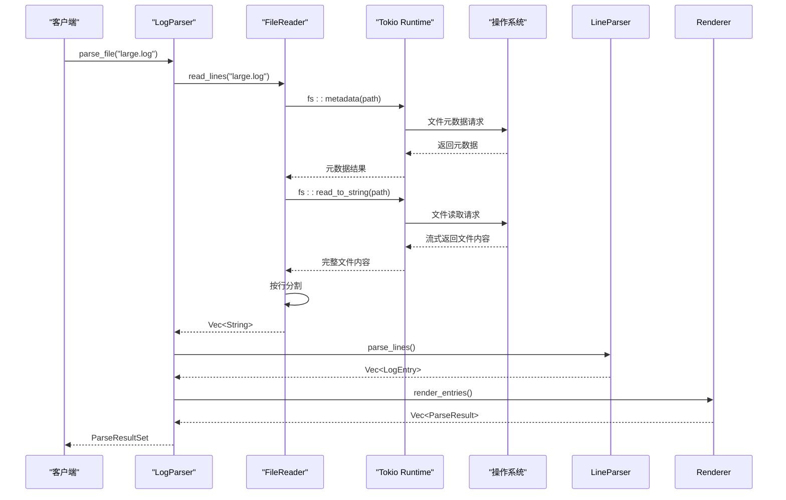
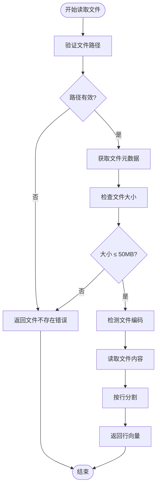
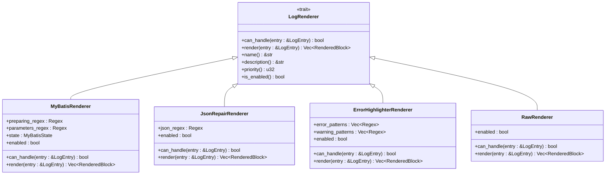

# 核心引擎

<cite>
**本文档引用文件**  
- [log_parser.rs](file://src-tauri/src/parser/log_parser.rs)
- [file_reader.rs](file://src-tauri/src/parser/file_reader.rs)
- [renderer.rs](file://src-tauri/src/parser/renderer.rs)
- [line_parser.rs](file://src-tauri/src/parser/line_parser.rs)
- [cache.rs](file://src-tauri/src/parser/cache.rs)
- [trait_def.rs](file://src-tauri/src/plugins/trait_def.rs)
- [registry.rs](file://src-tauri/src/plugins/registry.rs)
- [parse_result.rs](file://src-tauri/src/models/parse_result.rs)
- [log_entry.rs](file://src-tauri/src/models/log_entry.rs)
- [commands.rs](file://src-tauri/src/tauri/commands.rs)
</cite>

## 目录
1. [项目结构](#项目结构)
2. [核心组件](#核心组件)
3. [日志解析引擎架构](#日志解析引擎架构)
4. [异步非阻塞I/O与Tokio运行时](#异步非阻塞io与tokio运行时)
5. [FileReader流式读取策略](#filereader流式读取策略)
6. [Renderer插件协调机制](#renderer插件协调机制)
7. [ParsedLogEntry数据结构传递](#parsedlogentry数据结构传递)
8. [解析错误处理机制](#解析错误处理机制)
9. [性能优化建议](#性能优化建议)
10. [与Tauri命令层集成](#与tauri命令层集成)

## 项目结构



**图示来源**  
- [log_parser.rs](file://src-tauri/src/parser/log_parser.rs#L7-L14)
- [file_reader.rs](file://src-tauri/src/parser/file_reader.rs#L7-L12)
- [renderer.rs](file://src-tauri/src/parser/renderer.rs#L171-L182)
- [registry.rs](file://src-tauri/src/plugins/registry.rs#L8-L13)

**本节来源**  
- [log_parser.rs](file://src-tauri/src/parser/log_parser.rs)
- [file_reader.rs](file://src-tauri/src/parser/file_reader.rs)
- [renderer.rs](file://src-tauri/src/parser/renderer.rs)

## 核心组件

Log-Whisper的核心引擎由多个协同工作的组件构成，包括日志解析器（LogParser）、文件读取器（FileReader）、行解析器（LineParser）、渲染引擎（RenderEngine）、缓存系统（ParseCache）和插件注册中心（PluginRegistry）。这些组件共同实现了高效、可扩展的日志解析功能。

**本节来源**  
- [log_parser.rs](file://src-tauri/src/parser/log_parser.rs#L7-L14)
- [file_reader.rs](file://src-tauri/src/parser/file_reader.rs#L7-L12)
- [renderer.rs](file://src-tauri/src/parser/renderer.rs#L171-L182)

## 日志解析引擎架构



**图示来源**  
- [log_parser.rs](file://src-tauri/src/parser/log_parser.rs#L7-L14)
- [file_reader.rs](file://src-tauri/src/parser/file_reader.rs#L7-L12)
- [line_parser.rs](file://src-tauri/src/parser/line_parser.rs#L1-L245)
- [renderer.rs](file://src-tauri/src/parser/renderer.rs#L1-L241)
- [cache.rs](file://src-tauri/src/parser/cache.rs#L1-L193)
- [registry.rs](file://src-tauri/src/plugins/registry.rs#L8-L13)

**本节来源**  
- [log_parser.rs](file://src-tauri/src/parser/log_parser.rs)
- [file_reader.rs](file://src-tauri/src/parser/file_reader.rs)
- [line_parser.rs](file://src-tauri/src/parser/line_parser.rs)
- [renderer.rs](file://src-tauri/src/parser/renderer.rs)
- [cache.rs](file://src-tauri/src/parser/cache.rs)

## 异步非阻塞I/O与Tokio运行时

Log-Whisper使用Tokio异步运行时实现高效的非阻塞I/O操作。`FileReader`组件通过`tokio::fs`模块提供异步文件读取能力，确保在处理大日志文件时不会阻塞主线程。

`read_lines`方法是异步读取的核心实现，它首先验证文件存在性和大小限制，然后使用编码检测器读取文件内容，最后将内容按行分割返回。整个过程在Tokio运行时中执行，允许并发处理多个文件读取请求。



**图示来源**  
- [file_reader.rs](file://src-tauri/src/parser/file_reader.rs#L50-L100)
- [log_parser.rs](file://src-tauri/src/parser/log_parser.rs#L50-L100)

**本节来源**  
- [file_reader.rs](file://src-tauri/src/parser/file_reader.rs)
- [log_parser.rs](file://src-tauri/src/parser/log_parser.rs)

## FileReader流式读取策略

`FileReader`模块实现了三种不同的文件读取策略，以适应不同的使用场景和性能需求：

1. **异步读取** (`read_lines`)：适用于大文件的非阻塞读取，利用Tokio运行时实现高效I/O
2. **同步读取** (`read_lines_sync`)：适用于小文件或需要立即返回结果的场景
3. **流式读取** (`read_file_stream`)：适用于内存受限环境，按需逐行处理

流式读取策略通过`BufReader`和迭代器模式实现，避免一次性加载整个文件到内存中。同时，`FileReader`设置了50MB的默认文件大小限制，防止内存溢出。



**图示来源**  
- [file_reader.rs](file://src-tauri/src/parser/file_reader.rs#L50-L150)

**本节来源**  
- [file_reader.rs](file://src-tauri/src/parser/file_reader.rs)

## Renderer插件协调机制

渲染引擎通过插件注册中心协调多个插件对日志条目进行处理。插件协调机制包括优先级排序、`can_handle`判断逻辑和结果合并。



**图示来源**  
- [trait_def.rs](file://src-tauri/src/plugins/trait_def.rs#L2-L43)
- [mybatis.rs](file://src-tauri/src/plugins/mybatis.rs#L4-L10)
- [json_repair.rs](file://src-tauri/src/plugins/json_repair.rs#L5-L9)
- [error_highlighter.rs](file://src-tauri/src/plugins/error_highlighter.rs#L4-L9)
- [raw.rs](file://src-tauri/src/plugins/raw.rs#L3-L6)

**本节来源**  
- [renderer.rs](file://src-tauri/src/parser/renderer.rs)
- [registry.rs](file://src-tauri/src/plugins/registry.rs)
- [trait_def.rs](file://src-tauri/src/plugins/trait_def.rs)

## ParsedLogEntry数据结构传递

日志条目在解析流程中通过`LogEntry`和`ParseResult`数据结构进行传递。`LogEntry`表示原始日志条目，而`ParseResult`包含渲染后的结果。

```mermaid
classDiagram
    class LogEntry {
        +line_number: usize
        +timestamp: Option~DateTime~Utc~~
        +level: LogLevel
        +content: String
        +raw_line: String
        +is_error() bool
        +is_warning() bool
        +display_text() String
    }

    class ParseResult {
        +original: LogEntry
        +rendered_blocks: Vec~RenderedBlock~
        +is_error: bool
        +is_warning: bool
        +stats: ParseStats
        +add_block(block: RenderedBlock) Self
        +add_blocks(blocks: Vec~RenderedBlock~) Self
        +with_stats(stats: ParseStats) Self
    }

    class RenderedBlock {
        +id: String
        +block_type: BlockType
        +title: String
        +content: String